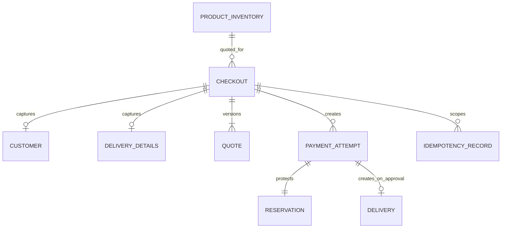

# Modelo de datos implementado

## Estado y fuentes de autoridad

Este documento describe la implementación vigente. Las fuentes autoritativas son:

- [`release-stacks.ts`](../../infra/lib/release-stacks.ts), para tablas e índices;
- [`dynamodb-catalog.repository.ts`](../../apps/api/src/infrastructure/persistence/dynamodb-catalog.repository.ts), para catálogo y unicidad de SKU;
- [`dynamodb-checkout.repository.ts`](../../apps/api/src/infrastructure/persistence/dynamodb-checkout.repository.ts), para el agregado de checkout y sus transacciones;
- [`checkout-service.ts`](../../apps/api/src/application/use-cases/checkout-service.ts), para las transiciones de negocio.

El diseño de Etapa 3 permanece como registro histórico. La construcción añadió `GSI2-PendingAge` para observabilidad; por eso el modelo implementado tiene dos GSIs.

## Modelo lógico

El agregado `CHECKOUT` conserva el estado canónico. Cliente, entrega, cotización, intento de pago, reserva e idempotencia son registros separados dentro de la misma partición para permitir lecturas consistentes y escrituras transaccionales.

## Modelo físico

### `CatalogTable`

| Registro          | PK                    | SK                    | Propósito                                        |
| ----------------- | --------------------- | --------------------- | ------------------------------------------------ |
| Producto          | `PRODUCT#<productId>` | `META`                | Datos, precio y stock autoritativos              |
| Proyección activa | `CATALOG#ACTIVE`      | `PRODUCT#<productId>` | Listado de productos activos                     |
| Unicidad SKU      | `SKU#<normalizedSku>` | `LOOKUP`              | Evita dos productos con el mismo SKU normalizado |

### `CheckoutTable`

La partición principal usa `PK = CHECKOUT#<checkoutId>`.

| Tipo               | SK                                     | Propósito                                |
| ------------------ | -------------------------------------- | ---------------------------------------- |
| `CHECKOUT`         | `META`                                 | Estado y versión del agregado            |
| `CUSTOMER`         | `CUSTOMER`                             | Datos de cliente permitidos              |
| `DELIVERY_DETAILS` | `DELIVERY_DETAILS`                     | Datos de entrega permitidos              |
| `QUOTE`            | `QUOTE#<quoteId>`                      | Cotización COP versionada                |
| `PAYMENT`          | `PAYMENT#<transactionId>`              | Estado del proveedor y fases de despacho |
| `RESERVATION`      | `RESERVATION#<transactionId>`          | Reserva de una unidad y expiración       |
| `IDEMPOTENCY`      | `IDEMPOTENCY#SUBMIT_PAYMENT#<keyHash>` | Replay seguro del comando de pago        |
| `DELIVERY`         | `DELIVERY#<deliveryId>`                | Entrega creada sólo al aprobar           |

Los registros `UNIQUE_LOCK` usan una partición dedicada y `SK = LOCK` para impedir duplicados de transacción, proveedor o entrega. Los webhooks usan `PK = WEBHOOK#<eventHash>` y `SK = DEDUPE`.

## Índices

### `GSI1-Reconcile`

- `GSI1PK = RECON#DUE` agrupa pagos cuyo resultado debe reconciliarse.
- El orden temporal vive en `GSI1SK`.
- El índice sólo descubre candidatos: ninguna lectura del GSI autoriza una transición. El item base y sus condiciones compare-and-set siguen siendo la autoridad.

### `GSI2-PendingAge`

- `GSI2PK = PAYMENT#PENDING` agrupa pagos aceptados aún pendientes.
- `GSI2SK` conserva la antigüedad para obtener el pendiente más antiguo.
- Se usa para métricas y alarmas; no decide integridad ni estado financiero.

## Invariantes transaccionales

- `available = onHand - reserved >= 0`.
- Todo importe COP se representa en centavos enteros seguros.
- Reserva, registro de idempotencia y estado `PENDING` se persisten antes del I/O externo.
- Un checkout admite como máximo un intento activo.
- `APPROVED` consume la reserva y crea una entrega exactamente una vez.
- `DECLINED`, `VOIDED` y `ERROR` liberan la reserva y no crean entrega.
- Un resultado `UNKNOWN` conserva la reserva y sólo avanza mediante reconciliación.
- Las transiciones usan versiones y expresiones condicionales; un conflicto no se corrige con last-write-wins.
- El TTL físico facilita limpieza, pero nunca decide estados financieros.

## Privacidad y retención

- PAN, CVC y vencimiento nunca entran a la API ni se persisten.
- La capability y la idempotency key se almacenan únicamente como HMAC.
- La API conserva sólo el token opaco del proveedor y evidencia mínima de aceptación.
- Logs, métricas, respuestas y evidencias aplican allowlist y redacción; no replican los items completos.
- Los datos de Sandbox son sintéticos y las políticas de retención/cleanup se validan antes del despliegue.
