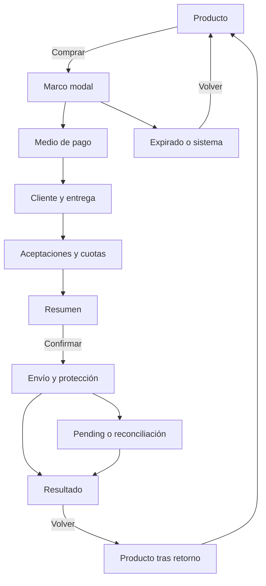

# Etapa 2: análisis y diseño UX/UI

## 1. Control documental y resumen ejecutivo

| Campo | Valor |
|---|---|
| Documento | Especificación canónica de experiencia para el checkout asíncrono |
| Versión | `1.0.0` |
| Fecha de corte | 2026-08-14, America/Bogota |
| Locale de diseño | `es-CO` (`ASM-09`, reversible) |
| Estado | `DESIGNED_NOT_IMPLEMENTED` |
| Autoridad | Este Markdown gobierna comportamiento visible, copy, estados, datos y handoff de etapa 2 |
| Entradas | PDF fuente, plan maestro, instrucción 0–1, baseline final 0–1 e instrucción de etapa 2 |
| Escrituras realizadas | Este Markdown y recursos sanitizados bajo `output/ux/` |
| Ejecución externa | 0 API, 0 sandbox, 0 UAT, 0 pagos, 0 despliegues, 0 participantes |

La etapa queda documentalmente cerrada con un diseño mobile-first, state-first y content-first que cubre producto, captura, revisión, procesamiento incierto, resultado y retorno. La experiencia nunca interpreta `PENDING` o `UNKNOWN` como final, nunca ofrece un nuevo pago durante incertidumbre y nunca lleva C4 al backend propio. El mecanismo de captura permanece reversible entre captura directa segura y componente alojado hasta `SPK-02`.

La instrucción de etapa 2 contiene una deriva respecto de la baseline final 0–1. Este documento no inventa IDs para satisfacer denominadores obsoletos: consume el universo real y registra el cambio en `CHG-03`–`CHG-10`. Por ello, las coberturas de salida se calculan sobre 33 identidades RF —29 hojas y 4 anclas—, 28 RNF —23 hojas y 5 anclas—, 12 US, 45 AC, 51 SC, 24 ERR, 72 DAT, 48 UAT y 36 aristas críticas heredadas. La equivalencia con los objetivos de la instrucción se explica en §4 y §29.

### Manifiesto controlado

| ID | Artefacto | Localización | Cobertura | Estado |
|---|---|---|---:|---|
| `ART-UX-01` | Arquitectura de información y modelo macro | §§9–12 | 5/5 macroestados; 5/5 momentos | `DESIGNED_NOT_IMPLEMENTED` |
| `ART-UX-02` | Catálogo de flujos | §§13–14 | 13/13 | `DESIGNED_NOT_IMPLEMENTED` |
| `ART-UX-03` | Inventario pantalla–estado | §§11, 15 | 100 % de celdas aplicables | `DESIGNED_NOT_IMPLEMENTED` |
| `ART-UX-04` | Wireframes anotados | §§16–21 y [wireframes-v1.svg](ux/wireframes-v1.svg) | 7/7 viewports especificados | `DESIGNED_NOT_IMPLEMENTED` |
| `ART-UX-05` | Contenido, errores y recovery | §§22–23 | 24/24 errores reales | `DESIGNED_NOT_IMPLEMENTED` |
| `ART-UX-06` | Sistema visual y componentes | §§24–26 | 16/16 componentes | `DESIGNED_NOT_IMPLEMENTED` |
| `ART-UX-07` | Prototipo y evaluación documental | §27 y [prototype-v1.html](ux/prototype-v1.html) | 13/13 escenarios modelados | `DESIGNED_NOT_IMPLEMENTED` |
| `ART-UX-08` | Trazabilidad, handoff y gates | §§28–30 | 0 huérfanos en el universo UX auditado | `DESIGNED_NOT_IMPLEMENTED` |

**Manifiesto:** 8/8 presentes. “Presente” significa especificado y enlazado; no significa implementado, probado con tecnología asistiva, medido en runtime ni aprobado por UAT.

## 2. Dictamen y readiness por consumidor

**Dictamen `GATE-E2-03`: `CONDITIONAL GO`.** La etapa 3 puede usar este contrato UX sin reinterpretar estados o acciones. Las condiciones restantes tienen variante segura, owner y gate; ninguna exige acceso externo para continuar el diseño.

| Consumidor | Readiness | Puede consumir | Condición que conserva |
|---|---|---|---|
| Arquitectura | `CONDITIONAL GO` | Flujos, estados, fronteras, 19 clusters UX y 36 aristas fuente | No congelar captura directa ni contrato externo antes de `SPK-02`; `UNKNOWN` conserva reserva |
| Frontend | `GO_FOR_PLANNING` | Wireframes, copy, tokens, componentes, DOM/foco y responsive | No persistir C2/C3/C4; ambas variantes de captura deben ser intercambiables |
| Backend/API | `GO_FOR_PLANNING` | Inputs visibles, quote, errores y recovery | Precio/stock/estado son canónicos; 404 no enumerable; cero C4 |
| QA | `GO_FOR_TEST_DESIGN` | UXF, UXST, viewports, walkthrough y trazas | `UAT-01`–`UAT-48` siguen `DESIGNED_NOT_RUN`; `EVD-16/24` siguen `AVAILABLE` y el resto `PLANNED` |
| Seguridad/privacidad | `CONDITIONAL GO` | Fronteras DAT, masking, almacenamiento y evidencia | Aprobar mecanismo real sólo tras `SPK-02`; artefactos deben seguir sin C3/C4/PII real |
| Product Owner | `ACTION_REQUIRED_BEFORE_BUILD` | Defaults, campos, tarifas, copy y retorno | Confirmar o aceptar `DEC-06`, `DEC-07`, `DEC-08`, `DEC-17`–`DEC-22` antes del gate indicado |

Bloqueos principales, no impeditivos para etapa 3 reversible:

1. `DEC-17`/`DEP-13`: captura directa frente a alojada sigue `BLOCKED` por `SPK-02`; se entrega equivalencia segura.
2. `DEC-06`/`DEC-07`: tarifas y campos definitivos siguen `ASSUMED`; el diseño usa configuración y disclosure condicional.
3. `QST-17`/`QST-18`: links contractuales y canal de soporte son slots, nunca valores inventados.

## 3. Fuentes, precedencia y fecha de corte

### Registro de entradas

| Fuente | Localizador | Huella SHA-256 | Uso | Estado |
|---|---|---|---|---|
| PDF normativo | `Wompi FullStack Test (1).pdf` | `5692401144BE1FAFEAE6D7C01A0EF46BBB0BBAB52EBB244E0CE559F3FAB28368` | Obligaciones visibles y rúbrica; ningún material de acceso se reproduce | `READ_SAFE_REFERENCE` |
| Plan maestro | `plan-maestro-prueba-fullstack.md` | `9DBEFF03446E3C1BDD8D6814B9D0AEAB4B60CD3A63CE04E841895C1B00BAE2C4` | Cinco momentos, responsive, estados e invariantes | `CONSUMED` |
| Instrucción 0–1 | `instruccion-etapas-0-1-incepcion-requisitos.md` | `DF476B11DB6A2132412E740756690A45D57C4054B396D3D51026D1EC21D7A2C0` | Convenciones históricas; subordinada a la baseline final | `CONSUMED` |
| Baseline 0–1 | `output/etapas-0-1-incepcion-y-requisitos.md` | `D604D8EADD0F29CD8283B66E4D5F0809C80EC4B9A5D558CFEDE12DB85892E9F5` | IDs y denominadores canónicos | `AUTHORITATIVE_BASELINE` |
| Instrucción etapa 2 | `instruccion-etapa-2-diseno-ux-ui.md` | `A6BB41F14915954D1E257532413DF43D46BA0C740CD24EDE2C4D7EE50B69E2E6` | Estructura, artefactos, gates y alcance de esta ejecución | `CONSUMED_WITH_DELTAS` |

### Fuentes oficiales consultadas

| ID | Fuente | Consulta | Decisión de diseño |
|---|---|---|---|
| `SRC-UX-EXT-01` | WCAG 2.2, W3C Recommendation 2024-12-12 | 2026-08-14 | Baseline derivada AA; criterios testables, no declaración de conformidad |
| `SRC-UX-EXT-02` | WAI-ARIA APG, Dialog Modal Pattern | 2026-08-14 | Foco inicial, ciclo Tab, Escape, retorno de foco, fondo inerte y nombre accesible |
| `SRC-UX-EXT-03` | Web Vitals | 2026-08-14 | Targets: LCP <2,5 s, INP ≤200 ms y CLS ≤0,1; evaluación futura al percentil 75 |
| `SRC-UX-EXT-04` | Tokens de aceptación, documentación pública del proveedor | 2026-08-14 | Dos aceptaciones explícitas y links vigentes; tokens nunca visibles |
| `SRC-UX-EXT-05` | Transacciones, documentación pública del proveedor | 2026-08-14 | Creación `PENDING`; polling/evento hasta final; estados terminales separados |
| `SRC-UX-EXT-06` | Métodos de pago, documentación pública del proveedor | 2026-08-14 | Cuota seleccionable; tarjeta no se almacena; captura real queda condicionada |

Precedencia aplicada: instrucción vigente del usuario → PDF → decisiones confirmadas → baseline final 0–1 → WCAG/APG → documentación pública externa → plan/instrucción histórica → criterio profesional. Ningún cambio externo se convirtió silenciosamente en requisito heredado.

## 4. Baseline heredada, deltas y anomalías

### Intake canónico `E2-INTAKE-0.1`

| Universo | Instrucción E2 | Baseline final real | Resolución de esta etapa |
|---|---:|---:|---|
| RF | 65 hojas | 33 IDs: 29 hojas + 4 anclas | 29/29 hojas y 4/4 anclas clasificadas; no se crean IDs ficticios |
| RNF | 15 | 28 IDs: 23 hojas + 5 anclas | 28/28 clasificados; se preservan extensiones atómicas |
| US | 12 | 12 | 12/12 |
| AC | 66 `AC-*` | 45 `AC-US-*` | 45/45; namespace real preservado |
| SC | 48 `SC-*` | 51 `SC-US/EN/TSK-*` | 51/51; títulos reales preservados |
| ERR | 22 | 24 | 24/24; se incluyen ambiente y configuración externa |
| DAT | 78 | 72 | 72/72; no existen `DAT-73`–`DAT-78` |
| UAT | 34 | 48 | 48/48 `DESIGNED_NOT_RUN` |
| Transiciones | 19 | 34 válidas, 24 críticas + 12 prohibidas | 19 clusters UX cubren 36/36 aristas críticas |
| EVD | 23 | 72 | `EVD-16/24` continúan `AVAILABLE`; 70 `PLANNED`; UX usa `UXEVD-*` separado |
| Actores | 6 | 7 | `ACT-01`–`ACT-07` preservados |
| BR/INV | 17/12 | 22/17 | 22/22 y 17/17 consumidos por regla o traza |
| DEC/ASM/QST/DEP/RSK | 12/8/5/8/12 | 16/8/13/12/15 | Nuevos IDs continúan desde el máximo real |

La baseline final tiene precedencia sobre las cifras embebidas en la instrucción. Las métricas de §29 muestran ambos lados: cumplimiento del objetivo funcional de etapa 2 y cobertura exacta del universo heredado real.

### Anomalías y cambios

| ID | Original observado | Verificación | Cambio propuesto | Impacto/owner/gate | Estado |
|---|---|---|---|---|---|
| `ANM-E2-01` | La instrucción afirma que `TR-01` referencia `UAT-03` | La baseline final no define `TR-01`; usa `CHK-T*`, `PAY-T*`, `DSP-T*`, `PRV-T*`, `RSV-T*`, `DLV-T*` y `XST-*` | `CHG-03`: retirar la hipótesis sobre un ID inexistente; conservar `UAT-03` para PENDING/UNKNOWN | PO/QA antes de consolidar otra versión de la baseline | `CLOSED_AS_STALE_INPUT` |
| `ANM-E2-02` | La instrucción afirma que `TR-02` referencia `UAT-18` | La baseline final no define `TR-02`; `UAT-18` es seed repetible, no quote/aceptación/cuota | `CHG-04`: mapear quote a `UAT-07/21/39`, aceptaciones a `UAT-19/20` y cuotas a `UAT-11/19` | PO/QA antes de consolidar otra versión | `CORRECTION_PROPOSED` |
| `ANM-E2-03` | Denominadores 65/15/66/48/22/78/34 | El gate final 0–1 congeló 33/28/45/51/24/72/48 | `CHG-05`: adoptar `E2-INTAKE-0.1` | CANDIDATE; esta etapa | `APPLIED_LOCALLY` |
| `ANM-E2-04` | La tabla E2 desplaza `DEC-01`–`DEC-12` | La baseline asigna stack a `DEC-01`, cloud a `DEC-02`, SKU a `DEC-03`, efectos a `DEC-04`, polling a `DEC-05`, fees a `DEC-06`, campos a `DEC-07`, retorno a `DEC-08`, refresh a `DEC-09`, idempotencia a `DEC-10`, UNKNOWN a `DEC-11`, rutas a `DEC-12`, viewport a `DEC-15` | `CHG-06`: usar significados reales; crear `DEC-17+` para decisiones UX nuevas | PO/ARCH antes E3 | `APPLIED_LOCALLY` |
| `ANM-E2-05` | §10.18 de la instrucción llama C4 a `DAT-01`–`DAT-03` y token a `DAT-04` | En la baseline son datos públicos de producto; C4 es `DAT-53`–`DAT-56` y token `DAT-57` | `CHG-07`: aplicar DATA-LOG-0.1 sin reinterpretar IDs | APPSEC; gate E2 | `CLOSED` |
| `ANM-E2-06` | Gate E2 pide 19 transiciones sin mapa a la baseline final | La baseline tiene 36 aristas críticas | `CHG-08`: definir `UXTR-01`–`UXTR-19` como clusters de presentación que cubren 36/36 aristas | UX/QA; §11/§29 | `APPLIED_LOCALLY` |
| `ANM-E2-07` | E2 presupone 22 errores | La baseline agregó `ERR-23` y `ERR-24` | `CHG-09`: catálogo UX 24/24 | UX/APPSEC; §23 | `APPLIED_LOCALLY` |
| `ANM-E2-08` | E2 presupone 23 evidencias | La baseline final define `EVD-01`–`EVD-72` | `CHG-10`: conservar 72 `PLANNED` y usar `UXEVD-*` para evidencia documental | QA; §28/§29 | `APPLIED_LOCALLY` |

No se editó la baseline 0–1. `CHG-03`–`CHG-10` son deltas de consumo para revisión del owner.

### `GATE-E2-01` — entrada

| Control | Resultado | Estado |
|---|---:|---|
| Entradas obligatorias | 5/5 localizadas y versionadas | `PASS` |
| Artefactos 0–1 | 7/7; `CONDITIONAL GO` heredado | `PASS` |
| Universo real consumible | 33 RF, 28 RNF, 12 US, 45 AC, 51 SC, 24 ERR, 72 DAT, 48 UAT | `PASS_WITH_CHG` |
| Variante segura ante `SPK-02` | Directa condicionada + alojada/fallback; cero C4 backend | `PASS` |
| Anomalías | 8 detectadas; ninguna corregida en silencio | `PASS` |
| Secretos/PII/C3/C4 reproducidos | 0 requeridos y 0 previstos | `PASS` |

**Dictamen `GATE-E2-01`: `CONDITIONAL GO`**, condicionado sólo por deltas documentales y decisiones reversibles con fallback.

## 5. Alcance, exclusiones y restricciones

### Incluido

- brief de tareas para comprador invitado y consumidores del handoff;
- cinco macroestados operativos y cinco momentos evaluables;
- trece flujos, recuperación, refresh, retorno y conflictos;
- once superficies, estados, acciones, foco, anuncios y datos permitidos;
- wireframes mobile-first, siete viewports y dos variantes de captura;
- formularios, validación, quote, confirmación financiera y copy seguro;
- 24 errores y 72 datos con disposición UX;
- tokens semánticos, dieciséis contratos de componentes y WCAG 2.2 AA de diseño;
- prototipo estático offline, walkthrough documental, trazabilidad y handoff.

### Condicionado

- tarifas `DEC-06`, campos `DEC-07`, retorno `DEC-08`, captura `DEC-17`, recap de pago `DEC-20`, contratos y soporte;
- conjunto de marcas/cuotas sólo desde configuración contractual;
- región/departamento según la baseline; código postal sólo si el schema lo admite o exige;
- movimiento, métricas y accesibilidad quedan como diseño/prueba futura.

### Excluido y prohibido

- React/Vue, CSS productivo, Storybook, API, OpenAPI, DB, IaC, CI/CD o deploy;
- sandbox, tokenización, pagos, webhook, login, participantes o datos reales;
- requests de red desde el prototipo, analítica, endpoints, credenciales o identidad visual restringida;
- afirmar conformidad WCAG, Core Web Vitals, cross-browser, UAT o seguridad runtime;
- persistir tarjeta/token/PII o habilitar retry mutante desde `PENDING`/`UNKNOWN`.

### Restricciones observables

| ID | Regla UX | Control de diseño |
|---|---|---|
| `UXCON-01` | Una sola acción primaria por estado | Inventario §15 y componentes §24 |
| `UXCON-02` | Confirmar muestra desglose, moneda y cuota canónicos | `UXSCR-06`, `UXCOPY-25`–`UXCOPY-29` |
| `UXCON-03` | Primer submit deshabilita toda nueva mutación | `UXST-08`–`UXST-10`, `UXCMP-03` |
| `UXCON-04` | `PENDING`/`UNKNOWN` sólo permiten consulta, espera o salida no mutante | `UXF-09`, `UXCOPY-31`–`UXCOPY-33`, `UXCOPY-53/58` |
| `UXCON-05` | Cerrar/back/refresh no cancela ni reenvía | §§14–15 |
| `UXCON-06` | C4 y token: memoria efímera; cero backend/persistencia/evidencia | §22/§28C |
| `UXCON-07` | Error siempre ofrece recovery seguro y no enumera recursos | §23 |
| `UXCON-08` | Modal tiene contrato APG, teclado y retorno de foco | §17/§25 |
| `UXCON-09` | 320 px y zoom/reflow no producen overflow bidimensional | §26 |
| `UXCON-10` | No hay falso éxito ni promesa de entrega sin APPROVED+CONSUMED | `UXST-11`, `UXST-15` |

## 6. Objetivos UX y métricas de éxito

| ID | Objetivo | Riesgo evitado | Criterio observable | Evidencia documental |
|---|---|---|---|---|
| `UXOBJ-01` | Completar compra de una unidad | Abandono por ambigüedad | 5/5 momentos y 13/13 flujos con salida | `UXEVD-01`, `UXEVD-02` |
| `UXOBJ-02` | Entender estado asíncrono | Falso final o doble pago | 0 CTA mutante en PENDING/UNKNOWN; copy distingue ambos | `UXEVD-03` |
| `UXOBJ-03` | Corregir sin perder datos permitidos | Reinicio/reentrada innecesaria | 100 % de campos con error, foco y preservación definidos | `UXEVD-04` |
| `UXOBJ-04` | Recuperar tras refresh | Cobro duplicado o estado perdido | 5/5 puntos de refresh con conducta canónica | `UXEVD-05` |
| `UXOBJ-05` | Operar desde 320 px y con teclado | Overflow, foco oculto o bloqueo | 7/7 viewports; 0 callejón P0; contrato APG completo | `UXEVD-06`, `UXEVD-07` |
| `UXOBJ-06` | Minimizar exposición | Fuga de tarjeta, token o PII | 72/72 DAT con disposición; 0 C3/C4/PII real en artefactos | `UXEVD-08` |

No se inventan métricas de conversión, satisfacción o tiempo de tarea. Los targets LCP/INP/CLS son `TARGET_DESIGN`; el prototipo no constituye medición de producto.

## 7. Actores, contextos, necesidades y tareas

| Actor | Contexto/tarea | Input/dispositivo | Necesidad y riesgo | Datos visibles/aportados | Superficies/flujos | Recovery |
|---|---|---|---|---|---|---|
| `ACT-01` Cliente invitado | Comprar una unidad sin cuenta | Touch 320–390, teclado físico o lector conceptual | Lenguaje directo; saber si pagar es seguro | C0, sus C2; C4 sólo superficie segura | `UXSCR-01`–`UXSCR-11`; `UXF-01`–`UXF-13` | Corregir, reingresar C4, consultar o volver |
| `ACT-02` SPA | Presentar estado canónico y validar temprano | DOM semántico; red potencialmente inestable | No inferir finales ni ser autoridad | C0–C2 mínimos, C4 efímero; no C3 privado | Todos los macroestados | GET/rehidratación; nunca POST ciego |
| `ACT-03` API | Autoridad de quote, stock y estado | Contrato futuro | Errores seguros y no enumerables | C0–C3 mínimo; nunca C4 | Contrato consumido por todas las superficies | Respuesta canónica y `correlationId` seguro |
| `ACT-04` Proveedor | Captura/tokenización y pago | Tercero; variante directa/alojada | Frontera explícita y mensajes traducidos | C4 sólo proveedor; metadata contractual | `UXSCR-03`, `UXSCR-07/08` | Resultado al backend; UI sólo estado canónico |
| `ACT-05` Reconciliador | Consultar pagos no terminales | Backend, sin UI propia | Cero nuevo despacho | IDs/estado mínimos | `UXST-09/10`; `UXF-09` | Backoff/alerta; UI ofrece consulta |
| `ACT-06` Evaluador | Recorrer happy, error, recovery y responsive | Desktop/mobile, teclado | Encontrar evidencia y límites honestos | Sólo fixtures y evidencia sanitizados | Prototipo, wireframes, §28/§29 | Selector de escenarios y trazas |
| `ACT-07` Operador candidato | Resolver conflicto/incidente sin panel admin | Canal operativo futuro | Ver referencia segura, no datos de pago | ID local opaco/correlationId; no C4 | `UXST-15`, `OPERATOR_ONLY` | Atención manual fuera de la SPA |

Perfiles de walkthrough derivados, no personas demográficas: touch 320 px; teclado/lector conceptual; landscape con teclado virtual; refresh durante captura/pago; doble activación; PENDING/UNKNOWN; evaluador; operador de conflicto.

## 8. Decisiones, supuestos, preguntas y dependencias

### Decisiones heredadas que gobiernan UX

| ID | Tema/meaning real | Default aplicado | provenance / normativity / decisionStatus | Owner/gate |
|---|---|---|---|---|
| `DEC-03` | Un SKU, cantidad uno | Sin carrito ni selector | PLAN / N-A / BASELINE | PO antes E2; consumido |
| `DEC-04` | Efectos sólo tras aprobación | APPROVED consume+entrega; fallo libera/sin entrega | USER+PLAN / MUST / BASELINE | PO/EVALUATOR antes E3 |
| `DEC-05` | Polling obligatorio | UX depende de consulta, webhook opcional | PLAN / SHOULD / BASELINE | ARCH antes E3 |
| `DEC-06` | Tarifas demo | COP 2.000 + COP 5.000, señaladas “provisionales” | PLAN / N-A / ASSUMED | PO antes build |
| `DEC-07` | Campos cliente/entrega | Mínimo de la baseline; condicionales por país | PLAN / N-A / ASSUMED | PO antes contrato E3 |
| `DEC-08` | Retorno al producto | CTA explícito y refetch; sin auto-retorno por defecto | PDF / MUST / ASSUMED | UX/PO antes build |
| `DEC-09` | Persistencia/refresh | Backend canónico y allowlist; cero PII/C3/C4 en storage | PLAN+DERIVED / MUST / BASELINE | APPSEC/ARCH E3 |
| `DEC-10` | Idempotencia externa no demostrada | Un líder local y cero retry ciego | EXTERNAL_DOC / N-A / ASSUMED | ARCH/SPK-02 |
| `DEC-11` | UNKNOWN conserva reserva | Esperar/consultar; atención tras umbral | PLAN+DERIVED / MUST / BASELINE | PO/ARCH E3 |
| `DEC-12` | Rutas/404 capability-bound | Mensaje genérico no enumerable | PLAN / N-A / BASELINE | ARCH antes OpenAPI |
| `DEC-15` | Viewports | Siete casos, incluido 1334×750 y 667×375 | PDF / MUST / BASELINE | UX/QA E6 |

### Decisiones UX nuevas

| ID | Problema/opciones | Recomendación/default | Impacto | provenance / normativity / decisionStatus | Owner/gate |
|---|---|---|---|---|---|
| `DEC-17` | Captura directa segura vs componente alojado | Diseñar ambas; alojada es fallback si la directa no demuestra frontera y accesibilidad | Layout, foco y styling | DERIVED / MUST / BLOCKED | APPSEC+ARCH; `SPK-02` antes E5 |
| `DEC-18` | Locale del prototipo | `es-CO`, COP, formato legible; arquitectura no hardcodea locale | Copy/formato | DERIVED / N-A / ASSUMED | PO antes build |
| `DEC-19` | Modal mobile/desktop | Bottom sheet de altura completa en móvil; diálogo centrado máx. 720 px en desktop; misma jerarquía/DOM | Reflow/foco | EXTERNAL_STANDARD / SHOULD / BASELINE | UX/FE antes implementación |
| `DEC-20` | Recap de método | Mostrar sólo marca y últimos cuatro si el backend los entrega; si no, “Método listo” | Privacidad/confianza | DERIVED / N-A / ASSUMED | APPSEC/PO antes E3 |
| `DEC-21` | Auto-retorno | No implementarlo por defecto; CTA “Volver al producto” siempre disponible en final | Evita ocultar resultado | DERIVED / SHOULD / BASELINE | PO antes build |
| `DEC-22` | Soporte y referencia | Mostrar `CORRELATION_ID_SAFE` sólo en conflicto/error interno; canal como slot | Soporte sin fuga | DERIVED / SHOULD / ASSUMED | PO/OPS antes release |

### Supuestos

| ID | Hipótesis/default | Evidencia/riesgo | Validación y estado |
|---|---|---|---|
| `ASM-09` | Locale `es-CO`; microcopy en español | Instrucción no fija locale | PO antes build; `ASSUMED` |
| `ASM-10` | Producto/imagen neutrales y sintéticos | Branding/activo final no confirmado | PO antes asset final; `ASSUMED` |
| `ASM-11` | Región se mantiene por la baseline; postal sólo aparece si el schema la admite o exige | Evita omitir un campo heredado y pedir PII adicional | Contrato E3; `ASSUMED` sólo para postal |
| `ASM-12` | Cuotas/marcas llegan como opciones configuradas | No inventar catálogo normativo | `SPK-02`/contrato E3; `ASSUMED` |
| `ASM-13` | La UI puede consultar manualmente además del polling backend | Necesita endpoint canónico, no proveedor | OpenAPI E3; `ASSUMED` |
| `ASM-14` | Copy largo de error puede ocupar tres líneas en 320 px | Previene layout optimista | Revisión visual futura; `BASELINE` |

### Preguntas abiertas

| ID | Pregunta | Default seguro | Owner/gate | Estado |
|---|---|---|---|---|
| `QST-14` | ¿Qué variante de captura pasa frontera, CORS y accesibilidad? | Componente alojado o no habilitar pago | APPSEC/PROVIDER; `SPK-02` | `OPEN_CONTROLLED` |
| `QST-15` | ¿Países y schemas de región/postal permitidos? | Mantener región heredada; postal sólo por schema; no pedir campos extra | PO/ARCH antes E3 | `OPEN_CONTROLLED` |
| `QST-16` | ¿Qué marcas y cuotas devuelve el contrato asignado? | Renderizar sólo opciones recibidas; ninguna inventada | PROVIDER/ARCH antes E5 | `OPEN_CONTROLLED` |
| `QST-17` | ¿Cuáles son los dos links contractuales vigentes? | Pago deshabilitado hasta tener ambos | PROVIDER/APPSEC antes E5 | `OPEN_CONTROLLED` |
| `QST-18` | ¿Cuál es el canal de soporte? | Sin enlace; mostrar referencia segura y “Contacta al soporte del comercio” | PO/OPS antes E7 | `OPEN_CONTROLLED` |
| `QST-19` | ¿Cuál es el asset final del producto? | Placeholder vectorial neutral y estable | PO antes build | `OPEN_CONTROLLED` |
| `QST-20` | ¿Se desea countdown cancelable de retorno? | No auto-retorno | PO antes build | `OPEN_CONTROLLED` |

Metadatos: `QST-14..19` son P0 y `QST-20` P1; fecha 2026-08-14; provenance `DERIVED` salvo `QST-14/17` también `EXTERNAL_DOC`; normativity `N-A`; decisionStatus `BLOCKED` para `QST-14/17` y `ASSUMED` para las demás. Cada default es la opción de menor exposición hasta decisión del owner.

### Dependencias y riesgos nuevos

| ID | Proveedor → consumidor / condición | Fallback / bloqueo | Estado |
|---|---|---|---|
| `DEP-13` | `SPK-02` → arquitectura/frontend; demostrar captura segura | Mantener adapter y variante alojada; pago real bloqueado | `BLOCKED_EXTERNAL` |
| `DEP-14` | PO → campos/tarifas/copy final | Defaults configurables; no bloquea arquitectura reversible | `OPEN` |
| `DEP-15` | Contrato API E3 → frontend | Estados/códigos presentes en UI; mock de contrato | `OPEN` |
| `DEP-16` | Build E5 → QA | Verificar foco, reflow, privacidad y métricas | Todo queda `DESIGNED_NOT_TESTED` | `OPEN` |
| `DEP-17` | OPS → canal de soporte | Copy neutral sin link | `OPEN` |

| ID | Causa → evento → impacto | P×I | Prevención/trigger/contingencia | Residual/owner |
|---|---|---:|---|---|
| `RSK-16` | Copy ambiguo → nuevo pago desde incertidumbre → doble cobro | 3×5=15 crítica | CTA mutante ausente; cualquier “reintentar pago” en PENDING/UNKNOWN bloquea gate | 4 baja / UX+QA |
| `RSK-17` | Modal/CTA sticky → foco o error oculto → flujo inaccesible | 3×4=12 alta | scroll owner, safe-area, `scroll-padding`, 7 viewports; bloqueo al primer ocultamiento | 4 baja / FE+QA |
| `RSK-18` | Hosted component no accesible/personalizable → captura bloqueada | 3×5=15 crítica | spike y contrato wrapper; si no cumple, no habilitar pago | 8 media / APPSEC+ARCH |
| `RSK-19` | Demasiada información en review → error de confirmación | 3×4=12 alta | jerarquía money, total destacado, editar antes de submit | 4 baja / UX |
| `RSK-20` | Artefacto usa dato realista → fuga/confusión con secreto | 2×5=10 alta | aliases, scan, revisión visual; sanear y regenerar | 2 baja / APPSEC |

## 9. Arquitectura de información

**Estado:** `DESIGNED_NOT_IMPLEMENTED`. La arquitectura separa cinco momentos evaluables de cinco macroestados operativos; `PROCESSING` es una fase necesaria y no reemplaza el resultado ni el retorno.

Reglas de información y navegación:

1. La URL nunca contiene capability, PII, token, id de proveedor ni monto autoritativo.
2. Back recorre pasos sólo antes de la primera confirmación; close o `Escape` desmonta C4/token y restaura el foco.
3. Desde `SUBMITTING`, `PENDING` o `UNKNOWN`, back, close y refresh no cancelan ni repiten; sólo consultan el recurso canónico.
4. Un estado final permanece visible hasta una acción explícita. Volver al producto realiza una lectura nueva de precio y stock.
5. Ninguna rama depende de webhook ni de una marca específica; ambos mecanismos de captura conservan orden, validación, copy y outcome.

| Momento evaluable | Macroestado | Entrada | Salida segura | Callejón P0 |
|---|---|---|---|---:|
| 1 Producto | `PRODUCT` | Entrada o retorno | Abrir captura o actualizar | 0 |
| 2 Captura | `CAPTURE` | Producto comprable | Review o corrección/cierre | 0 |
| 3 Resumen | `REVIEW` | Datos y quote vigentes | Confirmar una vez, editar o recotizar | 0 |
| Operativo | `PROCESSING` | Confirmación aceptada | Final, consulta o espera | 0 |
| 4 Resultado | `RESULT` | Final confirmado/revisión | Retorno, soporte o intento nuevo permitido | 0 |
| 5 Retorno | `PRODUCT` | CTA desde resultado | Producto con GET/refetch | 0 |

## 10. Modelo de los cinco macroestados

| ID | Macroestado | Dominio incluido | Entrada | Salida normal | Recovery seguro | Prohibido |
|---|---|---|---|---|---|---|
| `UXMAC-01` | `PRODUCT` | Sin checkout, final o lectura de catálogo | Entrada SPA/retorno | CTA a captura si `available>=1` | Actualizar o no disponible | Precio/stock inventados; pagar agotado |
| `UXMAC-02` | `CAPTURE` | Checkout `DRAFT` | Modal abierto | `CHK-T01` con datos, aceptación y quote válidos | Inline, summary, cierre, reingreso | C4 fuera de superficie segura; POST de pago |
| `UXMAC-03` | `REVIEW` | Checkout `READY`, quote vigente | Captura válida | `CHK-T02` y `PAY-T01` por confirmación única | Editar o aceptar quote nueva | Confirmar monto obsoleto/manipulado |
| `UXMAC-04` | `PROCESSING` | `PAYMENT_PENDING`; dispatch no terminal | Confirmación aceptada | Final confirmado o revisión | Consultar, esperar o cerrar sin cancelar | CTA de pago o retry mutante |
| `UXMAC-05` | `RESULT` | `PAID`, `PAYMENT_FAILED`, expiración o conflicto | Estado canónico | Retorno o intento nuevo permitido | Consulta, soporte o retorno | Falso éxito, entrega o release inferidos |

### Mapa dominio → macroestado

| Checkout | Pago | Dispatch | Reserva | Entrega | Presentación |
|---|---|---|---|---|---|
| `DRAFT` | inexistente | `NOT_SENT` | inexistente | inexistente | `CAPTURE` |
| `READY` | inexistente | `NOT_SENT` | inexistente | inexistente | `REVIEW` |
| `PAYMENT_PENDING` | `PENDING` | `NOT_SENT/SENDING/ACKNOWLEDGED` | `ACTIVE` | inexistente | `PROCESSING/PENDING` |
| `PAYMENT_PENDING` | `PENDING` | `UNKNOWN` | `ACTIVE` | inexistente | `PROCESSING/UNKNOWN_RECONCILING` |
| `PAID` | `APPROVED` | `ACKNOWLEDGED` | `CONSUMED` | `CREATED/ASSIGNED` | `RESULT/APPROVED` |
| `PAYMENT_FAILED` | `DECLINED/ERROR/VOIDED` preconsumo | final confirmado | `RELEASED` | inexistente | `RESULT/DECLINED_ERROR/VOIDED` |
| No terminal | `APPROVED_INVENTORY_CONFLICT` o finales incompatibles | preservado | preservada | sin efecto adicional | `RESULT/CONFLICT_REVIEW` |
| `EXPIRED` | sin activo | `NOT_SENT` | inexistente/liberada segura | inexistente | `RESULT/EXPIRED` |

## 11. Mapa dominio → presentación

### Estados de presentación canónicos

| ID | Estado | Copy/acción principal | Foco/anuncio | Refresh y seguridad |
|---|---|---|---|---|
| `UXST-01` | `PRODUCT_LOADING` | Cargando producto; sin CTA | Main conserva foco; `polite` al completar | Sólo GET |
| `UXST-02` | `PRODUCT_READY` | Precio/stock canónicos; Comprar | Heading/CTA | Refetch seguro |
| `UXST-03` | `PRODUCT_UNAVAILABLE` | Agotado/no disponible; Actualizar/Volver | Heading; `polite` | Cero pago |
| `UXST-04` | `CAPTURE_READY` | Formulario activo; Continuar | Primer heading/control lógico | C4 efímero |
| `UXST-05` | `CAPTURE_INVALID` | Inline + error summary | Summary y primer campo | Conserva sólo valores permitidos |
| `UXST-06` | `REVIEW_READY` | Desglose; Pagar total y moneda | Heading review | Quote canónica |
| `UXST-07` | `REVIEW_STALE` | El total cambió; revisar | Banner enfocable | Total anterior no accionable |
| `UXST-08` | `SUBMITTING` | Confirmación bloqueada | Status `polite` | Refresh consulta; cero segundo POST |
| `UXST-09` | `PENDING` | Consultar, esperar o cerrar | Cambio material `polite` | Reserva activa; cero pagar |
| `UXST-10` | `UNKNOWN_RECONCILING` | Consultar/esperar; no pagar | Status estable `polite` | Cero retry; reserva activa |
| `UXST-11` | `APPROVED` | Volver al producto | Heading resultado | Entrega sólo si confirmada |
| `UXST-12` | `DECLINED_ERROR` | Nuevo intento tras release o volver | Heading; anuncio único | C4/token nuevos |
| `UXST-13` | `VOIDED` | Volver o revisión | Heading | Posconsumo requiere operador |
| `UXST-14` | `EXPIRED_UNAUTHORIZED` | Nuevo checkout/volver | Heading | 404 indistinguible |
| `UXST-15` | `CONFLICT_REVIEW` | Consultar/soporte | Heading; `assertive` una vez | Sin mutaciones adicionales |
| `UXST-16` | `RECOVERY` | Acción segura según último estado | Heading o banner | Nunca deriva un final |
| `UXST-17` | `PRODUCT_INITIAL` | Estructura estable previa a GET | Main | Sin datos ficticios de negocio |
| `UXST-18` | `PRODUCT_ERROR` | Actualizar | Heading | Último estado no se inventa |
| `UXST-19` | `CAPTURE_INITIALIZING` | Preparando superficie | `polite` | Sin PAN/token previo |
| `UXST-20` | `PAYMENT_METHOD_MISSING` | Reingresar método | Heading del paso | Obligatorio tras refresh pre-pago |
| `UXST-21` | `INTERACTION_LOCKED` | Explica bloqueo | Status | Sólo desde mutación aceptada |
| `UXST-22` | `REVIEW_LOADING` | Actualizando total | `polite` | Confirmación deshabilitada |
| `UXST-23` | `NOT_SENT_RECOVERABLE` | Preparar intento nuevo | Heading `assertive` | Sólo con prueba de cero bytes |
| `UXST-24` | `RATE_LIMITED` | Esperar y consultar luego | `polite` | Respeta espera; sólo lectura |
| `UXST-25` | `SYSTEM_UNAVAILABLE` | Volver o soporte neutral | Heading | Sin config, secreto ni POST |
| `UXST-26` | `EXISTING_PAYMENT` | Mostrar intento existente | Status | Recupera recurso original |
| `UXST-27` | `RETURN_LOADING` | Actualizando producto | Main | GET único |
| `UXST-28` | `RETURN_READY` | Stock actualizado | Banner `polite` | No reenvía pago |
| `UXST-29` | `RETURN_ERROR` | Reintentar actualización | Banner | Resultado final se conserva |

### Diecinueve clusters UX de transición

No sustituyen IDs de dominio. Cada cluster ofrece un cambio visible o una guarda; la disposición completa 46/46 está en §28.

| UX | Transición canónica | Señal visible y acciones |
|---|---|---|
| `UXTR-01` | `CHK-T01` | Captura válida → review; editar permitido |
| `UXTR-02` | `CHK-T02` | Review → processing; edición/confirmación bloqueadas |
| `UXTR-03` | `CHK-T03` | Processing → aprobado |
| `UXTR-04` | `CHK-T04` | Processing → fallo final |
| `UXTR-05` | `PAY-T01` | Se crea intento `PENDING`; status no terminal |
| `UXTR-06` | `PAY-T02` | Aprobado confirmado; entrega sólo tras finalización |
| `UXTR-07` | `PAY-T03` | Rechazado; sin entrega |
| `UXTR-08` | `PAY-T04` | Error final confirmado; sin entrega |
| `UXTR-09` | `PAY-T05` | Anulado; rama manual si hubo consumo |
| `UXTR-10` | `PAY-T06` | Aprobado sin reserva → revisión; no prometer entrega |
| `UXTR-11` | `DSP-T01` | Enviando; una sola intención |
| `UXTR-12` | `DSP-T02` | No enviado demostrado; retry consciente permitido |
| `UXTR-13` | `DSP-T03` | Acknowledged; continúa observación |
| `UXTR-14` | `DSP-T04` | Resultado desconocido; cero retry |
| `UXTR-15` | `DSP-T05` | Consulta confirma operación; continúa mapping |
| `UXTR-16` | `RSV-T01` | Reserva activa reflejada en disponibilidad, no como código |
| `UXTR-17` | `RSV-T02` | Reserva consumida reflejada tras aprobación |
| `UXTR-18` | `RSV-T03` | Reserva liberada permite recovery sólo en final seguro |
| `UXTR-19` | `DLV-T01` | Entrega registrada máximo una vez |

## 12. Inventario de superficies y navegación

| ID | Superficie/propósito | Entrada/salida | Estados P0 | Datos visibles | Acción/recovery | Trazas núcleo |
|---|---|---|---|---|---|---|
| `UXSCR-01` | Producto inicial | Entrada → modal | `01/02/03/17/18` | `DAT-01..07`, `DAT-10` | Comprar/Actualizar | `US-01`, `UAT-37/38` |
| `UXSCR-02` | Contenedor modal | CTA → pasos/close | `04..16/19..26` aplicables | Paso y estado, sin capability | Atrás/cerrar/continuar | `US-02`, `UAT-36` |
| `UXSCR-03` | Medio de pago directo/alojado | Modal → cliente | `04/05/19/20/21` | C4 sólo proveedor; método opcional enmascarado | Corregir/reingresar | `US-03`, `UAT-11/29` |
| `UXSCR-04` | Cliente y entrega | Pago → aceptaciones | `04/05/19/21` | `DAT-42..50` mínimos | Corregir/atrás | `US-03`, `UAT-19/44` |
| `UXSCR-05` | Aceptaciones/cuotas | Entrega → review | `04/05/19/21` | `DAT-35`, links/textos; no tokens | Aceptar/corregir | `US-03`, `UAT-19/20` |
| `UXSCR-06` | Resumen | Captura válida → submit | `06/07/22` | `DAT-17..22`, cuota, recap mínimo | Editar/recotizar/pagar una vez | `US-04`, `UAT-07/21/39` |
| `UXSCR-07` | Envío/protección | Confirmar → pending/final | `08/21/23/26` | Estado local traducido | Esperar/consultar | `US-05/10`, `UAT-04/22/24` |
| `UXSCR-08` | Pending/reconciliación | Processing → final/permanencia | `09/10/16/24/25` | Estado y ayuda segura | Consultar/esperar/cerrar | `US-06/09`, `UAT-03/23/34` |
| `UXSCR-09` | Resultado | Final → retorno | `11/12/13/15/16` | Estado, entrega confirmada, referencia opcional | Volver/nuevo intento/soporte | `US-07/08/12`, `UAT-01/02/31/35` |
| `UXSCR-10` | Expirado/no autorizado/sistema | Lectura → producto | `14/15/16/24/25` | Copy genérico | Volver/consultar | `US-09`, `UAT-17/28/32` |
| `UXSCR-11` | Producto tras retorno | Resultado → catálogo | `03/27/28/29` | Precio/stock reconsultados | Comprar si disponible | `US-12`, `UAT-31` |

El modal usa un solo dueño de scroll en el body interno. Header y footer permanecen visibles cuando la altura lo permite; el footer nunca tapa foco o error y añade `safe-area-inset-bottom`. En móvil es bottom sheet de altura disponible; desde 768 px es diálogo centrado sin alterar el orden DOM.

## 13. Catálogo de flujos feliz y alternos

**Contrato común:** actor `ACT-01`; cada cambio visible procede del backend canónico; C4/token se limpian al cerrar o refrescar; back/close nunca mutan; todo status tiene heading, copy y acción segura. Estado: `DESIGNED_NOT_IMPLEMENTED`.

### `UXF-01` Compra aprobada completa

| Campo | Diseño |
|---|---|
| Trigger/outcome | Producto disponible; completar una compra y volver con stock reconsultado |
| Secuencia | `UXSCR-01→02→03→04→05→06→07→08/09→11`; `CHK-T01/02/03`, `PAY-T01/02`, `RSV-T01/02`, `DLV-T01` |
| Datos/copy | Producto, quote y total backend; C4 proveedor-only; `UXCOPY-02/25/29/30/34/50/55` |
| Acción/foco | Comprar, Continuar, Pagar una vez, Volver; foco entra al modal, pasa a headings y vuelve al invocador/producto |
| Recovery | Quote stale vuelve a review; pending consulta; refresh GET; ningún estado incierto habilita pago |
| Trazas | `US-01..07/12`; `AC-US-01-01..03`, `AC-US-07-01/02`, `AC-US-12-01/02`; `SC-US-07-01/02`; `UAT-01/21/31/43` |

### `UXF-02` Producto inexistente, agotado o última unidad perdida

| Campo | Diseño |
|---|---|
| Trigger/outcome | `ERR-04/06` o condición concurrente; cero pago |
| Secuencia | `UXST-01→03/18`; en concurrencia el perdedor recibe `UXST-03/16` antes de dispatch |
| Copy/acciones | `UXCOPY-03/04/05/54`; Actualizar o Volver, nunca Comprar |
| Foco/refresh | Heading del estado; refetch `polite`; no borra resultado previo |
| Trazas | `RF-01/16/29`; `US-01/11`; `AC-US-01-02/03`, `AC-US-11-01/02`; `SC-US-11-01/02`; `UAT-06/37/38` |

### `UXF-03` Abrir, navegar y cerrar el modal

| Campo | Diseño |
|---|---|
| Trigger/outcome | Comprar abre checkout; Back/Escape/cierre vuelven sin mutación |
| Secuencia | `UXST-02→19→04`; pasos lineales con atrás pre-submit; cierre desmonta C4/token |
| A11y | Foco inicial al heading/ayuda, trap Tab/Shift+Tab, Escape seguro, control visible, fondo inerte y retorno al CTA |
| Responsive | Bottom sheet móvil; diálogo centrado desktop; landscape con header y body scrolleables separados |
| Trazas | `RF-02`; `US-02`; `AC-US-02-01/02/04`; `SC-US-02-01/02`, `SC-EN-03-01`; `UAT-12/36` |

### `UXF-04` Medio de pago, cuota o aceptación inválidos

| Campo | Diseño |
|---|---|
| Trigger/outcome | Validación local/backend o `ERR-05/12`; corregir antes de crear pago |
| Secuencia | `UXST-04→05→04`; summary enlaza primer error; token rechazado limpia método |
| Datos/copy | `DAT-35/36/37/53..57`; `UXCOPY-09..14/22..24/52`; nunca se muestra token |
| A11y/recovery | Formato previo, inline asociado, summary enfocado tras submit; valores C2 válidos permanecen, C4 se reingresa |
| Trazas | `RF-03/04/17..20/23`; `US-03`; `AC-US-03-01/02/05/06`; `SC-US-03-01..03`; `UAT-11/19/20/29/45` |

### `UXF-05` Cliente o entrega inválidos

| Campo | Diseño |
|---|---|
| Trigger/outcome | `ERR-05` en `DAT-42..50`; corregir sin perder campos permitidos |
| Secuencia | `UXSCR-04/05`, `UXST-04→05→04`; datos válidos se conservan bajo capability |
| Copy/acciones | `UXCOPY-15..21/52`; Corregir, Atrás o Continuar |
| A11y/privacidad | Labels/autocomplete semánticos; summary+inline; cero URL, Web Storage, analítica o evidencia |
| Trazas | `RF-05/21/22`; `US-03`; `AC-US-03-03/04`; `SC-US-03-01`; `UAT-19/36/44` |

### `UXF-06` Cotización obsoleta o manipulada

| Campo | Diseño |
|---|---|
| Trigger/outcome | `ERR-07/09` o cambio de importes; obtener quote nueva y exigir reconfirmación |
| Secuencia | `UXST-06→07/22→06`; monto anterior queda visual y funcionalmente retirado |
| Copy/acciones | `UXCOPY-26..29/59`; Revisar total actualizado o Editar; Pagar deshabilitado hasta aceptación |
| A11y/recovery | Banner enfocado al bloquear; desglose nuevo en orden DOM; ninguna mutación durante recotización |
| Trazas | `RF-06/08/24`; `US-04`; `AC-US-04-01..03`; `SC-US-04-01..03`; `UAT-07/21/39` |

### `UXF-07` Doble submit, replay o pago ya activo

| Campo | Diseño |
|---|---|
| Trigger/outcome | Doble activación, misma key/hash, key conflictiva o nuevo intento durante activo |
| Secuencia | Primer submit `UXST-08`; replay recupera mismo recurso; conflicto/intento activo `UXST-26`; cero segundo POST |
| Copy/acciones | `UXCOPY-30/42/43`; Consultar estado; botón Pagar ausente o disabled |
| A11y/recovery | Bloqueo anunciado una vez; foco estable; refresh recupera recurso original |
| Trazas | `RF-07/08/13/30`; `US-05/10`; `AC-US-05-03`, `AC-US-10-01..04`; `SC-US-05-02`, `SC-US-10-01..03`; `UAT-04/05/24` |

## 14. Flujos de refresh, recuperación y retorno

### `UXF-08` Fallo demostrado antes del envío

| Campo | Diseño |
|---|---|
| Trigger/outcome | `DSP-T02` con evidencia contractual de cero bytes; reserva liberada |
| Secuencia | `UXST-08→23→20/04`; el nuevo intento usa token e idempotency key nuevos |
| Copy/acciones | `UXCOPY-38/39`; Preparar un intento nuevo o Volver |
| Parada segura | Si la no-creación no es demostrable, deriva obligatoriamente a `UXF-09` |
| Trazas | `RF-08/11/13`; `US-05/08/12`; `AC-US-05-04`; `SC-US-05-03`; `ERR-13`; `UAT-08/22` |

### `UXF-09` PENDING, timeout o UNKNOWN

| Campo | Diseño |
|---|---|
| Trigger/outcome | `PENDING`, timeout/crash o respuesta ilegible; obtener final o mantener revisión segura |
| Secuencia | `UXST-08→09/10`; polling GET acotado; `DSP-T04/05`; la reserva permanece `ACTIVE` |
| Copy/acciones | `UXCOPY-31/32/33/53/58`; Consultar, Esperar o Cerrar; cero Pagar y cero POST |
| Foco/refresh | Foco entra una vez; cambios materiales `polite`; refresh y CTA son sólo lectura; TTL no libera |
| Trazas | `RF-09/13/31`; `US-05/06/09`; `AC-US-05-05`, `AC-US-06-01..03`, `AC-US-09-03`; `SC-US-05-04`, `SC-US-06-01/02`, `SC-US-09-02`; `UAT-03/23/27/34` |

### `UXF-10` DECLINED o ERROR confirmado

| Campo | Diseño |
|---|---|
| Trigger/outcome | `PAY-T03/04`; liberar reserva, cero entrega y explicar siguiente acción |
| Secuencia | `UXST-08/09→12`; `RSV-T03`, `CHK-T04`; nuevo intento sólo tras release confirmado |
| Copy/acciones | `UXCOPY-35/36/39/50`; no atribuir causa no confirmada |
| Refresh | Final estable; back/close no modifica; C4/token nuevos para otro intento |
| Trazas | `RF-09/11/12`; `US-08/12`; `AC-US-08-01`, `AC-US-12-01/03`; `SC-US-08-01`, `SC-US-12-01/02`; `UAT-02/31/45` |

### `UXF-11` VOIDED, conflicto terminal o aprobación sin reserva

| Campo | Diseño |
|---|---|
| Trigger/outcome | `PAY-T05/06`, `ERR-18/21/22`; conservar hechos y evitar efectos adicionales |
| Secuencia | VOIDED preconsumo → `13`; posconsumo/final incompatible/aprobado sin reserva → `15` |
| Copy/acciones | `UXCOPY-37/46/47/60`; Consultar/Soporte/Volver según estado; retry mutante prohibido |
| A11y/recovery | Heading y `assertive` una vez; comprador no compensa stock ni entrega; owner operativo futuro |
| Trazas | `US-07/08`; `AC-US-07-03`, `AC-US-08-02..04`; `SC-US-07-03`, `SC-US-08-02..04`; `UAT-35/40/41/42` |

### `UXF-12` Refresh por fase y retorno

| Campo | Diseño |
|---|---|
| Trigger/outcome | Recarga en captura, review, submitting, pending o final; rehidratar sin recobro |
| Secuencia | Captura → `20`; review → quote+`20`; submitting → recuperar recurso; pending/unknown → `09/10`; final → mismo resultado; retorno → `27/28/29` |
| Datos | Capability cruda sólo cookie HttpOnly; C4/token nunca se restauran; PII no va a URL/storage |
| Copy/acciones | `UXCOPY-31/32/40/41/51/53`; reingresar sólo pre-pago, consultar post-submit, volver tras final |
| Trazas | `RF-13/32`; `US-09/10/12`; `AC-US-09-01..05`, `AC-US-12-01/02`; `SC-US-09-01..03`; `UAT-25/26/27/28/31` |

### `UXF-13` Expirado, capability inválida o sistema no disponible

| Campo | Diseño |
|---|---|
| Trigger/outcome | `ERR-02/03/08/18..24`; clasificar sin exponer detalle y ofrecer una salida segura |
| Secuencia | Expirado/404 → `14`; rate limit → `24`; ambiente/config → `25`; final incoherente → `15` |
| Datos/copy | `UXCOPY-40..49/53/57/60`; ninguna PII, provider ID, stack, payload o secreto; `DAT-69` sólo si opaco y seguro |
| Acción/recovery | Volver, esperar, consultar o soporte; nuevo checkout sólo sin pago activo; error ambiguo se trata como UNKNOWN |
| Trazas | `RF-13/15/32`; `US-06/08/09`; `AC-US-06-03`, `AC-US-08-04`, `AC-US-09-05`; `SC-US-09-03`; `UAT-17/28/32/35/42/46..48` |

### Back, close y refresh por fase

| Fase | Back | Close/Escape | Refresh | Mutación permitida |
|---|---|---|---|---|
| Producto | Historial normal | N-A | GET producto | Abrir checkout si disponible |
| Captura | Paso anterior | Sí; limpia C4/token y restaura foco | Rehidrata C2 permitido; exige método nuevo | Sólo guardar/continuar pre-pago |
| Review | Editar captura | Sí, sin pago activo | Recupera quote; exige método si se perdió | Confirmación única |
| Submitting | No navega a captura | Temporalmente controlado hasta recurso canónico; razón visible | GET de recuperación; nunca repite POST | Ninguna adicional |
| PENDING/UNKNOWN | Producto con consulta disponible | Sí; proceso continúa | Sólo GET/reconciliación | Ninguna |
| Final/conflicto | No revierte | Sí | GET devuelve mismo final/revisión | Retorno o nuevo intento sólo si permitido |
| Retorno | Historial normal | N-A | GET producto | Nueva compra sólo desde producto disponible |

## 15. Inventario pantalla–estado

Leyenda: los números remiten a `UXST-*`; `N1` = pertenece a otro macroestado; `N2` = el contenedor delega al hijo indicado; `N3` = operator-only. Toda celda `N-A` tiene esta razón y no es una omisión. Las celdas aplicables heredan copy, acción, datos, foco y refresh de §§11–14.

| Pantalla | INITIAL | LOADING | EMPTY | READY | INVALID | DISABLED | SUBMITTING | PENDING | RECONCILING |
|---|---|---|---|---|---|---|---|---|---|
| `UXSCR-01` | `17` | `01` | `03` | `02` | N1 | `03` | N1 | N2→08 | N2→08 |
| `UXSCR-02` | `19` | `19` | N2 | `04/06` | `05/07` | `21` | `08` | `09` | `09/10` |
| `UXSCR-03` | `19` | `19` | N1 | `04` | `05` | `21` | N2→07 | N2→08 | N1 |
| `UXSCR-04` | `19` | `19` | N1 | `04` | `05` | `21` | N2→07 | N2→08 | N1 |
| `UXSCR-05` | `19` | `19` | N1 | `04` | `05` | `21` | N2→07 | N2→08 | N1 |
| `UXSCR-06` | `22` | `22` | N1 | `06` | `07` | `07/21` | N2→07 | N2→08 | N1 |
| `UXSCR-07` | N1 | `08` | N1 | N1 | N1 | `21` | `08` | `09` | `09/10` |
| `UXSCR-08` | `09` | `09` | N1 | N1 | N1 | `21` | `08` | `09` | `09` |
| `UXSCR-09` | N1 | N2→08 | N1 | N1 | N1 | N1 | N1 | N1 | N1 |
| `UXSCR-10` | N1 | N1 | N1 | N1 | N1 | `25` | N1 | N1 | N1 |
| `UXSCR-11` | `27` | `27` | `03` | `28` | N1 | `03` | N1 | N1 | N1 |

| Pantalla | SUCCESS | DECLINED | VOIDED | ERROR CONF. | UNKNOWN | EXPIRED | UNAUTH/404 | CONFLICT | RECOVERY |
|---|---|---|---|---|---|---|---|---|---|
| `UXSCR-01` | N2→11 | N2→09 | N2→09 | `18` | N2→08 | N2→10 | N2→10 | N2→09 | `18` |
| `UXSCR-02` | `11` | `12` | `13` | `12/25` | `10` | `14` | `14` | `15` | `16/20/23..26` |
| `UXSCR-03` | N1 | N1 | N1 | `05` | N1 | N2→10 | N2→10 | N1 | `20` |
| `UXSCR-04` | N1 | N1 | N1 | `05` | N1 | N2→10 | N2→10 | N1 | `16` |
| `UXSCR-05` | N1 | N1 | N1 | `05` | N1 | N2→10 | N2→10 | N1 | `16` |
| `UXSCR-06` | N1 | N1 | N1 | `07` | N1 | N2→10 | N2→10 | N1 | `07/20` |
| `UXSCR-07` | N2→09 | N2→09 | N2→09 | `23/25` | `10` | N1 | N2→10 | `15/26` | `23/26` |
| `UXSCR-08` | N2→09 | N2→09 | N2→09 | `16/24/25` | `10` | N2→10 | N2→10 | `15` | `16/24` |
| `UXSCR-09` | `11` | `12` | `13` | `12` | N1 | N2→10 | N2→10 | `15` | `16` |
| `UXSCR-10` | N1 | N1 | N1 | `25` | N2→08 | `14` | `14` | `15` | `16/24/25` |
| `UXSCR-11` | `28` | N1 | N1 | `29` | N1 | N1 | N1 | N1 | `29` |

No existe estado de webhook en la UI compradora: `ERR-15`–`ERR-17` son `N3`. Cobertura declarativa: 100 % de las 198 celdas clasificadas como estado aplicable, delegación o `N-A` razonado; la validación runtime permanece `NOT_RUN`.

## 16. Wireframes de producto e inicio

Recurso vectorial canónico: [wireframes-v1.svg](ux/wireframes-v1.svg), versión 1.0.0, `DESIGNED_NOT_IMPLEMENTED`, alias sintéticos y sin red.

| Wireframe | Anatomía y orden DOM | Estados/datos | Acciones y foco | Responsive/trazas |
|---|---|---|---|---|
| `UXWF-01` | Main → media reservada → nombre → descripción → precio → stock → CTA | `UXSCR-01`, `UXST-01/02/03/17/18`; `DAT-01..07/10` | Comprar abre modal; loading sin CTA; Actualizar es GET; foco permanece en main | Una columna 320–767, media/texto a dos columnas desde 768; `RF-01/16`, `US-01`, `UAT-37/38` |
| `UXWF-12` | Banner de retorno → misma tarjeta → stock reconsultado → CTA contextual | `UXSCR-11`, `UXST-27/28/29`; sólo estado final mínimo | Volver enfoca banner/heading; refetch falla sin ocultar resultado | Mismo DOM y dimensiones que producto; `RF-12/13`, `US-12`, `UAT-31` |

Anotaciones: candidato LCP es la imagen principal con `width`/`height` o `aspect-ratio`; el placeholder conserva dimensiones. Precio y stock nunca nacen del fixture visual en producto real. La imagen es decorativa sólo si el nombre adyacente transmite toda la información; de lo contrario usa alt funcional breve.

## 17. Wireframes de captura y modal

| Wireframe | Variante | Frontera y anatomía | Teclado/foco | Recovery y equivalencia |
|---|---|---|---|---|
| `UXWF-02` | Directa segura, condicionada | Dialog → header/stepper → wrapper proveedor → ayuda → footer. PAN, vencimiento, CVC y titular sólo memoria/superficie proveedor | Foco al heading o ayuda; Tab atrapado; errores asociados; Escape/cierre sólo pre-submit | Si `SPK-02` no demuestra JWE/CORS/frontera/a11y, esta variante no se habilita; outcome y copy iguales a alojada |
| `UXWF-03` | Componente alojado, fallback | Mismo wrapper, nombre accesible, estado loading/ready/invalid y canal de error; el host no lee C4 | Wrapper entra en orden; contrato futuro debe demostrar navegación interna y retorno de foco | Si el componente no expone semántica o recuperación suficiente, `NO-GO`; nunca se reemplaza por inputs propios inseguros |

Contrato modal APG: semántica y nombre accesibles, `aria-modal` sólo con fondo realmente inerte, foco inicial documentado, ciclo Tab/Shift+Tab, Escape cuando es seguro, control visible de cierre, restauración del foco e interacción fuera bloqueada. Durante una mutación aceptada puede bloquearse el cierre sólo hasta disponer de recurso canónico y con explicación visible.

En 320×568 el diálogo ocupa la altura disponible con header/footer estables y body como único scroll. En 667×375 usa dos zonas sin cambiar el orden DOM; el teclado virtual no puede ocultar el campo, error o CTA.

## 18. Wireframes de cliente y entrega

| Wireframe | Anatomía | Campos | Validación/foco | Privacidad/responsive |
|---|---|---|---|---|
| `UXWF-04` | Error summary opcional → nombre/email/teléfono → dirección/complemento → ciudad/región/postal → instrucciones → atrás/continuar | `DAT-42..50`; teléfono según `DEC-07`; complemento, postal e instrucciones opcionales | Validar blur+submit; summary enfocado enlaza primer campo; conservar valores válidos; ayuda antes del error | C2 sólo memoria/backend autorizado; cero URL/storage/analytics/captura; una columna móvil, pares semánticos desde 768 sin alterar DOM |

País y documento no existen en `DAT-01..72` y no se inventan. Región/departamento se mantiene como campo heredado; código postal sigue el schema confirmado. Labels permanecen visibles, los placeholders son ejemplos no sustitutos y el autocomplete semántico queda sujeto a AppSec/contrato.

## 19. Wireframes de resumen y confirmación

| Wireframe | Orden DOM y datos | Estado/acción | Error y foco | Trazas |
|---|---|---|---|---|
| `UXWF-05` | Producto+1 unidad → subtotal → tarifa base → entrega → total+moneda → cuotas → recap mínimo → aceptaciones | `UXST-06`; Editar por sección y Pagar total/moneda una vez | Antes de submit, confirmación financiera y prevención de error; CTA pasa a `UXST-08` en primera activación | `RF-06/08/24`, `US-04/05`, `UAT-01/21` |
| `UXWF-06` | Banner de quote nueva precede al mismo resumen | `UXST-07/22`; sólo Revisar total actualizado | Foco al banner; anterior queda no accionable; exige nueva confirmación | `ERR-07/09`, `AC-US-04-03`, `SC-US-04-03`, `UAT-07/39` |

El total es destacado por jerarquía, no sólo por color. Los importes son enteros en centavos formateados `es-CO`; los valores demo de `DEC-06` se muestran como fixture provisional, nunca hardcode de autoridad. Marca/últimos cuatro aparecen sólo si el contrato los entrega y `DEC-20` lo permite.

## 20. Wireframes de procesamiento y reconciliación

| Wireframe | Dominio y copy | Acciones permitidas | Foco/anuncio | Refresh/cierre |
|---|---|---|---|---|
| `UXWF-07` | `UXST-08`; intención durable y un líder de dispatch; `UXCOPY-30` | Ninguna mutación; esperar | Status `polite`, botón bloqueado, edición inaccesible | Recupera recurso, nunca repite POST; cierre sólo cuando sea seguro |
| `UXWF-08` | `UXST-09`; pago PENDING conocido, reserva ACTIVE; `UXCOPY-31` | Consultar estado, esperar, cerrar | Foco entra una vez; cambios materiales `polite` | Sólo GET; cerrar no cancela |
| `UXWF-09` | `UXST-10`; dispatch UNKNOWN, resultado no afirmable; `UXCOPY-32` | Consultar, esperar, cerrar; no Pagar | Copy e icono/texto distinguen incertidumbre; sin spinner infinito como única señal | Sólo GET/reconciliación; TTL no libera ni habilita retry |

Un contador visible, si se implementa, se actualiza con baja frecuencia y no ocupa la live region. Tras rate limit se respeta la espera comunicada. `PENDING`, `UNKNOWN` y `RECONCILING` conservan exactamente cero CTA mutantes.

## 21. Wireframes de resultados, expiración y conflictos

| Wireframe/variante | Hecho que puede afirmar | Copy/acción | Datos/foco | Recovery/trazas |
|---|---|---|---|---|
| `UXWF-10 APPROVED` | Pago aprobado; entrega sólo si `DLV-T01` confirmó | `UXCOPY-34/50/55`; Volver al producto | Heading resultado, método mínimo opcional, sin provider ID | Refetch producto; `UAT-01/31/43` |
| `UXWF-11 DECLINED/ERROR` | Final fallido confirmado; no entrega; reserva liberada antes de retry | `UXCOPY-35/36/39/50` | Heading y anuncio único; limpia C4/token | Nuevo intento consciente o volver; `UAT-02/45` |
| `UXWF-11 VOIDED` | Anulación confirmada; posconsumo requiere revisión manual | `UXCOPY-37/50/60` | Referencia local segura sólo si útil | No reposición ni compensación automática; `UAT-40/41` |
| `UXWF-11 EXPIRED/404` | Checkout vencido o no disponible sin enumerar | `UXCOPY-40/41/50` | Cero PII/IDs; foco heading | Nuevo checkout desde producto sólo sin activo; `UAT-17/28` |
| `UXWF-11 CONFLICT` | Primer final preservado o pago aprobado sin reserva; entrega no confirmada | `UXCOPY-46/47/60` | `assertive` una vez; referencia opaca | Consultar/soporte; cero retry/efecto; `UAT-35/42` |

Todos los paneles conservan la misma anatomía: indicador redundante, heading, explicación, datos mínimos, acción primaria segura y alternativa. Ninguno depende sólo de color o animación. La rama aprobada no aparece por timeout ni por inferencia visual.

## 22. Formularios, validaciones y tratamiento de datos

Regla: validar en blur y submit; no anunciar cada tecla; un submit inválido enfoca el error summary. La validación UI reduce errores, pero backend/proveedor conservan autoridad. `autocomplete` es propuesta semántica sujeta a revisión AppSec/proveedor.

| DAT/campo | Label/ayuda | Obligación y semántica | Validación/copy | Foco | Persistencia/recovery |
|---|---|---|---|---|---|
| `DAT-53` PAN | Número de tarjeta; superficie segura | Sí; numeric, `cc-number` si se aprueba | `VAL-01/05`; `UXCOPY-10/14` | Inline+summary | C4 proveedor/memoria; limpiar close/refresh |
| `DAT-55` vencimiento | Vencimiento; formato `MM/AA` | Sí; `cc-exp` | `VAL-02`; `UXCOPY-11` | Inline | C4; nunca restaurar |
| `DAT-54` CVC | Código de seguridad; ayuda contextual | Sí; numeric, `cc-csc` si se aprueba | `VAL-03`; `UXCOPY-12` | Inline | C4; nunca restaurar |
| `DAT-56` titular | Nombre en la tarjeta | Sí; `cc-name` | `VAL-04`; `UXCOPY-13` | Inline | C4 según baseline; nunca backend propio |
| `DAT-58/59` método | Marca y últimos cuatro sólo si existen | No input; fallback Método listo | `VAL-05`; no inferir marca dudosa | Sin live por tecla | Omitir si contrato no los provee |
| `DAT-42` nombre | Nombre completo | Sí; `autocomplete=name` | `VAL-07`; `UXCOPY-16` | Inline+summary | C2 memoria/backend autorizado |
| `DAT-43` email | Correo electrónico; uso transaccional | Sí; `type=email`, `autocomplete=email` | `VAL-08`; `UXCOPY-17` | Inline+summary | C2; nunca storage/analytics |
| `DAT-44` teléfono | Teléfono | Según `DEC-07`; `type=tel` | `VAL-09`; `UXCOPY-18` | Inline+summary | C2; sólo si autorizado |
| `DAT-45` dirección 1 | Dirección | Sí; `address-line1` | `VAL-10`; `UXCOPY-19` | Inline+summary | C2 |
| `DAT-46` dirección 2 | Complemento opcional | No; `address-line2` | Longitud backend; `UXCOPY-21` | Inline | C2 |
| `DAT-47` ciudad | Ciudad | Sí; `address-level2` | `VAL-11`; `UXCOPY-20` | Inline+summary | C2 |
| `DAT-48` región | Departamento o región | Sí en la baseline; vocabulario/opciones según schema | `VAL-11`; `UXCOPY-20` | Inline+summary | C2 |
| `DAT-49` postal | Código postal opcional | No baseline; `postal-code` | `VAL-12`; `UXCOPY-21` | Inline | C2 |
| `DAT-50` instrucciones | Instrucciones opcionales | No; textarea, contador no intrusivo | `VAL-12`; `UXCOPY-21` | Inline | C2; nunca logs/evidencia |
| `DAT-35` cuotas | Número de cuotas | Sí; select del conjunto contractual | `VAL-06`; `UXCOPY-24` | Inline+summary | C2; mostrar en review |
| `DAT-36/38/40` términos | Checkbox separado + link vigente | Sí | `VAL-13`; `UXCOPY-22` | Inline+summary | Token C3 sólo tránsito; nunca visible |
| `DAT-37/39/40` datos | Checkbox separado + link vigente | Sí | `VAL-14`; `UXCOPY-23` | Inline+summary | Igual; consentimiento explícito separado |
| `DAT-57` token | Sin control visible | N-A usuario | `VAL-20`; `ERR-12/24` | Error en wrapper, no valor | Uso único; persistencia cero |

`DAT-14` capability cruda permanece inaccesible a JavaScript en cookie HttpOnly/memoria autorizada; backend conserva sólo hash `DAT-15`. Idempotency key cruda, secretos, IDs del proveedor y estados internos nunca son campos visibles. País y documento requieren un cambio formal porque no existen en el inventario canónico.

### Resumen financiero

| Orden DOM | Dato | Presentación/edición | Seguridad |
|---:|---|---|---|
| 1 | `DAT-03/17` | Producto y una unidad; no editable dentro del checkout | Backend canónico |
| 2 | `DAT-18` | Subtotal | Nunca autoridad cliente |
| 3 | `DAT-19` | Tarifa base separada | Snapshot versionado |
| 4 | `DAT-20` | Tarifa de entrega separada | Snapshot versionado |
| 5 | `DAT-21/07` | Total destacado y moneda | Enteros en centavos, formato `es-CO` |
| 6 | `DAT-35` | Cuotas; Editar vuelve a aceptaciones | Sólo opciones contractuales |
| 7 | `DAT-42..50` | Recap mínimo de cliente/entrega; Editar vuelve al paso | No incluir en evidencia |
| 8 | `DAT-58/59` | Marca/últimos cuatro opcionales | Omitir si no disponibles |
| 9 | `DAT-22` | Vigencia de quote en lenguaje simple | Expirada bloquea confirmación |
| 10 | `DAT-38..40` | Aceptaciones registradas, sin token | Links/versiones vigentes |
| 11 | Confirmación | `UXCOPY-29`; primera activación bloquea botón/edición | `UXST-08`; idempotencia local |

### Equivalencia de captura

| Contrato | Directa segura | Componente alojado |
|---|---|---|
| Frontera | JWE y CORS demostrados; PAN/CVC nunca backend propio | C4 dentro del componente/proveedor |
| Orden/labels | Wrapper con labels y ayudas persistentes | Wrapper nombrado + semántica interna contractual |
| Loading/error | `UXST-19/05`, error traducido | Mismos estados y copy; canal de error accesible |
| Teclado/foco | Inputs en orden DOM y error asociado | Entrada/salida de foco y lectura interna demostrables |
| Token | Efímero, uso único, no storage | Entregado sólo al flujo autorizado; no visible |
| Gate | `BLOCKED` hasta `SPK-02` | Fallback preferido; también exige evaluación de accesibilidad |

Si ninguna variante conserva la frontera C4, la semántica y la recuperación, el pago queda deshabilitado y `GATE-E3` es `NO-GO`; no se introduce un relay con PAN/CVC claro.

## 23. Catálogo de copy, errores y acciones

Copy en `es-CO`, directo y no acusatorio. Los códigos internos no se muestran.

| ID | Condición | Copy canónico |
|---|---|---|
| `UXCOPY-01` | Carga producto | **Cargando producto.** Consultando precio y disponibilidad. |
| `UXCOPY-02` | Producto comprable | **Disponible.** Precio y stock actualizados. |
| `UXCOPY-03` | Sin stock | **Producto agotado.** No hay unidades disponibles en este momento. |
| `UXCOPY-04` | Missing/inactivo | **Producto no disponible.** No encontramos una opción comprable. |
| `UXCOPY-05` | GET producto falla | **No pudimos cargar el producto.** Actualiza para volver a consultarlo. |
| `UXCOPY-06` | Modal | **Completa tu compra.** |
| `UXCOPY-07` | Medio | **Método de pago.** |
| `UXCOPY-08` | Frontera C4 | Los datos de la tarjeta se procesan en una superficie segura y esta aplicación no los guarda. |
| `UXCOPY-09` | Form inválido | **Revisa los campos marcados.** Corrige la información antes de continuar. |
| `UXCOPY-10` | PAN | Revisa el número de tarjeta. |
| `UXCOPY-11` | Vencimiento | Revisa la fecha de vencimiento. |
| `UXCOPY-12` | CVC | Revisa el código de seguridad. |
| `UXCOPY-13` | Titular | Escribe el nombre del titular. |
| `UXCOPY-14` | Método/token rechazado | **No pudimos usar este método.** Ingresa otro sólo si se confirmó que no se creó una transacción. |
| `UXCOPY-15` | Paso C2 | **Tus datos y la entrega.** |
| `UXCOPY-16` | Nombre | Escribe tu nombre completo. |
| `UXCOPY-17` | Email | Revisa el correo electrónico. |
| `UXCOPY-18` | Teléfono | Revisa el teléfono. |
| `UXCOPY-19` | Dirección | Completa la dirección. |
| `UXCOPY-20` | Ciudad/región | Revisa la ciudad y la región. |
| `UXCOPY-21` | Opcionales | Revisa el formato o la longitud de este campo. |
| `UXCOPY-22` | Términos | Debes aceptar los términos vigentes para continuar. |
| `UXCOPY-23` | Datos | Debes aceptar el tratamiento de datos para continuar. |
| `UXCOPY-24` | Cuotas | Elige una opción de cuotas disponible. |
| `UXCOPY-25` | Review | **Revisa y confirma.** |
| `UXCOPY-26` | Autoridad monto | El total mostrado fue calculado por el servidor con la cotización vigente. |
| `UXCOPY-27` | Quote loading | **Actualizando el total.** Espera antes de confirmar. |
| `UXCOPY-28` | Stale | **El total cambió.** Revisa la cotización actualizada antes de volver a confirmar. |
| `UXCOPY-29` | CTA | **Pagar {total} {currency}.** |
| `UXCOPY-30` | Submit | **Enviando tu solicitud.** La confirmación ya está bloqueada para evitar duplicados. |
| `UXCOPY-31` | Pending conocido | **Pago en verificación.** Estamos consultando el resultado. No intentes pagar de nuevo. |
| `UXCOPY-32` | Unknown | **Seguimos verificando el resultado.** Todavía no podemos confirmar si el pago fue aceptado. No pagues de nuevo. |
| `UXCOPY-33` | CTA read-only | Consultar estado. |
| `UXCOPY-34` | Approved | **Pago aprobado.** |
| `UXCOPY-35` | Declined | **Pago rechazado.** No se creó una entrega. |
| `UXCOPY-36` | Error final | **Pago no completado.** No se creó una entrega. |
| `UXCOPY-37` | Voided | **Pago anulado.** Revisa la siguiente acción disponible. |
| `UXCOPY-38` | No envío | **La solicitud no se envió.** Confirmamos que no se creó una transacción externa. |
| `UXCOPY-39` | Retry permitido | Preparar un intento nuevo. |
| `UXCOPY-40` | Expirado | **Este checkout venció.** Vuelve al producto para empezar uno nuevo. |
| `UXCOPY-41` | 404/forbidden | **Checkout no disponible.** Vuelve al producto para continuar. |
| `UXCOPY-42` | Activo | **Ya hay un pago en curso.** Te mostraremos ese intento. |
| `UXCOPY-43` | Idempotencia | **No podemos aplicar ese reenvío.** Recuperaremos el intento original. |
| `UXCOPY-44` | Rate limit | **Espera antes de consultar de nuevo.** Podrás actualizar en {retryAfter}. |
| `UXCOPY-45` | Interno | **Ocurrió un problema.** Tu último estado confirmado no cambió. |
| `UXCOPY-46` | Final conflict | **El pago necesita revisión.** Conservamos el primer resultado confirmado y no aplicamos efectos adicionales. |
| `UXCOPY-47` | Approved conflict | **Pago aprobado en revisión.** La entrega todavía no está confirmada. |
| `UXCOPY-48` | Ambiente | **Aplicación temporalmente no disponible.** El entorno no permite iniciar pagos. |
| `UXCOPY-49` | Config proveedor | **El servicio de pago no está disponible.** No vuelvas a enviar la solicitud hasta confirmar el estado. |
| `UXCOPY-50` | CTA retorno | Volver al producto. |
| `UXCOPY-51` | Refresh pre-pago | **Vuelve a ingresar el método de pago.** Por seguridad no guardamos la tarjeta. |
| `UXCOPY-52` | Summary | Hay campos que requieren tu atención. |
| `UXCOPY-53` | GET/recovery falla | **No pudimos actualizar el estado.** Conservamos el último estado confirmado; consulta de nuevo. |
| `UXCOPY-54` | Última unidad | **La última unidad ya no está disponible.** No se creó un pago. |
| `UXCOPY-55` | Delivery created | **Entrega registrada.** Mostramos sólo la información confirmada. |
| `UXCOPY-56` | Close processing | Puedes cerrar esta ventana. La verificación continuará y podrás consultar después. |
| `UXCOPY-57` | CTA | Volver. |
| `UXCOPY-58` | CTA unknown | Esperar y volver a consultar. |
| `UXCOPY-59` | CTA stale | Revisar total actualizado. |
| `UXCOPY-60` | Soporte | Si necesitas ayuda, comparte únicamente esta referencia: {correlationIdSafe}. |

### Catálogo de errores heredados 24/24

La columna Retry usa `READ_ONLY`, `NEW_ATTEMPT_CONDITIONED`, `FORBIDDEN` u `OPERATOR_ONLY`; nunca un retry mutante ambiguo.

| Error | Superficie/estado | Copy | Acción/retry | Foco/datos preservados | Prueba futura |
|---|---|---|---|---|---|
| `ERR-01 REQUEST_MALFORMED` | `UXSCR-03..06/UXST-05` | `09/52` | Corregir; pre-pago | Summary `assertive`; C2 válido | `UAT-20/30/44/47` |
| `ERR-02 ORIGIN_FORBIDDEN` | `UXSCR-10/UXST-25` | `41` | Volver; `FORBIDDEN` | Heading; cero config | `UAT-17/28` |
| `ERR-03 CHECKOUT_NOT_FOUND_OR_FORBIDDEN` | `UXSCR-10/UXST-14` | `41` | Volver; `FORBIDDEN` | 404 indistinguible, cero PII | `UAT-17/28` |
| `ERR-04 PRODUCT_NOT_FOUND` | `UXSCR-01/UXST-03` | `04` | Actualizar; `READ_ONLY` | Heading `polite`; sin checkout | `UAT-37` |
| `ERR-05 FIELD_INVALID` | `UXSCR-03..06/UXST-05` | `09..24/52` | Corregir; pre-pago | Summary+primer campo; valores permitidos | `UAT-11/19/20/44` |
| `ERR-06 OUT_OF_STOCK` | `UXSCR-01/06`, `UXST-03/16` | `03/54` | Actualizar; `READ_ONLY` | Heading; cero pago/entrega | `UAT-06/38` |
| `ERR-07 QUOTE_STALE` | `UXSCR-06/UXST-07` | `28/59` | Recotizar; `READ_ONLY` | Banner; monto viejo no accionable | `UAT-07/39` |
| `ERR-08 CHECKOUT_EXPIRED` | `UXSCR-10/UXST-14` | `40` | Nuevo checkout sin activo | Heading; limpia local/C4 | `UAT-28` |
| `ERR-09 PRECONDITION_FAILED` | `UXSCR-04..07/UXST-07/16` | `28/53` | Refrescar; `READ_ONLY` | Banner; backend intacto | `UAT-20/39/44` |
| `ERR-10 IDEMPOTENCY_CONFLICT` | `UXSCR-07/UXST-26` | `43` | Recuperar original; `READ_ONLY` | Status `polite`; recurso original | `UAT-04/05` |
| `ERR-11 PAYMENT_ALREADY_IN_PROGRESS` | `UXSCR-07/UXST-26` | `42` | Consultar; `READ_ONLY` | Status; reserva/pago conservados | `UAT-04/05/24` |
| `ERR-12 PAYMENT_TOKEN_REJECTED` | `UXSCR-03/09`, `UXST-05/12` | `14` | Nuevo método tras release | Wrapper/heading; limpia C4/token | `UAT-45` |
| `ERR-13 PROVIDER_NOT_SENT` | `UXSCR-07/UXST-23` | `38/39` | `NEW_ATTEMPT_CONDITIONED` | Heading `assertive`; reserva liberada | `UAT-08/22` |
| `ERR-14 PROVIDER_OUTCOME_UNKNOWN` | `UXSCR-08/UXST-10` | `32/33/58` | Esperar/GET; `READ_ONLY` | `polite`; PENDING+UNKNOWN | `UAT-03/23/34` |
| `ERR-15 WEBHOOK_SIGNATURE_INVALID` | Operador | Sin copy comprador | `OPERATOR_ONLY` | Sin anuncio; cero mutación | `UAT-14` |
| `ERR-16 WEBHOOK_DUPLICATE` | Operador | Sin copy comprador | `OPERATOR_ONLY` | No-op | `UAT-14` |
| `ERR-17 WEBHOOK_OUT_OF_ORDER` | Operador | Sin copy comprador | `OPERATOR_ONLY` | Primer estado intacto | `UAT-14` |
| `ERR-18 STATE_TRANSITION_CONFLICT` | `UXSCR-08/09`, `UXST-15/16` | `46/53` | Recuperar; `READ_ONLY` | Sólo enfoca si bloquea; preserva previo | `UAT-40..42` |
| `ERR-19 RATE_LIMITED` | `UXSCR-08/10`, `UXST-24` | `44` | Esperar; `READ_ONLY` | `polite`; estado intacto | `UAT-46` |
| `ERR-20 INTERNAL_ERROR` | `UXSCR-08/10`, `UXST-16/25` | `45/53` | Consultar/volver; `READ_ONLY` | Referencia `DAT-69` opcional | `UAT-47` |
| `ERR-21 FINAL_STATE_CONFLICT` | `UXSCR-09/UXST-15` | `46/60` | Soporte/consulta; `FORBIDDEN` | Heading `assertive`; primer final intacto | `UAT-40..42` |
| `ERR-22 APPROVED_INVENTORY_CONFLICT` | `UXSCR-09/UXST-15` | `47/60` | Soporte; `FORBIDDEN` | Pago aprobado, entrega no confirmada | `UAT-35` |
| `ERR-23 ENVIRONMENT_MISMATCH` | `UXSCR-10/UXST-25` | `48` | Volver; `FORBIDDEN` | Heading; cero config/request | `UAT-32` |
| `ERR-24 PROVIDER_AUTH_OR_CONFIG_INVALID` | `UXSCR-07/10`, `UXST-23/25` | `49` | `READ_ONLY`; retry sólo con no-creación | Secreto oculto; duda → `ERR-14` | `UAT-48` |

Reglas globales: nunca mostrar código interno, payload, stack, firma, header, provider ID o capability. `DAT-69` sólo puede mostrarse como referencia local opaca. `ERR-20/24` se reclasifican visualmente como `UNKNOWN` cuando no existe prueba de no-envío. `ERR-15..17` no generan UI de comprador.

## 24. Tokens visuales y catálogo de componentes

Sistema neutral y propio, sin identidad restringida. Estado de todos los tokens: `BASELINE_DESIGN` salvo los marcados `ASSUMED`; aplican a `UXVP-01..07`.

| ID | Token/valor propuesto | Propósito/relación | Componentes | Estado |
|---|---|---|---|---|
| `UXTOK-01` | `color.background #F3F1EB` | Fondo; no comunica estado | Layout/producto | `BASELINE` |
| `UXTOK-02` | `color.surface #FFFFFF` | Superficies | Todos | `BASELINE` |
| `UXTOK-03` | `color.surfaceSubtle #E9EEEA` | Agrupación, nunca única señal | Summary/status | `BASELINE` |
| `UXTOK-04` | `color.text #17201C` | Texto sobre surface, contraste 16.67:1 | Todos | `BASELINE` |
| `UXTOK-05` | `color.muted #526159` | Texto secundario sobre surface, 6.54:1 | Ayuda/metadata | `BASELINE` |
| `UXTOK-06` | `color.border #BCC7C1` | División estructural; no basta como foco/estado | Cards/inputs | `BASELINE` |
| `UXTOK-07` | `color.primary #145B49` | CTA/texto con blanco, contraste documentado superior a 4.5:1 | Botones/links/stepper | `BASELINE` |
| `UXTOK-08` | `color.focus #0047AB` | Anillo 3 px; 8.44:1 sobre blanco | Todo interactivo | `BASELINE` |
| `UXTOK-09` | `color.success #0D5F40` + `#E4F5EC` | Éxito con icono, heading y texto; no sólo color | Stock/result | `BASELINE` |
| `UXTOK-10` | `color.warning #744900` + `#FFF3CF` | Pending/stale con texto redundante | Alert/status | `BASELINE` |
| `UXTOK-11` | `color.danger #862E28` + `#FFF0EE` | Error/conflicto con texto redundante | Error/result | `BASELINE` |
| `UXTOK-12` | `color.overlay rgb(16 25 21 / 72%)` | Separación modal; fondo además inerte | Modal | `BASELINE` |
| `UXTOK-13` | `font.family system-ui` | Sin descarga bloqueante; fallback nativo | Todos | `BASELINE` |
| `UXTOK-14` | `font.size 12/14/16/20/24/32 px` | Escala legible; títulos con `clamp` | Todos | `BASELINE` |
| `UXTOK-15` | `line-height 1.2/1.5/1.65` | Compacto en títulos; lectura en texto/error | Todos | `BASELINE` |
| `UXTOK-16` | `weight 400/650/750/850` | Jerarquía sin imágenes de texto | Todos | `BASELINE` |
| `UXTOK-17` | `space 4/8/12/16/24/32 px` | Ritmo y gaps | Todos | `BASELINE` |
| `UXTOK-18` | `control.min 44 px` | Target de producto; supera mínimo WCAG 24 px | Botón/input/select | `BASELINE` |
| `UXTOK-19` | `icon 20/24 px` | Icono nunca único nombre accesible | Status/acciones | `BASELINE` |
| `UXTOK-20` | `container 72rem; dialog 43rem` | Longitud de línea y modal | Shell/dialog | `ASSUMED` |
| `UXTOK-21` | `radius 8/14/22 px` | Jerarquía superficie/modal | Todos | `ASSUMED` |
| `UXTOK-22` | `shadow.modal 0 24px 64px / 26%` | Elevación; nunca sustituye borde/overlay | Modal | `ASSUMED` |
| `UXTOK-23` | `layer base 0/sticky 10/backdrop 20/modal 30/status 40` | Foco y estado nunca tras overlay | Modal/status | `BASELINE` |
| `UXTOK-24` | `motion 140/220 ms; ease` | Sólo feedback no esencial; 0 ms con reduced motion | Botón/modal | `BASELINE` |
| `UXTOK-25` | `breakpoint 48rem; landscape height 30rem` | Cambios por contenido | Layout/dialog | `BASELINE` |
| `UXTOK-26` | `safe-area env(top/right/bottom/left)` | Bottom sheet y CTA sin corte | Dialog/footer | `BASELINE` |

Los contrastes son cálculos de diseño para los pares declarados, no conformidad runtime. `UXTOK-06` no es una señal suficiente por sí sola: focus, invalid, selected y status añaden color de mayor contraste, grosor, texto e icono.

### Catálogo de componentes 16/16

Cada fila define propósito/superficie, slots/propiedades, variantes/estados, interacción y semántica, datos, responsive y verificación futura. Wrapping es obligatorio; truncamiento sólo en metadata técnica no esencial.

| ID/componente | Superficies y anatomía/props | Variantes/estados | Interacción y a11y | Datos/responsive | Prueba/trazas |
|---|---|---|---|---|---|
| `UXCMP-01 ProductCardMedia` | `01/11`; media, nombre, descripción, precio, stock, acciones | loading/ready/unavailable/error/return | Card no finge botón; heading y alt/placeholder | `DAT-01..07/10`; 1→2 columnas | Visual/axe; `US-01`, `UAT-12/37/38` |
| `UXCMP-02 StockIndicator` | `01/11`; icono+label+cantidad disponible | loading/available/zero/error | Status en texto; no color-only; `polite` al cambiar | Sólo `DAT-10`; wrap | SR/contraste; `AC-US-01-02`, `UAT-38` |
| `UXCMP-03 ActionButton` | Todas; label, icono opcional, spinner | primary/secondary/quiet; default/hover/focus/active/disabled/loading | Button nativo; Space/Enter; 44 px; loading conserva nombre | Sin DAT sensible; full-width móvil opcional | Keyboard/pointer; `UAT-04/36` |
| `UXCMP-04 CheckoutDialog` | `02`; backdrop, header, title, close, stepper, body, footer | mobile-sheet/desktop/landscape; open/locked/error | Dialog nombrado, foco, trap, Escape, restore, fondo inerte | Nunca capability; un scroll owner/safe area | APG+keyboard; `US-02`, `UAT-36` |
| `UXCMP-05 StepIndicator` | `02`; lista, pasos, current/completed | current/complete/upcoming/locked | Lista semántica; `aria-current=step`; no navegable si no permitido | Sin PII; labels wrap | SR/zoom; `AC-US-02-01` |
| `UXCMP-06 FormField` | `03..05`; label, control, hint, error | text/email/tel/select/textarea; default/focus/invalid/disabled | Label persistente, describedby, autocomplete, error textual | `DAT-35/42..50`; 1→2 columnas por pares | Keyboard/axe; `UAT-19/44` |
| `UXCMP-07 PaymentFieldWrapper` | `03`; boundary, provider slot, loading/error/help | direct/hosted; initializing/ready/invalid/disabled | Nombre accesible, orden de foco y canal de error; nunca trap de tercero | `DAT-53..57` provider-only; ancho completo | Spike+SR futuro; `UAT-11/29/45` |
| `UXCMP-08 AcceptanceControl` | `05`; checkbox, label, link, error | terms/data; default/focus/checked/invalid/disabled | Checkbox/link separados; Space; label incluye nombre visible | `DAT-36..40`; token oculto; wrap sin corte | Keyboard/axe; `UAT-19/20` |
| `UXCMP-09 InstallmentSelector` | `05/06`; label, select, hint, error | loading/ready/invalid/disabled | Select nativo; opciones contractuales, sin placeholder ambiguo | `DAT-35`; full width móvil | Keyboard/contract; `UAT-11/19` |
| `UXCMP-10 OrderSummary` | `06`; heading, product, money rows, total, recap, edit | loading/ready/stale/disabled | `dl` semántica; total textual; editar con nombre específico | `DAT-17..22/35/42..50/58/59`; rows wrap | SR/visual; `UAT-07/21/39` |
| `UXCMP-11 ErrorFeedback` | Formularios; summary, links, inline, icono | invalid/blocking/system | Summary enfocable; inline asociado; `assertive` sólo tras submit/bloqueo | Nunca raw error ni valor sensible; texto wrap | axe/SR; `UAT-11/20/44` |
| `UXCMP-12 StatusRegion` | `01/07/08/11`; icono, heading, detail, progress | loading/submitting/pending/unknown/rate | `status`/`polite`; no mover foco por polling; motion reducible | Estado traducido, sin provider raw; centrado o banner | SR/timing; `UAT-03/23/46` |
| `UXCMP-13 ResultPanel` | `09`; icono, heading, explanation, metadata, actions | approved/declined/error/voided/conflict | Heading enfocado; estado no color-only; acción segura | Estado, delivery confirmada y referencia opcional; stack vertical | SR/BDD; `UAT-01/02/35/40..42` |
| `UXCMP-14 ReviewAlert` | `06/09/10`; title, body, action | stale/warning/danger/info | Region nombrada; foco sólo cuando bloquea; icono+texto | Quote/reference mínima; wrap largo | Keyboard/visual; `UAT-39/42/47` |
| `UXCMP-15 SafeActions` | `07..11`; requery, wait, new-attempt, return, support | read-only/conditioned/forbidden/loading | Labels verbales; confirmación única; disabled explicado | Cero id mutante en URL; full-width y wrap móvil | E2E futuro; `UAT-04/22/23/31` |
| `UXCMP-16 StableImage` | `01/11`; picture/img/placeholder | loading/loaded/error | Alt o decorativa según contenido; sin imagen de texto | `DAT-05`; aspect-ratio reservado, `srcset/sizes` futuro | Lighthouse/CLS; `UAT-12` |

Completitud documental: 16/16 componentes con estados, interacción, semántica, datos, responsive y prueba futura. Implementación y Storybook: `NOT_RUN`.

## 25. Accesibilidad

Baseline derivada: WCAG 2.2 AA; APG se usa como guía de patrón. Estado global: `DESIGNED_NOT_TESTED`, no declaración de conformidad.

| ID | Criterio/patrón y nivel | Superficie/riesgo | Decisión observable | Método y evidencia futura | Estado |
|---|---|---|---|---|---|
| `UXA11Y-01` | 3.1.1 Idioma, A | Documento/copy mal pronunciado | `lang=es-CO`; cambios de idioma marcados si aparecen | Inspección+SR; `UXEVD-10` | `DESIGNED_NOT_TESTED` |
| `UXA11Y-02` | 1.3.1 Relaciones, A | Jerarquía/form fields | Landmarks, headings, listas, `dl`, label-control y describedby | axe+DOM; `UXEVD-11` | `DESIGNED_NOT_TESTED` |
| `UXA11Y-03` | 1.3.2 Secuencia, A | Reflow altera significado | Orden DOM=lectura; CSS no reordena pasos/datos | Keyboard+SR; `UXEVD-12` | `DESIGNED_NOT_TESTED` |
| `UXA11Y-04` | 1.3.5 Input purpose, AA | Autocomplete incorrecto | Tokens semánticos en campos permitidos; revisión AppSec para C4 | Inspección; `UAT-19` | `DESIGNED_NOT_TESTED` |
| `UXA11Y-05` | 1.1.1 No textual, A | Imagen/iconos/logos sin nombre | Alt útil o vacío; icono decorativo oculto; fallback textual de marca | axe+SR; `UXEVD-13` | `DESIGNED_NOT_TESTED` |
| `UXA11Y-06` | 1.4.3 Contraste, AA | Texto ilegible | Texto normal ≥4.5:1; grande ≥3:1; pares documentados en §24 | Contrast tool; `UXEVD-14` | `DESIGNED_NOT_TESTED` |
| `UXA11Y-07` | 1.4.11 Contraste no textual, AA | Foco/control/estado invisible | Bordes de estado y foco ≥3:1; borde neutral nunca única señal | Contrast+forced colors; `UXEVD-15` | `DESIGNED_NOT_TESTED` |
| `UXA11Y-08` | 1.4.4 Resize text, AA | Corte al 200 % | Unidades relativas, wrap y sin altura fija de copy | Zoom 200 %; `UXEVD-16` | `DESIGNED_NOT_TESTED` |
| `UXA11Y-09` | 1.4.10 Reflow, AA | Scroll bidimensional a 320 | Una columna, money rows wrap, modal con un scroll owner | 320 CSS px/400 %; `UAT-12/16` | `DESIGNED_NOT_TESTED` |
| `UXA11Y-10` | 2.1.1 Teclado, A | Acción inaccesible | Todo control operable con teclado nativo; sin hover-only | Keyboard; `UAT-36` | `DESIGNED_NOT_TESTED` |
| `UXA11Y-11` | 2.1.2 Sin trap, A + APG | Persona atrapada | Trap sólo dentro de modal real; Escape y cierre seguro; hosted demuestra salida | Keyboard+SR; `UXEVD-17` | `DESIGNED_NOT_TESTED` |
| `UXA11Y-12` | 2.4.7 Foco visible, AA | Ubicación desconocida | Anillo 3 px `UXTOK-08`, offset 3 px, no sólo color de fondo | Keyboard+contrast; `UXEVD-18` | `DESIGNED_NOT_TESTED` |
| `UXA11Y-13` | 2.4.11 Foco no oculto, AA | Sticky/teclado tapa foco | `scroll-padding`, safe area y desplazamiento al error | Keyboard+viewports; `UXEVD-19` | `DESIGNED_NOT_TESTED` |
| `UXA11Y-14` | 2.5.8 Target size, AA | Target touch pequeño | Mínimo normativo 24×24; objetivo de producto 44×44 sin solape | Medición CSS; `UXEVD-20` | `DESIGNED_NOT_TESTED` |
| `UXA11Y-15` | 2.5.3 Label in name, A | Voice control falla | El nombre accesible comienza/contiene el label visible | axe+SR; `UXEVD-21` | `DESIGNED_NOT_TESTED` |
| `UXA11Y-16` | 3.3.1/3.3.3 Error, A/AA | Error no identificable | Inline textual + summary; sugerencia segura y formato previo | Submit inválido+SR; `UAT-11/44` | `DESIGNED_NOT_TESTED` |
| `UXA11Y-17` | 3.3.4 Prevención financiera, AA | Confirmación accidental | Review editable con desglose, cuota y total; stale exige reconfirmar | BDD+inspection; `UAT-07/21/39` | `DESIGNED_NOT_TESTED` |
| `UXA11Y-18` | 4.1.3 Status messages, AA | Cambio silencioso | `polite` para progreso; `assertive` sólo bloqueo crítico; sin mover foco por polling | SR; `UAT-03/23` | `DESIGNED_NOT_TESTED` |
| `UXA11Y-19` | 1.4.1 Uso de color, A | Estado depende de color | Icono, heading y texto redundantes; links subrayados | Inspection/forced colors; `UXEVD-22` | `DESIGNED_NOT_TESTED` |
| `UXA11Y-20` | 2.3.3 Animación, AAA como mejora | Movimiento molesto | Sólo transiciones no esenciales; `prefers-reduced-motion` las elimina | Emulación; `UXEVD-23` | `DESIGNED_NOT_TESTED` |
| `UXA11Y-21` | APG Dialog Modal | Fondo/foco semánticamente incoherentes | Nombre, modal real, inerte, foco inicial/cíclico, Escape, cierre y restore | Keyboard+SR; `UAT-36` | `DESIGNED_NOT_TESTED` |

### Contrato modal verificable

| Evento | Foco/teclado | Anuncio | Restricción |
|---|---|---|---|
| Abrir | Foco al heading/ayuda inicial; no al primer C4 por defecto | Nombre y descripción del diálogo | Invocador guardado |
| Tab/Shift+Tab | Ciclo dentro del modal | N-A | Fondo funcionalmente inerte |
| Error submit | Summary enfocado y enlaces a campos | `assertive` una vez | No borrar valores válidos |
| Progreso | Foco estable | `polite` sólo en cambio material | No anunciar cada tick |
| Escape/cerrar pre-submit | Cierra y vuelve al CTA | Sin alerta innecesaria | Limpia C4/token |
| Submit aceptado | Foco al status; cierre puede controlarse brevemente | Explica bloqueo | Cero nueva mutación |
| Cerrar pending | Vuelve a punto lógico/producto | Explica que continúa | No cancela ni habilita pago |

Cobertura de diseño: 21/21 decisiones aplicables. Pruebas con axe, lector, zoom, keyboard y forced colors: `NOT_RUN`; bloqueadores P0 documentales abiertos: 0.

## 26. Responsive, rendimiento, assets y movimiento

### Siete viewports congelados

| ID/viewport | Layout y DOM | Modal/scroll/CTA | Teclado, error y estados críticos | Media/wrap | Evidencia |
|---|---|---|---|---|---|
| `UXVP-01 320×568` | Una columna; padding 16; DOM lineal | Sheet `100dvh`; body único scroll; footer safe-area | Campo+error+CTA alcanzables; pending/result sin corte | 4:3 reservado; todo texto wrap | `UXWF-01..12`; futura captura |
| `UXVP-02 375×667` | Una columna, gaps 16/24 | Sheet con header/footer estables | Teclado virtual desplaza foco; long copy 3+ líneas | Money rows wrap | Futura captura |
| `UXVP-03 390×844` | Una columna con mayor respiración | Sheet máximo disponible | Loading/unknown/result conservan acción | Imagen flexible, sin crop informativo | Futura captura |
| `UXVP-04 667×375` | Landscape; header lateral visual, DOM intacto | Dialog casi full; header/body/footer con zonas; un body scroll | Teclado no tapa error/CTA; orientación libre | Media producto se reduce sin ocultarse | Futura captura |
| `UXVP-05 768×1024` | Producto/form pares a dos columnas semánticas | Dialog centrado máx. 43rem | Tab order sigue DOM; status centrado | `srcset/sizes` futuro | Futura captura |
| `UXVP-06 1334×750` | Producto media+contenido; sidebar opcional | Dialog máx. 43rem/altura disponible | Error largo y processing caben con scroll interno | Candidato LCP no excede budget | Restricción heredada |
| `UXVP-07 1440×900` | Container 72rem; sin estirar líneas | Dialog centrado; footer visible | Teclado/touch equivalentes; resultado no disperso | Imagen desktop ≤budget | Futura captura |

Umbrales comunes: cero overflow horizontal injustificado, solapamiento o contenido cortado; el CTA sticky no oculta foco; resumen reflow conserva orden; orientación nunca se restringe. Producto, error largo, review, submitting, pending/unknown y resultado están especificados en los siete casos mediante las reglas anteriores; verificación pixel/runtime `NOT_RUN`.

### Presupuesto de diseño

| ID | Métrica/asset | Target | Decisión | Verificación futura | Estado |
|---|---|---:|---|---|---|
| `UXPERF-01` | Imagen principal | ≤120 KiB | AVIF/WebP con fallback; candidato LCP no lazy | Build+Lighthouse | `TARGET_DESIGN` |
| `UXPERF-02` | LCP | <2.5 s | Imagen prioritaria, CSS crítico y fuente del sistema | Lab y campo p75 | `TARGET_DESIGN` |
| `UXPERF-03` | CLS | <0.1 | Dimensiones/aspect ratio y skeleton estable | Lighthouse+campo | `TARGET_DESIGN` |
| `UXPERF-04` | INP | ≤200 ms | Handlers breves; primer submit bloquea sin congelar UI | Campo/interacciones; Lighthouse no basta | `TARGET_DESIGN` |
| `UXPERF-05` | Overflow | 0 | Layout fluido, `min-width:0`, wrapping | Playwright/manual | `TARGET_DESIGN` |
| `UXPERF-06` | Media reservada | 100 % | `width/height` o `aspect-ratio`; placeholder estable | Inspection/CLS | `TARGET_DESIGN` |

Imágenes secundarias serán lazy; `srcset/sizes` se define en frontend; iconos son SVG inline/local sin fuente externa. No hay webfont obligatoria. Skeletons reservan el tamaño final. Contenido dinámico no inserta banners sobre el foco sin `scroll-margin/padding`.

Movimiento: 140–220 ms, sólo color/borde/transform no esencial; nunca retrasa una acción, comunica progreso o reemplaza texto. Con `prefers-reduced-motion: reduce` la duración efectiva es 0. Spinners no son la única señal y pending prolongado no usa animación infinita como único feedback.

## 27. Prototipo y evaluación de diseño

Prototipo navegable: [prototype-v1.html](ux/prototype-v1.html), versión 1.0.0, `ART-UX-07`, `DESIGNED_NOT_IMPLEMENTED`.

| Control | Resultado documental |
|---|---|
| Offline | CSP `connect-src none`, `form-action none`; 0 fetch/XHR/WebSocket/EventSource/sendBeacon |
| Persistencia | 0 localStorage/sessionStorage/indexedDB; fixtures sólo alias |
| Cobertura | Selector `UXF-01..13`; 13 opciones y 13 definiciones; `UXST/UXSCR` visibles |
| Captura | Variantes directa/alojada como diseño; no tokeniza ni envía |
| Riesgo | Pending, unknown, preenvío, refresh y conflicto alcanzables; cero Pagar en incertidumbre |
| Modal | Nombre, foco inicial, ciclo Tab/Shift+Tab, Escape/cierre y restauración en el nivel del prototipo |
| Sanitización | 0 endpoints, emails, PAN-like, credenciales o PII real detectados en autocontrol |
| Limitaciones | No demuestra proveedor, API, seguridad, SR real, WCAG, performance, cross-browser ni UAT |

### Cognitive walkthrough

Preguntas aplicadas a cada ruta: objetivo evidente; acción detectable; relación acción–resultado; feedback suficiente/seguro; recovery sin mutación peligrosa; operación sin color/mouse/animación; estado coherente con dominio/datos.

| ID/flujo/perfil | Evidencia | Hallazgo y severidad | Corrección/disposición | Trazas/owner | Estado |
|---|---|---|---|---|---|
| `UXTEST-01 / UXF-01 / touch 320` | `UXEVD-01`, ruta happy | Footer/error podía quedar oculto por teclado, Sev2 | Un scroll owner, safe area y scroll padding | `UAT-01/12`; UX+FE | `CLOSED_IN_DESIGN` |
| `UXTEST-02 / UXF-02 / touch` | `UXEVD-02` | Producto no disponible necesitaba salida explícita, Sev3 | Actualizar/Volver; cero pago | `UAT-37/38`; UX | `CLOSED_IN_DESIGN` |
| `UXTEST-03 / UXF-03 / teclado-SR conceptual` | `UXEVD-03` | Contrato modal debía ser explícito, Sev2 | §25 + foco trap/Escape/restore; runtime pendiente | `UAT-36`; FE+QA | `CLOSED_IN_DESIGN` |
| `UXTEST-04 / UXF-04 / teclado` | `UXEVD-04` | Semántica interna hosted aún externa, Sev3 | Wrapper equivalente; `DEP-13`; no habilitar si falla | `UAT-11/20/29`; APPSEC | `ACCEPTED_WITH_FALLBACK` |
| `UXTEST-05 / UXF-05 / error largo` | `UXEVD-05` | Error+teclado podía desplazar CTA, Sev2 | Summary enfocable, wrap, body scroll y sticky seguro | `UAT-19/44`; UX+FE | `CLOSED_IN_DESIGN` |
| `UXTEST-06 / UXF-06 / evaluador` | `UXEVD-06` | Total anterior podía parecer accionable, Sev2 | Retirarlo y exigir Revisar total actualizado | `UAT-07/39`; UX+QA | `CLOSED_IN_DESIGN` |
| `UXTEST-07 / UXF-07 / doble clic` | `UXEVD-07` | Segundo CTA durante submit sería Sev1 | Primer submit bloquea; sólo recuperar intento | `UAT-04/05/24`; UX+ARCH | `CLOSED_IN_DESIGN` |
| `UXTEST-08 / UXF-08 / fallo de red` | `UXEVD-08` | Retry sin prueba de no-envío sería Sev1 | Sólo `NOT_SENT_FAILED` habilita intento; duda → UXF-09 | `UAT-08/22`; ARCH+UX | `CLOSED_IN_DESIGN` |
| `UXTEST-09 / UXF-09 / PENDING-UNKNOWN` | `UXEVD-09` | Copy de retry causaría doble cobro, Sev1 | Sólo consultar/esperar/cerrar; reserva conservada | `UAT-03/23/34`; UX+QA | `CLOSED_IN_DESIGN` |
| `UXTEST-10 / UXF-10 / rechazo` | `UXEVD-24` | Nuevo intento antes de release, Sev2 | CTA condicionada a final+release; C4 nuevo | `UAT-02/45`; ARCH+UX | `CLOSED_IN_DESIGN` |
| `UXTEST-11 / UXF-11 / conflicto` | `UXEVD-25` | Falso éxito/entrega posible, Sev1 | Resultado en revisión, sin promesa ni efecto | `UAT-35/40..42`; PO+OPS | `CLOSED_IN_DESIGN` |
| `UXTEST-12 / UXF-12 / refresh` | `UXEVD-26` | Restaurar tarjeta o repetir POST, Sev1 | Método se reingresa pre-pago; luego sólo GET | `UAT-25..27`; APPSEC+ARCH | `CLOSED_IN_DESIGN` |
| `UXTEST-13 / UXF-13 / evaluador` | `UXEVD-27` | Mensaje podía enumerar recurso/config, Sev2 | 404 genérico y sistema neutral; referencia opaca opcional | `UAT-17/28/32/47/48`; APPSEC | `CLOSED_IN_DESIGN` |

Resultado de walkthrough: 13/13 rutas revisadas documentalmente; 0 Sev1/Sev2 abiertos después de correcciones de diseño; un Sev3 controlado (`DEP-13`) con fallback. No hubo participantes ni se afirma validación de usabilidad. Evidencias `UXEVD-*` son rutas/decisiones documentales, no sustituyen `EVD-*` o UAT heredadas.

## 28. Matrices completas de trazabilidad UX

**Estado:** `DESIGNED_NOT_IMPLEMENTED`. Todo rango se expande inclusivamente con ceros a la izquierda y sin cruzar prefijos. Se consume la baseline final sin renumerar IDs.

### Vista A — baseline a disposición UX

| Universo | Denominador | Disposición | Cobertura |
|---|---:|---|---:|
| RF hoja | 29 | `UX_DIRECT`: `RF-01`, `RF-02`, `RF-04`, `RF-07..13`, `RF-17..24`, `RF-29..32`; `UX_SUPPORT`: `RF-15/16/25..28`; `OPERATOR_ONLY`: `RF-33` | 29/29 |
| Anclas RF | 4 | `TRACE_ONLY`: `RF-03/05/06/14`, todas `DECOMPOSED`, no se recuentan como hojas | 4/4 |
| RNF | 28, 23 hojas | `UX_DIRECT`: `RNF-03/06/07/14..19/24/25/28`; `UX_SUPPORT`: `RNF-01/02/05/20/23/26/27`; `NO_UI`: `RNF-04/08..13/21/22` | 28/28 |
| US | 12 | `US-01..12` → `UXF-01..13` por outcome | 12/12 |
| AC | 45 | Todos `UX_DIRECT`; expansión en la tabla siguiente | 45/45 |
| SC | 51 | 34 `SC-US` directos; 11 técnicos directos; 4 support; 2 operator-only | 51/51 |
| UAT | 48 | `DESIGN_SUPPORTED`: `01..13/15..29/31/32/34..48`; `N-A` razonado: `14` webhook, `30` OpenAPI, `33` TLS. Todos `DESIGNED_NOT_RUN` | 48/48 |
| BR | 22 | `UX_DIRECT`: `BR-01..08/16..21`; `UX_SUPPORT`: `BR-09..15/22` | 22/22 |
| INV | 17 | `INV-01..17` support mediante guardas, copy y acciones | 17/17 |

| Historia | AC exactos | SC exactos | Flujo/superficie | UAT núcleo |
|---|---|---|---|---|
| `US-01` | `AC-US-01-01..03` | `SC-US-01-01..03` | `UXF-01/02`, `UXSCR-01/11` | `UAT-18/37/38` |
| `US-02` | `AC-US-02-01..04` | `SC-US-02-01..02` | `UXF-03`, `UXSCR-02` | `UAT-12/36` |
| `US-03` | `AC-US-03-01..06` | `SC-US-03-01..03` | `UXF-04/05`, `UXSCR-03..05` | `UAT-11/19/20/29/44/45` |
| `US-04` | `AC-US-04-01..03` | `SC-US-04-01..03` | `UXF-06`, `UXSCR-06` | `UAT-07/21/39` |
| `US-05` | `AC-US-05-01..05` | `SC-US-05-01..04` | `UXF-01/07/08/09`, `UXSCR-07` | `UAT-01/04/08/22/23` |
| `US-06` | `AC-US-06-01..03` | `SC-US-06-01..02` | `UXF-09/13`, `UXSCR-08` | `UAT-03/34/46` |
| `US-07` | `AC-US-07-01..03` | `SC-US-07-01..03` | `UXF-01/11`, `UXSCR-09` | `UAT-01/35/43` |
| `US-08` | `AC-US-08-01..04` | `SC-US-08-01..04` | `UXF-10/11`, `UXSCR-09` | `UAT-02/40..42/45` |
| `US-09` | `AC-US-09-01..05` | `SC-US-09-01..03` | `UXF-09/12/13`, `UXSCR-08/10` | `UAT-25..28/34` |
| `US-10` | `AC-US-10-01..04` | `SC-US-10-01..03` | `UXF-07/12`, `UXSCR-07` | `UAT-04/05/24` |
| `US-11` | `AC-US-11-01..02` | `SC-US-11-01..02` | `UXF-02`, producto/conflicto | `UAT-06` |
| `US-12` | `AC-US-12-01..03` | `SC-US-12-01..02` | `UXF-01/10/12`, `UXSCR-09/11` | `UAT-31/43/45` |

Los 34 `SC-US-*` son exactamente: `SC-US-01-01..03`, `SC-US-02-01..02`, `SC-US-03-01..03`, `SC-US-04-01..03`, `SC-US-05-01..04`, `SC-US-06-01..02`, `SC-US-07-01..03`, `SC-US-08-01..04`, `SC-US-09-01..03`, `SC-US-10-01..03`, `SC-US-11-01..02`, `SC-US-12-01..02`. Técnicos `UX_DIRECT`: `SC-EN-02-01`, `SC-EN-03-01`, `SC-EN-04-01`, `SC-EN-07-02`, `SC-EN-11-02..04`, `SC-EN-15-01..02`, `SC-EN-24-01`, `SC-TSK-08-01`; `UX_SUPPORT`: `SC-EN-07-01`, `SC-EN-11-01`, `SC-EN-19-01`, `SC-EN-22-01`; `OPERATOR_ONLY`: `SC-EN-10-01/02`.

### Vista C — error y dato a experiencia

| Disposición ERR | IDs | Contrato descendente |
|---|---|---|
| `INLINE` | `ERR-01/05/12` | `UXCMP-06/07/11`, `UXST-05`, `UXCOPY-09..24` |
| `PAGE` | `ERR-02/03/04/08/20/23/24` | `UXSCR-01/10`, `UXST-03/14/25`, retorno/consulta segura |
| `STATUS` | `ERR-06/07/09/10/11/13/14/18/19/21/22` | `UXCMP-12..15`, `UXST-07/09/10/15/16/23/24/26` |
| `OPERATOR_ONLY` | `ERR-15/16/17` | Sin UI compradora; no-op/observabilidad futura |

| Disposición DAT | IDs exactos | Superficie/masking/recovery |
|---|---|---|
| `DISPLAY` | `DAT-01..07/10/12/17..22/32/52/58` | Producto, quote y estado traducido; refresh GET |
| `INPUT` | `DAT-35/42..50` | Captura C2; recap mínimo; nunca URL/storage/evidencia |
| `MASKED` | `DAT-29/59/69` | Sólo referencia local/últimos cuatro útiles; opcional |
| `PROVIDER_ONLY` | `DAT-36/37/53..57/64/65` | C3/C4/tránsito proveedor; cero persistencia/evidencia |
| `HIDDEN` | `DAT-08/09/11/13..16/23..28/30/31/33/34/38..41/51/60..63/66..68/70..72` | Backend/secret/operación; nunca copy ni prototipo |

Cobertura: `ERR 24/24`, `DAT 72/72`. Los tokens de aceptación son provider-only; la UI muestra los dos textos, links y checkboxes, nunca tokens crudos. No se crean `DAT-73..78`.

### Transiciones dominio → UX

| Disposición | IDs |
|---|---|
| Críticas `VISIBLE` | `CHK-T01..04`, `PAY-T01..06`, `DSP-T01..05`, `PRV-T02..05`, `DLV-T01/03` |
| Críticas `BACKGROUND` | `RSV-T01..03` |
| Prohibidas `VISIBLE_GUARD` | `XST-01..05`, `XST-08..12` |
| Prohibidas `BACKGROUND_GUARD` | `XST-06/07` |
| No críticas `VISIBLE` | `CHK-T05`, `PRV-T01`, `DSP-T07` |
| No críticas `BACKGROUND` | `CHK-T06`, `PAY-T07`, `DSP-T06`, `PRV-T06`, `RSV-T04`, `DLV-T02/04` |

Resultado: 34/34 válidas, 12/12 prohibidas, 36/36 críticas y 46/46 totales con disposición. No existen IDs canónicos `TR-*` ni `TRX-*`.

### Vista B — flujo a diseño

| Flujo | Macroestado | UXSCR/UXST | UXWF | Copy/componentes | Viewports |
|---|---|---|---|---|---|
| `UXF-01` | Todos | `01..09/11`; `02/04/06/08/09/11/28` | `01/02/03/04/05/07/08/10/12` | `02/25/29/30/34/50/55`; `01..16` aplicables | `01..07` |
| `UXF-02` | PRODUCT | `01/11`; `03/18/29` | `01/12` | `03..05/54`; `01/02/15/16` | `01..07` |
| `UXF-03` | CAPTURE | `02`; `04/19/21` | `02/03` | `06..08`; `03..05/07` | `01..07` |
| `UXF-04` | CAPTURE | `03/05`; `04/05/20` | `02/03` | `09..14/22..24/52`; `06..09/11` | `01..07` |
| `UXF-05` | CAPTURE | `04/05`; `04/05` | `04` | `15..21/52`; `06/08/09/11` | `01..07` |
| `UXF-06` | REVIEW | `06`; `06/07/22` | `05/06` | `25..29/59`; `10/14/15` | `01..07` |
| `UXF-07` | REVIEW/PROCESSING | `06/07`; `08/21/26` | `05/07/08` | `30/42/43`; `03/12/15` | `01..07` |
| `UXF-08` | PROCESSING/CAPTURE | `07/03`; `23/20` | `07/11` | `38/39`; `07/12/13/15` | `01..07` |
| `UXF-09` | PROCESSING | `07/08`; `09/10/24` | `08/09` | `31..33/44/53/58`; `12/14/15` | `01..07` |
| `UXF-10` | RESULT | `09`; `12/16` | `11` | `35/36/39/50`; `13/15` | `01..07` |
| `UXF-11` | RESULT | `09`; `13/15/16` | `11` | `37/46/47/60`; `13..15` | `01..07` |
| `UXF-12` | Todos | `03..11`; `20/09/10/11..15/27..29` | `08..12` | `31/32/40/41/51/53`; `12/13/15` | `01..07` |
| `UXF-13` | RESULT/SYSTEM | `09/10`; `14/15/24/25` | `11/12` | `40..49/53/57/60`; `13..15` | `01..07` |

### Vista D — criterio a prototipo y evidencia

| Paquete | Criterios exactos | Ruta | Walkthrough/evidencia | Estado |
|---|---|---|---|---|
| Producto | `AC-US-01-01..03`; `SC-US-01-01..03`; `UAT-18/37/38` | `UXF-01/02` | `UXTEST-01/02`, `UXEVD-01/02` | `DESIGN_SUPPORTED` |
| Modal | `AC-US-02-01..04`; `SC-US-02-01..02`; `UAT-12/36` | `UXF-03` | `UXTEST-03`, `UXEVD-03` | `DESIGN_SUPPORTED` |
| Captura | `AC-US-03-01..06`; `SC-US-03-01..03`; `UAT-11/19/20/29/44/45` | `UXF-04/05` | `UXTEST-04/05`, `UXEVD-04/05` | `DESIGN_SUPPORTED_WITH_DEP-13` |
| Quote | `AC-US-04-01..03`; `SC-US-04-01..03`; `UAT-07/21/39` | `UXF-06` | `UXTEST-06`, `UXEVD-06` | `DESIGN_SUPPORTED` |
| Dispatch | `AC-US-05-01..05`; `SC-US-05-01..04`; `UAT-01/04/08/22/23` | `UXF-01/07/08/09` | `UXTEST-01/07..09`, `UXEVD-01/07..09` | `DESIGN_SUPPORTED` |
| Reconciliación | `AC-US-06-01..03`; `SC-US-06-01..02`; `UAT-03/34/46` | `UXF-09/13` | `UXTEST-09/13`, `UXEVD-09/27` | `DESIGN_SUPPORTED` |
| Aprobado | `AC-US-07-01..03`; `SC-US-07-01..03`; `UAT-01/35/43` | `UXF-01/11` | `UXTEST-01/11`, `UXEVD-01/25` | `DESIGN_SUPPORTED` |
| Fallos finales | `AC-US-08-01..04`; `SC-US-08-01..04`; `UAT-02/40..42/45` | `UXF-10/11` | `UXTEST-10/11`, `UXEVD-24/25` | `DESIGN_SUPPORTED` |
| Refresh | `AC-US-09-01..05`; `SC-US-09-01..03`; `UAT-25..28/34` | `UXF-09/12/13` | `UXTEST-09/12/13`, `UXEVD-09/26/27` | `DESIGN_SUPPORTED` |
| Idempotencia | `AC-US-10-01..04`; `SC-US-10-01..03`; `UAT-04/05/24` | `UXF-07/12` | `UXTEST-07/12`, `UXEVD-07/26` | `DESIGN_SUPPORTED` |
| Concurrencia | `AC-US-11-01..02`; `SC-US-11-01..02`; `UAT-06` | `UXF-02` | `UXTEST-02`, `UXEVD-02` | `DESIGN_SUPPORTED` |
| Resultado/retorno | `AC-US-12-01..03`; `SC-US-12-01..02`; `UAT-31/43/45` | `UXF-01/10/12` | `UXTEST-01/10/12`, `UXEVD-01/24/26` | `DESIGN_SUPPORTED` |

Paquete P0 de resultado y recovery, enumerado sin rangos:

- AC: `AC-US-07-01`, `AC-US-07-02`, `AC-US-07-03`, `AC-US-08-01`, `AC-US-08-02`, `AC-US-08-03`, `AC-US-08-04`, `AC-US-09-01`, `AC-US-09-02`, `AC-US-09-03`, `AC-US-09-04`, `AC-US-09-05`, `AC-US-10-01`, `AC-US-10-02`, `AC-US-10-03`, `AC-US-10-04`, `AC-US-11-01`, `AC-US-11-02`, `AC-US-12-01`, `AC-US-12-02`, `AC-US-12-03`.
- SC: `SC-US-07-01`, `SC-US-07-02`, `SC-US-07-03`, `SC-US-08-01`, `SC-US-08-02`, `SC-US-08-03`, `SC-US-08-04`, `SC-US-09-01`, `SC-US-09-02`, `SC-US-09-03`, `SC-US-10-01`, `SC-US-10-02`, `SC-US-10-03`, `SC-US-11-01`, `SC-US-11-02`, `SC-US-12-01`, `SC-US-12-02`.

### Vista E — handoff por consumidor

| Artefactos | Consumidor | Contrato que debe conservar | Decisión/bloqueo | Verificación futura |
|---|---|---|---|---|
| `ART-UX-01/02/03` | Arquitectura/backend | Estados canónicos, `UNKNOWN` no terminal, monto/stock backend, exactly-once local | `DEC-10/11`, `DEP-15` | ADR/OpenAPI/secuencias E3 |
| `ART-UX-04/05/06` | Frontend | DOM/foco/copy/tokens/acciones prohibidas; cero storage sensible | `DEC-17/19/20`, `DEP-13` | Storybook/build/axe E4–E6 |
| `ART-UX-02/03/05/08` | QA | 13 flujos, 29 estados, 24 errores, 7 viewports; UAT sigue not run | `CHG-03..10` | Playwright/Jest/UAT E6 |
| `ART-UX-03/05/08` | Security/Privacy | DAT 72/72, C4 provider-only, capability HttpOnly, prototipo offline | `SPK-02`, `QST-14/17` | Threat model/scans E3/E6 |
| `ART-UX-06/07` | Performance/A11y | WCAG 2.2 AA design, APG modal, budgets y reduced motion | Hosted semantics pendiente | SR/keyboard/Lighthouse/campo E6 |
| `ART-UX-08` | Product Owner/Ops | Defaults no confirmados, copy/fees/campos/soporte y retorno | `DEC-06/07/08/22`, `QST-15..20` | Decisiones antes de build/release |

Bidireccionalidad: cada fila de baseline conduce a una disposición y cada `UXF/UXSCR/UXST/UXWF/UXCOPY/UXCMP/UXTEST` retorna a historias, criterios y UAT. `TasaHuérfanos` se calcula en §29 sobre los IDs auditados.

## 29. Handoff, cobertura, gates y hallazgos de auditoría

### Paquetes de handoff

| Consumidor | Recibe | Debe conservar | Pendiente/owner | Ready |
|---|---|---|---|---|
| Arquitectura | §§9–15, 22–23, 28; estados/fronteras/errores | Backend canónico; `UNKNOWN` no terminal; cero C4; no retry ciego | `SPK-02`, `DEC-10/11`; ARCH+APPSEC | `READY_WITH_FALLBACK` |
| Frontend | Wireframes, prototipo, tokens, componentes, copy, a11y/responsive | Orden DOM, foco, no storage, estados y CTA permitidos | Stack/contrato E3–E4; FE | `READY_FOR_ARCH_REVIEW` |
| Backend/API | Inputs visibles, quote, estados, errors y recovery | Monto/estado backend; 404 indistinguible; idempotencia | OpenAPI/ADR; ARCH | `READY_FOR_ARCH_REVIEW` |
| QA | 13 flujos, matriz, AC/SC/UAT, UXTEST y métodos futuros | UAT `DESIGNED_NOT_RUN`; fixtures simbólicos | Builds/ambientes; QA | `READY_FOR_TEST_DESIGN` |
| Security/Privacy | DAT, fronteras, masking, storage y artefactos | C3/C4/PII real cero; directa/alojada equivalentes | `SPK-02/AUTH`; APPSEC | `READY_WITH_FALLBACK` |
| Product/Ops | Defaults, copy, tarifas, campos, retorno y soporte | `ASSUMED` no equivale a confirmado | `QST-15..20`; PO/OPS | `DECISION_QUEUE_READY` |

### Cobertura real congelada

| Métrica | Numerador/denominador | Exclusión/estado |
|---|---:|---|
| RF hoja/anclas | 29/29 y 4/4 | 33 identidades totales; anclas no se duplican |
| RNF | 28/28 | 23 hojas, 5 anclas reconocidas |
| US/AC/SC | 12/12, 45/45, 51/51 | Namespace canónico preservado |
| UAT | 48/48 con disposición; ejecución 0/48 | `UAT-14/30/33` N-A para UI, razonados |
| ERR/DAT | 24/24, 72/72 | No se inventan 22/78 obsoletos |
| Transiciones | 46/46; críticas 36/36 | 34 válidas +12 prohibidas; 19 clusters UX |
| BR/INV | 22/22, 17/17 | Direct/support explícitos |
| Macroestados/momentos | 5/5, 5/5 | Processing no reemplaza retorno |
| Flujos/superficies/wireframes | 13/13, 11/11, 12/12 | Artefactos documentales |
| Viewports/componentes/a11y | 7/7, 16/16, 21/21 | Diseño completo; runtime `NOT_RUN` |
| Errores con retry/foco/copy | 24/24 | Tres operator-only razonados |
| Callejones P0/CTA mutante incierto | 0/0 | Por walkthrough documental |
| Implementación/API/sandbox/UAT/deploy | 0 | Fuera de autorización |

### Gates

| Gate | Dictamen | Fundamento/condición |
|---|---|---|
| `GATE-E2-01` | `CONDITIONAL GO` | Entradas 5/5 y artefactos 0–1 7/7; denominadores/DEC obsoletos corregidos localmente mediante `CHG-03..10`; captura tiene fallback |
| `GATE-E2-02` | `GO` documental | 5 macroestados, 5 momentos, 13 flujos, 36 aristas críticas, 24 errores, matriz aplicable, 7 viewports y 0 acción ambigua diseñados |
| `GATE-E2-03` | `CONDITIONAL GO` | Ocho artefactos listos para etapa 3; condicionan `SPK-02`, campos/tarifas/soporte y pruebas runtime. No autoriza implementación ni integración |

Condiciones de continuidad: mantener `UAT-* = DESIGNED_NOT_RUN`; conservar `EVD-16/EVD-24 = AVAILABLE` y las demás `EVD-* = PLANNED`; no enviar C4 al backend; no habilitar pago desde PENDING/UNKNOWN; no reutilizar significados DEC o denominadores obsoletos.

### Auditoría final `UXAUD-01..20`

| ID | Control | Resultado verificable | Estado |
|---|---|---|---|
| `UXAUD-01` | Estructura/manifiesto | 30 secciones en orden; 8 IDs únicos de artefacto | `PASS` |
| `UXAUD-02` | Fuentes/precedencia | 5 entradas con hash; 6 fuentes oficiales; `CHG-03..10` | `PASS` |
| `UXAUD-03` | IDs/referencias | 0 AC/SC obsoletos en recursos; 0 IDs HTML duplicados; namespaces preservados | `PASS` |
| `UXAUD-04` | Intake real | RF 29 hojas+4 anclas; RNF 28; US12; AC45; SC51; ERR24; DAT72; UAT48 | `PASS_WITH_CHG` |
| `UXAUD-05` | Flujos | 13/13; walkthrough 13/13; callejones P0 0 | `PASS_DOCUMENTAL` |
| `UXAUD-06` | Transiciones | 46/46 totales y 36/36 críticas; 19 clusters UX | `PASS_DOCUMENTAL` |
| `UXAUD-07` | Pantalla×estado | 198/198 celdas clasificadas; `N-A` razonado | `PASS_DOCUMENTAL` |
| `UXAUD-08` | Modal/foco/teclado | Contrato APG completo y atributos del prototipo presentes | `SPECIFIED_NOT_RUNTIME_TESTED` |
| `UXAUD-09` | Accesibilidad | 21/21 decisiones, contraste/reflow/error/status/target/motion | `SPECIFIED_NOT_RUNTIME_TESTED` |
| `UXAUD-10` | Responsive | 7/7 viewports y seis estados críticos especificados | `SPECIFIED_NOT_RUNTIME_TESTED` |
| `UXAUD-11` | Copy/recovery | `UXCOPY 60/60`; `ERR 24/24` con foco/acción/retry | `PASS_DOCUMENTAL` |
| `UXAUD-12` | Pago incierto | CTA de pago en PENDING/UNKNOWN 0; inferencia terminal 0 | `PASS_DOCUMENTAL` |
| `UXAUD-13` | Datos/seguridad | DAT 72/72, duplicados 0; escaneo 3 archivos/8 patrones/matches 0/exit 0 | `PASS` |
| `UXAUD-14` | Performance | Imagen/LCP/CLS/INP/layout/motion definidos | `TARGET_DESIGN_NOT_RUN` |
| `UXAUD-15` | Componentes/tokens | 16/16 componentes; 26 tokens semánticos | `PASS_DOCUMENTAL` |
| `UXAUD-16` | Prototipo | 13 escenarios; 1 script válido; SVG XML válido; red/storage 0 | `PASS_OFFLINE_ARTIFACT` |
| `UXAUD-17` | Handoff | 6/6 consumidores con contrato, owner y bloqueo | `PASS` |
| `UXAUD-18` | Decisiones/deltas | `DEC-17..22`, defaults y anomalías visibles; baseline no editada | `PASS_WITH_OPEN_CONTROLS` |
| `UXAUD-19` | Markdown/visual | 2/2 links relativos válidos; fences balanceados; mojibake 0 | `PASS` |
| `UXAUD-20` | Dictamen | Métricas reales; `GATE-E2-03 CONDITIONAL GO`; siguiente paso correcto | `PASS` |

Alcance del escaneo: exclusivamente este Markdown, el SVG y el HTML generados. El PDF no se escaneó ni se imprimieron coincidencias. Los patrones cubrieron tarjetas agrupadas/continuas, JWT, PEM, Bearer, emails y prefijos de producción; resultado agregado 0.

### Hallazgos de auditoría

| ID | Sev | Hallazgo | Corrección/fallback | Owner/gate | Estado |
|---|---:|---|---|---|---|
| `UXFND-01` | Sev2 | Instrucción E2 usaba denominadores, TR/AC/SC/DAT y DEC de una baseline anterior | `CHG-03..10`; cobertura recalculada sin editar 0–1 | PO+QA / antes siguiente consolidación | `CLOSED_IN_E2` |
| `UXFND-02` | Sev2 | Prototipo/storyboard heredaron 24 líneas con AC/SC obsoletos | Reemplazadas por `AC-US/SC-US` canónicos; búsqueda posterior 0 | UX+QA / E2 | `CLOSED` |
| `UXFND-03` | Sev3 | Prototipo requería semántica modal explícita y asociación de error email | Añadidos `aria-modal` y `aria-describedby`; prueba SR queda futura | FE+QA / E6 | `CLOSED_IN_DESIGN` |
| `UXFND-04` | Sev3 | Accesibilidad/frontera interna del componente alojado no pueden demostrarse offline | Contrato equivalente y `DEP-13`; si spike falla, pago no se habilita | APPSEC+ARCH / `SPK-02` | `OPEN_CONTROLLED` |
| `UXFND-05` | Sev4 | Conteo editorial de anomalías y estado EVD eran inconsistentes | 8 anomalías; `EVD-16/24 AVAILABLE`, resto `PLANNED` | QA / E2 | `CLOSED` |

Sev1 abiertos: 0. Sev2 abiertos: 0. Sev3 abiertos: 1 con fallback, owner y gate. Validación visual por navegador, lector de pantalla, axe, Playwright, Lighthouse, cross-browser y UAT: `NOT_RUN`.

## 30. Fuentes y siguiente paso recomendado

Fecha efectiva de consulta: 2026-08-14, America/Bogota.

| ID | Fuente | Uso y límite |
|---|---|---|
| `SRC-UX-LOCAL-01` | `Wompi FullStack Test (1).pdf` | Obligaciones y rúbrica; ningún valor sensible reproducido |
| `SRC-UX-LOCAL-02` | `plan-maestro-prueba-fullstack.md` | Baseline SDLC y defaults; menor precedencia que PDF/baseline final |
| `SRC-UX-LOCAL-03` | `instruccion-etapas-0-1-incepcion-requisitos.md` | Convenciones y método histórico |
| `SRC-UX-LOCAL-04` | `output/etapas-0-1-incepcion-y-requisitos.md` | Universo canónico de IDs y reglas consumido por esta etapa |
| `SRC-UX-LOCAL-05` | `instruccion-etapa-2-diseno-ux-ui.md` | Mandato, estructura y gates; sus denominadores obsoletos se corrigen mediante `CHG-03..10` |
| `SRC-UX-EXT-01` | [WCAG 2.2](https://www.w3.org/TR/WCAG22/) | Baseline de diseño AA; no conformidad runtime |
| `SRC-UX-EXT-02` | [APG Dialog Modal](https://www.w3.org/WAI/ARIA/apg/patterns/dialog-modal/) | Guía de foco, teclado y semántica modal |
| `SRC-UX-EXT-03` | [Web Vitals](https://web.dev/articles/vitals) | Targets LCP, INP y CLS; no mediciones ejecutadas |
| `SRC-UX-EXT-04` | [Tokens de aceptación](https://docs.wompi.co/docs/colombia/tokens-de-aceptacion/) | Dos aceptaciones explícitas y links vigentes; tokens ocultos |
| `SRC-UX-EXT-05` | [Transacciones](https://docs.wompi.co/docs/colombia/transacciones/) | Creación PENDING y consulta hasta final; sin llamadas API |
| `SRC-UX-EXT-06` | [Métodos de pago](https://docs.wompi.co/docs/colombia/metodos-de-pago/) | Slots de tarjeta/cuotas y no almacenamiento; captura real bloqueada por spike |

Siguiente paso recomendado: crear `output/instruccion-etapa-3-arquitectura-diseno-tecnico.md` y desarrollar C4 técnico mínimo, dominio, OpenAPI, acceso/persistencia, secuencias de pago, threat model y ADR usando este handoff. Esta recomendación no inicia etapa 3 ni autoriza código, sandbox, UAT, infraestructura o despliegue.

**Cierre de ejecución:** etapa 2 `DESIGNED_NOT_IMPLEMENTED`; sandbox/API/UAT/runtime/deploy `NOT_RUN`.
