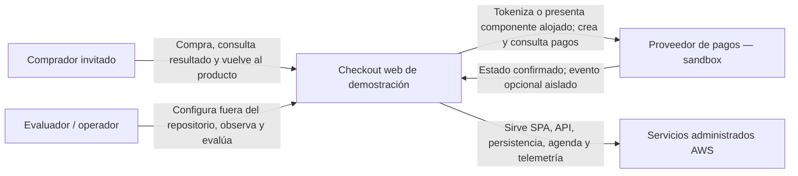
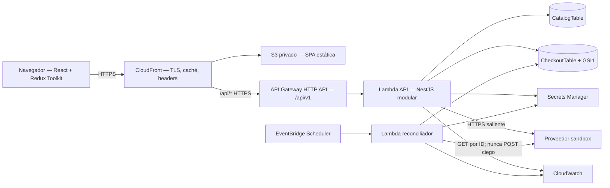
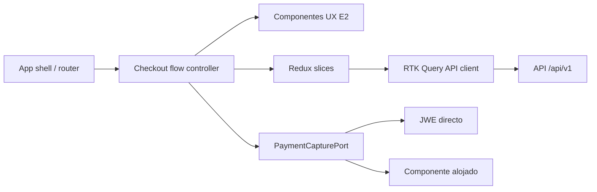
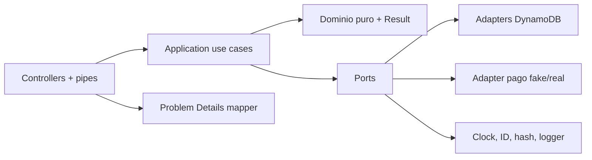
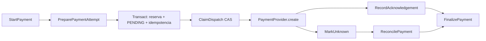
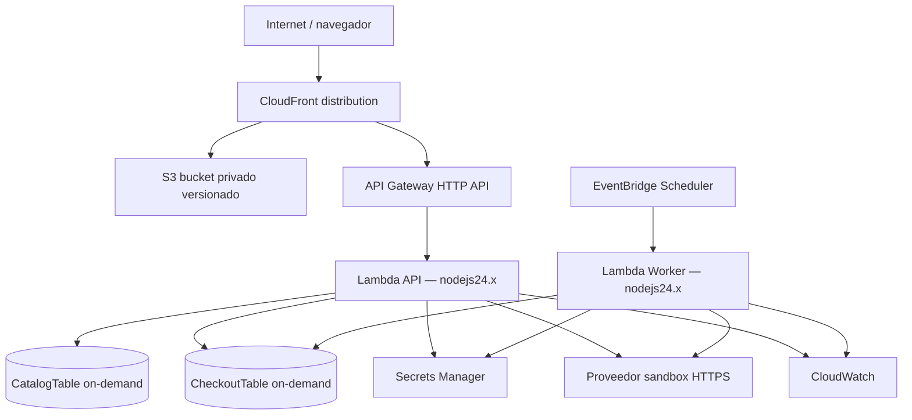
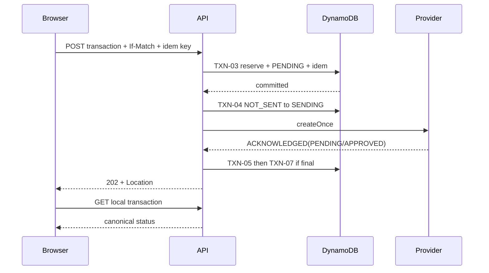
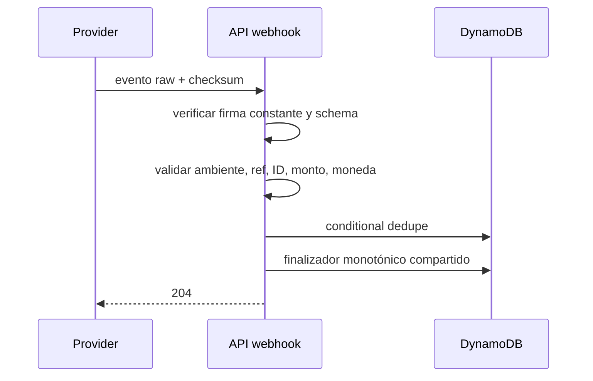
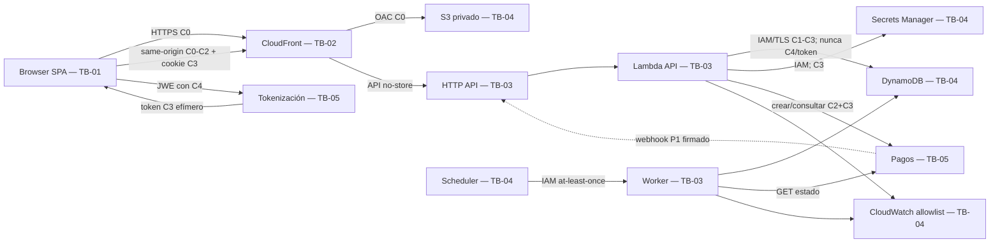
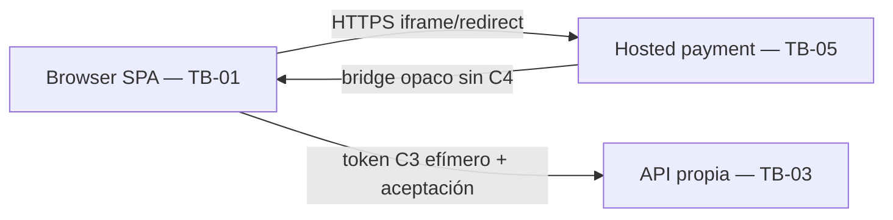

# Etapa 3: arquitectura y diseño técnico

## 1. Control documental, manifiesto y resumen ejecutivo

| Campo | Valor |
|---|---|
| Documento | Contrato canónico de arquitectura y diseño técnico |
| Versión | `1.0.0` |
| Fecha de corte | 2026-08-14, America/Bogota |
| Estado | `DESIGNED_NOT_IMPLEMENTED` |
| Patrón | Monolito modular serverless, contract-first y fake-first |
| Autoridad | Este documento gobierna la etapa 3; no modifica los entregables 0–2 |
| Artefacto machine-readable | [OpenAPI 3.1.2](architecture/openapi.yaml) |
| Ejecución externa | 0 API del proveedor, 0 sandbox/UAT, 0 pagos, 0 recursos AWS, 0 deploy |
| Clasificación máxima | `C2-RESTRICTED`; contiene sólo aliases y ejemplos sintéticos |

La arquitectura mínima que sostiene los requisitos es una SPA, una API Lambda modular, un reconciliador que reutiliza los mismos casos de uso, dos tablas DynamoDB y un adaptador de pagos sustituible. No se introducen microservicios, VPC/NAT, bus de dominio, cola, outbox, ORM, caché financiera ni un segundo backend. Ponytail se aplicó en modo `full`: se reutilizan contratos de etapas 0–2, se eligen primitivas nativas de HTTP/AWS/DynamoDB y se conserva sólo el OpenAPI como archivo auxiliar indispensable. No se simplifican seguridad, accesibilidad, validación, dinero, concurrencia ni recuperación.

El resultado es apto para que la etapa 4 construya contrato, persistencia local y fake. La captura y el adaptador reales continúan bloqueados por `SPK-02/AUTH-01/AUTH-02`; por ello el dictamen final es `CONDITIONAL_GO_TO_E4_FAKE_ONLY`.

### Manifiesto controlado

| ID | Artefacto | Secciones | Resultado | Estado |
|---|---|---:|---|---|
| `ART-ARC-01` | Drivers y baseline | 3–7 | Universo real reconciliado y QAS medibles | `DESIGNED_NOT_IMPLEMENTED` |
| `ART-ARC-02` | C4 y deployment lógico | 8–11, 25 | 9/9 vistas C4/deployment/DFD, relaciones y trust zones | `DESIGNED_NOT_IMPLEMENTED` |
| `ART-ARC-03` | Dominio, módulos e invariantes | 12–14 | 7 módulos; 22 BR, 17 INV y 46 transiciones dispuestas | `DESIGNED_NOT_IMPLEMENTED` |
| `ART-ARC-04` | HTTP/OpenAPI | 15–18 | 14/14 operaciones y 24/24 errores | `DESIGNED_NOT_IMPLEMENTED`; lint estático en §29 |
| `ART-ARC-05` | Persistencia | 19–21 | 20/20 AP; dos tablas, un GSI, 0 `Scan` P0 | `DESIGNED_NOT_IMPLEMENTED` |
| `ART-ARC-06` | Pagos y reconciliación | 22–24 | 16/16 secuencias y fake 12/12; retry ciego 0 | `DESIGNED_NOT_IMPLEMENTED`; real `BLOCKED` |
| `ART-ARC-07` | Seguridad y privacidad | 17, 21, 25, 27 | 72/72 DAT y 29/29 amenazas | `DESIGNED_NOT_IMPLEMENTED` |
| `ART-ARC-08` | Calidad operativa | 26–27 | Fallos, telemetría, targets y costo modelados | `DESIGNED_NOT_IMPLEMENTED` |
| `ART-ARC-09` | ADR, testabilidad y handoff | 28 | 15/15 ADR; seams, tests y enablers | `DESIGNED_NOT_IMPLEMENTED` |
| `ART-ARC-10` | Trazabilidad, auditoría y gates | 29–30 | Cobertura real, 30/30 controles y dictamen | `DESIGNED_NOT_IMPLEMENTED` |

**Manifiesto: 10/10.** “Diseñado” no significa implementado, desplegado, observado ni aprobado por UAT.

## 2. Dictamen, readiness y límites de lo diseñado

| Gate | Dictamen | Base objetiva |
|---|---|---|
| `GATE-E3-01` | `CONDITIONAL GO` | E0–1 7/7, E2 8/8, gate E2 admisible, 0 Sev1/Sev2; denominadores obsoletos reconciliados por `CHG-11` |
| `GATE-E3-02` | `GO_DOCUMENTAL` | Contratos API/datos/pagos/seguridad completos contra el universo canónico; runtime `NOT_RUN` |
| `GATE-E3-03` | `CONDITIONAL_GO_TO_E4_FAKE_ONLY` | Fundación reversible y fake habilitados; integración/captura real siguen `BLOCKED` por `SPK-02` |

Puede comenzar en etapa 4: monorepo y TypeScript strict, contratos, OpenAPI lint, módulos, DynamoDB Local, seed, fake 12/12, health, CI e IaC sin despliegue. No puede comenzar: llamada al proveedor, tokenización, transacción sandbox, webhook real, secretos, infraestructura creada o deploy.

Bloqueos principales:

1. `DEC-17/QST-14/DEP-13`: directa frente a alojada requiere `SPK-02`; default: alojada o pago deshabilitado.
2. `DEC-06/DEC-07/DEP-14`: tarifas y campos siguen `ASSUMED`; se aíslan detrás de configuración/versiones.
3. `QST-21/QST-22`: disponibilidad y DR son targets de diseño, no SLA aceptado.

## 3. Fuentes, precedencia y fecha de corte

### Entradas locales

| Entrada | Ruta efectiva | SHA-256 | Dictamen |
|---|---|---|---|
| PDF normativo | `C:\Users\Ivan\Downloads\Wompi FullStack Test (1).pdf` | `5692401144BE1FAFEAE6D7C01A0EF46BBB0BBAB52EBB244E0CE559F3FAB28368` | `READ_SAFE_REFERENCE`; no se extrajo material sensible |
| Plan maestro | `C:\Users\Ivan\Downloads\plan-maestro-prueba-fullstack.md` | `9DBEFF03446E3C1BDD8D6814B9D0AEAB4B60CD3A63CE04E841895C1B00BAE2C4` | `CONSUMED` |
| Instrucción E0–1 | `C:\Users\Ivan\Downloads\instruccion-etapas-0-1-incepcion-requisitos.md` | `DF476B11DB6A2132412E740756690A45D57C4054B396D3D51026D1EC21D7A2C0` | `CONSUMED` |
| Baseline E0–1 | `output/etapas-0-1-incepcion-y-requisitos.md` | `D604D8EADD0F29CD8283B66E4D5F0809C80EC4B9A5D558CFEDE12DB85892E9F5` | `AUTHORITATIVE_BASELINE` |
| Instrucción E2 | `C:\Users\Ivan\Downloads\instruccion-etapa-2-diseno-ux-ui.md` | `A6BB41F14915954D1E257532413DF43D46BA0C740CD24EDE2C4D7EE50B69E2E6` | `CONSUMED_WITH_DELTAS` |
| Entregable E2 | `output/etapa-2-diseno-ux-ui.md` | `DA5E49DA88078011EF33CC0C6121A9DD8E28CF48FC24F0056EA74E361871EAAB` | `AUTHORITATIVE_UX` |
| Wireframes E2 | `output/ux/wireframes-v1.svg` | `322F78BBFC8CEE5D2C8BF596EBD63D3484A910BD419D17A7ABFCC24343ABE1B9` | `AVAILABLE` |
| Prototipo E2 | `output/ux/prototype-v1.html` | `B7F90C8C80A61FFDA6784E47440775DE87F6F507827BB1E0D7AC4E2B76EAC4E2` | `AVAILABLE` |
| Instrucción E3 | `C:\Users\Ivan\Downloads\instruccion-etapa-3-arquitectura-diseno-tecnico.md` | `F2DC032EBADFE82BF3251D567BEEC889D5F8D449130B2F8AF94A95485DBF89A7` | `EXECUTED_WITH_CHG-11` |

### Fuentes oficiales consultadas el 2026-08-14

| ID | Fuente oficial | Uso y disposición |
|---|---|---|
| `SRC-ARC-01` | [C4 model](https://c4model.com/) | Vocabulario contexto/contenedor/componente/deployment |
| `SRC-ARC-02` | [OpenAPI 3.2.0](https://spec.openapis.org/oas/latest.html) y [3.1.2](https://spec.openapis.org/oas/v3.1.2.html) | 3.2.0 es la publicación vigente; 3.1.2 es el default interoperable de `ADR-08` |
| `SRC-ARC-03` | [RFC 9457](https://www.rfc-editor.org/rfc/rfc9457) y [RFC 9110](https://www.rfc-editor.org/rfc/rfc9110) | Problem Details y semántica HTTP |
| `SRC-ARC-04` | [Transacciones DynamoDB](https://docs.aws.amazon.com/amazondynamodb/latest/developerguide/transactions.html), [condiciones](https://docs.aws.amazon.com/amazondynamodb/latest/developerguide/Expressions.ConditionExpressions.html), [consistencia](https://docs.aws.amazon.com/amazondynamodb/latest/developerguide/HowItWorks.ReadConsistency.html) y [TTL](https://docs.aws.amazon.com/amazondynamodb/latest/developerguide/TTL.html) | Unidades atómicas, CAS, lecturas y limpieza asíncrona |
| `SRC-ARC-05` | [Lambda best practices](https://docs.aws.amazon.com/lambda/latest/dg/best-practices.html), [runtimes](https://docs.aws.amazon.com/lambda/latest/dg/lambda-runtimes.html), [EventBridge Scheduler](https://docs.aws.amazon.com/eventbridge/latest/userguide/using-eventbridge-scheduler.html) y [Serverless Lens](https://docs.aws.amazon.com/wellarchitected/latest/serverless-applications-lens/welcome.html) | Runtime nodejs24.x, idempotencia, retries, scheduler y operación |
| `SRC-ARC-06` | [OWASP API Security 2023](https://owasp.org/API-Security/editions/2023/en/0x11-t10/), [ASVS 5.0.0](https://owasp.org/www-project-application-security-verification-standard/) y [Threat Modeling](https://cheatsheetseries.owasp.org/cheatsheets/Threat_Modeling_Cheat_Sheet.html) | Riesgos/control/prueba; no declaración de conformidad |
| `SRC-ARC-07` | Documentación pública del proveedor: [ambientes](https://docs.wompi.co/docs/colombia/ambientes-y-llaves/), [aceptaciones](https://docs.wompi.co/docs/colombia/tokens-de-aceptacion/), [transacciones](https://docs.wompi.co/docs/colombia/transacciones/), [métodos](https://docs.wompi.co/docs/colombia/metodos-de-pago/) y [eventos](https://docs.wompi.co/docs/colombia/eventos/) | Confirma separación de ambiente, dos aceptaciones, JWE, `PENDING`, consulta por ID y eventos; UAT asignado sigue `NOT_OBSERVED` |
| `SRC-ARC-08` | Precios oficiales: [API Gateway](https://aws.amazon.com/api-gateway/pricing/), [Lambda](https://aws.amazon.com/lambda/pricing/), [DynamoDB](https://aws.amazon.com/dynamodb/pricing/), [S3](https://aws.amazon.com/s3/pricing/), [CloudFront](https://aws.amazon.com/cloudfront/pricing/), [CloudWatch](https://aws.amazon.com/cloudwatch/pricing/), [Scheduler](https://aws.amazon.com/eventbridge/pricing/) y [Secrets Manager](https://aws.amazon.com/secrets-manager/pricing/) | Modelo teórico de costo en §26; facturación real `NOT_RUN` |
| `SRC-ARC-09` | [WCAG 2.2](https://www.w3.org/TR/WCAG22/), [APG modal](https://www.w3.org/WAI/ARIA/apg/patterns/dialog-modal/) y [Web Vitals](https://web.dev/articles/vitals) | Preserva el contrato técnico de E2 |

Precedencia: seguridad/autorización → instrucción vigente del usuario → PDF → decisiones confirmadas → E0–1 → E2 → estándares → contrato público externo → plan/instrucciones históricas → criterio profesional. Una página pública no autoriza una request.

## 4. Baseline heredada, intake, deltas y anomalías

### `E3-INTAKE-1.0`

| Universo | Instrucción E3 | Baseline real consumida | Disposición arquitectónica |
|---|---:|---:|---|
| Cláusulas fuente | 79 | 131 hojas: 106 MUST, 13 SHOULD, 6 MAY, 6 BONUS | 131/131 por ledger; 106/106 MUST con elemento técnico o `DELIVERY_ONLY` |
| RF/RNF | 65/15 | 33 RF (29 hojas+4 anclas) y 28 RNF (23 hojas+5 anclas) | 33/33 y 28/28; anclas no se cuentan como hojas |
| CON/DELIV/EXT/DER | 10/6/7 | 15/8/7/8 | 38/38 |
| US/AC/SC | 12/66/48 | 12/45/51 | 12/12, 45/45 y 51/51 |
| TC/VER/EVD | 45/15/23 | 54 suites/12/72 | 138/138 dispuestos; estados preservados |
| ERR/DAT/UAT | 22/78/34 | 24/72/48 | 24/24, 72/72 y 48/48 |
| BR/INV | 17/12 | 22/17 | 22/22 y 17/17 |
| Transiciones | `TR/TRX` 19 | 34 válidas + 12 prohibidas; 36 críticas | 46/46; 36/36 críticas |
| Rúbrica | 12 | 12 | 12/12; base y bonus separados |
| UX | “denominador real” | 5 macroestados, 13 flujos, 19 clusters, 11 superficies, 29 estados, 60 copy, 16 componentes, 21 a11y, 7 viewports, 12 wireframes | Cada familia 100 % dispuesta en §29 |

### Ledger compacto de disposición

| IDs canónicos | Conteo | Disposición predominante | Elementos descendentes |
|---|---:|---|---|
| `SRC-PDF-P02-*` | 31 | `DRIVES/CONSTRAINS` | `ARCHDRV-01..04`, `API-01..12`, `SEQ-01..16` |
| `SRC-PDF-P03-*` | 24 | `DRIVES/CONSTRAINS` | API, seguridad, recuperación y documentación |
| `SRC-PDF-P04-*` | 35 | `CONSTRAINS`; permisos sin uso son `N-A` razonado | `ADR-01..05/08/15`, QAS |
| `SRC-PDF-P05-*` | 17 | `CONSTRAINS/DELIVERY_ONLY`; datos de acceso nunca copiados | guards, `SPK-02`, repo/handoff |
| `SRC-PDF-P06-*` | 24 | `ARCH_DELIVERABLE/DELIVERY_ONLY` | cloud lógico, evidencia futura y scorecard |
| `RF-01..33` | 33 | Hojas `ARCH_DIRECT/ARCH_SUPPORT`; anclas `IMPLEMENTATION_DETAIL` | API, módulos, AP, secuencias |
| `RNF-01..28` | 28 | Hojas `QUALITY_DRIVER`; anclas agregan trazabilidad | `QAS-01..23` |
| `US-01..12`, `AC-US-*`, `SC-*` | 108 | `CONTRACT/INVARIANT/TESTABILITY` | API/SEQ/ARCHTEST |
| `CON-01..15`, `DELIV-01..08`, `EXT-01..07`, `DER-01..08` | 38 | `CONSTRAINT/ARCH_DELIVERABLE/EXTERNAL_DEPENDENCY` | ADR, controles y handoff |
| `TC-*`, `VER-01..12`, `EVD-01..72`, `UAT-01..48` | 186 | `DESIGN_SUPPORTED/IMPLEMENTATION_ONLY/BLOCKED_EXTERNAL` | `ARCHTEST-*`; ejecución no cambia |
| `BR-01..22`, `INV-01..17`, transiciones válidas/prohibidas | 85 | `DOMAIN/APPLICATION/TRANSACTION/REJECTED` | módulos, agregados, `TXN-*` |
| `ERR-01..24`, `DAT-01..72` | 96 | Contrato/error y frontera de dato | OpenAPI, DFD, retención y observabilidad |
| `UXMAC/UXF/UXTR/UXSCR/UXST/UXCOPY/UXCMP/UXA11Y/UXVP/UXWF` | Familias E2 | `DRIVES/CONSTRAINS/IMPLEMENTATION_DETAIL` | SPA, estado local, API, a11y y performance |

No se duplica aquí la matriz atómica ya canónica de E0–1; este ledger define la regla descendente por conjunto y §29 verifica sus denominadores. Ningún `N-A` oculta una obligación base.

### Anomalías E3 resueltas

| ID | Veredicto contra la baseline real | Resolución |
|---|---|---|
| `ANM-E3-01` | La instrucción desplaza el significado de `DEC-11`; rutas reales viven en `DEC-12` | Una ruta customer anidada en `ADR-08`; tag `Customers`; `CHG-13` |
| `ANM-E3-02` | La instrucción invierte aliases; E0 usa `NOT_SENT/ACKNOWLEDGED` | Se conservan los estados E0; aliases inexistentes no entran a schemas |
| `ANM-E3-03` | E0 modela un pseudoestado de conflicto | `CHG-12`: `paymentStatus=APPROVED` + `integrityStatus=CONFLICT`, preservando `ERR-22` |
| `ANM-E3-04` | Modelo físico abierto | `ADR-05`: dos tablas legibles y un GSI; no single-table opaco |
| `ANM-E3-05` | OAS 3.2 vigente frente a toolchain incierto | `ADR-08`: OAS 3.1.2 hasta spike de compatibilidad E4 |
| `ANM-E3-06` | Significados/estados DEC de la instrucción no coinciden con E0/E2 | Se usa `DEC-01..22` real sin elevar ninguno |
| `ANM-E3-07/08` | `RF-07.2`, `TR-*` y `TRX-*` no existen en baseline final | Se usan `PAY-T*`, `DSP-T*`, `CHK-T*`, `RSV-T*`, `DLV-T*`, `PRV-T*`, `XST-*` |
| `ANM-E3-09/10` | Tensión válida | Claves crudas sólo memoria/header; capability denegada responde 404 |
| `ANM-E3-11` | IDs DAT obsoletos | Llave pública=`DAT-60`; aceptaciones=`DAT-36/37`; config completa `no-store` |
| `ANM-E3-12` | Riesgo válido | GET público lee sólo DB local; reconciliador hace GET externo |
| `ANM-E3-13` | Singular/plural divergente | Se preserva la ruta canónica plural `/webhooks/payments` |
| `ANM-E3-14` | Retry final sin arista explícita | `CHG-14`: “Intentar de nuevo” crea checkout nuevo; no rehabilita el anterior |
| `ANM-E3-15` | Mapa DAT de la instrucción es de otra versión | Rige DATA-LOG-0.1, 72/72; `CHG-07` heredado |

### Cambios de consumo

| ID | Propuesta aplicada sólo en E3 | Razón/impacto | Owner/estado/gate |
|---|---|---|---|
| `CHG-11` | Sustituir todos los denominadores E3 obsoletos por `E3-INTAKE-1.0` | Evita IDs ficticios y falsas coberturas | CANDIDATE+QA / `APPLIED_LOCALLY` / E3 |
| `CHG-12` | Separar aprobación externa de conflicto local mediante `integrityStatus` | Nunca oculta un cobro aprobado; cambia schema/tests, no el hecho externo | ARCH+PO / `PROPOSED_APPLIED_IN_CONTRACT` / antes E4 |
| `CHG-13` | Canonizar `PUT /checkouts/{id}/customer`; retirar alias top-level | Relación anti-IDOR y una sola ruta | ARCH / `ACCEPTED_FOR_CONTRACT` / OpenAPI |
| `CHG-14` | Retry tras final crea checkout nuevo | Evita inventar transición `PAYMENT_FAILED→READY` | PO+UX+ARCH / `BASELINE_FOR_E4` / antes build |

La baseline E0–1 y E2 no fue editada.

## 5. Alcance, exclusiones, restricciones y principios

Incluye: C4/DFD, módulos y dominio, HTTP/OpenAPI, DynamoDB, pago/fake/reconciliación, seguridad/privacidad, fallos/telemetría/costo, ADR/testabilidad y handoff. Queda condicionado: captura directa/alojada, adapter real, webhook real, PITR/WAF y toolchain OAS 3.2. Queda excluido: código, scaffold, dependencias, tablas/recurso cloud, CI/CD ejecutado, sandbox, UAT, deploy, carrito, login, reembolso y producción.

Principios: autoridad backend para dinero/stock/estado; reserva y `PENDING` antes de I/O; una sola intención activa; convergencia local idempotente, nunca exactly-once externo; `UNKNOWN` conserva y sólo consulta; dominio sin Nest/AWS/DTO externo; relaciones capability-bound; datos mínimos y logs allowlisted; fake antes de real; expand/contract; costo acotado; YAGNI.

## 6. Drivers y escenarios de atributos de calidad

### Drivers

| ID | Driver/prioridad | Fuente | Táctica y medida | Riesgo/owner/estado |
|---|---|---|---|---|
| `ARCHDRV-01` | Flujo checkout P0 | PDF/RF/UX | 14 operaciones, 16 secuencias, 13 UXF soportados | `RSK-13`; ARCH; `BASELINE` |
| `ARCHDRV-02` | Integridad dinero/stock P0 | BR/INV | Transacciones/condiciones; negativos/doble efecto=0 | `RSK-02..05/08`; ARCH; `BASELINE` |
| `ARCHDRV-03` | Asincronía/recuperación P0 | RF-07..13/31 | estado durable, polling local, worker, retry ciego=0 | `RSK-02/07`; ARCH; `BASELINE` |
| `ARCHDRV-04` | Seguridad/privacidad P0 | RNF-18..20/26/27 | C4 provider-only, cookie hash, anti-IDOR, allowlists | `RSK-01/09/12`; APPSEC; `BASELINE` |
| `ARCHDRV-05` | UX/a11y/performance P0 | E2/RNF-16/17/24/25 | estado canónico, foco/reflow, payload/image budgets | `RSK-17..19`; FE+QA; `BASELINE` |
| `ARCHDRV-06` | Testabilidad P0 | RNF-08/09/21/22 | puertos, fake 12/12, clocks/IDs, gate 85 % | `RSK-10`; QA; `BASELINE` |
| `ARCHDRV-07` | Modificabilidad P0 | RNF-05/DEC-01 | monolito modular, contratos y mappers | `RSK-13`; ARCH; `BASELINE` |
| `ARCHDRV-08` | Deploy reproducible P0 | RNF-23/DELIV | serverless/CDK futuro, no VPC/NAT | `RSK-11`; DEVOPS; `BASELINE` |
| `ARCHDRV-09` | Observabilidad P0 | RNF-27 | eventos allowlisted, alarmas y runbooks | `RSK-01/07`; OPS; `BASELINE` |
| `ARCHDRV-10` | Costo P0 | DEC-02/RSK-14 | on-demand, límites, retención, base ≤USD10 | CANDIDATE; `TARGET_DESIGN` |
| `ARCHDRV-11` | Contrato externo P0 | EXT/SPK-02 | port+fake; real bloqueado/fail-closed | `RSK-07/18`; PROVIDER+APPSEC; `BLOCKED` |
| `ARCHDRV-12` | Rúbrica/entrega P0 | PDF/RUB | Swagger, AWS lógico, Jest, README/evidencia futura | `RSK-10/11/15`; CANDIDATE; `BASELINE` |

### Escenarios `QAS-01..23`

| ID/RNF | Fuente–estímulo/entorno | Respuesta y medida futura | Tácticas/evidencia |
|---|---|---|---|
| `QAS-01/RNF-01` | CI encuentra framework no permitido | build falla; React SPA único | `ADR-02`; inspection/EVD-10 |
| `QAS-02/RNF-02` | Evento actualiza estado global | Redux/RTK determinista; C2–C4 persistidos=0 | slices por feature; Jest |
| `QAS-03/RNF-04` | Build backend | sólo TS/NestJS | manifest gate |
| `QAS-04/RNF-05` | Request ejecuta regla | controller sólo mapea; dominio importa Nest/AWS=0 | architecture test/EVD-11 |
| `QAS-05/RNF-07` | Refresh en cualquier paso | canónico ≤2 s target; POST nuevo=0; C4/token ausentes | RTK Query+GET local/UAT-25..27 |
| `QAS-06/RNF-09` | PR cambia código | FE y BE ≥85 % en lines/branches/functions/statements | Jest/EVD-05; `NOT_RUN` |
| `QAS-07/RNF-11` | Evaluador abre docs | HTTPS 200, OpenAPI válido, 14/14 operaciones | OpenAPI lint/EVD-04 |
| `QAS-08/RNF-12` | Release candidate | README/links/modelo/cobertura completos | checklist/EVD-01 |
| `QAS-09/RNF-13` | Handoff público | nombre neutro, historia real, secretos=0 | repo audit/EVD-13 |
| `QAS-10/RNF-14` | Config parece producción | startup aborta antes de red; guard trip=1 | config schema/UAT-32 |
| `QAS-11/RNF-16` | Render 7 viewports | overflow/solape/control oculto=0 | E2 tokens+Playwright/EVD-36 |
| `QAS-12/RNF-17` | Teclado opera modal | foco/trap/Escape/restore/labels 100 % | APG contract/UAT-36 |
| `QAS-13/RNF-18` | Captura+refresh | PAN/CVC/expiry/token en API/DB/log/storage=0 | provider boundary/scans/EVD-37/53 |
| `QAS-14/RNF-19` | Checkout contiene PII | cifrada, capability-bound, logs=0, purga gobernada | DS profiles/UAT-29 |
| `QAS-15/RNF-20` | Build/runtime usa secretos | bundle/repo/OpenAPI/log=0; sólo gestor+memoria | `ADR-13`/EVD-15 |
| `QAS-16/RNF-21` | PR frontend | Jest verde y QAS-06 | test gate |
| `QAS-17/RNF-22` | PR backend | Jest verde y QAS-06 | test gate |
| `QAS-18/RNF-23` | Smoke futuro | TLS válido, redirect HTTPS, health/product/docs 200 | CloudFront/API GW/EVD-06/57 |
| `QAS-19/RNF-24` | 3 cargas mobile limpias | LCP<2.5 s, CLS<0.1, INP≤200 ms target | CDN/assets/Lighthouse |
| `QAS-20/RNF-25` | Descarga LCP | AVIF/WebP ≤200 KiB mobile, dimensiones reservadas | build budget/EVD-02 |
| `QAS-21/RNF-26` | Request hostil/repetido | origin/headers/body/unknown props/rate checks; high=0 | API GW+guards+tests |
| `QAS-22/RNF-27` | Pago/error emite telemetría | sólo allowlist; C2 directo/C3/C4/stack=0 | safe logger/EVD-15 |
| `QAS-23/RNF-28` | Camino P0 por motor P1 | Chromium/Firefox/WebKit; bonus sólo si pasa | Playwright/EVD-08; `NOT_RUN` |

Targets no aprobados: disponibilidad mensual 99.5 %, RTO 4 h y RPO 24 h para pérdida administrativa de tabla son `TARGET_DESIGN`, sujetos a `QST-21/QST-22`; no son SLA ni resultado medido.

## 7. Decisiones, supuestos, preguntas, dependencias y riesgos

### Gobierno heredado y nuevo

| IDs | Estado preservado | Tratamiento E3 |
|---|---|---|
| `DEC-01..05/09/11/12/15/19/21` | `BASELINE` | ADR técnico reversible; no se eleva a `CONFIRMED` |
| `DEC-06..08/10/13/14/18/20/22` | `ASSUMED` | Config/default/fallback; owner y gate permanecen |
| `DEC-17` | `BLOCKED` | Dos variantes diseñadas; real no se implementa |
| `DEC-16` | `CONFIRMED` editorial | Sin impacto técnico |
| `ASM-01..14`, `QST-01..20`, `DEP-01..17`, `RSK-01..20` | Estados E0/E2 | Se consumen sin renumerar |

| ID | Nuevo supuesto/pregunta | Default seguro | Owner/gate/estado |
|---|---|---|---|
| `ASM-15` | Región de cálculo y futura baseline: `us-east-1` | Cambiable por config/IaC; recalcular costo | DEVOPS / E4 / `ASSUMED` |
| `ASM-16` | Base mensual: 10k visitas, 1k checkouts, 800 pagos, 100k API, 200k lecturas y 50k escrituras | Escenario explícito, no forecast | PO+OPS / E7 / `ASSUMED` |
| `QST-21` | ¿Disponibilidad objetivo aceptada? | 99.5 % mensual `TARGET_DESIGN`; sin SLA público | PO+OPS / antes E7 / `OPEN_CONTROLLED` |
| `QST-22` | ¿RTO/RPO y backup aceptados? | RTO 4 h/RPO 24 h; PITR se activa sólo si costo/owner lo aprueban | PO+OPS / antes E7 / `OPEN_CONTROLLED` |

Riesgos heredados siguen abiertos hasta implementación; el diseño reduce su exposición, no los “cierra”. Señales críticas: `UNKNOWN` con segundo POST, C4 en backend, stock negativo, final contradictorio aplicado, config productiva, ruta privada enumerable, costo sin límite. Cualquiera bloquea E4.

## 8. Vista C4 de contexto

### `ARCVIEW-01` — contexto del sistema



| Nodo | Responsabilidad | Datos permitidos | Límite explícito |
|---|---|---|---|
| Comprador | Seleccionar el único SKU, aportar datos mínimos, aceptar contratos y ordenar el pago | C0–C2; C4 sólo dentro de frontera del proveedor | No es identidad permanente ni fuente de monto/stock |
| Sistema | Cotizar, reservar, coordinar pago, reconciliar y finalizar exactamente una vez | C0–C3 conforme a `POL-DAT-*`; C4=0 | No custodia tarjeta, no reintenta un `POST` ambiguo |
| Proveedor | Tokenización, operación financiera y estado externo | C4 y token efímero según contrato sandbox | Sólo sandbox futuro autorizado; no se cambia configuración global |
| AWS | Hosting, cómputo, persistencia, agenda, secretos y observabilidad | Datos cifrados y minimizados | Sin VPC/NAT ni servicios no justificados |
| Evaluador/operador | Entrega, observación y compensación manual excepcional | Evidencia sanitizada | No ve secretos, tarjeta, capability ni cuerpos crudos |

Relaciones de confianza: navegador↔SPA/API sólo HTTPS y mismo origen; API↔proveedor sólo FQDN sandbox allowlisted; workloads↔AWS mediante IAM por rol; operador↔consola queda fuera del flujo de cliente y exige autoridad independiente.

## 9. Vista C4 de contenedores y relaciones

### `ARCVIEW-02` — contenedores



| ID | Contenedor | Responsabilidad única | Escala/fallo | Restricciones |
|---|---|---|---|---|
| `ARC-C01` | SPA | Flujo, validación de presentación, captura elegida y polling de estado local | CDN; refresh reconstruye desde API | Estado permitido por `DEC-09`; sin autoridad de negocio |
| `ARC-C02` | Edge/S3 | Entregar shell y assets inmutables, HTTPS y headers | Global/estático; rollback por versión | Bucket no público; HTML `no-store`, assets hashados |
| `ARC-C03` | HTTP API | Enrutamiento, límites, request ID y acceso Lambda | Throttle y timeout finitos | Mismo origen; no contiene dominio |
| `ARC-C04` | Lambda API | Casos de uso síncronos y adapter de pago inicial | Concurrencia reservada limitada | Registro durable antes de I/O; log seguro |
| `ARC-C05` | Reconciliador | Reclamar vencidos, consultar proveedor y finalizar | Batch acotado, lease/CAS | Lee GSI sólo para descubrir; base es autoridad |
| `ARC-C06` | CatalogTable | Producto e inventario atómico | On-demand | Consistencia fuerte en compra; sin `Scan` |
| `ARC-C07` | CheckoutTable | Agregado, pago, reserva, dedupe, entrega y agenda | On-demand + un GSI | Particiones acotadas; TTL nunca decide finales |
| `ARC-C08` | Secretos | Claves privadas/HMAC/evento | Caché en memoria de ejecución | IAM por secreto; jamás bundle/config pública |
| `ARC-C09` | Telemetría | Señales allowlisted, alarmas y presupuesto | Retención finita | C3/C4=0; C2 directo=0 |
| `ARC-C10` | Pago | Tokenización, creación y consulta | Externo/no controlable | `SPK-02` bloquea adapter real |

### Zonas de confianza

| Zona | Entrada | Salida | Control principal |
|---|---|---|---|
| `TZ-01` pública | HTTPS 443 | Edge/API | TLS, CSP, HSTS, límites, Origin/Fetch Metadata |
| `TZ-02` aplicación | API Gateway a Lambda | DynamoDB/Secrets/proveedor | IAM mínimo, validación runtime, egress allowlist lógica |
| `TZ-03` datos | Roles concretos | Ninguna pública | Cifrado administrado, condiciones y transacciones |
| `TZ-04` proveedor | JWE/hosted y API servidor | Estado externo | Sandbox coherente, auth separada, timeout |
| `TZ-05` operación | Roles humanos temporales | Métricas/evidencias | Menor privilegio, sin payloads, auditoría |

### Relaciones `ARC-REL-01..15`

| ID | Origen→destino | Protocolo/datos | Autenticación | Timeout/retry/cache |
|---|---|---|---|---|
| `ARC-REL-01` | Navegador→CloudFront | HTTPS, HTML/assets C0 | Pública | caché por tipo; retry navegador sólo GET |
| `ARC-REL-02` | CloudFront→S3 | HTTPS OAC | SigV4 administrada | asset inmutable |
| `ARC-REL-03` | Navegador→API | HTTPS JSON C0–C2 | capability cookie + origen | cliente reintenta sólo GET; mutación idempotente |
| `ARC-REL-04` | Edge→API Gateway | HTTPS mismo origen | distribución/ruta | sin caché privado |
| `ARC-REL-05` | Gateway→Lambda API | integración proxy | servicio administrado | timeout inferior al gateway |
| `ARC-REL-06` | API→CatalogTable | SDK Get/Query/Transact | rol API | retry sólo si seguro |
| `ARC-REL-07` | API→CheckoutTable | SDK Get/Query/Transact | rol API | CAS; lectura fuerte para efectos |
| `ARC-REL-08` | API→Secrets | SDK GetSecretValue | rol+ARN concreto | caché en memoria, sin log |
| `ARC-REL-09` | Navegador→tokenización | HTTPS JWE o iframe hosted | contrato proveedor | efímero, no persistido |
| `ARC-REL-10` | API→proveedor POST | HTTPS JSON C2+C3 efímero | secreto servidor | una llamada; timeout→`UNKNOWN` |
| `ARC-REL-11` | API/worker→proveedor GET | HTTPS ID opaco | secreto servidor | backoff acotado y repetible |
| `ARC-REL-12` | Scheduler→worker | invocación AWS | IAM | al-menos-una-vez absorbida por lease |
| `ARC-REL-13` | Worker→CheckoutTable | Query GSI + CAS base | rol worker | páginas acotadas; sin `Scan` |
| `ARC-REL-14` | Proveedor→webhook | HTTPS firmado | firma + secret + dedupe | opcional/P1; mismo finalizador |
| `ARC-REL-15` | Workloads→CloudWatch | EMF/logs allowlisted | IAM | nunca bloquea negocio |

## 10. Vista C4 de componentes

### `ARCVIEW-03` — SPA



- Redux conserva sólo estado de presentación y referencias permitidas; RTK Query es dueño de datos servidor.
- `PaymentCapturePort` evita bifurcar el journey; `DEC-17` selecciona un adapter después de `SPK-02`.
- El modal implementa `UXA11Y-*`; el dominio no se deduce de copy, color ni ruta.
- Un `paymentToken` vive sólo en memoria hasta una llamada; refresh exige reingreso, nunca recuperación.

### `ARCVIEW-04` — Lambda API



Los controllers traducen HTTP; no deciden tarifas, reservas, finales ni reintentos. Los casos de uso coordinan puertos. El dominio no importa Nest, AWS SDK ni DTO. Los adapters no exponen excepciones externas: retornan `Result<T, DomainError>` tipado.

### `ARCVIEW-05` — orquestación de pago



`Prepare`, `Claim`, `Record` y `Finalize` son fronteras durables distintas. Después de `SENDING` cualquier ambigüedad conserva reserva y prohíbe otro `POST`; sólo se consulta por ID confirmado o se deriva a revisión manual.

### `ARCVIEW-06` — datos

| Componente | Escrituras | Lecturas | Consistencia |
|---|---|---|---|
| Product repository | seed y deltas de stock | producto/listado/stock | fuerte antes de reservar; eventual admisible sólo para catálogo visual |
| Checkout repository | META, cliente, entrega previa, quote | recuperación capability-bound | fuerte para `If-Match`; proyección dentro de partición |
| Payment repository | intento, dispatch, provider state, locks | status local/reconcile | CAS + transacciones; finales monotónicos |
| Idempotency store | key HMAC + hash semántico + respuesta | replay/conflicto | misma unidad transaccional que el comando |
| Delivery repository | entrega post-aprobación | resultado/consulta | creación condicional exactamente una vez |
| Reconcile index | cola constante + `nextCheckAt` | trabajo vencido | GSI eventual descubre; reclamo fuerte en item base |

## 11. Vista de despliegue lógico y flujos de red

### `ARCVIEW-07` — despliegue objetivo



No hay VPC: los servicios administrados y la salida HTTPS evitan subredes, NAT y costo fijo. Si una política futura exige VPC, debe abrirse un ADR y un nuevo modelo de costo; no es un ajuste implícito.

| Área | Diseño objetivo | Control verificable futuro |
|---|---|---|
| DNS/TLS | CloudFront y API bajo mismo origen; TLS 1.2+ | `UAT-33`, cert válido, redirect 301/308 |
| S3 | block-public-access, acceso sólo OAC, versionado | policy audit; URL S3 pública falla |
| CloudFront | HTML `no-store`; assets hashados `public,max-age=31536000,immutable`; `/api/*` sin caché | headers/smoke/rollback de origin path |
| API Gateway | rutas explícitas, payload aplicación ≤16 KiB, throttle global 1 rps/10 burst para demo | pruebas 413/429 y budget alarm |
| Lambda API | baseline a medir: 512 MiB, 10 s, concurrencia reservada 5 | smoke de carga y p95; no es cifra final |
| Worker | baseline a medir: 512 MiB, 30 s, batch≤20, concurrencia 1 | lease/CAS y age metric |
| DynamoDB | on-demand, cifrado administrado, PITR condicionado por `QST-22` | no `Scan`, alarmas y restore drill futuro |
| Scheduler | cada minuto, payload constante sin PII | regla/invocación y alarma; no se agrega una cola |
| IAM | rol API y worker separados; acciones y ARN concretos | policy review; secretos denegados al frontend |
| Logs | JSON allowlist, retención 7 días; métricas 90 días | `EVD-15`, scan C3/C4=0 |
| Ambientes | `local=fake`; `preview=fake`; `sandbox=real sólo AUTH`; producción inexistente | guard startup/host/key; `UAT-32` |
| Rollback | SPA vuelve a versión S3; Lambda a alias previo; esquema additive/expand-contract | smoke postrollback, sin reversión destructiva |

Entrada pública permitida: 443 a CloudFront. Flujos internos: Scheduler→worker y workloads→servicios AWS/proveedor. No existen puertos administrativos, acceso público a tablas/bucket ni entrada directa a Lambda.

## 12. Arquitectura modular, dependencias y puertos

El backend es un monolito modular desplegado en dos entrypoints. No hay microservicios, bus, ORM, outbox ni repositorio por tabla: serían variación sin necesidad demostrada. La frontera hexagonal existe donde protege dominio, proveedor, reloj, hashes, persistencia y telemetría.

| ID | Módulo | Responsabilidad | Entradas públicas | Dueño de reglas |
|---|---|---|---|---|
| `MOD-01` Catalog | Consultar y sembrar el único producto | list/get product, stock, seed interno | precio base, identidad del SKU |
| `MOD-02` Checkout | Crear/recuperar sesión, cliente, entrega previa y quote | create/get/update | capability, versión, readiness, quote |
| `MOD-03` Payments | Preparar, despachar, observar y finalizar intento | create/get, webhook opcional, worker | idempotencia, dispatch y monotonía |
| `MOD-04` Inventory | Reservar, consumir o liberar | sólo casos de uso internos | `INV-01..17`, deltas y concurrencia |
| `MOD-05` Delivery | Crear/consultar entrega post-aprobación | get delivery; comandos internos | máximo una, compensación manual |
| `MOD-06` Trust | Capability, Origin, validación, problemas y logs seguros | guards/interceptors/mappers | C0–C4, error estable, redacción |
| `MOD-07` Platform | Adapters AWS, proveedor, config, IDs, reloj y hash | composition root API/worker | ninguna regla de negocio |

### Regla de dependencias

```text
transport/adapters -> application -> domain
                              -> ports <- infrastructure adapters
```

| Origen | Puede depender de | No puede depender de |
|---|---|---|
| Domain | tipos propios y utilidades puras | NestJS, AWS SDK, HTTP, variables de entorno |
| Application | Domain + interfaces de ports | DTO externos concretos, DynamoDB expressions |
| Transport | Application + contratos HTTP | repositorios/adapters directos |
| Infrastructure | Ports + SDKs | controllers o estado de UI |
| SPA domain/state | contratos generados + UI | claves servidor, provider private API |

### Puertos mínimos

| ID | Puerto | Operaciones esenciales | Adapter E4 |
|---|---|---|---|
| `PORT-01` | `CatalogRepository` | `list`, `get`, `seedIfAbsent` | DynamoDB/in-memory |
| `PORT-02` | `CheckoutRepository` | `create`, `loadAuthorized`, `updateIfVersion` | DynamoDB/in-memory |
| `PORT-03` | `PaymentUnitOfWork` | `prepareAttempt`, `finalize`, `recordUnknown` | TransactWrite/fake |
| `PORT-04` | `PaymentProvider` | `configuration`, `createOnce`, `getById`, `verifyEvent` | deterministic fake; real bloqueado |
| `PORT-05` | `ReconcileRepository` | `findDue`, `claimLease`, `reschedule`, `release` | GSI+CAS/in-memory |
| `PORT-06` | `SecretsPort` | `getNamedSecret` | Secrets Manager/test fixture alias |
| `PORT-07` | `ClockAndIds` | `now`, `newOpaqueId`, `newCapability` | crypto+UTC/determinista |
| `PORT-08` | `SafeTelemetry` | `event`, `metric`, `alarmSignal` | CloudWatch/capturing fake |

Cada operación expresa éxito o error de dominio mediante una unión discriminada `Result<T,E>`; no se incorpora una biblioteca ROP. Los errores de infraestructura se mapean una vez a `ERR-*` sin exponer stack, cuerpo o credencial.

## 13. Modelo de dominio y agregados

### Agregados

| ID | Raíz y contenido | Invariantes locales | Comandos |
|---|---|---|---|
| `AGG-01` | `ProductInventory`: producto + `onHand/reserved/available/version` | `available=onHand-reserved≥0`; cantidad positiva; seed idempotente | reserve, consume, release, seed |
| `AGG-02` | `Checkout`: estado, capabilityHash, cliente, delivery details, quote, versión | un SKU/q=1; quote backend vigente; capability ligada; edición bloqueada en pago | create, updateCustomer, updateDelivery, quote, expire |
| `AGG-03` | `PaymentAttempt`: estado local/proveedor, dispatch, referencia, agenda | máximo un activo; finales monotónicos; un claim; `UNKNOWN` sin POST | prepare, claim, acknowledge, markUnknown, applyProviderState |
| `AGG-04` | `IdempotencyRecord`: keyHash, semanticHash, operation, respuesta | misma key+hash=replay; misma key+otro hash=conflicto | reserve, complete, replay |
| `AGG-05` | `Delivery`: snapshot de destino y estado | nace sólo con APPROVED+CONSUMED; máximo una por checkout | create, assign, cancelManually |
| `AGG-06` | `ReconcileLease`: owner, leaseUntil, nextCheckAt, attempts | un worker por ventana; GSI no concede autoridad | claim, reschedule, release |

Una operación financiera necesita atomicidad entre `AGG-01..05`; DynamoDB `TransactWriteItems` es la unidad física. “Agregado” no implica una megaentidad en memoria ni una partición ilimitada.

### Objetos de valor

| ID | Valor | Reglas |
|---|---|---|
| `VO-01` Money | `amountInCents` entero no negativo + `COP` | sin float; suma con overflow guard |
| `VO-02` Quantity | entero; baseline exactamente 1 | validación servidor |
| `VO-03` Quote | id, versión, líneas, total, vencimiento | inmutable; autoridad backend |
| `VO-04` Capability | secreto 256-bit crudo + HMAC persistido | comparación constante; jamás log |
| `VO-05` IdempotencyKey | formato opaco + HMAC | scope operación/checkout |
| `VO-06` SemanticHash | HMAC de campos cobrables canónicos | excluye datos efímeros y telemetría |
| `VO-07` ProviderReference | derivada estable de checkout/intento | única; no contiene PII |
| `VO-08` Email | normalizada para uso, no para identidad | longitud/formato; no log |
| `VO-09` Phone | E.164 normalizado cuando sea viable | longitud/formato |
| `VO-10` DeliveryAddress | campos mínimos de `DEC-07` | allowlist/longitudes |
| `VO-11` AcceptanceEvidence | versiones, timestamp y hashes | dos aceptaciones, sin token crudo persistido |
| `VO-12` Installments | entero permitido por configuración | no se acepta lista cliente |
| `VO-13` ProviderTransactionId | opaco, validado y no enumerable | requerido para reconciliar |
| `VO-14` ETagVersion | entero monotónico representado `"checkout-vN"` | `If-Match` obligatorio en cambios |
| `VO-15` CorrelationId | UUID generado/validado | no autentica ni entra al hash |

### Invariantes aplicadas

- `INV-01..17` conservan su definición E0/E1; el diseño no redefine sus textos.
- El catálogo visual puede ser eventualmente consistente; reservar, finalizar y autorizar usan lectura fuerte/condición.
- `PAY-T06` y el código `APPROVED_INVENTORY_CONFLICT` se conservan como traza canónica. El contrato E3 aplica `CHG-12`: `paymentStatus=APPROVED`, `providerStatus=APPROVED` e `integrityStatus=APPROVED_INVENTORY_CONFLICT`; así no se oculta el cobro ni se inventa otro final externo.
- `FINAL_STATE_CONFLICT` es incidente, no transición silenciosa.
- Datos previos de entrega no son una entrega; `AGG-05` nace sólo durante finalización aprobada.

## 14. Estados, transiciones y unidades de consistencia

### Estados canónicos y proyección de presentación

| Máquina | Estados canónicos | Regla de proyección UX |
|---|---|---|
| Checkout | `DRAFT, READY, PAYMENT_PENDING, PAID, PAYMENT_FAILED, EXPIRED` | DRAFT/READY alimentan captura/revisión; PAYMENT_PENDING muestra submitting/pending/unknown según dispatch; finales muestran resultado |
| Pago local | Baseline: `PENDING, APPROVED, DECLINED, VOIDED, ERROR, APPROVED_INVENTORY_CONFLICT`; proyección E3: los cinco estados y `integrityStatus` separado | Nunca se infiere por HTTP ni copy; `PAY-T06` proyecta APPROVED+conflict |
| Dispatch | `NOT_SENT, SENDING, ACKNOWLEDGED, UNKNOWN, NOT_SENT_FAILED` | `SENDING` no significa enviado confirmado; `UNKNOWN` bloquea retry |
| Proveedor | `null, PENDING, APPROVED, DECLINED, VOIDED, ERROR` | Hecho externo separado del resultado local |
| Reserva | `NONE, ACTIVE, CONSUMED, RELEASED` | PENDING/UNKNOWN conservan ACTIVE |
| Entrega | `NONE, CREATED, ASSIGNED, CANCELLED` | `CANCELLED` es compensación manual, no reversión automática |

Los 19 `UXTR-*` son clusters de presentación sobre 36 aristas críticas; no sustituyen las 34 transiciones válidas ni las 12 prohibidas del dominio.

### Unidades de consistencia `TXN-01..10`

| ID | Comando | Escrituras atómicas/condiciones | Resultado durable |
|---|---|---|---|
| `TXN-01` | Crear checkout | put META si ausente + capabilityHash único lógico | DRAFT, versión 1 |
| `TXN-02` | Actualizar cliente/entrega/quote | update item + META version si capability y `If-Match` | nueva versión/ETag |
| `TXN-03` | Preparar pago | inventario reserve + PAYMENT PENDING + RESERVATION ACTIVE + IDEMPOTENCY + checkout PAYMENT_PENDING | cero I/O externo antes del commit |
| `TXN-04` | Reclamar dispatch | CAS `NOT_SENT→SENDING`, líder/token/startedAt | exactamente un líder lógico |
| `TXN-05` | Reconocer proveedor | CAS SENDING/UNKNOWN→ACKNOWLEDGED + provider ID/status + agenda | consulta futura posible |
| `TXN-06` | Marcar desconocido | CAS SENDING→UNKNOWN + nextCheckAt; reserva intacta | segundo POST prohibido |
| `TXN-07` | Finalizar APPROVED | payment final + reserva consumed + inventario consume + delivery create-if-absent + checkout PAID + idempotencia completa | todos los efectos o ninguno |
| `TXN-08` | Finalizar fallo | payment final + reserva release + inventario release + checkout PAYMENT_FAILED + cero delivery | todos los efectos o ninguno |
| `TXN-09` | Aplicar evento opcional | dedupe event + monotonía + `TXN-07/08` lógica | replay no-op; conflicto incidente |
| `TXN-10` | Reclamar reconciliación | CAS lease vencido + owner + leaseUntil; al terminar reschedule/release | un worker autoritativo |

### 34 transiciones válidas

| ID | Arista | Condición/efecto principal | Unidad |
|---|---|---|---|
| `CHK-T01` | DRAFT→READY | cliente, entrega, aceptaciones y quote válidos; versión++ | `TXN-02` |
| `CHK-T02` | READY→PAYMENT_PENDING | pago y reserva activos | `TXN-03` |
| `CHK-T03` | PAYMENT_PENDING→PAID | APPROVED finalizado | `TXN-07` |
| `CHK-T04` | PAYMENT_PENDING→PAYMENT_FAILED | DECLINED/ERROR/VOIDED preconsumo | `TXN-08` |
| `CHK-T05` | DRAFT/READY→EXPIRED | expiración sin pago activo | update condicional |
| `CHK-T06` | estado→mismo | replay idempotente | no-op |
| `PAY-T01` | inexistente→PENDING | quote vigente, reserva+idempotencia | `TXN-03` |
| `PAY-T02` | PENDING→APPROVED | final confirmado y reserva consumible | `TXN-07` |
| `PAY-T03` | PENDING→DECLINED | final confirmado | `TXN-08` |
| `PAY-T04` | PENDING→ERROR | final confirmado o no-envío probado | `TXN-08` |
| `PAY-T05` | PENDING→VOIDED | libera ACTIVE; posconsumo deriva a manual | `TXN-08` o incidente |
| `PAY-T06` | baseline PENDING→APPROVED_INVENTORY_CONFLICT; E3 PENDING→APPROVED + integrity conflict | APPROVED sin reserva consumible | alerta; cero efecto inseguro |
| `PAY-T07` | final→mismo final | replay | no-op |
| `DSP-T01` | NOT_SENT→SENDING | CAS y pago durable | `TXN-04` |
| `DSP-T02` | NOT_SENT→NOT_SENT_FAILED | prueba de cero bytes | `TXN-08` |
| `DSP-T03` | SENDING→ACKNOWLEDGED | respuesta contractual con ID | `TXN-05` |
| `DSP-T04` | SENDING→UNKNOWN | timeout/crash/respuesta ilegible | `TXN-06` |
| `DSP-T05` | UNKNOWN→ACKNOWLEDGED | consulta confirma ID/estado | `TXN-05` |
| `DSP-T06` | ACKNOWLEDGED→ACKNOWLEDGED | consulta/evento repetido monotónico | update/no-op |
| `DSP-T07` | UNKNOWN→UNKNOWN | consulta inconclusa | reschedule/alerta |
| `PRV-T01` | no confirmado→PENDING | respuesta/GET válido | `TXN-05` |
| `PRV-T02` | no confirmado/PENDING→APPROVED | resultado autenticado | solicita `PAY-T02` |
| `PRV-T03` | no confirmado/PENDING→DECLINED | resultado autenticado | solicita `PAY-T03` |
| `PRV-T04` | no confirmado/PENDING→ERROR | resultado autenticado | solicita `PAY-T04` |
| `PRV-T05` | no confirmado/PENDING→VOIDED | resultado autenticado | solicita `PAY-T05` |
| `PRV-T06` | final→mismo final | replay | no-op |
| `RSV-T01` | NONE→ACTIVE | available≥q y sin activa | `TXN-03` |
| `RSV-T02` | ACTIVE→CONSUMED | APPROVED y efecto no aplicado | `TXN-07` |
| `RSV-T03` | ACTIVE→RELEASED | final fallido o NOT_SENT_FAILED | `TXN-08` |
| `RSV-T04` | final→mismo final | replay | no-op |
| `DLV-T01` | NONE→CREATED | APPROVED+CONSUMED | `TXN-07` |
| `DLV-T02` | CREATED→ASSIGNED | asignación futura | update condicional |
| `DLV-T03` | CREATED/ASSIGNED→CANCELLED | decisión manual autorizada | compensación auditada |
| `DLV-T04` | estado→mismo | replay | no-op |

Conteo: 34/34 válidas representadas; 24/24 marcadas críticas en la baseline quedan ligadas a `TXN-03..10` o a una condición explícita.

### 12 transiciones prohibidas

| ID | Intento prohibido | Control/fallo seguro |
|---|---|---|
| `XST-01` | final→PENDING | rechazar `ERR-21`, alertar |
| `XST-02` | DECLINED/ERROR→APPROVED automático | `FINAL_STATE_CONFLICT`, cero efecto |
| `XST-03` | APPROVED→otro final automático | compensación manual, no reversión |
| `XST-04` | SENDING/UNKNOWN→NOT_SENT_FAILED por tiempo/5xx | conservar ACTIVE y consultar |
| `XST-05` | UNKNOWN→SENDING para retry | CAS impide segundo POST |
| `XST-06` | ACTIVE→RELEASED por TTL no terminal | TTL filter y alarma impiden |
| `XST-07` | CONSUMED→ACTIVE/RELEASED automático | condición falla; manual |
| `XST-08` | RELEASED→CONSUMED | `ERR-22`, incidente |
| `XST-09` | crear delivery sin APPROVED+CONSUMED | condición transaccional |
| `XST-10` | crear segunda delivery | `attribute_not_exists`/replay |
| `XST-11` | segundo pago/reserva activos | active-attempt lock + `ERR-11` |
| `XST-12` | acceder sin capability relacionada | 404 indistinguible, rate signal |

Conteo total: 46/46 aristas canónicas; 36/36 críticas cubiertas. Ningún TTL, GET, webhook o retry puede saltarse estas máquinas.

## 15. Convenciones HTTP y recursos

### Perfil contractual

| Tema | Convención |
|---|---|
| Base/versión | `/api/v1`; versión mayor sólo ante ruptura |
| Formato | JSON UTF-8; requests `application/json`; errores `application/problem+json` |
| Tiempo | RFC 3339 UTC con `Z`; reloj servidor autoritativo |
| IDs | opacos, no secuenciales y sin PII; no autorizan por sí mismos |
| Dinero | objeto `{amountInCents, currency:"COP"}`; enteros, nunca float |
| Nombres | JSON `camelCase`; paths plurales y sustantivos |
| Evolución | lectores toleran sólo campos de respuesta adicionales; requests rechazan propiedades desconocidas |
| Correlación | acepta UUID válido en `X-Correlation-Id` o genera uno; siempre responde el efectivo |
| Errores | código `ERR-*` estable en extensión `code`; `detail` seguro y no contractual |
| Paginación | cursor opaco y `limit≤50`; catálogo demo puede devolver un elemento |

### Métodos, efectos y códigos

| Caso | Respuesta | Regla |
|---|---|---|
| Crear checkout | `201 Created` + `Location` + ETag | capability se entrega sólo en cookie; cuerpo no la contiene |
| Actualizar subrecurso | `200 OK` + ETag | `If-Match` obligatorio; PUT reemplaza el subrecurso permitido |
| Aceptar pago | `202 Accepted` + `Location` | cuerpo estable del intento local; nunca espera un final externo |
| Consultar estado | `200 OK` | sólo lee estado local; jamás causa POST o consulta externa inline |
| Replay idéntico | mismo status/body/Location del primer comando | correlation ID puede cambiar y no participa en equivalencia |
| Cuerpo inválido | `400` | JSON/sintaxis/forma ilegible |
| Capability ausente/ajena/recurso ausente | `404` indistinguible | reduce enumeración; no revela cuál condición falló |
| Precondición faltante/inválida | `412` | incluye ETag actual sólo si el actor ya está autorizado |
| Conflicto de estado/idempotencia | `409` | no se reintenta sin cambio explícito |
| Semántica de campo/negocio | `422` | errores por puntero seguro |
| Rate limit | `429` + `Retry-After` | GET puede repetir tras espera; POST requiere además replay con misma key |
| Fallo inesperado | `500` seguro | correlation ID, sin stack/cuerpo externo |
| Proveedor no disponible antes de envío probado | `503` sólo si no nació intento; en flujo durable se consulta recurso | nunca convertir ambigüedad en fallo final |

### Precondiciones y caché

- ETag fuerte: `"checkout-v{version}"`. `If-Match` es obligatorio en customer, delivery-details y creación de pago.
- `Idempotency-Key` es obligatorio en `POST /checkouts/{id}/transactions`; longitud 16–128, caracteres visibles seguros, scope por checkout+operación.
- `Cache-Control: no-store` en checkout, pago, configuración, entrega, problemas y cualquier respuesta con capability/PII.
- Producto público: `public,max-age=60,stale-while-revalidate=30`; stock: `no-store`.
- OpenAPI: `public,max-age=300` sólo si no tiene servidor/ejemplos sensibles; health: `no-store`.
- `Vary: Origin` sólo sería necesario si se habilita CORS; la baseline propio-origen no lo habilita.

### URI canónica

`CHG-13` propone `PUT /api/v1/checkouts/{checkoutId}/customer` para que la capability del checkout sea la única frontera y evitar un ID de cliente global. Hasta aceptación no se edita `DEC-12`; el OpenAPI E3 usa la ruta propuesta como contrato candidato, con traza explícita. No se publica un alias `/customers/{id}`.

## 16. Catálogo API y contrato OpenAPI

El contrato machine-readable está en [`architecture/openapi.yaml`](architecture/openapi.yaml). Usa OpenAPI 3.1.2 como baseline de interoperabilidad del toolchain E4; adoptar 3.2.x requiere un spike de lint/generación, no aporta comportamiento al checkout.

### 14 operaciones

| # / operationId | Método y path | Auth/precondición | Éxito | Trazas principales |
|---:|---|---|---|---|
| 1 `listProducts` | GET `/products` | pública | 200 | `RF-01-01`, `RF-14-01`, `UAT-18` |
| 2 `getProduct` | GET `/products/{productId}` | pública | 200 | `RF-01-01`, `ERR-04`, `UAT-37` |
| 3 `getProductStock` | GET `/products/{productId}/stock` | pública | 200 | `RF-14-01`, `UAT-38` |
| 4 `createCheckout` | POST `/checkouts` | Origin; idempotencia no necesaria por sesión nueva | 201 | `RF-14-02`, `US-02` |
| 5 `getCheckout` | GET `/checkouts/{checkoutId}` | capability | 200 | `RF-13-01..05`, `UAT-25..28` |
| 6 `putCheckoutCustomer` | PUT `/checkouts/{checkoutId}/customer` | capability + Origin + If-Match | 200 | `RF-05-01`, `RF-21`, `CHG-13` |
| 7 `putDeliveryDetails` | PUT `/checkouts/{checkoutId}/delivery-details` | capability + Origin + If-Match | 200 | `RF-05-02`, `RF-22`, `UAT-44` |
| 8 `getPaymentConfiguration` | GET `/payment-configuration` | capability | 200 | `RF-08-01`, `DEC-17`, `UAT-20` |
| 9 `createTransaction` | POST `/checkouts/{checkoutId}/transactions` | capability + Origin + If-Match + Idempotency-Key | 202 | `RF-07/08/10/11`, `UAT-01..11` |
| 10 `getTransaction` | GET `/transactions/{transactionId}` | capability relacionada | 200 | `RF-09`, `UAT-03/27/34` |
| 11 `receivePaymentWebhook` | POST `/webhooks/payments` | firma evento; no cookie | 204 | P1 `RF-09`, `UAT-14` |
| 12 `getDelivery` | GET `/deliveries/{deliveryId}` | capability relacionada | 200 | `RF-28`, `UAT-31/43` |
| 13 `getOpenApi` | GET `/docs/openapi.yaml` | pública, sanitizada | 200 | `RNF-11`, `UAT-30` |
| 14 `getHealth` | GET `/health` | pública, sin dependencias/secretos detallados | 200 | `RNF-10-03`, smoke E7 |

### Esquemas de frontera

| Esquema | Campos contractuales |
|---|---|
| `Product` | productId, sku, name, description, imageUrl, unitPrice, currency |
| `Stock` | productId, available, version, observedAt |
| `Checkout` | checkoutId, status, version, product, quantity, customerPresent, deliveryDetailsPresent, quote, activeTransactionId?, expiresAt |
| `CustomerInput` | fullName, email, phone |
| `DeliveryDetailsInput` | recipientName, addressLine1, city, department, postalCode?, instructions? |
| `PaymentConfiguration` | environment=`sandbox`, captureMode, public tokenization material permitido, links/versiones de dos contratos, installments |
| `CreateTransactionInput` | quoteId, quoteVersion, paymentToken efímero, installments, dos pruebas de aceptación |
| `Transaction` | transactionId, checkoutId, status, providerStatus?, dispatchPhase, integrityStatus?, nextCheckAt?, createdAt, updatedAt |
| `Delivery` | deliveryId, checkoutId, status, snapshot permitido, createdAt |
| `Problem` | type, title, status, detail, instance, code, correlationId, errors? |

Ejemplos sensibles están prohibidos. El OpenAPI no contiene credenciales, tokens reales, PAN, CVC, expiración, cookies, firmas, hosts privados ni bodies del proveedor. Los ejemplos financieros son sintéticos y no tienen forma de tarjeta.

## 17. Seguridad de API, capability y navegador

### Capability

1. Al crear checkout se generan 32 bytes aleatorios. El cliente recibe `__Secure-checkout_cap={checkoutId}.{secret}` con `Secure; HttpOnly; SameSite=Strict; Path=/api/v1`; no se fija `Domain`.
2. DynamoDB guarda sólo HMAC versionado del secreto, nunca el valor crudo. La clave HMAC vive en Secrets Manager.
3. El servidor extrae checkoutId sólo para localizar candidato y compara HMAC en tiempo constante. El path y la cookie deben apuntar al mismo checkout.
4. La capability autoriza exclusivamente el agregado y delivery/transaction relacionados. Ausencia, expiración, relación inválida o ID inexistente producen el mismo 404.
5. Regeneración, multi-dispositivo y cuenta autenticada quedan fuera de alcance. La baseline admite un checkout activo por navegador; ampliar exige ADR.

### Matriz de autorización

| Grupo | Cookie | Origin/Fetch Metadata | If-Match | Idempotency-Key | Firma |
|---|---:|---:|---:|---:|---:|
| GET producto/stock/docs/health | no | no; CSP/edge sí | no | no | no |
| POST checkout | no | sí | no | no | no |
| GET checkout/payment config/transaction/delivery | sí | no; validar host/fetch site | no | no | no |
| PUT customer/delivery-details | sí | sí | sí | no | no |
| POST transaction | sí | sí | sí | sí | no |
| POST webhook P1 | no | no cookie | no | dedupe interno | sí |

Para métodos inseguros el servidor exige Origin exacto allowlisted y rechaza `Sec-Fetch-Site: cross-site`; si el navegador no envía Fetch Metadata, Origin sigue siendo obligatorio. No hay CORS para la API propia. Preflight o acceso cross-origin se deniegan por defecto.

### Headers de navegador

| Header | Baseline |
|---|---|
| Content-Security-Policy | `default-src 'self'; object-src 'none'; base-uri 'none'; frame-ancestors 'none'; form-action 'self'; img-src 'self' data:; script-src 'self'; style-src 'self'; connect-src 'self' [proveedor sólo si direct]; frame-src [proveedor sólo si hosted]` |
| Strict-Transport-Security | `max-age=31536000; includeSubDomains` tras validar todos los subdominios |
| X-Content-Type-Options | `nosniff` |
| Referrer-Policy | `no-referrer` |
| Permissions-Policy | cámara, micrófono, geolocalización, USB y payment deshabilitados salvo requisito hosted demostrado |
| Cross-Origin-Opener/Embedder/Resource | decisión diferida a prueba del componente hosted; no romperlo por aspiración |

La política CSP final se genera por variante y contiene FQDN exactos, no comodines. No se admite `unsafe-inline` ni `unsafe-eval`; si el build lo exige, el gate falla.

### Abuso y límites

- API demo global: 1 request/s sostenido y burst 10 por IP/origen; valores `TARGET_DESIGN`, afinables con smoke.
- Mutaciones de checkout: 10/min por capability+IP; creación de pago: 2/min y, además, máximo un intento activo por checkout.
- Webhook: 60/min por source y dedupe; la firma sigue siendo obligatoria.
- Body ≤16 KiB; profundidad JSON≤10; strings/arrays con máximos declarados en OpenAPI; propiedades desconocidas rechazadas.
- Identificadores fallidos generan métricas agregadas, no logs de ID/cookie/IP crudos. IP sólo puede existir temporalmente en edge conforme a `DAT-67`.
- WAF se pospone: throttles, capability y controles de aplicación bastan para la demo. Se agrega sólo si evidencia de abuso/costo lo justifica.

## 18. Errores, idempotencia, precondiciones y deduplicación

### Contrato unificado de problemas

```json
{
  "type": "urn:checkout:problem:quote-stale",
  "title": "La cotización cambió",
  "status": 409,
  "code": "ERR-07",
  "correlationId": "a1b2c3d4-e5f6-4a7b-8c9d-e0f1a2b3c4d5"
}
```

`instance` sólo contiene un path seguro; `errors[]` admite `pointer` JSON y mensaje genérico. Nunca se incluyen input rechazado, stack, expresión DynamoDB, host/provider body, capability, token, PII ni secreto. El catálogo de dominio es de 24/24; algunos códigos aparecen como estado de un recurso aceptado y no como una respuesta 4xx/5xx.

| ID / código | HTTP cuando aplica | Retry del cliente | Efecto/telemetría |
|---|---:|---|---|
| `ERR-01 REQUEST_MALFORMED` | 400 | corregir request | cero efecto; contador por ruta |
| `ERR-02 ORIGIN_FORBIDDEN` | 403 | no | cero efecto; señal agregada |
| `ERR-03 CHECKOUT_NOT_FOUND_OR_FORBIDDEN` | 404 | no | indistinguible; cero PII |
| `ERR-04 PRODUCT_NOT_FOUND` | 404 | no | cero reserva |
| `ERR-05 FIELD_INVALID` | 422 | corregir | punteros allowlisted |
| `ERR-06 OUT_OF_STOCK` | 409 | nuevo checkout tras refetch | cero POST externo |
| `ERR-07 QUOTE_STALE` | 409 | requote/reconfirmar | cero reserva/POST |
| `ERR-08 CHECKOUT_EXPIRED` | 410 | crear checkout nuevo | revocar según retención |
| `ERR-09 PRECONDITION_FAILED` | 412 | GET y reintentar con ETag actual | cero mutación |
| `ERR-10 IDEMPOTENCY_CONFLICT` | 409 | nueva intención/key tras resolver | cero nuevo efecto |
| `ERR-11 PAYMENT_ALREADY_IN_PROGRESS` | 409 | consultar existente | cero nuevo POST/reserva |
| `ERR-12 PAYMENT_TOKEN_REJECTED` | 422 | reingresar método/nuevo intento permitido | token=0 persistencia |
| `ERR-13 PROVIDER_NOT_SENT` | 202 al aceptar y 200 al consultar el recurso `NOT_SENT_FAILED`; no Problem postaceptación | comando nuevo sólo tras terminal confirmado | libera reserva; cero byte demostrado |
| `ERR-14 PROVIDER_OUTCOME_UNKNOWN` | 202/200 en recurso | sólo GET | conserva reserva, agenda y alerta |
| `ERR-15 WEBHOOK_SIGNATURE_INVALID` | 401 | no | descarta; contador sin firma/body |
| `ERR-16 WEBHOOK_DUPLICATE` | 204 | no | replay no-op |
| `ERR-17 WEBHOOK_OUT_OF_ORDER` | 204 si final compatible; 409 interno si conflicto | no | no degrada final; alerta si contradice |
| `ERR-18 STATE_TRANSITION_CONFLICT` | 409 | consultar | cero efecto adicional |
| `ERR-19 RATE_LIMITED` | 429 | tras `Retry-After`; POST misma key | métrica agregada |
| `ERR-20 INTERNAL_ERROR` | 500 | GET seguro; POST sólo replay misma key | alerta con correlation ID |
| `ERR-21 FINAL_STATE_CONFLICT` | 409/200 con incidente si recurso ya final | no automático | alerta Sev1 negocio; manual |
| `ERR-22 APPROVED_INVENTORY_CONFLICT` | 409/200 con resultado visible | no automático | preservar APPROVED externo, cero entrega silenciosa |
| `ERR-23 ENVIRONMENT_MISMATCH` | 503 o fallo de startup | no | cero request externo; alarma configuración |
| `ERR-24 PROVIDER_AUTH_OR_CONFIG_INVALID` | 503 sólo fail-closed antes de aceptar; si hubo posible envío usa ERR-14 | no POST ciego | secretos/cuerpo=0 en log |

### Idempotencia financiera

1. Se valida formato y se calcula `keyHash=HMAC(kVersion, operation|checkoutId|rawKey)`; `rawKey` existe sólo durante el request.
2. El hash semántico canoniza: versión de operación, checkoutId, quoteId+version, productId, quantity, snapshot de montos, versión customer/delivery, installments y hashes/versiones de aceptación.
3. Se excluyen capability cruda, key cruda, payment token, PAN/CVC/expiry, PII cruda, IP, user-agent, correlation ID y timestamps de transporte.
4. `TXN-03` escribe idempotencia `IN_PROGRESS` junto con intento y reserva. Misma key+hash retorna el recurso/Location original; misma key+otro hash produce `ERR-10`.
5. Una key nueva mientras existe intento activo produce `ERR-11`. Diez replays concurrentes observan un solo intento y un solo claim externo.
6. Al completar se guarda un snapshot mínimo de status, IDs locales, Location y fecha de aceptación. Si el proceso cae tras el commit, el replay reconstruye la misma respuesta.
7. La deduplicación local no afirma idempotencia del proveedor. `DEC-10` mantiene “no soportada hasta demostrar”; referencia determinista y líder único reducen, no eliminan, la ambigüedad de red.

### Firma y dedupe de webhook

La firma se verifica sobre las propiedades dinámicas y timestamp definidos por el contrato vigente, con comparación constante y secreto de ambiente. Luego se valida ambiente, referencia, provider ID, moneda y monto antes de aplicar estado. `eventId`, o un digest canónico cuando falte, se inserta condicionalmente por 30 días. Un duplicado u orden anterior compatible es 204/no-op; dos finales incompatibles generan `ERR-21` y nunca un segundo efecto.

## 19. Access patterns antes del modelo físico

| AP | Caso/API/job | Operación y clave de entrada | Consistencia/target/frecuencia | Tabla/índice; vacío/fallback/prueba |
|---|---|---|---|---|
| `AP-01` | listar producto activo | Query `PK=CATALOG#ACTIVE`, limit≤50 | eventual; p95≤100 ms; frecuente | Catalog; [] válido; `UAT-18`; sin contadores internos |
| `AP-02` | producto/stock por ID o SKU | Get item por ID; Get lookup SKU→Get item | fuerte para stock, eventual visual; p95≤80 ms | Catalog; 404; `UAT-37/38` |
| `AP-03` | seed idempotente | Transact Put product+SKU lookup si ausentes | fuerte; despliegue | Catalog; existente=no reset; `UAT-18` |
| `AP-04` | crear checkout/quote/capability | Transact Put META+QUOTE | fuerte; p95≤150 ms | Checkout; conflicto ID regenera local; contract test |
| `AP-05` | autorizar/recuperar checkout | Get META por PK/SK y comparar HMAC | fuerte; p95≤100 ms; polling/refresh | Checkout; 404 indistinguible; `UAT-17/25..28` |
| `AP-06` | actualizar cliente | Transact Put CUSTOMER + version CAS | fuerte; p95≤150 ms | Checkout; 412; `UAT-44` |
| `AP-07` | actualizar entrega/requote | Transact Put DETAILS+QUOTE + version CAS | fuerte; p95≤150 ms | Checkout; 412/422; `UAT-21/39/44` |
| `AP-08` | idempotencia scope+digest | Get/conditional Put IDEMPOTENCY | fuerte; por POST/replay | Checkout; conflicto→ERR-10; `UAT-04/05` |
| `AP-09` | intento/reserva activa | Get META/PAYMENT/RESERVATION por partición | fuerte; por pago | Checkout; ausente habilita; `UAT-24` |
| `AP-10` | reserva+intento+aceptación+idem | TransactWrite claves conocidas en 2 tablas | serializable; p95≤250 ms | ambas; cancelación mapeada; `UAT-01/06` |
| `AP-11` | reclamar dispatch | Update PAYMENT condition dispatch=NOT_SENT | fuerte; por intento | Checkout; perdedor consulta; `UAT-04/24` |
| `AP-12` | resolver ref/provider ID únicos | conditional Put `UNIQUE#...` + update payment | fuerte; por acknowledgement | Checkout; conflicto incidente; contract test |
| `AP-13` | transacción autorizada | Get PAYMENT + META relación | fuerte; polling p95≤100 ms | Checkout; 404 indistinguible; `UAT-17/27` |
| `AP-14` | descubrir PENDING/UNKNOWN vencidos | Query `GSI1PK=RECON#DUE` y `nextCheckAt≤now`, limit≤20 | eventual sólo discovery; minuto | GSI1; vacío normal; scheduler metric |
| `AP-15` | reclamar lease | Update PAYMENT condition lease expirado | fuerte; cada candidato | base table; perdedor omite; fault test |
| `AP-16` | finalizar APPROVED | TransactWrite payment/reservation/inventory/delivery/META/idem | serializable; por final | ambas; replay no-op; `UAT-01/35/43` |
| `AP-17` | finalizar fallo inequívoco | TransactWrite payment/reservation/inventory/META/idem | serializable; por final | ambas; replay no-op; `UAT-02/40` |
| `AP-18` | entrega única autorizada | Get DELIVERY + META relación | fuerte; p95≤100 ms | Checkout; 404; `UAT-31/43` |
| `AP-19` | dedupe webhook P1 | conditional Put WEBHOOK_DEDUPE | fuerte; por evento | Checkout; duplicado no-op; `UAT-14` |
| `AP-20` | purgar elegibles | Query por partición/clave conocida y TTL físico administrado | eventual borrado; diario/TTL | sin GSI nuevo; no terminal se excluye; `UAT-29/34` |

Gate: 20/20 tienen clave, consistencia, target, consumidor y prueba; `Scan` P0=0. Sólo `IDX-01/GSI1` existe y lo consumen `AP-14`; nunca concede autorización, unicidad o integridad.

## 20. Modelo físico DynamoDB

### Alternativas

| Alternativa | Ventaja | Costo/riesgo | Dictamen |
|---|---|---|---|
| Una tabla totalmente single-table | colocalización y flexibilidad de patrones | claves opacas, transacciones de inventario menos legibles, mayor carga de revisión | descartada para la prueba |
| Tabla por agregado | claridad conceptual | más recursos, permisos e IaC sin valor; transacciones dispersas | descartada |
| Dos tablas por ritmo/autoridad | catálogo-inventario separado del checkout; patrones legibles; transacciones multi-table soportadas | requiere dos repositorios y acciones transaccionales | elegida, `ADR-05` |

Ambas tablas usan capacity on-demand y cifrado administrado. No hay ORM. Los nombres físicos incorporarán ambiente; el documento usa nombres lógicos.

### `CatalogTable`

| ID | PK / SK | Contenido | AP |
|---|---|---|---|
| `DBITEM-01 ProductInventory` | `PRODUCT#{productId}` / `META` | C0 producto, onHand, reserved, available, version, active | 01–03, 10, 16, 17 |
| `DBITEM-02 ActiveProductProjection` | `CATALOG#ACTIVE` / `PRODUCT#{productId}` | productId y campos C0 mínimos; sin contadores internos | 01 |
| `DBITEM-03 SkuLookup` | `SKU#{normalizedSku}` / `LOOKUP` | productId | 02, 03 |

`AP-01` hace Query de la proyección y BatchGet de los productos; el resultado expone sólo `available`. El seed crea los tres items con condiciones; si existen, no reescribe cantidades. El hot key del único SKU es deliberado y correcto: la condición de última unidad debe serializar ese recurso.

### `CheckoutTable`

| ID | PK / SK | Campos principales | Lifecycle/AP |
|---|---|---|---|
| `DBITEM-04 CheckoutMeta` | `CHECKOUT#{id}` / `META` | status, version, capabilityHash, productId, quantity, activeTransactionId, expiresAt | 04–07, 09, 13, 18 |
| `DBITEM-05 Customer` | misma / `CUSTOMER` | PII mínima cifrada, schemaVersion | 06 |
| `DBITEM-06 DeliveryDetails` | misma / `DELIVERY_DETAILS` | destino previo al pago | 07 |
| `DBITEM-07 Quote` | misma / `QUOTE#{quoteId}` | snapshot monetario/versionado | 04, 07, 10 |
| `DBITEM-08 Payment` | misma / `PAYMENT#{transactionId}` | estados, referencia, provider ID, lease, nextCheckAt, integrityStatus y evidencia de aceptación sin tokens | 10–17 |
| `DBITEM-09 Reservation` | misma / `RESERVATION#{id}` | status, quantity, expiresAt | 09, 10, 16, 17 |
| `DBITEM-10 Idempotency` | misma / `IDEMPOTENCY#{operation}#{keyHash}` | semanticHash, status, transactionId, response snapshot | 08, 10, 16, 17 |
| `DBITEM-11 Delivery` | misma / `DELIVERY#{deliveryId}` | status y snapshot permitido | 16, 18 |
| `DBITEM-12 UniqueLock` | `UNIQUE#{kind}#{hmacValue}` / `LOCK` | checkoutId, transactionId | 12 |
| `DBITEM-13 WebhookDedupe` | `WEBHOOK#{eventHash}` / `DEDUPE` | receivedAt, provider ID HMAC, purgeAt | 19/P1 |

Ningún item supera un budget de diseño de 32 KiB; el request completo debe quedar muy por debajo de los límites DynamoDB. No se guardan provider bodies. Un checkout demo produce un número acotado de items: un intento activo, históricos finales limitados y una entrega.

### Índice único

| ID | Claves | Proyección | Consumidor | Autoridad |
|---|---|---|---|---|
| `IDX-01 / GSI1-Reconcile` | `GSI1PK=RECON#DUE`; `GSI1SK={nextCheckAt}#{transactionId}` | checkoutId, transactionId, dispatchPhase, paymentStatus | sólo `AP-14` | discovery eventual; `AP-15` reclama el item base con CAS |

Se elimina del índice un final borrando `GSI1PK/GSI1SK` en la misma finalización. Una sola partición es suficiente para la demo y su techo controlado de aproximadamente 1 request/s; sharding se revisa sólo si escrituras sostenidas superan 50/s. No hay índices huérfanos ni configuración/migración prematuras.

## 21. Transacciones, concurrencia, TTL, retención y evolución

### Condiciones de integridad

| Escenario | Condición atómica | Ganador/perdedor | Evidencia futura |
|---|---|---|---|
| Última unidad | `available>=q AND reserved+q<=onHand`; deltas reserve | un commit; el otro `ERR-06`, cero POST | `UAT-06` |
| Dos keys de pago | META `activeTransactionId` ausente/final | primero crea; otro `ERR-11` | `UAT-24` |
| Diez replays | Idempotency item `attribute_not_exists` y semanticHash | un recurso/claim; nueve replays | `UAT-04` |
| Misma key, payload distinto | key existe y hash difiere | `ERR-10`, cero mutación | `UAT-05` |
| Dos dispatchers | `dispatchPhase=NOT_SENT` y leader ausente | un `SENDING`; otro consulta | `UAT-04/23` |
| Worker duplicado | lease ausente o `leaseUntil<now` | uno consulta; otro omite | fault test |
| Dos finales iguales | payment PENDING o mismo final; effect flag ausente | primero aplica; replay no-op | `UAT-43` |
| Dos finales distintos | final existente distinto | `ERR-21`, cero segundo efecto | `UAT-42` |
| APPROVED sin ACTIVE | reserva status debe ser ACTIVE y product version válida | `PAY-T06/ERR-22`; alerta/manual | `UAT-35` |
| VOIDED posconsumo | reserva CONSUMED no admite release | delivery/stock intactos; manual | `UAT-41` |

Las cancelaciones transaccionales se mapean por razón de condición conocida; no se devuelve la expresión interna. SDK retry sólo puede repetir una transacción con token/semántica idénticos y sin I/O externo intermedio. El `POST` al proveedor no pertenece a DynamoDB y nunca se “envuelve” conceptualmente en la transacción.

### TTL comercial frente a TTL físico

- Quote/reserva/checkouts tienen expiración comercial evaluada por dominio. Esa fecha puede bloquear comandos, pero no borra.
- `purgeAt` se añade únicamente después de un final elegible y como mecanismo físico eventual.
- `PENDING`, `SENDING`, `UNKNOWN`, reserva ACTIVE y leases/incidentes abiertos nunca reciben `purgeAt`.
- Un proceso de retención puede marcar elegibilidad con claves conocidas; DynamoDB TTL elimina después sin garantía horaria. Ningún efecto de stock/pago depende de esa eliminación.

### Gobierno 72/72 datos

| DAT | Clase / ubicación autorizada | Persistencia/cifrado | Log/evidencia | Retención y borrado |
|---|---|---|---|---|
| 01–07 producto | C0; catálogo/API/UI | CatalogTable cifrada; CDN sólo imagen | permitido sin datos asociados | mientras activo; purga al retiro |
| 08–10 stock | C1; backend/valor available UI | CatalogTable | sólo delta agregado | activo +90 d auditoría |
| 11–13 checkout | C1; backend/API autorizada | CheckoutTable | ID local opcional allowlisted | 90 d tras final; no terminal +90 d |
| 14 capability raw | C3; cookie HttpOnly/memoria servidor | persistencia 0 | 0 | cookie 24 h tras final, máximo 7 d no terminal |
| 15 capability hash | C3; backend | HMAC en CheckoutTable | 0 | 24 h tras final; conservar no terminal |
| 16 quoteId | C1; frontend/backend | Quote item | ID local permitido | 15 min comercial; metadata 24 h |
| 17 quantity | C1 | Quote/META | agregado | 90 d con checkout |
| 18–21 importes | C2 | Quote/payment cifrados | métricas agregadas, no por persona | 90 d; borrar/pseudonimizar |
| 22 quoteExpiresAt | C1 | Quote | permitido | 24 h tras expiración |
| 23–25 reserva | C1 | Reservation | status/delta allowlisted | 90 d tras final; nunca borrar activa |
| 26 idem raw | C3; header/memoria | 0 | 0 | sólo request |
| 27–28 idem/semantic hashes | C3/C2 | Idempotency cifrado | 0 valores | final+24 h; no terminal+24 h |
| 29–35 pago | C2 | Payment cifrado | sólo IDs locales, categorías/latencias | 90 d; no borrar no terminal |
| 36–37 acceptance tokens | C3; memoria/tránsito proveedor | 0 | 0 | máximo 15 min |
| 38–40 evidence | C1/C2 | AcceptanceEvidence cifrado | 0 directo | 90 d con transacción |
| 41–50 cliente/entrega | C2; memoria UI/API autorizada | items cifrados | 0 en logs/trazas/evidencia | 30 d tras entrega/final; borrar/pseudonimizar |
| 51–52 entrega | C2 | Delivery cifrado | ID local/status permitidos | 90 d; PII asociada 30 d |
| 53–56 tarjeta | C4; sólo formulario/frontera proveedor | sistema propio=0 | 0 absoluto | memoria hasta tokenizar/cancelar, ≤5 min |
| 57 cardToken | C3; memoria frontend→backend→proveedor | 0 | 0 | un uso, ≤5 min |
| 58–59 marca/lastFour | C2 | 0 salvo `DEC-20`; entonces cifrado | 0 por defecto | máximo 90 d si se aprueba |
| 60 llave pública sandbox | C0; bundle/config | sólo pública y guard de ambiente | nombre/versión, no material innecesario | mientras config sandbox activa |
| 61–63 secretos | C3; Secrets Manager/memoria adapter | cifrado y versionado | 0 | versión activa; revocación al rotar |
| 64–65 webhook raw/firma | C2/C3; memoria verifier | 0 | 0 | sólo request |
| 66 eventId | C1; dedupe P1 | HMAC/item dedupe | hash/local | 30 d |
| 67–68 IP/UA | C2; edge | aplicación=0 | edge restringido | ≤7 d; no correlacionar |
| 69 correlationId | C1 | sólo logs/trazas seguros | allowlisted | logs 7 d; trace según servicio |
| 70–71 evento/métrica segura | C1 | log 7 d; métrica agregada | definición por allowlist | dashboard 90 d; retención física de métrica administrada |
| 72 evidencia UAT | C1 sanitizada | repositorio de evidencia futuro | sólo assertions y conteo cero | 90 d o aceptación; luego eliminar |

Conteos preservados: C0=8, C1=19, C2=30, C3=11, C4=4. `CHG-15` aplica la instrucción E3 vigente: logs 7 días en lugar de 14; las métricas CloudWatch sólo usan dimensiones agregadas y aceptan la retención administrada, porque el servicio no ofrece TTL individual por métrica. Owner APPSEC+OPS; gate E4/E7; `PROPOSED`.

### Evolución, seed y recuperación

- Cada item tiene `schemaVersion`; los readers adaptan N y N−1. Cambios son additive/expand-read-write-contract.
- No se renombra o elimina un atributo en el mismo release que deja de escribirse. El cleanup espera métrica de readers antiguos=0.
- Backfill futuro usa claves conocidas, páginas/batch acotados, checkpoint y dry-run; no `Scan` P0 ni reset de stock.
- Seed usa `attribute_not_exists` para producto/lookup/proyección. Reejecutarlo no modifica unidades vendidas/reservadas.
- PITR es condicionado por `QST-22`; export/restore y RTO/RPO son targets aún no ensayados. Restaurar una tabla no autoriza repetir pagos.

## 22. Puerto de pago, capacidades y fake contractual

### Contrato propio `PaymentProvider`

```text
getPublicConfiguration() -> Result<PublicPaymentConfiguration, ProviderConfigError>
createOnce(command) -> ACKNOWLEDGED | DEFINITIVE_REJECTION | PROVEN_NOT_SENT
                     | OUTCOME_UNKNOWN | PROTOCOL_VIOLATION_AFTER_POSSIBLE_SEND
getById(providerId) -> PENDING | APPROVED | DECLINED | VOIDED | ERROR | UNKNOWN_EXTERNAL
verifyAndNormalizeEvent(raw, headers) -> VerifiedEvent | RejectedEvent
```

El comando está normalizado y no replica el DTO externo. Incluye referencia, monto/moneda backend, token efímero, cuotas y aceptaciones vigentes. El adapter descarta la respuesta cruda después de validar schema y mapear sólo campos allowlisted.

Taxonomía:

- `ACKNOWLEDGED`: respuesta autenticada confirma ID y estado.
- `DEFINITIVE_REJECTION`: respuesta autenticada demuestra que no nació transacción; bytes pueden haber salido, por lo que no equivale a “no enviado”.
- `PROVEN_NOT_SENT`: sólo cuando la instrumentación prueba cero bytes escritos; excepción genérica, 4xx, 429 o timeout no bastan.
- `OUTCOME_UNKNOWN`: hubo o pudo haber envío y no existe resultado contractual.
- `PROTOCOL_VIOLATION_AFTER_POSSIBLE_SEND`: schema/estado inválido tras posible envío; converge durablemente a UNKNOWN.

### Matriz de capacidades

| Capacidad | Pri | Docs públicas | SPK-02 | Direct/hosted/fake | Fallback/gate |
|---|---:|---|---|---|---|
| Ambiente/llaves separados | P0 | DOCUMENTED | NOT_RUN | ambas / fake | guard fail-closed; `AUTH-01` |
| Ubicación llave pública/privada | P0 | DOCUMENTED | NOT_RUN | ambas / fake | secreto sólo backend |
| Dos aceptaciones dinámicas | P0 | DOCUMENTED | NOT_RUN | ambas / fake | pago disabled si falta una |
| Tokenización cifrada JWE | P0 | DOCUMENTED | NOT_RUN | direct candidato / fake | hosted o no-enable |
| CORS directo UAT | P0 | no afirmado | BLOCKED | direct bloqueado | `QST-06/DEC-17` |
| Semántica/bridge hosted | P0 fallback | no demostrado | BLOCKED | hosted bloqueado | origin/schema/a11y o no-enable |
| Firma/integridad transacción | P0 | DOCUMENTED | NOT_RUN | ambas / fake | adapter real bloqueado |
| Cuotas CARD permitidas | P0 | DOCUMENTED parcialmente | NOT_RUN | ambas / fake | lista server-config, no cliente |
| Creación nace PENDING | P0 | DOCUMENTED | NOT_RUN | ambas / fake | estado local PENDING siempre |
| Consulta por provider ID | P0 | DOCUMENTED | NOT_RUN | ambas / fake | requisito para reconcile |
| Estados terminales | P0 | DOCUMENTED | NOT_RUN | ambas / fake | desconocido→UNKNOWN |
| Idempotencia externa | P0 riesgo | no afirmado | BLOCKED | N-A / fake configurable | asumir no; un líder/cero retry |
| Lookup por referencia | P0 riesgo | no afirmado | BLOCKED | N-A / fake configurable | consulta por ID o manual |
| Timeout/pre-send observable | P0 | no contractual | NOT_RUN | adapter / fake | sólo evidencia de transporte prueba no-envío |
| Evento firmado | P1 | DOCUMENTED | NOT_RUN | ambas / fake | polling obligatorio |
| Rate limit/SLA UAT | P1 | no congelado | BLOCKED | ambas / fake | límites internos conservadores |
| Equivalencia contrato PDF↔público | P0 | inconclusa | BLOCKED | ambas | smoke AUTH exacto |

Resultado: adapter `fake=READY_FOR_STAGE_4`; adapters `direct` y `hosted=DESIGNED_BLOCKED`; adapter real y pagos habilitados=`BLOCKED` hasta `SPK-02/AUTH-01/AUTH-02/DEP-05/06`.

### Fake 12/12

| Fixture simbólico | Comportamiento | Resultado esperado |
|---|---|---|
| `FAKE-PAY-01` | aprobación inmediata | ACKNOWLEDGED APPROVED, consume/entrega |
| `FAKE-PAY-02` | rechazo inmediato inequívoco | DECLINED, libera/sin entrega |
| `FAKE-PAY-03` | PENDING→APPROVED | agenda, GET, finaliza una vez |
| `FAKE-PAY-04` | PENDING→DECLINED | agenda, GET, libera una vez |
| `FAKE-PAY-05` | cero bytes demostrado | PROVEN_NOT_SENT/NOT_SENT_FAILED |
| `FAKE-PAY-06` | timeout tras posible envío | OUTCOME_UNKNOWN, cero retry |
| `FAKE-PAY-07` | payload inválido posenvío | PROTOCOL_VIOLATION→UNKNOWN |
| `FAKE-PAY-08` | terminal idéntico duplicado | replay no-op |
| `FAKE-PAY-09` | terminal contradictorio/fuera de orden | ERR-21/alerta/cero segundo efecto |
| `FAKE-PAY-10` | APPROVED sin reserva activa | PAY-T06/ERR-22/manual |
| `FAKE-PAY-11` | rate limit/rechazo autenticado sin creación | DEFINITIVE_REJECTION, no “cero bytes” |
| `FAKE-PAY-12` | estado externo desconocido | UNKNOWN/alerta, nunca default terminal |

El fake usa reloj, IDs y guion de respuestas inyectables; no contiene tarjetas, llaves, tokens ni bodies tomados de documentación.

## 23. Secuencias, polling y reconciliación

### Secuencia feliz y ambigua



```mermaid
sequenceDiagram
    participant A as API
    participant D as DynamoDB
    participant P as Provider
    participant W as Worker
    A->>D: dispatch SENDING durable
    A-xP: possible send; timeout/crash
    A->>D: SENDING to UNKNOWN, keep reservation
    W->>D: Query GSI then claim base lease
    W->>P: GET by provider ID if known
    alt confirmed
      P-->>W: canonical state
      W->>D: idempotent finalizer
    else inconclusive
      W->>D: reschedule + alert; no POST
    end
```

### `SEQ-01..16`

| ID | Precondición y pasos durables | I/O/frontera | Estado/HTTP/UI | Retry, señales y traza |
|---|---|---|---|---|
| `SEQ-01` | config sandbox coherente; dos contratos vigentes; captura seleccionada | C4 va sólo a direct-JWE o hosted; token C3 vuelve efímero | config `no-store`; pago disabled si gate falla | reingreso manual; `DEC-17,UAT-19/20/29,THR-01..04` |
| `SEQ-02` | POST checkout; `TXN-01`; quote backend | ninguno externo | 201+Location+cookie HttpOnly+ETag; DRAFT/READY | nueva sesión sólo por acción; `UAT-21/25` |
| `SEQ-03` | capability válida; PUT con If-Match; `TXN-02` | ninguno | 200+ETag; stale=412 sin overwrite | GET/reaplicar explícito; `UAT-09/44,THR-07` |
| `SEQ-04` | READY; `TXN-03` reserva+PENDING; `TXN-04` claim | un createOnce; ACK APPROVED | `TXN-07`: PAID/APPROVED/ACK/CONSUMED/delivery 1; 202→result | sólo replay misma key; `UAT-01/43,THR-08..11` |
| `SEQ-05` | igual; ACK PENDING guardado y nextCheckAt | POST total 1; luego GET | PAYMENT_PENDING/PENDING/ACK/ACTIVE; 202+Location, UI pending | polling local; worker GET; `UAT-03` |
| `SEQ-06` | idem key+semanticHash existentes | sólo líder realiza primer claim; POST total≤1 | mismo transaction/body/Location; estados intactos | 10 replays; `UAT-04,THR-08` |
| `SEQ-07` | key igual+hash distinto, o key nueva con activo | I/O proveedor=0 | 409 ERR-10/11; reserva/intento previos intactos | consultar/corregir; `UAT-05/24` |
| `SEQ-08` | dos `TXN-03` por última unidad | perdedor no alcanza I/O | ganador ACTIVE+PENDING; perdedor ERR-06; available≥0 | no retry automático; `UAT-06,THR-09` |
| `SEQ-09` | commit inicial y crash antes de CAS, o transporte prueba cero bytes | create externo=0 demostrado | NOT_SENT reclamable; NOT_SENT_FAILED libera una vez | nueva captura/key sólo tras terminal; `UAT-22`; corrige NOT_STARTED obsoleto |
| `SEQ-10` | SENDING durable; crash/timeout sin prueba de cero bytes | posible POST; resultado desconocido | `TXN-06`: UNKNOWN/PENDING/ACTIVE/PAYMENT_PENDING, delivery 0 | cero POST; GET sólo si capacidad; alerta >1 min; `UAT-08/23` |
| `SEQ-11` | PENDING/UNKNOWN con provider ID y lease | GET devuelve APPROVED | `TXN-05/07`; PAID/CONSUMED/delivery 1 | GET acotado; final replay no-op; `UAT-03/43` |
| `SEQ-12` | PENDING/UNKNOWN con lease | GET confirma DECLINED/ERROR/VOIDED | `TXN-08`; PAYMENT_FAILED/RELEASED/delivery 0 | GET acotado; `UAT-02/40` |
| `SEQ-13` | respuesta/evento duplicado o anterior | GET/evento opcional | mismo final/no-op; contradicción→ERR-21 | dedupe+monotonía; `UAT-14/42/43,THR-12` |
| `SEQ-14` | terminal distinto o APPROVED sin ACTIVE | respuesta autenticada | preservar hecho externo; conflict+alerta, cero efecto silencioso | manual; `UAT-35/42,RSK-05` |
| `SEQ-15` | cierre/refresh durante captura/resumen/proceso/final | sólo GET local tras abrir | C4/token ausentes; servidor reconstruye; POST nuevo=0 | polling se reanuda; `UAT-25..27/29` |
| `SEQ-16` | expiración sin activo o fallo final | ninguno por TTL; nuevo create sólo por acción | no terminal se conserva; final permite checkout nuevo según `CHG-14` | nunca reusar token/key; `UAT-28/34/45` |

Gate: 16/16 secuencias representan checkout, pago, dispatch, provider, reserva, entrega, deltas de stock y conteo de POST. Todas son `DESIGNED_NOT_RUN`.

### Polling de UI

- La SPA consulta exclusivamente `GET /transactions/{id}`; esa ruta sólo lee la base local.
- Serie target con jitter ±20 %: 2, 3, 5, 8 y 10 s; después 10 s. Ocultar el tab puede pausar timers, nunca iniciar mutaciones.
- Se detiene ante final, revocación o a los 10 min de polling automático. La UI conserva CTA “Consultar de nuevo”; no convierte agotamiento en fallo.
- Cerrar modal, navegar, volver atrás o refresh no crea intento. Se recuperan checkoutId/transactionId y se hace GET autorizado.
- 404/410 terminan sesión local; 429 respeta `Retry-After`; red/5xx usa backoff al cap. Ningún error GET libera reserva.

### Reconciliador backend

1. Scheduler invoca cada minuto; entrega al menos una vez es esperada.
2. Worker hace un Query de `IDX-01` y toma hasta 10 candidatos con `nextCheckAt≤now`.
3. `AP-15` reclama lease de 45 s mediante CAS base; el retraso del GSI sólo aplaza un ciclo.
4. Con provider ID, ejecuta máximo dos GET por invocación con jitter; sin ID por ambigüedad, no inventa lookup por referencia y alerta/manual.
5. Estado confirmado usa el mismo mapper/finalizador. Desconocido, schema inválido o timeout reschedulea 1, 2, 5, 10 y 15 min; luego consulta horaria y mantiene alerta.
6. `PENDING>5 min`, cualquier `UNKNOWN>1 min`, lease age, target error y final conflict emiten métricas. No se abandona ni borra un no terminal.
7. Error Scheduler/worker no corrompe: el item sigue elegible. Reintentos y workers duplicados son absorbidos por lease+finalizador.

Timeout target de `createOnce`: 4 s dentro de Lambda API target 10 s. No se implementa circuit breaker propio en E4: timeouts, concurrencia, kill switch restrictivo y métricas bastan; se añade sólo con evidencia.

## 24. Webhook opcional

Ruta candidata P1: `POST /api/v1/webhooks/payments`. No es dependencia del camino base y no se registra/modifica una URL global del comercio sin `DEP-08` y autorización explícita.



| Paso | Control | Fallo |
|---|---|---|
| Request | body límite, content type, timestamp/ventana y secreto de ambiente | 400/401 genérico |
| Firma | propiedades dinámicas en orden contractual + timestamp + secret; comparación constante | ERR-15; body/firma no log |
| Correlación | environment, provider ID/reference, amount y COP coinciden con registro local | descartar+alertar |
| Dedupe | eventId o digest HMAC canónico, Put condicional, 30 d | ERR-16→204 |
| Orden | final igual=no-op; PENDING posterior no degrada; final distinto=incidente | ERR-17/21 |
| Efectos | `TXN-07/08` compartido | exactamente una vez local |
| Evidencia | fixture sintético firmado, conteos y estados | `UAT-14`; integración real NOT_RUN |

Polling y Scheduler permanecen activos aunque el webhook exista. Raw payload y firma viven sólo durante verificación; sólo se persisten event hash, timestamp y resultado normalizado permitido.

## 25. DFD, trust boundaries, amenazas y controles

Las fronteras `TB-*` refinan las zonas de §9: `TB-01` navegador no confiable; `TB-02` edge público; `TB-03` cómputo; `TB-04` datos/operación AWS; `TB-05` proveedor externo; `TB-06` operador/CI privilegiado.

### ARCVIEW-08 — captura directa condicionada



### ARCVIEW-09 — componente alojado



Origin, schema del bridge, semántica interna, foco, cierre y errores hosted siguen `BLOCKED`. Si no se demuestran, `PAYMENTS_ENABLED=false`.

### Flujos `DF-01..17`

| Flujo | Cruce/dato | Control y persistencia |
|---|---|---|
| `DF-01` | Browser→CloudFront, C0 | TLS/headers; sólo asset cacheable |
| `DF-02` | CloudFront→S3, C0 | OAC/SigV4; bucket privado |
| `DF-03` | Browser→API, C0–C2 + capability C3 | mismo origen/Origin; no-store; body no log |
| `DF-04` | Gateway→Lambda | rutas/límites/throttle; memoria |
| `DF-05` | Lambda→DynamoDB, C1–C3 | IAM/condiciones/transacciones; C4/token=0 |
| `DF-06` | Lambda→Secrets | ARN exacto/IAM; sólo memoria runtime |
| `DF-07` | Browser→tokenización, C4 en JWE | cero storage/log propio |
| `DF-08` | Proveedor→Browser, token C3 | memoria efímera |
| `DF-09` | API→provider, C2+C3 efímero | host allowlist; raw descartado |
| `DF-10` | Scheduler→worker | IAM; sin dato sensible |
| `DF-11` | Worker→GSI/base | GSI descubre; CAS base autoriza |
| `DF-12` | Worker→provider | sólo GET repetible |
| `DF-13` | Worker→finalizador | transacción idempotente |
| `DF-14` | Componentes→CloudWatch | schema allowlist; logs 7 d |
| `DF-15` | Alarmas→operador | mensaje agregado, sin IDs/PII |
| `DF-16` | Provider→webhook P1 | checksum/ambiente/dedupe; raw memoria |
| `DF-17` | Hosted→Browser | origin/schema exactos; BLOCKED |

### Controles `SECCTRL-01..24`

Todos están `DESIGNED_NOT_IMPLEMENTED`; evidencia runtime `NOT_RUN`.

| ID | Prevención/detección/recuperación | Enforcement/fallo seguro |
|---|---|---|
| `SECCTRL-01` | ambiente, host y tipo de llave allowlisted; detector producción | startup y antes de I/O; falla cerrado |
| `SECCTRL-02` | CSP estricta, cero scripts innecesarios, hash/nonce/SRI | edge/SPA; bloquea variante incompatible |
| `SECCTRL-03` | frame-src exacto, postMessage origin+schema, wrapper a11y | browser; si no se demuestra, pago off |
| `SECCTRL-04` | C4/token sólo memoria y cleanup | FE/API/logger; storage scan |
| `SECCTRL-05` | capability 256-bit, cookie segura, HMAC DB | guard relacional; 404 indistinguible |
| `SECCTRL-06` | mismo origen, Origin/Fetch Metadata, no cache privado | edge/API; 403 |
| `SECCTRL-07` | DTO allowlist/límites, dinero backend, ETag/If-Match | controller/use case; 400/412/422 |
| `SECCTRL-08` | HMAC idem, digest, intento/reserva/idem atómicos | transaction; replay estable |
| `SECCTRL-09` | CAS dispatch/finalizador monotónico | sólo NOT_SENT→SENDING; UNKNOWN no reenvía |
| `SECCTRL-10` | host fijo y schema/status externos allowlisted | adapter; desconocido→UNKNOWN |
| `SECCTRL-11` | checksum constante, ambiente/monto/moneda/ref, dedupe | webhook P1; inválido no enumera |
| `SECCTRL-12` | dos aceptaciones, links/versiones vigentes | UI/API; pago off si falta |
| `SECCTRL-13` | GSI discovery, base CAS, TTL cleanup | repositories/use cases |
| `SECCTRL-14` | Secrets Manager, IAM por ARN/acción, rotación versionada | Lambda; secreto ausente bloquea pago |
| `SECCTRL-15` | lockfile, OIDC, secret scan, audit, CodeQL | CI futuro; deploy bloqueado |
| `SECCTRL-16` | rate, reserved concurrency, payload/timeout, budget | edge/API/Lambda/DDB; 429/503 |
| `SECCTRL-17` | lease, batch acotado y alarmas Scheduler | worker; duplicado no-op |
| `SECCTRL-18` | logs/eventos/dimensiones por allowlist | logger descarta dato prohibido |
| `SECCTRL-19` | S3 privado/OAC, API no-store, headers | CloudFront |
| `SECCTRL-20` | reutiliza sólo clientes/config; jamás estado usuario en Lambda global | bootstrap/handler |
| `SECCTRL-21` | minimización/purga terminal/PITR condicionado | datos; no borra PENDING/UNKNOWN |
| `SECCTRL-22` | schemaVersion, lectores tolerantes, expand/contract | persistencia/deploy |
| `SECCTRL-23` | kill switch sólo restrictivo | nuevas capturas off; reconcile continúa |
| `SECCTRL-24` | fake 12/12 y fault injection antes del real | E4–E6; real bloqueado |

### Amenazas `THR-01..29`

Escala heredada P×I: 1–4 baja, 5–9 media, 10–14 alta, 15–25 crítica. El residual supone controles implementados; hoy es una estimación de diseño, no verificación.

| ID | Escenario / categoría | Inicial→residual | Controles | Prueba futura |
|---|---|---:|---|---|
| `THR-01` | configuración/cobro productivo | 4×5=20→1×5=5 | 01,14,23 | startup/I/O guard |
| `THR-02` | XSS/formjacking exfiltra C4 | 3×5=15→1×5=5 | 02,04,19 | CSP/E2E/storage |
| `THR-03` | iframe falso, clickjacking o bridge malicioso | 3×5=15→1×5=5 | 03,19,23 | origin/schema/foco |
| `THR-04` | token persistido, filtrado o reutilizado | 3×5=15→1×5=5 | 04,08 | scanner/replay |
| `THR-05` | IDOR, enumeración o capability alterada | 3×5=15→1×5=5 | 05 | anti-IDOR |
| `THR-06` | CSRF/origin abuse/cache leakage | 3×5=15→1×5=5 | 06,19 | cross-site/cache |
| `THR-07` | monto, moneda, cuota o quote manipulados | 3×5=15→1×5=5 | 07,09 | tamper/If-Match |
| `THR-08` | doble submit/replay/digest débil | 4×5=20→1×5=5 | 08,09 | carrera/replay |
| `THR-09` | dos compradores por última unidad | 3×5=15→1×5=5 | 08,13 | simultáneo |
| `THR-10` | timeout ambiguo seguido de POST ciego | 4×5=20→1×5=5 | 09,10,17 | fault injection |
| `THR-11` | falso aprobado/transición ilegal/final conflictivo | 3×5=15→1×5=5 | 09,10 | property/state |
| `THR-12` | webhook falso, duplicado o fuera de orden | 3×5=15→1×5=5 | 11,17 | fixtures firmados |
| `THR-13` | secretos en Git, OpenAPI, bundle o CI | 3×5=15→1×5=5 | 14,15 | secret scan |
| `THR-14` | provider raw, stack o PII en telemetría | 3×5=15→1×5=5 | 18 | log capture |
| `THR-15` | mass assignment/payload excesivo | 3×4=12→1×4=4 | 07 | fuzz/unknown props |
| `THR-16` | abuso de flujo y costo inducido | 4×4=16→2×3=6 | 16,23 | load/cost |
| `THR-17` | SSRF/host externo manipulable | 3×5=15→1×5=5 | 10,14 | host injection |
| `THR-18` | aceptaciones ausentes u obsoletas | 3×4=12→1×4=4 | 12,23 | contract |
| `THR-19` | dependencia/build comprometido | 3×5=15→1×5=5 | 15,22 | audit/lock/OIDC |
| `THR-20` | Scheduler duplicado, tardío o sin IAM | 4×4=16→2×3=6 | 13,17 | duplicate/delay/deny |
| `THR-21` | GSI eventual usado como autoridad | 3×5=15→1×5=5 | 13 | GSI lag+CAS |
| `THR-22` | TTL libera/borra activo | 3×5=15→1×5=5 | 13,21 | TTL retrasado |
| `THR-23` | reuso Lambda filtra estado entre usuarios | 2×5=10→1×5=5 | 04,20 | warm invocation |
| `THR-24` | IAM/KMS permite secreto indebido | 3×5=15→1×5=5 | 14 | IAM negative |
| `THR-25` | CloudFront cachea cookie/respuesta privada | 3×5=15→1×5=5 | 06,19 | cache poisoning |
| `THR-26` | schema/status externo desconocido se vuelve terminal | 3×5=15→1×5=5 | 09,10 | unknown enum/schema |
| `THR-27` | PII conservada de más | 3×4=12→1×4=4 | 18,21 | purga/retención |
| `THR-28` | cardinalidad/alertas filtran o cuestan | 3×3=9→1×3=3 | 16,18 | dimension audit |
| `THR-29` | docs/health revelan topología/config | 3×3=9→1×3=3 | 18,19 | snapshot seguro |

Cobertura: 29/29 amenazas, 24/24 controles, residual alto/crítico de diseño=0. Un control no implementado no reduce riesgo real; cada fila permanece `NOT_RUN` hasta su `ARCHTEST-*`.

### Abuse cases P0

| Caso | Ataque | Respuesta segura |
|---|---|---|
| `ABU-01` | enumerar checkout/transaction/delivery | 404 uniforme, capability relacional, rate signal |
| `ABU-02` | alterar monto/cuota/quote/unknown field | recálculo servidor, 409/412/422, cero POST |
| `ABU-03` | click/replay concurrente | idempotencia+active lock+CAS |
| `ABU-04` | forzar cross-origin | Origin/Fetch Metadata/CSP, 403 |
| `ABU-05` | inducir timeout para duplicar | UNKNOWN y consulta; cero POST |
| `ABU-06` | elevar costo con polling/creación | throttle, concurrencia, límites y kill switch sólo nuevas capturas |
| `ABU-07` | inyectar host/provider status | config fija/schema allowlist; UNKNOWN |
| `ABU-08` | exfiltrar mediante logs/evidencia | allowlist, capture tests y scan cero |

## 26. Resiliencia, observabilidad, rendimiento y costo

### Matriz de fallos `FAL-01..18`

Todos los escenarios están `DESIGNED_NOT_RUN`.

| ID | Fallo / antes-después de I/O | Estado durable y recovery | Retry/UI/alerta/test |
|---|---|---|---|
| `FAL-01` | browser offline/refresh/cierre | servidor conserva canónico; memoria sensible se pierde | GET con backoff; cero POST; `UAT-25..27` |
| `FAL-02` | CDN/API indisponible | ningún efecto por lectura fallida | UI retry GET; mutación conserva key; smoke |
| `FAL-03` | 429/503 propio | estado previo intacto | Retry-After GET; POST sólo replay misma key |
| `FAL-04` | Lambda cae antes de commit inicial | no intento ni I/O | puede iniciar con captura/key nuevas |
| `FAL-05` | commit local y crash antes del CAS | PENDING/ACTIVE/NOT_SENT | replay puede reclamar una vez; fault test |
| `FAL-06` | crash/timeout tras SENDING | UNKNOWN/ACTIVE | cero POST; reconcile; `UAT-23` |
| `FAL-07` | rechazo autenticado demuestra no creación | terminal fallido/RELEASED | nuevo intento explícito; contract test |
| `FAL-08` | 5xx/timeout/payload inválido tras posible envío | UNKNOWN/ACTIVE | GET/manual; `UAT-08` |
| `FAL-09` | status/schema externo desconocido | UNKNOWN + evidencia sanitizada | alerta/adaptador congelado |
| `FAL-10` | condición/transacción DDB falla | clasifica stock/version/replay/activo | no retry ciego; tests concurrentes |
| `FAL-11` | DDB throttle/system error antes de I/O | commit no aplicado | máximo 2 SDK retries+jitter; después 503 |
| `FAL-12` | GSI atrasado | item base intacto | siguiente ciclo; CAS manda |
| `FAL-13` | Scheduler duplicado/tardío/sin IAM | lease/no-op o candidato pendiente | target error+alarma; fault test |
| `FAL-14` | config/secreto ausente o ambiente incoherente | pago no arranca | fail-closed/ERR-23; `UAT-32` |
| `FAL-15` | webhook inválido/duplicado/out-of-order | rechazo/no-op; polling continúa | `UAT-14` |
| `FAL-16` | rollback con schema distinto | readers N/N−1 + expand/contract | smoke postrollback |
| `FAL-17` | APPROVED sin reserva | `APPROVED_INVENTORY_CONFLICT`, provider APPROVED preservado, cero delivery | alerta/manual; `UAT-35` |
| `FAL-18` | dos finales incompatibles | primer final preservado, cero segundo efecto | ERR-21/alerta/manual; `UAT-42` |

Política: GET repite de forma acotada; conflicto condicional es resultado de negocio; POST externo jamás repite tras posible envío; `NOT_SENT_FAILED` probado permite un intento posterior con token/key nuevos; UNKNOWN sólo consulta; final idéntico es no-op. No se agrega breaker o cola sin datos que los justifiquen.

### Eventos y campos permitidos

Eventos: `checkout.created`, `checkout.version_conflict`, `payment.reserved`, `payment.dispatch_claimed`, `payment.acknowledged`, `payment.outcome_unknown`, `payment.finalized`, `payment.final_conflict`, `inventory.conflict`, `reconcile.claimed`, `reconcile.exhausted`, `sandbox_guard.blocked`, `webhook.rejected`, `webhook.duplicate`.

Allowlist: `timestamp, level, service, environment, eventName, correlationId, localTransactionId, fromState, toState, dispatchPhase, providerStatus` allowlisted, `error.code, latencyBucket, pollCount, retryCount`.

Prohibidos: PII, IP cruda, capability, idempotency key, tokens, C4, secretos, firma, authorization headers, bodies, provider raw y stack. Correlation/transaction IDs jamás son dimensiones de métrica.

### Alarmas `OBS-01..11`

| ID | SLI/umbral target | Fuente/ventana/sev | Owner, canal/runbook y prueba |
|---|---|---|---|
| `OBS-01` | API 5xx≥5 % | Gateway, 5 min, Sev2 | OPS, alarma→runbook API, synthetic fail |
| `OBS-02` | p95 API>2 s | Gateway/Lambda, 5 min, Sev3 | OPS, latency runbook, load smoke |
| `OBS-03` | Lambda error/throttle>0 sostenido | Lambda, 5 min, Sev2 | OPS, concurrency runbook |
| `OBS-04` | DDB throttle/system error>0 | DynamoDB, 5 min, Sev2 | OPS+ARCH, capacity/partition |
| `OBS-05` | PENDING age>5 min | EMF agregado, 1 min, Sev2 | OPS, reconcile runbook |
| `OBS-06` | UNKNOWN age>1 min | EMF agregado, 1 min, Sev1 negocio | OPS+PO, no-retry/manual |
| `OBS-07` | integrity/final conflict>0 | app metric, inmediata, Sev1 | PO+ARCH, compensación |
| `OBS-08` | Scheduler target error/dropped>0 | Scheduler, 5 min, Sev2 | OPS, IAM/target |
| `OBS-09` | sandbox guard trip>0 | app metric, inmediata, Sev1 | APPSEC, pago off |
| `OBS-10` | provider schema inválido>0 | app metric, 5 min, Sev2 | ARCH, congelar adapter |
| `OBS-11` | presupuesto 5/8/10 USD | Budget, mensual/forecast | OPS+PO, contingencia costo |

Los mensajes contienen ambiente/servicio/categoría y conteo, no IDs ni inputs. Dedupe/supresión: una notificación por alarma y ventana, con recovery notice. Los runbooks son entregables futuros de E7/E9.

### Rendimiento y escala

| Presupuesto | Target de diseño | Mecanismo/medición |
|---|---|---|
| Refresh canónico | ≤2 s | `QAS-05`; GET local/RTK Query |
| API global | p95≤2 s bajo base | Gateway route metrics; pago se observa también separado |
| GET producto/estado | p95≤500 ms origin | Get/Query conocidos, sin proveedor |
| Mutación local | p95≤800 ms sin I/O externo | ≤1 TransactWrite + validación |
| Crear pago | p95≤5 s; provider timeout 4 s < Lambda 10 s | outcome durable incluso al agotar |
| Payload | request≤16 KiB; response≤32 KiB | gateway + parser + OpenAPI |
| Polling UI | 2/3/5/8/10 s + jitter, cap 10 s | fake clocks/load test |
| Worker | batch10, lease45 s, concurrencia1 | lag y duration metrics |
| Frontend | LCP<2.5 s, CLS<0.1, INP≤200 ms, imagen≤200 KiB mobile | `QAS-19/20`; Lighthouse futuro |
| Caché | sólo assets/product/config C0; privado=no-store | header tests |

El único SKU concentra la escritura correcta de inventario; no es un hot key accidental sino la frontera serializable de una última unidad. On-demand, límites de concurrencia y batches acotados bastan para la demo.

Disponibilidad 99.5 % mensual, RTO 4 h y RPO 24 h son `TARGET_DESIGN_NOT_RUN` gobernados por `QST-21/QST-22`, no SLA. PITR/restore drill se decide antes de E7.

### Modelo de costo mensual

Fecha/precios: 2026-08-14, región `us-east-1` `ASSUMED`, USD sin impuestos. No depende de free tier/créditos. Referencias: [CloudFront](https://aws.amazon.com/cloudfront/pricing/), [S3](https://aws.amazon.com/s3/pricing/), [HTTP API](https://aws.amazon.com/api-gateway/pricing/), [Lambda](https://aws.amazon.com/lambda/pricing/), [DynamoDB](https://aws.amazon.com/dynamodb/pricing/on-demand/), [Scheduler](https://aws.amazon.com/eventbridge/pricing/), [CloudWatch](https://aws.amazon.com/cloudwatch/pricing/), [Secrets Manager](https://aws.amazon.com/secrets-manager/pricing/) y [SNS](https://aws.amazon.com/sns/pricing/).

Precios de cálculo: CloudFront HTTPS USD 0.010/10k y transferencia US USD 0.085/GB; S3 Standard USD 0.023/GB-mes, PUT USD 0.005/1k y GET USD 0.004/10k; HTTP API USD 1/M; Lambda USD 0.20/M + USD 0.0000166667/GB-s; DynamoDB USD 0.625/M WRU, 0.125/M RRU, storage 0.25/GB y PITR shadow 0.20/GB; Scheduler shadow USD 1/M; logs USD 0.50/GB, métrica 0.30/mes y alarma 0.10/mes; Secrets Manager 0.40/secreto-mes + 0.05/10k llamadas. La facturación real debe recalcularse en E7.

| Recurso | Bajo | Base `ASM-16` | Abuso controlado |
|---|---:|---:|---:|
| CloudFront/transfer | 0.031 | 0.625 | 10.180 |
| S3 | 0.004 | 0.050 | 0.113 |
| HTTP API | 0.010 | 0.100 | 2.592 |
| Lambda | 0.041 | 0.343 | 7.025 |
| DynamoDB + storage/PITR shadow | 0.089 | 0.560 | 3.708 |
| Scheduler shadow | 0.043 | 0.043 | 0.043 |
| CloudWatch | 2.627 | 2.665 | 4.190 |
| Secrets Manager | 1.600 | 1.610 | 1.720 |
| SNS shadow | 0.001 | 0.010 | 0.021 |
| **Total teórico** | **4.45** | **6.01** | **29.59** |

Base: 10k visitas, 1k checkouts, 800 pagos, 100k requests API, 200k lecturas, 50k escrituras, 200k requests CDN/5 GB, 150k invocaciones Lambda a 512 MiB/250 ms, 0.5 GB logs, 6 métricas/6 alarmas y 4 secretos cacheados en cold start. Transacciones ya contemplan consumo adicional. PITR es shadow cost mientras `QST-22` siga abierto.

Abuso: máximo modelado de 1 request/s aceptada todo el mes (2.592 M API), 2.7 M CDN, 88 GB de salida, 3 GB logs y concurrencias limitadas. Es exposición, no hard cap: throttle y Budget son best-effort/alerta.

Gate: base USD 6.01≤objetivo interno 8≤máximo 10. Budget alerta en 5/8/10. A 8, OPS+PO deben fijar `PAYMENTS_ENABLED=false` para nuevas capturas, conservando GET y reconciliador; a 10, reducir concurrencia API a 1 y preservar worker hasta resolver PENDING/UNKNOWN. Payload 16/32 KiB, logs 7 d, concurrencia API 5/worker 1, throttle y máximo on-demand limitan exposición. Teardown sólo tras confirmación del evaluador.

No se presupuestan NAT, VPC, WAF, X-Ray, Redis, cola, dominio comprado ni microservicio. Añadir cualquiera exige ADR, fuente de precio, escenarios recalculados y gate ≤10.

## 27. Configuración, secretos, ambientes, despliegue y rollback

### Inventario de configuración

Los valores siguientes son nombres simbólicos; este documento no define hosts, llaves ni secretos reales.

| Key | Owner/componente | Clase/ambiente | Validación/default | Rotación/fallo/log/test |
|---|---|---|---|---|
| `APP_ENV` | OPS/todos | C0; local/preview/sandbox | allowlist; default local | inmutable; desconocido aborta; log valor allowlisted |
| `AWS_REGION` | OPS/IaC | C0 | allowlist; `us-east-1` asumido | cambio recrea stack; mismatch aborta |
| `PAYMENT_ADAPTER` | ARCH/API | C0 | fake/real; default fake | real exige gate; log modo |
| `PAYMENTS_ENABLED` | PO+OPS/API | C0 restrictiva | default false | activar requiere AUTH; log cambio |
| `TOKENIZATION_MODE` | APPSEC/SPA+API | C0 | disabled/direct/hosted; default disabled | direct/hosted bloqueados; test config |
| `PROVIDER_ENV` | APPSEC/adapter | C0 | sólo sandbox | cualquier producción aborta |
| `PROVIDER_BASE_URL_ALIAS` | APPSEC/adapter | C0 | alias→FQDN compilado/allowlisted | nunca URL cliente; test host injection |
| `PROVIDER_PUBLIC_CONFIG` | APPSEC/SPA | C0 | ambiente/tipo coherentes | no-store; sólo versión loggable |
| `PROVIDER_PRIVATE_KEY_SECRET_ID` | APPSEC/API | nombre C1; secreto C3 | ARN/path exacto | valor rota; ausente pago off; valor no log |
| `PROVIDER_INTEGRITY_SECRET_ID` | APPSEC/API | igual | requerido en real | igual |
| `PROVIDER_EVENT_SECRET_ID` | APPSEC/webhook | igual | sólo si webhook enabled | igual |
| `CAPABILITY_HMAC_SECRET_ID` | APPSEC/API | igual | keyVersion activa | dual-read temporal; ausente startup fail |
| `IDEMPOTENCY_HMAC_SECRET_ID` | APPSEC/API | igual | separada de capability | dual-read temporal |
| `ALLOWED_ORIGIN` | APPSEC/API | C0 por ambiente | una origin HTTPS exacta | wildcard aborta; log host allowlisted |
| `PROVIDER_TIMEOUT_MS` | ARCH/adapter | C0 | 4000 target, rango 1000–6000 | cambio medido; log número |
| `RECONCILE_BATCH_SIZE` | OPS/worker | C0 | 10, rango 1–20 | log número; load test |
| `RECONCILE_LEASE_SECONDS` | OPS/worker | C0 | 45, mayor que batch worst case | log número; lease test |
| `PENDING_ALERT_SECONDS` | OPS/metrics | C0 | 300 heredado | dashboard/test clock |
| `UNKNOWN_ALERT_SECONDS` | OPS/metrics | C0 | 60 heredado | dashboard/test clock |
| `MAX_BODY_BYTES` | APPSEC/API | C0 | 16384, no ampliable sin ADR | 413; boundary test |
| `LOG_LEVEL` | OPS/logger | C0 | info; nunca habilita bodies | allowlist; capture test |
| `SCHEMA_VERSION` | ARCH/data | C0 | 1; soporta N/N−1 | expand/contract test |

Invariantes no configurables: cookie HttpOnly/Secure/host-only, C4/token con persistencia cero, producción no soportada, no retry de POST ambiguo, autorización relacional, redacción de error, APIs financieras `no-store` y no liberar no terminal.

### Validación fail-closed

Orden startup: parse schema→validar ambiente/región→resolver alias de host→validar combinación adapter/capture/payment enabled→comprobar IDs de secretos→crear clientes. `fake` no lee secretos del proveedor. `real` requiere sandbox, `PAYMENTS_ENABLED=true`, captura aceptada, FQDN exacto, secretos presentes y autorización vigente; si falta algo, no abre ruta financiera y emite sólo `sandbox_guard.blocked`.

`GET /health` muestra `status, serviceVersion, environmentCategory` y readiness booleana; no nombres de secretos, hosts, tablas, cuentas, regiones detalladas ni errores internos.

### IAM mínimo

| Rol | Permisos |
|---|---|
| API Lambda | Get/Query/Transact/Update sólo dos tablas/índice; GetSecretValue sólo ARNs necesarios; logs/metrics |
| Worker Lambda | Query GSI, Get/Transact/Update Checkout+Catalog para finalizar; secretos proveedor; logs/metrics |
| Scheduler | InvokeFunction sólo worker alias |
| Deploy OIDC futuro | acciones CDK por stack; no claves persistentes; separación bootstrap/deploy |
| CloudFront OAC | GetObject sólo bucket/prefix release |

### Ambientes y release

| Ambiente | Provider | Datos | Infra/acción permitida E3 |
|---|---|---|---|
| local | fake obligatorio | fixtures sintéticos/in-memory o DynamoDB Local futuro | diseño únicamente |
| preview | fake obligatorio | seed sintético aislado | IaC skeleton E4, no deploy E3 |
| sandbox | real sólo tras AUTH/SPK-02 | fixtures oficiales por alias | bloqueado ahora |
| production | no soportado | ninguno | hard fail |

Release futuro: lint/tests/scans→synth CDK→deploy preview fake→seed idempotente→smoke health/product/docs→publicar SPA versionada→smoke same-origin→aprobación para sandbox. No hay promoción automática a real.

Rollback: fijar alias Lambda anterior, restaurar origin path/versión SPA y validar smoke. Los datos no se “desmigran”: readers N/N−1 y expand/contract permiten volver la app. Si una captura ya fue enviada, rollback mantiene worker/reconciliación y `PAYMENTS_ENABLED=false`; jamás borra intento o reserva. Teardown sólo con confirmación del evaluador, purga según §21 y revocación de secretos.

## 28. ADR, testabilidad y handoff implementable a E4

### Registro ADR

Fecha común: 2026-08-14. Criterios por defecto: integridad/seguridad 35 %, simplicidad 25 %, testabilidad 15 %, costo 15 %, reversibilidad 10 %. Estados no equivalen a confirmación de `DEC-*`; aprobador por defecto `USER_DECISION_OWNER` con ARCH/APPSEC/OPS según tema.

| ADR / estado | Contexto, drivers y opciones | Decisión y consecuencias | Riesgo, reversibilidad, revisión y trazas |
|---|---|---|---|
| `ADR-01 PROPOSED` Monolito modular serverless | checkout pequeño; microservicios/servidor/monolito | un deploy API + worker compartiendo dominio; menos fallos/costo, blast radius común | separable por módulos si escala/equipos; `DEC-01/02,QAS-04`; ARCH |
| `ADR-02 PROPOSED` Frontend/estado/captura | React vs Vue; local fetch vs RTK Query; captura concreta vs port | React+TS+Vite+Redux/RTK Query y `PaymentCapturePort`; una variante runtime | adapter de captura bloqueado; reversible detrás del port; `DEC-01/17,RNF-01/02`; UX+APPSEC |
| `ADR-03 PROPOSED` Nest hexagonal + Result | controller-heavy vs módulos/ports; excepciones vs unión | controllers delgados, dominio puro, `Result<T,E>` propio | disciplina/import tests; quitar ports sin consumidor; `RNF-04/05,RUB-BONUS-05/06`; ARCH |
| `ADR-04 PROPOSED` Topología/routing/cache | EC2/ECS/VPC vs AWS administrado | CloudFront+S3 OAC+HTTP API+Lambda/Scheduler, sin VPC/NAT | cold starts/limits; reversible por adapters/CDK; `DEC-02,QAS-18`; OPS |
| `ADR-05 PROPOSED` DynamoDB | single-table, tabla/agregado o dos tablas | CatalogTable + CheckoutTable + un GSI; claves legibles | transacciones multi-table/costo doble; revisar si AP cambian; `AP-01..20,ANM-E3-04`; ARCH |
| `ADR-06 PROPOSED` Consistencia/dispatch | reserva eventual vs transacción; retry vs CAS | reserva+PENDING+idem atómicos, CAS líder, finalizador idempotente | UNKNOWN/manual residual; no relajar sin proof; `INV-*,TXN-03..10,RSK-03..06`; ARCH+PO |
| `ADR-07 PROPOSED` Capability/anti-IDOR/CSRF | ID solo, bearer header, cookie capability | secreto 256-bit host-only cookie, HMAC DB, relación+Origin/Fetch Metadata | un checkout/browser; migrable a auth; `DEC-09,RNF-07,UAT-17`; APPSEC |
| `ADR-08 PROPOSED` HTTP/OpenAPI | OAS3.2 vs3.1; custom errors vs RFC9457; rutas | OAS3.1.2, RFC9457/9110, ETag, version /v1, customer anidado candidato | toolchain/ruta requieren aceptación; `CHG-13,QAS-07`; ARCH |
| `ADR-09 BLOCKED` Puerto/fake/captura | direct JWE, hosted, relay cifrado o disabled | port propio+fake 12/12; dos adapters diseñados; real disabled | CORS/bridge/UAT desconocidos; fallback no-enable; `DEC-17,SPK-02,DEP-13`; APPSEC+provider |
| `ADR-10 PROPOSED` Reconciliación/webhook | polling, evento o ambos | GET local+Scheduler mandatory; webhook P1 adicional | latencia/costo bajo; revisable si aislamiento; `DEC-05,SEQ-05/10..13`; ARCH |
| `ADR-11 PROPOSED` Telemetría/retención | logs libres vs allowlist; 14 vs7 d | schema allowlist, logs7d, métricas agregadas/retención administrada | menor detalle forense; revisar incidentes; `CHG-15,RNF-20,QAS-22`; APPSEC+OPS |
| `ADR-12 PROPOSED` Retry/límites | SDK retries/breaker/queue vs mínimo | GET acotado; POST ambiguo cero retry; timeouts/concurrency/lease; sin breaker/cola | proveedor prolongado exige manual; revisar métricas; `FAL-*,THR-10`; ARCH |
| `ADR-13 PROPOSED` Secretos/ambientes | env plaintext, Parameter Store o Secrets Manager | IDs en config; valores en Secrets Manager/memoria; fake default; prod hard-fail | costo≈USD1.6/mes; Parameter Store sigue alternativa; `CON-02..04,QAS-10/15`; APPSEC |
| `ADR-14 PROPOSED` Costo/backups | provisioned/on-demand; PITR on/off; servicios opcionales | on-demand con límites, Budget5/8/10; PITR condicionado; base USD6.01 | Budget no cap; kill switch manual; `ASM-15/16,QST-22`; OPS+PO |
| `ADR-15 PROPOSED` Test/evolución | mocks acoplados vs ports; migración destructiva vs expand-contract | fake/reloj/IDs/repos, property/fault/contract; schemaVersion N/N−1 | más tests/código seam; revisar abstracciones sin dos adapters; `RNF-08/09,ARCHTEST-*`; QA+ARCH |

Para `ADR-09`, fake y contrato sí quedan listos para E4; el estado BLOCKED aplica a captura/adaptador reales. Para `ADR-14`, costo pondera 35 % y seguridad/integridad 25 %. Ningún ADR ejecuta infraestructura ni eleva un `DEC` a CONFIRMED.

### Seams y oráculos `ARCHTEST-01..24`

Fixtures son alias sintéticos; cada fila está `PLANNED_NOT_RUN`.

| ID/nivel | Objetivo; precondición/fixture/acción | Oráculo/fallo detectado | Trazas; herramienta/etapa |
|---|---|---|---|
| `ARCHTEST-01` architecture | módulos skeleton; analizar imports | dominio no importa Nest/AWS, controller no repo | QAS-04; dependency-cruiser/Jest E4 |
| `ARCHTEST-02` property | cualquier estado+comando generado | sólo 34 aristas; 12 XST rechazadas | INV/CHK/PAY/DSP; fast-check E5 |
| `ARCHTEST-03` property | secuencias reserve/consume/release | available=onHand−reserved≥0 siempre | INV/RSV; fast-check E5 |
| `ARCHTEST-04` unit | montos límite/quote manipulada | enteros COP y total backend exacto | UAT-07/21; Jest E5 |
| `ARCHTEST-05` concurrency | 10 comandos misma key/hash | un recurso/reserva/POST | UAT-04; Jest barrier E5 |
| `ARCHTEST-06` concurrency | keys/payloads distintos, última unidad | conflicto correcto, stock no negativo | UAT-05/06/24; integration E5 |
| `ARCHTEST-07` fault | crash pre-CAS y cero bytes probado | NOT_SENT/NOT_SENT_FAILED; release una vez | UAT-22; fake transport E5 |
| `ARCHTEST-08` fault | timeout pos-SENDING | UNKNOWN+ACTIVE; POST total1 | UAT-08/23; fake transport E5 |
| `ARCHTEST-09` integration | fake APPROVED+reserva | consume+PAID+delivery1 atómico | UAT-01/43; DynamoDB Local E5 |
| `ARCHTEST-10` integration | DECLINED/ERROR/VOIDED | release una vez; delivery0 | UAT-02/40/41; local E5 |
| `ARCHTEST-11` state | final opuesto y approved sin reserve | ERR-21/22, cero efecto extra, señal | UAT-35/42; Jest E5 |
| `ARCHTEST-12` security | IDs ajenos/cookie alterada/expirada | 404 uniforme y data0 | UAT-17/28; Supertest E5 |
| `ARCHTEST-13` security | cross-site/missing Origin/fetch | 403, mutación0 | UAT-17; Supertest E5 |
| `ARCHTEST-14` security | unknown props/body 16KiB+ | 400/413/422, mass assignment0 | THR-15; fuzz E5 |
| `ARCHTEST-15` privacy | ejecutar flujos y capturar memory/storage/log/OpenAPI | C4/token/secret/PII prohibida=0 | UAT-29; Jest/Playwright/scan E6 |
| `ARCHTEST-16` contract | fake scenarios 01..12 | taxonomía/estado/efectos 12/12 | §22; Jest E4 |
| `ARCHTEST-17` provider contract | schemas sanitizados de docs/observación autorizada | mapper rechaza drift a UNKNOWN | SPK-02; contract E5 bloqueado real |
| `ARCHTEST-18` contract | parse `openapi.yaml` | 14 ops, refs0 rotas, 24 ERR | QAS-07/UAT-30; lint E4 |
| `ARCHTEST-19` contract | DTO/controller vs generated types | request/response/status/security sin drift | RF-14/15; Schemathesis/custom E5 |
| `ARCHTEST-20` data | seed dos veces después de venta simulada | mismo producto; stock vendido no reset | UAT-18; local E4 |
| `ARCHTEST-21` worker | GSI atrasado, scheduler doble, dos leases | eventual redescubre; un GET/finalizador | THR-20/21; fake clock E5 |
| `ARCHTEST-22` lifecycle | TTL retrasado y no terminal antiguo | no release/borrado; alertas correctas | UAT-34; fake clock/local E5 |
| `ARCHTEST-23` compatibility | reader N/N−1 con writer N+1 additive | rollback lee; unknown attrs tolerados | FAL-16; fixture snapshots E6 |
| `ARCHTEST-24` smoke | fake build+synth+local shell/API | health/product/docs 200, no red externa | RNF-10/11; Playwright/CDK assertions E4 |

Seams obligatorios: `PaymentProvider`, `ClockAndIds`, random/capability, repositories/unit of work, scheduler invocation y `SafeTelemetry`. El fake puede detenerse antes/después de cada frontera de I/O. Tests de provider real permanecen bloqueados; TC siguen PLANNED, UAT DESIGNED_NOT_RUN y EVD PLANNED salvo evidencias documentales heredadas.

### Enablers de fundación

| ID | Tamaño/dependencia | Resultado/DoD | Estado |
|---|---|---|---|
| `E4-EN-01` | ≤1 d; ADR-01..03 | monorepo, TS strict, manifests permitidos, scripts base | READY |
| `E4-EN-02` | ≤1 d; OpenAPI | package contracts, parser/lint, types y check de 14 ops | READY |
| `E4-EN-03` | ≤1 d; EN01 | módulos/ports/Result skeleton + import test | READY |
| `E4-EN-04` | ≤1 d; ADR-05 | DynamoDB Local, keys/repos mínimos y seed repetible | READY |
| `E4-EN-05` | ≤1 d; PORT-04 | fake programable 12/12 + reloj/IDs deterministas | READY |
| `E4-EN-06` | ≤1 d; EN01–05 | health/product/docs walking skeleton sólo fake | READY |
| `E4-EN-07` | ≤1 d; ADR-04 | CDK synth de S3/CloudFront/API/Lambda/tablas/scheduler; no deploy | READY |
| `E4-EN-08` | ≤1 d; QAS/ARCHTEST | CI Jest/cobertura85/lint/build/secret scan/architecture | READY |
| `E4-EN-09` | ≤1 d; SECCTRL-18 | safe logger, eventos/metricas allowlist y capture test | READY |
| `E4-EN-10` | externo; SPK-02/AUTH | adapter/captura real y contract smoke | BLOCKED; no iniciar |

Orden sugerido: 01→02/03→04/05→06→07/08/09. Cada enabler termina verde y no excede un día ideal; si crece, se divide por resultado, no por capa técnica.

## 29. Trazabilidad, métricas, gates y auditoría

### Vista A — fuente/requisito → arquitectura

| Origen canónico | Necesidad | Elementos descendentes | Estado |
|---|---|---|---|
| `SRC-PDF-P02-*` 31 + `RF-01..13/17..24/29..33` | journey, pago, stock, recuperación | `MOD-01..05`, API-01..12, `SEQ-01..16`, `TXN-03..10` | DESIGNED |
| `SRC-PDF-P03-*` 24 + `RF-14..16/25..28` | API, información, datos, carpetas | OAS, C4, modules, AP/DBITEM | DESIGNED |
| `SRC-PDF-P04-*` 35 + `RNF-01..28` | stack, móvil, calidad, cloud | ADR01..08/15, QAS01..23, deployment/testability | DESIGNED_NOT_RUN |
| `SRC-PDF-P05-*` 17 | proveedor, sandbox, entrega segura | PORT04, capability matrix, guards, SPK-02 | real BLOCKED |
| `SRC-PDF-P06-*` 24 + `DELIV-01..08/RUB-*` | artefactos, deploy, score | manifest, handoff, cost/gates | deploy/evidence futuro |
| `BR-01..22/INV-01..17` | semántica e integridad | aggregates, transitions, transactions, tests | 39/39 dispuestos |
| `ERR-01..24/DAT-01..72` | contrato y privacidad | OAS, Problem, DFD, retention, controls | 96/96 dispuestos |

### Vista B — UX → API/secuencia/test

| UX | Camino | Arquitectura | Oráculo futuro |
|---|---|---|---|
| `UXF-01` | happy | API01–10/12, SEQ01–05/11, UX components | ARCHTEST09/18/24 |
| `UXF-02` | missing/outstock | API01–04, ERR04/06, SEQ08 | ARCHTEST06 |
| `UXF-03` | modal/a11y | SPA/PaymentCapturePort, security headers | UAT12/36, Playwright/axe |
| `UXF-04` | tarjeta/consent/cuotas | API08/09, SEQ01, DAT36–40/53–60 | ARCHTEST15–17 |
| `UXF-05` | cliente/entrega | API06/07, TXN02, capability | ARCHTEST12–14 |
| `UXF-06` | resumen/stale | Quote VO, If-Match, ERR07/09 | ARCHTEST04 |
| `UXF-07` | submit/replay/activo | API09, TXN03/04, SEQ06/07 | ARCHTEST05/06 |
| `UXF-08` | no enviado | SEQ09, NOT_SENT_FAILED | ARCHTEST07 |
| `UXF-09` | pending/unknown | API10, IDX01/worker, SEQ05/10–12 | ARCHTEST08/21 |
| `UXF-10` | declined/error | TXN08, ERR12/18 | ARCHTEST10 |
| `UXF-11` | voided/conflictos | PAY-T05/06, ERR21/22, SEQ13/14 | ARCHTEST11 |
| `UXF-12` | refresh/retorno | API05/10, local GET, CHG14 | ARCHTEST24/UAT25–31 |
| `UXF-13` | expirado/forbidden | ERR03/08, capability/TTL | ARCHTEST12/22 |

Los 13/13 UXF, 29/29 UXST, 11/11 UXSCR, 19/19 UXTR, 12/12 UXWF y familias `UXCOPY/UXCMP/UXTOK/UXVP/UXA11Y/UXTEST/UXEVD/UXAUD` se consumen por la proyección E2→SPA/QAS/ARCHTEST; no se duplican sus tablas canónicas.

### Vista C — dominio → consistencia/error/test

| Dominio | Aristas | Unidades/AP | Errores/oráculos |
|---|---:|---|---|
| Checkout `CHK-T01..06` | 6 | TXN01–03/07/08; AP04–07 | ERR03/05/08/09/11; ARCHTEST02/24 |
| Pago `PAY-T01..07` | 7 | TXN03/07/08; AP08–10/16/17 | ERR06/07/18/21/22; ARCHTEST05/09–11 |
| Dispatch `DSP-T01..07` | 7 | TXN04–06; AP11/12/14/15 | ERR11/13/14/24; ARCHTEST07/08/21 |
| Proveedor `PRV-T01..06` | 6 | PORT04; SEQ04/05/10–14 | ERR14/21/24; ARCHTEST16/17 |
| Reserva `RSV-T01..04` | 4 | TXN03/07/08; AP10/16/17 | ERR06/18/22; ARCHTEST03/06 |
| Entrega `DLV-T01..04` | 4 | TXN07; AP16/18 | ERR18/22; ARCHTEST09/10 |
| Prohibidas `XST-01..12` | 12 | CAS/conditions/authorization | ERR03/11/18/21/22; ARCHTEST02/11/12 |

Total 46/46; críticas 36/36.

### Vista D — dato/amenaza → storage/control/test

| Datos | Frontera/storage | Amenazas | Controles/test |
|---|---|---|---|
| DAT01–10 catálogo/stock | CatalogTable | THR07/09 | SEC07/08/13; AT03/04/06/20 |
| DAT11–35 checkout/quote/reserva/pago | CheckoutTable + cookie/hash | THR05–11/21/22/25 | SEC05–10/13; AT05–12/21/22 |
| DAT36–40 aceptaciones | token memoria/evidence cifrada | THR18 | SEC04/12; AT15–17 |
| DAT41–52 PII/delivery | UI memory + items cifrados | THR05/14/27 | SEC05/18/21; AT12/15/22 |
| DAT53–57 C4/token | sólo provider/memoria | THR02–04 | SEC02–04; AT15 |
| DAT58–66 config/secret/webhook | config pública/Secrets/memoria/dedupe | THR01/12/13/17/24/26 | SEC01/10/11/14; AT16/17 |
| DAT67–72 edge/telemetría/evidencia | edge/log allowlist/artefacto sanitizado | THR14/27–29 | SEC18/19/21; AT15/24 |

### Vista E — rúbrica/entrega → evidencia

| Rúbrica | Arquitectura habilitadora | Evidencia futura/estado |
|---|---|---|
| `RUB-BASE-01` frontend | ADR02, SPA components/QAS | EVD02/08/09; PLANNED |
| `RUB-BASE-02` checkout | API/SEQ/TXN/UX trace | EVD25–72 según UAT; PLANNED |
| `RUB-BASE-03` backend/API | ADR03/08, OpenAPI 14 ops | EVD04/11; contrato disponible, runtime no |
| `RUB-BASE-04` persistencia | ADR05/06, AP20/20 | EVD19/20; PLANNED |
| `RUB-BASE-05` tests/cobertura | ARCHTEST, QAS06 | EVD05; PLANNED |
| `RUB-BASE-06` cloud/docs | ADR04/14, deployment/handoff | EVD01/06/57; PLANNED |
| `RUB-BONUS-01..06` | responsive/a11y/CI/IaC/hexagonal/ROP | ADR03/04/15, QAS/controls | no sustituye ningún punto base; PLANNED |

### Resumen cuantitativo

| Métrica | Resultado |
|---|---:|
| Manifiesto/estructura | 10/10; 30/30 secciones |
| Baseline | SRC 131/131; RF33/33; RNF28/28; US12/12; AC45/45; SC51/51 |
| Gobierno/calidad | CON15/15; DELIV8/8; EXT7/7; DER8/8; RUB12/12; TC54/54; VER12/12; EVD72/72 dispuestos |
| Dominio | BR22/22; INV17/17; transiciones46/46; críticas36/36 |
| Contratos | API14/14; ERR24/24; DAT72/72; UAT48/48 diseñados |
| Arquitectura | ARCVIEW9; containers10; modules7; aggregates6; VO15; TXN10 |
| Persistencia | AP20/20; DBITEM13; IDX1; Scan P0=0; índice huérfano=0 |
| Pagos | capabilities17; fake12/12; SEQ16/16; POST ciego=0 |
| Seguridad/operación | DF17; SECCTRL24; THR29; residual alto/crítico diseño=0; FAL18; OBS11 |
| Decisión/testing | ADR15/15; ARCHTEST24; enablers10 (9 ready/1 blocked) |
| Costo | base teórica USD6.01≤8≤10; abuso modelado USD29.59 |
| Ejecución | proveedor/sandbox/AWS/deploy/UAT/runtime tests=0 |

### Cambios y decisiones pendientes

| ID | Disposición E3 | Owner/gate |
|---|---|---|
| `CHG-11` | denominadores reales aplicados en todo el entregable | QA / aplicado |
| `CHG-12` | OAS proyecta APPROVED externo + `integrityStatus`, preservando traza PAY-T06/ERR22 | PO+ARCH / aceptar antes E4 |
| `CHG-13` | customer anidado, sin alias global | ARCH+APPSEC / contrato candidato |
| `CHG-14` | retry final crea checkout nuevo | PO+UX / antes build |
| `CHG-15` | logs 7 d; métricas agregadas con retención administrada | APPSEC+OPS / E4/E7 |
| `CHG-16` | después de aceptar intento, ERR13/UAT22 se observa por GET Transaction 200; 503 sólo fail-closed preaceptación ERR23/24 | ARCH+QA / aplicado en OAS |

Prioridades abiertas: (1) `DEC-17/QST-02/06/14/DEP-05/06/13/SPK-02` para captura/adapter; (2) `DEC-06/07` para tarifas/campos; (3) `QST-21/22` para disponibilidad/DR. Defaults permiten E4 fake, no integración real.

### Gates cuantificados

| Gate/condición | Resultado |
|---|---|
| `GATE-E3-01`: entradas E0/E2 15/15, no Sev1/2, universo reconciliado, autorización documental | `CONDITIONAL GO` 4/4; condición permanente: no usar real |
| `GATE-E3-02`: manifest10, vistas9, modules7, API14/ERR24, AP20/Scan0, DAT72, fake12/SEQ16, DFD2/THR29 | `GO_DOCUMENTAL` 9/9 |
| `GATE-E3-03`: estructura30, audit30, OpenAPI estático, costo≤10, Sev1/2 abiertos0, E4 enablers ready | `CONDITIONAL_GO_TO_E4_FAKE_ONLY`; real sigue bloqueado |

Causas automáticas de NO_GO: sensible real o secreto; estado/ID ficticio no dispuesto; C4/token en backend/storage/log; POST ambiguo reintentable; UNKNOWN libera reserva/TTL; monto cliente autoritativo; GSI autoriza integridad; Scan P0; índice sin AP; operación OAS sin auth/respuesta/error/traza; residual alto/crítico sin control; costo base>10; producción habilitable; UAT/EVD inflados. Resultado actual de diseño: 0 causas.

### Auditoría `ARCAUD-01..30`

`PASS` significa que el diseño/artefacto local satisface el control; no afirma implementación ni ejecución.

| ID | Control corregido al universo real | Resultado / evidencia |
|---|---|---|
| `ARCAUD-01` | preflight E2 | PASS; 8/8, gate conditional, Sev1/2=0 |
| `ARCAUD-02` | fuentes/precedencia | PASS; §3, fecha/hashes/deltas |
| `ARCAUD-03` | IDs/referencias | PASS; namespaces reales y CHG11–16; control estático final |
| `ARCAUD-04` | estructura/manifiesto | PASS; 30/30 y 10/10 |
| `ARCAUD-05` | intake/trazas | PASS; denominadores E3-INTAKE y cinco vistas |
| `ARCAUD-06` | C4/deployment/DFD | PASS; 9/9 vistas y ARC-REL15/DF17 |
| `ARCAUD-07` | módulos/dependencias | PASS; MOD7/7 y regla de imports |
| `ARCAUD-08` | dominio | PASS; AGG6, VO15, PORT8 |
| `ARCAUD-09` | reglas/transiciones | PASS; BR22, INV17, 46/46 y TXN10 |
| `ARCAUD-10` | API/OpenAPI | PASS; 14/14, schemas/security/responses |
| `ARCAUD-11` | errores | PASS; ERR24/24; Problem sólo 4xx/5xx |
| `ARCAUD-12` | capability/API security | PASS; §17 cookie/HMAC/IDOR/origin/rate |
| `ARCAUD-13` | idem/precondición | PASS; replay/conflict/active/ETag |
| `ARCAUD-14` | access patterns | PASS; 20/20, Scan0, índice huérfano0 |
| `ARCAUD-15` | Dynamo/consistencia | PASS; condiciones/TXN; GSI discovery |
| `ARCAUD-16` | TTL/evolución | PASS; no business TTL/no terminal purge |
| `ARCAUD-17` | datos | PASS; DAT72/72, C4/token persistido0, POL-DAT profiles |
| `ARCAUD-18` | puerto/fake/provider | PASS; capabilities17 y docs≠observación |
| `ARCAUD-19` | secuencias | PASS; 16/16 con I/O/retry/recovery/test |
| `ARCAUD-20` | incertidumbre | PASS; UNKNOWN no retry/release; no-send probado |
| `ARCAUD-21` | polling/webhook | PASS; GET local, worker GET, webhook P1 |
| `ARCAUD-22` | DFD/trust | PASS; direct+hosted 2/2, DF17/17 |
| `ARCAUD-23` | amenazas/controles | PASS; THR29/29, SEC24/24, residual alto/crítico0 diseño |
| `ARCAUD-24` | resiliencia | PASS; FAL18/18 |
| `ARCAUD-25` | observabilidad | PASS; allowlist, OBS11, logs7d |
| `ARCAUD-26` | performance/costo | PASS; targets, fecha/región/3 escenarios, base6.01 |
| `ARCAUD-27` | ADR/testabilidad | PASS; ADR15, AT24, enablers10 |
| `ARCAUD-28` | sanitización/calidad | PASS; parse/refs/links/fences/scan estático final |
| `ARCAUD-29` | evidencia honesta | PASS; provider/AWS/UAT/runtime=0, NOT_RUN preservado |
| `ARCAUD-30` | handoff/dictamen | PASS; §30 y gate limitado a fake |

Hallazgos cerrados durante autoría:

| ID | Sev | Hallazgo | Corrección/estado |
|---|---:|---|---|
| `ARCFIND-01` | 2 | denominadores/IDs de instrucción no coinciden con baseline | CHG11 aplicado; CLOSED |
| `ARCFIND-02` | 2 | pseudoestado podía ocultar APPROVED externo | CHG12/OAS integrityStatus; CLOSED_CONTRACT |
| `ARCFIND-03` | 2 | retención 14d vs orden E3 7d | CHG15/ADR11; CLOSED_DESIGN |
| `ARCFIND-04` | 3 | límites payload 64/16 KiB divergentes | 16 KiB único; CLOSED |
| `ARCFIND-05` | 3 | manifiesto contaba 7 vistas/18 amenazas | 9 vistas/29 amenazas; CLOSED |

Abiertos: Sev1=0, Sev2=0, Sev3=0. Bloqueos externos no son hallazgos cerrables por diseño y permanecen visibles como BLOCKED.

Auditoría Ponytail de sobreingeniería, después de retirar sharding prematuro y un item de aceptación redundante: **Lean already. Ship.** Archivos nuevos=2, dependencias=0, servicios especulativos=0.

## 30. Handoff, fuentes y siguiente paso

### Paquetes por consumidor

| Consumidor | Recibe | Debe preservar | Bloqueos/condiciones |
|---|---|---|---|
| Etapa 4/fundación | ADR, módulos, OpenAPI, AP/DBITEM/TXN y E4-EN | TS strict, fake-first, gates | no adapter real ni deploy |
| Frontend | API types, estados/proyección, capability, polling, dos variantes | UX E2, no storage, GET local, a11y | `DEC-17/SPK-02` |
| Backend | use cases, ports, errors, transactions/finalizer | PENDING antes I/O, UNKNOWN, idempotencia | CHG12–16 y toolchain review |
| Datos | AP20, dos tablas/GSI, condiciones, TTL/retención | Scan0, GSI no autoridad, no terminal no purga | ADR05/14 |
| QA/SDET | fake12, SEQ16, ARCHTEST24 y oráculos | TC/UAT/EVD siguen no ejecutados | runtime/ambientes futuros |
| Security/Privacy | DFD2, DF17, THR29, SEC24, DAT72 | C4 sólo proveedor, fail-closed, anti-IDOR | captura real bloqueada |
| DevOps/FinOps | deployment lógico, config/IAM, OBS/costo/rollback | fake preview, Budget5/8/10, worker preservado | AWS/OIDC/cuenta no disponibles |
| Producto/UX | CHG12–14, DEC/QST y conflictos manuales | sólo APPROVED entrega; resultado visible | confirmar fees/campos/captura |

### Artefactos entregados

| Artefacto | Ruta | Estado |
|---|---|---|
| Documento canónico E3 | `output/etapa-3-arquitectura-diseno-tecnico.md` | `COMPLETE_DOCUMENTAL` |
| Contrato OpenAPI | `output/architecture/openapi.yaml` | YAML/static contract `PASS`; SHA-256 `6BDDD9E44E6C1E7C1B8A64BB43600ED8C11E0C7792708ADE330EE39E8D84231E` |

El OpenAPI declara 3.1.2, 14 paths/operaciones únicas, 251 referencias locales resueltas, 24/24 errores y 23 ejemplos sintéticos. Un validador formal remoto/toolchain no se instaló ni ejecutó; ese gate pertenece a `E4-EN-02`.

### Fuentes y límites de evidencia

El registro oficial y fechado vive en §3; el modelo de costo enlaza precios en §26. Las afirmaciones del proveedor se limitan a documentación pública: ambiente/llaves separados, dos aceptaciones, JWE, creación PENDING, consulta por ID, estados finales y eventos. CORS UAT, contrato asignado, hosted bridge, idempotencia/lookup por referencia y adapter real siguen BLOCKED/NOT_OBSERVED.

En esta etapa se realizaron lectura documental, diseño, generación del Markdown/OpenAPI y validación local estática. Totales externos: 0 requests autenticadas, 0 tokenizaciones, 0 transacciones, 0 cambios de dashboard, 0 AWS, 0 dependencias instaladas, 0 código de aplicación, 0 IaC, 0 deploy, 0 UAT. No se copiaron valores del material sensible.

### Recomendación para la siguiente instrucción

`GATE-E3-03=CONDITIONAL_GO_TO_E4_FAKE_ONLY`. La etapa 4 debe ejecutar únicamente `E4-EN-01..09`, manteniendo `E4-EN-10` bloqueado: fundación monorepo, contrato/lint, módulos, DynamoDB Local/seed, fake12, walking skeleton, CDK synth sin deploy, CI y logger seguro. Debe revalidar CHG12–16 al convertir contrato en código.

Antes de cualquier integración real se requiere una instrucción separada y autoridad explícita para `SPK-02/AUTH-01/AUTH-02`, FQDN sandbox exacto y aislamiento. Si no se demuestra una captura segura y accesible, el resultado obligatorio es `PAYMENTS_ENABLED=false`.

Condición de parada cumplida: etapa 3 termina aquí; no se inicia fundación, no se instala tooling y no se toca sandbox/cloud.
