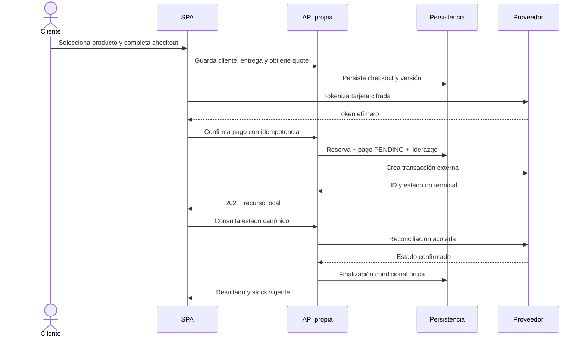

# Etapas 0-1: incepción, gobierno y requisitos

## 1. Control documental y resumen ejecutivo

| Campo | Valor |
|---|---|
| Documento | `DOC-01` - Baseline de incepción y requisitos |
| Versión | 1.0 |
| Fecha de corte | 2026-08-14, America/Bogota |
| Estado | `BASELINED` documental; integración externa no autorizada |
| Propietario | `CANDIDATE` |
| Aprobador de decisiones de alcance | `USER_DECISION_OWNER` |
| Fuente normativa primaria | `Wompi FullStack Test (1).pdf`, revisión 2025-10-09 |
| Documento rector | `plan-maestro-prueba-fullstack.md`, 2026-08-13 |
| Instrucción de ejecución | `instruccion-etapas-0-1-incepcion-requisitos.md`, 2026-08-13 |
| Clasificación máxima del documento | `C2-RESTRICTED`; no contiene valores C3/C4 |
| Historial | v1.0: cierre documental inicial de etapas 0-1 |

### Resumen ejecutivo

El producto es un checkout invitado, distribuido y asíncrono. El sistema debe coordinar UI, proveedor de pagos, inventario, transacción local, entrega y recuperación sin almacenar datos completos de tarjeta ni convertir un resultado incierto en fallo. La rúbrica contiene 100 puntos base y 50 puntos bonus; todos los puntos base tienen trabajo y evidencia futura planificados.

El dictamen es **CONDITIONAL GO** para avanzar a UX y arquitectura reversible. La documentación está lista, pero `SPK-02` no fue ejecutado y no existe `AUTH-01`; por ello quedan prohibidas la integración real, las consultas UAT y las transacciones de sandbox. Las diferencias de host, tokenización, aceptaciones e idempotencia entre la documentación pública y el UAT asignado deben comprobarse antes de congelar el adaptador externo.

Ponytail se aplicó como restricción de alcance: un solo entregable, arquitectura de negocio independiente de la tecnología, un SKU y una unidad como supuesto reversible, polling como mecanismo mínimo y webhook únicamente opcional. No se simplificaron seguridad, validación, accesibilidad básica, concurrencia ni recuperación.

### Manifiesto de artefactos

| ID | Artefacto | Sección | Estado | Gate |
|---|---|---:|---|---|
| `ART-01` | Matriz completa de trazabilidad | 25 | `COMPLETE` | Cuatro vistas y navegación bidireccional |
| `ART-02` | Backlog priorizado | 18 | `COMPLETE` | P0, dependencias y orden topológico |
| `ART-03` | Historias y enablers | 19 | `COMPLETE` | Fichas P0, INVEST/DoR |
| `ART-04` | AC y Given/When/Then | 20 | `COMPLETE` | Happy, negative y adversos P0 |
| `ART-05` | Catálogo de errores | 22 | `COMPLETE` | HTTP/UI/estado/stock/entrega/retry |
| `ART-06` | Inventario y clasificación de datos | 23 | `COMPLETE` | Campos conocidos clasificados; C3/C4 excluidos |
| `ART-07` | Matriz UAT | 24 | `COMPLETE` | P0 trazable; `DESIGNED_NOT_RUN` |

**Resultado del manifiesto: 7/7.**

## 2. Dictamen general y matriz de preparación por consumidor

| Vista | Dictamen | Condiciones pendientes | Consumidor |
|---|---|---|---|
| Etapa 0 | `CONDITIONAL GO` | Confirmar `DEC-01` a `DEC-12`; ejecutar `SPK-02` sólo tras `AUTH-01` | Gobierno, producto |
| Etapa 1 | `CONDITIONAL GO` | Las reglas externas quedan como `ASSUMED`; no bloquean UX reversible ni contratos con fake | UX, arquitectura, QA |
| `DOCUMENT_READY` | `GO` | Mantener este archivo como baseline y tramitar cambios mediante `CHG-01` | Todos |
| `UX_READY` | `CONDITIONAL` | No fijar campos finales ni copys legales hasta `DEC-04`, `QST-03` y `QST-04` | `UX` |
| `ARCHITECTURE_READY` | `CONDITIONAL` | Conservar puertos reemplazables; no congelar host, JWE ni consulta por referencia | `ARCH` |
| `SANDBOX_SPIKE_READY` | `NO-GO` | Falta autorización explícita, host allowlist y credenciales preconfiguradas fuera de la conversación | `APPSEC`, `EXTERNAL_PROVIDER` |

No hay `Sev1` ni `Sev2` documentales abiertos. Las incertidumbres externas están acotadas, tienen fallback seguro y no autorizan operaciones.

## 3. Fuentes, precedencia y fecha de corte

### Registro unificado

| sourceId | Tipo | Título/versión | Ruta o URL | Localizador | Consulta | Autoridad | Estado |
|---|---|---|---|---|---|---|---|
| `SRC-PDF-ROOT` | PDF | FullStack Development Test, rev. 2025-10-09 | Archivo proporcionado | pp. 1-7 | 2026-08-13 | Normativa del reto | Disponible, inspeccionado |
| `SRC-PLAN-ROOT` | Markdown | Plan maestro, 2026-08-13 | Archivo proporcionado | §§1-22 | 2026-08-14 | Rector, no normativo por sí solo | Disponible, inspeccionado |
| `SRC-USER-01` | Markdown | Instrucción etapas 0-1 | Archivo proporcionado | §§1-16 | 2026-08-14 | Instrucción vigente del usuario | Disponible, ejecutada |
| `SRC-EXT-PAY-01` | Oficial | Inicio rápido | https://docs.wompi.co/docs/colombia/inicio-rapido/ | API de pagos | 2026-08-14 | Contrato público | Consultado |
| `SRC-EXT-PAY-02` | Oficial | Ambientes y llaves | https://docs.wompi.co/docs/colombia/ambientes-y-llaves/ | Llaves y ambientes | 2026-08-14 | Contrato público | Consultado |
| `SRC-EXT-PAY-03` | Oficial | Tokens de aceptación | https://docs.wompi.co/docs/colombia/tokens-de-aceptacion/ | Pasos 1-4 | 2026-08-14 | Contrato público | Consultado |
| `SRC-EXT-PAY-04` | Oficial | Transacciones | https://docs.wompi.co/docs/colombia/transacciones/ | Creación, estados y consulta | 2026-08-14 | Contrato público | Consultado |
| `SRC-EXT-PAY-05` | Oficial | Métodos de pago | https://docs.wompi.co/docs/colombia/metodos-de-pago/ | Tarjeta, cuotas y tokenización | 2026-08-14 | Contrato público | Consultado |
| `SRC-EXT-PAY-06` | Oficial | Eventos | https://docs.wompi.co/docs/colombia/eventos/ | Cuerpo y checksum | 2026-08-14 | Contrato público | Consultado |
| `SRC-EXT-PAY-07` | Oficial | Datos de prueba Sandbox | https://docs.wompi.co/docs/colombia/datos-de-prueba-en-sandbox/ | Tarjetas | 2026-08-14 | Contrato público | Consultado sin copiar fixtures |

### Precedencia

1. Instrucción explícita vigente del usuario.
2. Obligación o restricción literal del PDF.
3. Decisión confirmada explícitamente por `USER_DECISION_OWNER`.
4. Contrato oficial vigente para detalles externos.
5. Baseline o recomendación del plan maestro.
6. Criterio técnico derivado.

`provenance`, `normativity` y `decisionStatus` se registran por separado. Un detalle oficial puede ser `EXTERNAL_DOC/MUST/ASSUMED` hasta comprobarse en el UAT asignado; una tecnología del plan puede ser `PLAN/SHOULD/BASELINE` y nunca se atribuye al PDF.

## 4. Visión, objetivos y criterios de éxito

**Visión.** Permitir que una persona invitada compre un producto con tarjeta ficticia en sandbox, vea un resultado honesto y recupere el progreso, manteniendo consistentes pago, inventario y entrega ante duplicados, concurrencia, refresh y fallos de red.

| ID | Resultado | Indicador | Meta | Fuente | Requisitos |
|---|---|---|---:|---|---|
| `OBJ-01` | Checkout completo | UAT P0 aprobadas | 100 % | `SRC-PDF-P02-01` | `RF-01`, `RF-02`, `RF-05`, `RF-06`, `RF-07`, `RF-08`, `RF-09`, `RF-10`, `RF-11`, `RF-12` |
| `OBJ-02` | Integridad de inventario/pago | Duplicados, stock negativo y efectos dobles | 0 | `SRC-PLAN-ROOT` §8.1 | `RF-10`, `RF-11`, `RF-29`, `RF-30`, `RF-31` |
| `OBJ-03` | Protección de datos | Hallazgos C3/C4 en persistencia/log/evidencia | 0 | `SRC-PDF-P03-04` | `RNF-06`, `RNF-18`, `RNF-19`, `RNF-20` |
| `OBJ-04` | Recuperación | Refresh que duplica cobro o pierde estado canónico | 0 | `SRC-PDF-P03-07` | `RF-13`, `RNF-07` |
| `OBJ-05` | Puntaje base demostrable | Rúbrica base con evidencia planificada | 100/100 | `SRC-PDF-P06-04` | `DELIV-01`, `DELIV-02`, `DELIV-03`, `DELIV-04` |
| `OBJ-06` | Calidad verificable | Cobertura Jest por app y métrica | >=85 % | `SRC-PLAN-ROOT` §13 | `RNF-08`, `RNF-09`, `RNF-21`, `RNF-22` |

## 5. Actores y responsabilidades

| ID | Actor/rol | Objetivo y permisos | Frontera de confianza | Datos accesibles | Historias |
|---|---|---|---|---|---|
| `ACT-01` | Cliente invitado | Ver producto, introducir datos, pagar y consultar su checkout | Navegador no confiable; capability limitada | C0, sus C2; C4 sólo en memoria | `US-01` a `US-10` |
| `ACT-02` | SPA | Presentar, validar temprano y llamar API/proveedor | Código público y manipulable | C0-C2, C4 efímero; nunca C3 privado | `US-01` a `US-10` |
| `ACT-03` | API local | Autoridad de precio, stock, estados y autorización | Trust boundary servidor | C0-C3 según mínimo privilegio; nunca C4 | `US-04` a `US-10` |
| `ACT-04` | Proveedor de pagos | Tokenizar, crear y resolver transacciones | Tercero externo | JWE/tarjeta y datos contractuales | `US-05`, `US-06`, `US-07` |
| `ACT-05` | Reconciliador | Reclamar y consultar pendientes sin despacho duplicado | Proceso backend | IDs/estado C1-C2; secretos vía almacén | `US-07`, `EN-06` |
| `ACT-06` | Evaluador | Inspeccionar repo, URLs, evidencia y demo | Acceso público controlado | Sólo evidencia sanitizada | `DOC-02`, `DOC-03` |
| `ACT-07` | Operador candidato | Desplegar, observar y responder a alertas | Acceso privilegiado temporal | C1-C3 bajo IAM; no C4 | `EN-08`, `EN-09` |

RACI: `CANDIDATE` ejecuta y documenta; `USER_DECISION_OWNER` confirma alcance; `UX` diseña; `ARCH` congela contratos; `QA` verifica; `APPSEC` aprueba controles y sanitización; `EVALUATOR` acepta; `EXTERNAL_PROVIDER` controla el contrato externo.

## 6. Alcance incluido, excluido, diferido y condicionado

| Clase | Elemento | provenance | normativity | decisionStatus | Disposición |
|---|---|---|---|---|---|
| Incluido | Producto precargado, disponibilidad, checkout invitado y tarjeta | PDF | MUST | CONFIRMED | `PLANNED` |
| Incluido | Cliente, entrega, resumen, tarifas, cuotas y resultado | PDF/EXTERNAL_DOC | MUST | BASELINE | `PLANNED` |
| Incluido | Transacción local `PENDING`, pago externo y consulta hasta terminal | PDF/EXTERNAL_DOC | MUST | BASELINE | `PLANNED` |
| Incluido | Reserva, consumo/liberación, idempotencia y recuperación | PLAN/DERIVED | MUST | BASELINE | `PLANNED` por integridad |
| Incluido | API de productos/stock/transacciones/clientes/entregas, seed y Swagger | PDF | MUST | CONFIRMED | `PLANNED` |
| Incluido | React, Redux Toolkit, NestJS, DynamoDB y AWS serverless | PLAN | SHOULD | BASELINE | `PLANNED`, reemplazable hasta `DEC-01`/`DEC-02` |
| Incluido | Jest FE/BE con gate 85 % | PDF/PLAN | MUST | BASELINE | `PLANNED`; supera el >80 % literal |
| Incluido | HTTPS, seguridad mínima, responsive y accesibilidad modal | PDF/DERIVED | MUST/BONUS | BASELINE | P0 estructural |
| Condicionado | Tokenización JWE directa navegador-proveedor | EXTERNAL_DOC/PLAN | MUST | ASSUMED | `SPK-02`; fallback alojado o relay de JWE |
| Condicionado | Webhook real | PLAN | MAY | ASSUMED | `DEFERRED`; sólo con aislamiento y autorización |
| Diferido | Cross-browser amplio, ZAP y hardening bonus | PDF/PLAN | BONUS | BASELINE | P1 después de 100/100 base |
| Excluido | Login, panel admin, carrito múltiple, reembolsos, transportadora real | PLAN | N-A | BASELINE | `NOT_PLANNED` |
| Excluido | Pagos reales, producción, cambio de credenciales/2FA/eventos globales | USER/PDF | MUST | CONFIRMED | Prohibido |
| Excluido | Microservicios, Kubernetes, CQRS/event sourcing, multi-región | PLAN | N-A | BASELINE | `NOT_PLANNED` por YAGNI |

Todo cambio de alcance posterior crea `CHG-01`, actualiza trazas y vuelve a ejecutar los gates de requisitos, datos y UAT.

## 7. Inventario completo de cláusulas fuente

Cada fila es una cláusula verificable; no se reproducen credenciales, llaves ni fixtures. `COV` significa `COVERED`.

| sourceId | Página/localizador | Paráfrasis fiel | Tipo/fuerza | Requisito o disposición | Ambigüedad | Estado |
|---|---|---|---|---|---|---|
| `SRC-PDF-P02-01` | p.2, historia | Crear una aplicación para comprar un producto con el proveedor de pagos | Obligación/MUST | `RF-01`, `RF-08` | NONE | PLANNED/COV |
| `SRC-PDF-P02-02` | p.2, historia | Obtener datos de pago del cliente | Obligación/MUST | `RF-18`, `RF-19`, `RF-20` | `QST-03` | PLANNED/COV |
| `SRC-PDF-P02-03` | p.2, historia | Obtener datos de entrega | Obligación/MUST | `RF-22` | `QST-04` | PLANNED/COV |
| `SRC-PDF-P02-04` | p.2, historia | Mostrar resultado del pago y actualizar stock | Obligación/MUST | `RF-09`, `RF-12` | NONE | PLANNED/COV |
| `SRC-PDF-P02-05` | p.2, paso 1 | Mostrar producto, unidades disponibles, descripción y precio | Obligación/MUST | `RF-01` | NONE | PLANNED/COV |
| `SRC-PDF-P02-06` | p.2, paso 2 | Mostrar botón de pago con tarjeta | Obligación/MUST | `RF-02` | NONE | PLANNED/COV |
| `SRC-PDF-P02-07` | p.2, paso 2 | Abrir un modal que solicite tarjeta | Obligación/MUST | `RF-02`, `RNF-17` | NONE | PLANNED/COV |
| `SRC-PDF-P02-08` | p.2, paso 3 | Validar estructura de tarjeta ficticia | Obligación/MUST | `RF-18`, `RF-19`, `RF-20` | NONE | PLANNED/COV |
| `SRC-PDF-P02-09` | p.2, paso 3 | Detectar Mastercard/Visa y mostrar logo suma valor | Recomendación/SHOULD | `RF-04` | NONE | PLANNED/COV |
| `SRC-PDF-P02-10` | p.2, paso 3 | Capturar información de entrega | Obligación/MUST | `RF-22` | `QST-04` | PLANNED/COV |
| `SRC-PDF-P02-11` | p.2, paso 4 | Resumen contiene producto, tarifa base siempre y entrega | Obligación/MUST | `RF-06`, `RF-24` | `ASM-01` | PLANNED/COV |
| `SRC-PDF-P02-12` | p.2, paso 4 | Botón de pago se presenta en backdrop | Obligación/MUST | `RF-06` | NONE | PLANNED/COV |
| `SRC-PDF-P02-13` | p.2, paso 5.1 | Crear transacción backend `PENDING` y obtener número antes del proveedor | Obligación/MUST | `RF-07` | NONE | PLANNED/COV |
| `SRC-PDF-P02-14` | p.2, paso 5.2 | Llamar API del proveedor para pagar | Obligación/MUST | `RF-08` | `QST-01` | PLANNED/COV |
| `SRC-PDF-P02-15` | p.2, paso 5.3.1 | Actualizar transacción local con resultado | Obligación/MUST | `RF-09` | NONE | PLANNED/COV |
| `SRC-PDF-P02-16` | p.2, pasos 5.3.2-3 | Texto agrupa asignación y stock tras pago completado o fallido | Ambigüedad/MUST | `RF-10`, `RF-11` | `QST-05`, `DEC-04` | PLANNED/PARTIAL hasta decisión |
| `SRC-PDF-P02-17` | p.2, paso 6 | Mostrar resultado y volver a producto con stock vigente | Obligación/MUST | `RF-12` | `DEC-08` | PLANNED/COV |
| `SRC-PDF-P03-01` | p.3, resp. 1 | Diseñar API, esquema de datos y estructura | Obligación/MUST | `RNF-05`, `RNF-12` | NONE | PLANNED/COV |
| `SRC-PDF-P03-02` | p.3, resp. 2 | Definir request/response por endpoint | Obligación/MUST | `RF-15`, `DELIV-04` | NONE | PLANNED/COV |
| `SRC-PDF-P03-03` | p.3, resp. 2 | Publicar Postman o Swagger y enlazarlo en README | Obligación/MUST | `RNF-11`, `DELIV-04` | NONE | PLANNED/COV |
| `SRC-PDF-P03-04` | p.3, resp. 3 | Definir validaciones para situaciones reales | Obligación/MUST | `VAL-01` a `VAL-20` | NONE | PLANNED/COV |
| `SRC-PDF-P03-05` | p.3, resp. 4 | Manejar datos sensibles de forma segura | Obligación/MUST | `RNF-06`, `RNF-18`, `RNF-19`, `RNF-20` | NONE | PLANNED/COV |
| `SRC-PDF-P03-06` | p.3, resp. 5 | API incluye stock, transacciones, clientes y entregas | Obligación/MUST | `RF-14`, `RF-25`, `RF-26`, `RF-27`, `RF-28` | `DEC-12` | PLANNED/COV |
| `SRC-PDF-P03-07` | p.3, resp. 5 | API usa distintos tipos de requests | Obligación/MUST | `RF-15` | NONE | PLANNED/COV |
| `SRC-PDF-P03-08` | p.3, resp. 7 | Recuperar progreso tras refresh | Obligación/MUST | `RF-13`, `RNF-07` | NONE | PLANNED/COV |
| `SRC-PDF-P03-09` | p.3, resp. 8-9 | Atención al detalle y flujo de cinco pantallas | Obligación/MUST | `RF-02`, `RF-06`, `RF-12`, `RNF-03` | NONE | PLANNED/COV |
| `SRC-PDF-P04-01` | p.4, FE | SPA sólo ReactJS o VueJS | Restricción/MUST | `RNF-01`, `CON-06` | `DEC-01` | PLANNED/COV |
| `SRC-PDF-P04-02` | p.4, FE.1 | Diseño mobile-oriented y responsive | Obligación/MUST | `RNF-03`, `RNF-16` | NONE | PLANNED/COV |
| `SRC-PDF-P04-03` | p.4, FE.1 | Probar referencia literal iPhone SE 2020 1334x750 | Obligación/MUST | `RNF-16` | `QST-08` | PLANNED/COV |
| `SRC-PDF-P04-04` | p.4, FE.1 | UI no sale de sus límites | Obligación/MUST | `RNF-15`, `RNF-16` | NONE | PLANNED/COV |
| `SRC-PDF-P04-05` | p.4, FE.2 | Redux o Vuex es obligatorio y sigue Flux | Restricción/MUST | `RNF-02` | `DEC-01` | PLANNED/COV |
| `SRC-PDF-P04-06` | p.4, FE.2 | Conservar transacción de pago en estado o localStorage de forma segura | Obligación/MUST | `RF-13`, `RNF-07`, `RNF-18` | `QST-06` | PLANNED/COV |
| `SRC-PDF-P04-07` | p.4, FE.3 | Diseño UX queda a criterio del candidato | Permiso/MAY | `EN-03` | NONE | PLANNED/COV |
| `SRC-PDF-P04-08` | p.4, FE.4 | CSS framework permitido; se favorece Flexbox/Grid | Recomendación/SHOULD | `RUB-BONUS-03` | NONE | PLANNED/COV |
| `SRC-PDF-P04-09` | p.4, BE | Backend en JS/TS o Ruby y framework listado | Restricción/MUST | `RNF-04`, `CON-06` | `DEC-01` | PLANNED/COV |
| `SRC-PDF-P04-10` | p.4, BE.1 | Lógica de negocio fuera de routing/controller | Obligación/MUST | `RNF-05` | NONE | PLANNED/COV |
| `SRC-PDF-P04-11` | p.4, BE.1-2 | Intentar hexagonal y ROP | Recomendación/SHOULD | `RUB-BONUS-05`, `RUB-BONUS-06` | `DEC-01` | PLANNED/COV |
| `SRC-PDF-P04-12` | p.4, BE.3-4 | DB/ORM libres; PostgreSQL o DynamoDB recomendadas | Permiso/SHOULD | `DEC-01` | NONE | PLANNED/COV |
| `SRC-PDF-P04-13` | p.4, BE.5 | Seed de productos y sin endpoint para crearlos | Obligación/MUST | `RF-16`, `CON-07` | NONE | PLANNED/COV |
| `SRC-PDF-P04-14` | p.4, tests | Unit tests FE/BE, Jest, cobertura >80 % y resultado en README | Obligación/MUST | `RNF-08`, `RNF-09`, `RNF-21`, `RNF-22`, `DELIV-06` | NONE | PLANNED/COV |
| `SRC-PDF-P04-15` | p.4, cloud | Publicar en cloud; AWS recomendado | Obligación/MUST | `RNF-10`, `RNF-23`, `DELIV-03` | `DEC-02` | PLANNED/COV |
| `SRC-PDF-P05-01` | p.5, UAT.1 | Leer inicio rápido y ambientes/llaves | Obligación/MUST | `SPK-01` | NONE | PLANNED/COV |
| `SRC-PDF-P05-02` | p.5, UAT.2 | La cuenta asignada es compartida | Restricción/MUST | `CON-01`, `CON-03` | NONE | PLANNED/COV |
| `SRC-PDF-P05-03` | p.5, UAT | Usar siempre sandbox | Restricción/MUST | `RNF-14`, `CON-02` | NONE | PLANNED/COV |
| `SRC-PDF-P05-04` | p.5, usuario | No modificar credenciales ni añadir 2FA | Restricción/MUST | `CON-01` | NONE | PLANNED/COV |
| `SRC-PDF-P05-05` | p.5, hosts | El PDF suministra endpoints UAT; sus valores no se reproducen aquí | Restricción/MUST | `SPK-02`, `QST-01` | Divergencia con contrato público por comprobar | PLANNED/COV |
| `SRC-PDF-P05-06` | p.5, acceso | El PDF suministra material de acceso UAT, redaccionado en este documento | Restricción/MUST | `RNF-20`, `CON-01` | NONE | PLANNED/COV |
| `SRC-PDF-P05-07` | p.5, UAT.3 | Ninguna transacción de dinero real | Restricción/MUST | `CON-02`, `RNF-14` | NONE | PLANNED/COV |
| `SRC-PDF-P05-08` | p.5, UAT.4 | Intentar usar asistente AI CLI | Recomendación/SHOULD | `DOC-04` | NONE | PLANNED/COV |
| `SRC-PDF-P05-09` | p.5, consid. | Ramas y PR por feature recomendadas | Recomendación/SHOULD | `RNF-13`, `TSK-15` | NONE | PLANNED/COV |
| `SRC-PDF-P05-10` | p.5, consid. | Uso de IA recomendado | Recomendación/SHOULD | `DOC-04` | NONE | PLANNED/COV |
| `SRC-PDF-P05-11` | p.5, consid. | Repositorio debe ser público | Restricción/MUST | `RNF-13`, `DELIV-02` | `QST-09` | PLANNED/COV |
| `SRC-PDF-P05-12` | p.5, consid. | No usar la marca de la empresa en el repositorio | Restricción/MUST | `CON-04`, `RNF-13` | `QST-10` | PLANNED/COV |
| `SRC-PDF-P05-13` | p.5, consid. | No compartir la solución con candidatos/desarrolladores | Restricción/MUST | `CON-05` | `QST-09` | PLANNED/COV |
| `SRC-PDF-P06-01` | p.6, entregable 1 | Frontend y backend completos | Entregable/MUST | `DELIV-01` | NONE | PLANNED/COV |
| `SRC-PDF-P06-02` | p.6, entregable 2 | URL del repositorio GitHub con README actualizado | Entregable/MUST | `DELIV-02` | NONE | PLANNED/COV |
| `SRC-PDF-P06-03` | p.6, entregable 3 | URL de app AWS desplegada y conectada a API | Entregable/MUST | `DELIV-03` | `DEC-02` | PLANNED/COV |
| `SRC-PDF-P06-04` | p.6, base 1 | README correcto: 5 puntos | Rúbrica/MUST | `RUB-BASE-01` | NONE | PLANNED/COV |
| `SRC-PDF-P06-05` | p.6, base 2 | Imágenes rápidas y sin desbordes: 5 puntos | Rúbrica/MUST | `RUB-BASE-02` | NONE | PLANNED/COV |
| `SRC-PDF-P06-06` | p.6, base 3 | Checkout completo: 20 puntos | Rúbrica/MUST | `RUB-BASE-03` | NONE | PLANNED/COV |
| `SRC-PDF-P06-07` | p.6, base 4 | API correcta: 20 puntos | Rúbrica/MUST | `RUB-BASE-04` | NONE | PLANNED/COV |
| `SRC-PDF-P06-08` | p.6, base 5 | >80 % unit tests FE/BE: 30 puntos | Rúbrica/MUST | `RUB-BASE-05` | NONE | PLANNED/COV |
| `SRC-PDF-P06-09` | p.6, base 6 | App y API en cloud: 20 puntos | Rúbrica/MUST | `RUB-BASE-06` | NONE | PLANNED/COV |
| `SRC-PDF-P06-10` | p.6, bonus 1 | OWASP, HTTPS y headers: +5 | Bonus/BONUS | `RUB-BONUS-01` | NONE | PLANNED/COV |
| `SRC-PDF-P06-11` | p.6, bonus 2 | Responsive y varios navegadores: +5 | Bonus/BONUS | `RUB-BONUS-02` | NONE | PLANNED/COV |
| `SRC-PDF-P06-12` | p.6, bonus 3 | Habilidades CSS: +10 | Bonus/BONUS | `RUB-BONUS-03` | NONE | PLANNED/COV |
| `SRC-PDF-P06-13` | p.6, bonus 4 | Clean code: +10 | Bonus/BONUS | `RUB-BONUS-04` | NONE | PLANNED/COV |
| `SRC-PDF-P06-14` | p.6, bonus 5 | Hexagonal/Ports & Adapters: +10 | Bonus/BONUS | `RUB-BONUS-05` | NONE | PLANNED/COV |
| `SRC-PDF-P06-15` | p.6, bonus 6 | ROP: +10 | Bonus/BONUS | `RUB-BONUS-06` | NONE | PLANNED/COV |
| `SRC-PDF-P06-16` | p.6, consid. | Mínimo 100 puntos para completar/continuar | Restricción/MUST | `OBJ-05` | NONE | PLANNED/COV |
| `SRC-PDF-P06-17` | p.6, consid. | Repositorio debe mostrar progreso/commits auténticos | Restricción/MUST | `RNF-13`, `TSK-15` | NONE | PLANNED/COV |
| `SRC-PDF-P06-18` | p.6, consid. | Copia o similitud fraudulenta anula la prueba | Restricción/MUST | `CON-05`, `RNF-13`, `DOC-04` | NONE | PLANNED/COV |

### Descomposición atómica de anclas compuestas

Las filas simples de la tabla anterior siguen siendo requisitos hoja. Las siguientes reemplazan, para conteo y gate, las anclas compuestas del mismo prefijo; el ancla queda `DECOMPOSED` y no se suma dos veces.

| sourceId hoja | Paráfrasis atómica | Fuerza | Traza/ambigüedad |
|---|---|---|---|
| `SRC-PDF-P02-04.1` | Mostrar el resultado del pago | MUST | `RF-12`; NONE |
| `SRC-PDF-P02-04.2` | Actualizar el stock | MUST | `RF-10`, `RF-11`; `DEC-04` |
| `SRC-PDF-P02-05.1` | Mostrar el producto | MUST | `RF-01`; NONE |
| `SRC-PDF-P02-05.2` | Mostrar unidades disponibles | MUST | `RF-01`; NONE |
| `SRC-PDF-P02-05.3` | Mostrar descripción | MUST | `RF-01`; NONE |
| `SRC-PDF-P02-05.4` | Mostrar precio | MUST | `RF-01`; NONE |
| `SRC-PDF-P02-11.1` | Mostrar un resumen de pago | MUST | `RF-06`; NONE |
| `SRC-PDF-P02-11.2` | Incluir monto del producto | MUST | `RF-06`; NONE |
| `SRC-PDF-P02-11.3` | Incluir siempre tarifa base | MUST | `RF-24`; `ASM-01`, `DEC-06` |
| `SRC-PDF-P02-11.4` | Incluir tarifa de entrega | MUST | `RF-24`; `ASM-01`, `DEC-06` |
| `SRC-PDF-P02-12.1` | Incluir botón de pago en el resumen | MUST | `RF-06`; NONE |
| `SRC-PDF-P02-12.2` | Presentar el resumen en backdrop | MUST | `RF-06`; `ASM-08` |
| `SRC-PDF-P02-13.1` | Crear la transacción en backend | MUST | `RF-07`; NONE |
| `SRC-PDF-P02-13.2` | Crear la transacción con estado `PENDING` | MUST | `RF-07`; NONE |
| `SRC-PDF-P02-13.3` | Obtener número de transacción | MUST | `RF-07`; NONE |
| `SRC-PDF-P02-13.4` | Persistir lo anterior antes de llamar al proveedor | MUST | `RF-07`; NONE |
| `SRC-PDF-P02-16.1` | El texto ubica asignación para entrega tras pago completado o fallido | MUST/ambigua | `RF-10`, `RF-11`; `QST-05`, `DEC-04`; PARTIAL |
| `SRC-PDF-P02-16.2` | El texto ubica actualización de stock tras pago completado o fallido | MUST/ambigua | `RF-10`, `RF-11`; `QST-05`, `DEC-04`; PARTIAL |
| `SRC-PDF-P02-17.1` | Mostrar resultado final | MUST | `RF-12`; NONE |
| `SRC-PDF-P02-17.2` | Volver a la página de producto | MUST | `RF-12`; `DEC-08` |
| `SRC-PDF-P02-17.3` | Mostrar allí stock actualizado | MUST | `RF-12`; NONE |
| `SRC-PDF-P03-01.1` | Diseñar la API | MUST | `RNF-05`; NONE |
| `SRC-PDF-P03-01.2` | Diseñar arquitectura de información | MUST | `RNF-12`; NONE |
| `SRC-PDF-P03-01.3` | Diseñar esquema de datos | MUST | `RNF-12`, `DELIV-05`; NONE |
| `SRC-PDF-P03-01.4` | Definir estructura de carpetas | MUST | `RNF-05`; NONE |
| `SRC-PDF-P03-02.1` | Definir datos solicitados por endpoint | MUST | `RF-15`; NONE |
| `SRC-PDF-P03-02.2` | Definir datos respondidos por endpoint | MUST | `RF-15`; NONE |
| `SRC-PDF-P03-06.1` | La API cubre stock | MUST | `RF-14`, `RF-25`; NONE |
| `SRC-PDF-P03-06.2` | La API cubre transacciones | MUST | `RF-14`, `RF-26`; NONE |
| `SRC-PDF-P03-06.3` | La API cubre clientes | MUST | `RF-14`, `RF-27`; `DEC-12` |
| `SRC-PDF-P03-06.4` | La API cubre entregas | MUST | `RF-14`, `RF-28`; `DEC-12` |
| `SRC-PDF-P03-09.1` | La atención al detalle es esperada | SHOULD | `RNF-16`; NONE |
| `SRC-PDF-P03-09.2` | El flujo tiene cinco pasos | MUST | `RF-02`, `RF-06`, `RF-12`; NONE |
| `SRC-PDF-P03-09.3` | Paso 1 es producto | MUST | `RF-01`; NONE |
| `SRC-PDF-P03-09.4` | Paso 2 es tarjeta y entrega | MUST | `RF-02`, `RF-03`, `RF-05`; NONE |
| `SRC-PDF-P03-09.5` | Paso 3 es resumen | MUST | `RF-06`; NONE |
| `SRC-PDF-P03-09.6` | Paso 4 es estado final | MUST | `RF-12`; NONE |
| `SRC-PDF-P03-09.7` | Paso 5 vuelve al producto | MUST | `RF-12`; NONE |
| `SRC-PDF-P03-10` | Mostrar producto en UI | MUST | `RF-01`; NONE |
| `SRC-PDF-P03-11` | Mostrar unidades disponibles en UI | MUST | `RF-01`; NONE |
| `SRC-PDF-P04-01.1` | Implementar una SPA | MUST | `RNF-01`; NONE |
| `SRC-PDF-P04-01.2` | Usar sólo ReactJS o VueJS | MUST | `RNF-01`, `CON-06`; `DEC-01` |
| `SRC-PDF-P04-02.1` | Orientar diseño a móvil | MUST | `RNF-03`; NONE |
| `SRC-PDF-P04-02.2` | Gestionar múltiples tamaños | MUST | `RNF-03`, `RNF-16`; NONE |
| `SRC-PDF-P04-02.3` | Hacer la app responsive | MUST | `RNF-03`; NONE |
| `SRC-PDF-P04-02.4` | Mantener foco mobile-first | MUST | `RNF-03`; NONE |
| `SRC-PDF-P04-04.1` | Las interacciones UI funcionan | MUST | `RNF-16`; NONE |
| `SRC-PDF-P04-04.2` | La UI permanece dentro de límites | MUST | `RNF-15`, `RNF-16`; NONE |
| `SRC-PDF-P04-05.1` | Redux o Vuex es obligatorio | MUST | `RNF-02`; `DEC-01` |
| `SRC-PDF-P04-05.2` | Seguir Flux en lo posible | SHOULD | `RNF-02`; NONE |
| `SRC-PDF-P04-08.1` | Framework CSS queda a elección | MAY | `DEC-01`; NONE |
| `SRC-PDF-P04-08.2` | Se fomenta Flexbox o Grid | SHOULD | `RUB-BONUS-03`; NONE |
| `SRC-PDF-P04-09.1` | Backend sólo JS/TS o Ruby | MUST | `RNF-04`, `CON-06`; `DEC-01` |
| `SRC-PDF-P04-09.2` | Framework sólo de la lista permitida | MUST | `RNF-04`, `CON-06`; `DEC-01` |
| `SRC-PDF-P04-09.3` | Ruby on Rails no está permitido | MUST | `CON-06`; NONE |
| `SRC-PDF-P04-09.4` | Otros frameworks no están permitidos | MUST | `CON-06`; NONE |
| `SRC-PDF-P04-11.1` | Hexagonal/Ports & Adapters es recomendada | SHOULD | `RUB-BONUS-05`; `DEC-01` |
| `SRC-PDF-P04-11.2` | ROP en casos de uso es recomendado | SHOULD | `RUB-BONUS-06`; `DEC-01` |
| `SRC-PDF-P04-12.1` | Base de datos queda a elección | MAY | `DEC-01`; NONE |
| `SRC-PDF-P04-12.2` | PostgreSQL o DynamoDB son recomendadas | SHOULD | `DEC-01`; NONE |
| `SRC-PDF-P04-12.3` | ORM queda a elección | MAY | NOT_PLANNED; DynamoDB no lo requiere |
| `SRC-PDF-P04-12.4` | Serialización queda a elección | MAY | `DEC-01`; NONE |
| `SRC-PDF-P04-13.1` | Sembrar productos ficticios | MUST | `RF-16`; NONE |
| `SRC-PDF-P04-13.2` | Endpoint de creación de productos no es necesario | MAY | NOT_PLANNED; fuera de alcance |
| `SRC-PDF-P04-14.1` | Unit tests frontend son obligatorios | MUST | `RNF-08`, `RNF-21`; NONE |
| `SRC-PDF-P04-14.2` | Unit tests backend son obligatorios | MUST | `RNF-08`, `RNF-22`; NONE |
| `SRC-PDF-P04-14.3` | Cobertura debe superar 80 % | MUST | `RNF-09`; NONE |
| `SRC-PDF-P04-14.4` | Publicar resultados en README | MUST | `DELIV-06`; NONE |
| `SRC-PDF-P04-14.5` | Crear pruebas con Jest | MUST | `RNF-08`; NONE |
| `SRC-PDF-P04-15.1` | Publicar app en un proveedor cloud | MUST | `RNF-10`, `DELIV-03`; NONE |
| `SRC-PDF-P04-15.2` | AWS es recomendación de cloud | SHOULD | `DEC-02`; NONE |
| `SRC-PDF-P05-01.1` | Leer Inicio rápido oficial | MUST | `SPK-01`; NONE |
| `SRC-PDF-P05-01.2` | Leer Ambientes y llaves oficial | MUST | `SPK-01`; NONE |
| `SRC-PDF-P05-04.1` | No modificar credenciales compartidas | MUST | `CON-01`; NONE |
| `SRC-PDF-P05-04.2` | No habilitar 2FA | MUST | `CON-01`; NONE |
| `SRC-PDF-P05-09.1` | Ramas son recomendadas | SHOULD | `RNF-13`, `TSK-15`; NONE |
| `SRC-PDF-P05-09.2` | PR por feature son recomendados | SHOULD | `RNF-13`, `TSK-15`; NONE |
| `SRC-PDF-P05-14` | El PDF indica dónde localizar modo sandbox | SHOULD | `SPK-02`; sin acceso actual |
| `SRC-PDF-P06-01.1` | Entregar frontend completo | MUST | `DELIV-01`; NONE |
| `SRC-PDF-P06-01.2` | Entregar backend API completo | MUST | `DELIV-01`; NONE |
| `SRC-PDF-P06-02.1` | Entregar enlace del repositorio | MUST | `DELIV-02`; `DEC-14` |
| `SRC-PDF-P06-02.2` | README debe estar actualizado | MUST | `DELIV-02`; NONE |
| `SRC-PDF-P06-03.1` | Entregar app AWS desplegada y operativa | MUST | `DELIV-03`; `DEC-02` |
| `SRC-PDF-P06-03.2` | App desplegada está conectada a API | MUST | `DELIV-03`; NONE |
| `SRC-PDF-P06-16.1` | Se requieren al menos 100 puntos | MUST | `OBJ-05`; NONE |
| `SRC-PDF-P06-16.2` | El mínimo habilita continuar entrevista | MUST | `OBJ-05`; NONE |
| `SRC-PDF-P06-17.1` | Repositorio evidencia progreso auténtico | MUST | `RNF-13`; NONE |
| `SRC-PDF-P06-17.2` | Repositorio contiene commits auténticos | MUST | `RNF-13`; NONE |
| `SRC-PDF-P06-18.1` | Solución no es copia de otra candidatura | MUST | `CON-05`; NONE |
| `SRC-PDF-P06-18.2` | Copia/similitud fraudulenta anula la prueba | MUST | `CON-05`; NONE |

Filas simples que siguen siendo hojas: `SRC-PDF-P02-01`, `SRC-PDF-P02-02`, `SRC-PDF-P02-03`, `SRC-PDF-P02-06`, `SRC-PDF-P02-07`, `SRC-PDF-P02-08`, `SRC-PDF-P02-09`, `SRC-PDF-P02-10`, `SRC-PDF-P02-14`, `SRC-PDF-P02-15`, `SRC-PDF-P03-03`, `SRC-PDF-P03-04`, `SRC-PDF-P03-05`, `SRC-PDF-P03-07`, `SRC-PDF-P03-08`, `SRC-PDF-P04-03`, `SRC-PDF-P04-06`, `SRC-PDF-P04-07`, `SRC-PDF-P04-10`, `SRC-PDF-P05-02`, `SRC-PDF-P05-03`, `SRC-PDF-P05-05`, `SRC-PDF-P05-06`, `SRC-PDF-P05-07`, `SRC-PDF-P05-08`, `SRC-PDF-P05-10`, `SRC-PDF-P05-11`, `SRC-PDF-P05-12`, `SRC-PDF-P05-13`, `SRC-PDF-P06-04`, `SRC-PDF-P06-05`, `SRC-PDF-P06-06`, `SRC-PDF-P06-07`, `SRC-PDF-P06-08`, `SRC-PDF-P06-09`, `SRC-PDF-P06-10`, `SRC-PDF-P06-11`, `SRC-PDF-P06-12`, `SRC-PDF-P06-13`, `SRC-PDF-P06-14` y `SRC-PDF-P06-15`.

**Denominador congelado:** 131 cláusulas hoja: 106 `MUST`, 13 `SHOULD`, 6 `MAY` y 6 `BONUS`. Las 131 tienen requisito o disposición. `SRC-PDF-P02-16.1` y `SRC-PDF-P02-16.2` permanecen `PARTIAL` hasta `DEC-04`; la cobertura de fuente se mide por existencia de traza y tratamiento, no por fingir la ambigüedad resuelta. La página 1 contiene metadatos y la página 7 cierre motivacional; ambas quedan `NOT_APPLICABLE` al denominador contractual.

## 8. Scorecard de rúbrica base y bonus

| ID | Pts | Tipo | Condición objetiva | Trazas | Verificación/evidencia | Captura | Riesgo | Owner | Estado |
|---|---:|---|---|---|---|---|---|---|---|
| `RUB-BASE-01` | 5 | Base | README contiene setup, URLs, arquitectura, datos, cobertura, seguridad y limitaciones | `RNF-12`, `DOC-02` | `VER-01`, `EVD-01` | E8 | Medio | CANDIDATE | PLANNED |
| `RUB-BASE-02` | 5 | Base | Imagen principal <=200 KiB, dimensiones reservadas, cero overflow en matriz | `RNF-15`, `RNF-16`, `RNF-25` | `TC-NFR-02`, `TC-NFR-03`, `UAT-12`, `EVD-02` | E6 | Alto | UX/QA | PLANNED |
| `RUB-BASE-03` | 20 | Base | Cinco pasos, aprobado/rechazado/pendiente/refresh y stock coherente | `RF-01` a `RF-13`, `US-01` a `US-10` | `TC-E2E-01`, `UAT-01` a `UAT-13`, `EVD-03` | E6 | Crítico | CANDIDATE/QA | PLANNED |
| `RUB-BASE-04` | 20 | Base | Recursos requeridos, HTTP semántico, Swagger y reglas protegidas | `RF-14`, `RF-15`, `RF-25` a `RF-28` | `TC-INT-01`, `VER-02`, `UAT-20`, `EVD-04` | E6 | Alto | ARCH/QA | PLANNED |
| `RUB-BASE-05` | 30 | Base | Jest FE y BE >80 %; gate 85 % en cuatro métricas por app | `RNF-08`, `RNF-09`, `RNF-21`, `RNF-22` | `VER-03`, `EVD-05` | E6 | Crítico | QA | PLANNED |
| `RUB-BASE-06` | 20 | Base | SPA y API conectadas, desplegadas, HTTPS y smoke verde | `RNF-10`, `RNF-23`, `DELIV-03` | `VER-04`, `UAT-31`, `EVD-06` | E7 | Alto | CANDIDATE | PLANNED |
| `RUB-BONUS-01` | 5 | Bonus | HTTPS, headers y análisis OWASP sin alto | `RNF-26`, `EN-07` | `TC-NFR-07`, `EVD-07` | E6-E7 | Medio | APPSEC | PLANNED |
| `RUB-BONUS-02` | 5 | Bonus | Playwright en tres motores y smoke real si se reclama | `RNF-28` | `TC-E2E-08`, `UAT-15`, `EVD-08` | E6 | Medio | QA | PLANNED |
| `RUB-BONUS-03` | 10 | Bonus | CSS propio con tokens, Grid/Flex y responsive | `RNF-03`, `RNF-16` | `VER-05`, `EVD-09` | E2/E6 | Bajo | UX | PLANNED |
| `RUB-BONUS-04` | 10 | Bonus | Lint, módulos claros, nombres y tests legibles | `RNF-05`, `EN-02` | `VER-06`, `EVD-10` | E5/E8 | Bajo | CANDIDATE | PLANNED |
| `RUB-BONUS-05` | 10 | Bonus | Dominio no importa frameworks; puertos sólo en límites reales | `RNF-05`, `EN-02` | `VER-07`, `EVD-11` | E5/E8 | Medio | ARCH | PLANNED |
| `RUB-BONUS-06` | 10 | Bonus | Casos de uso retornan Result tipado y errores exhaustivos | `EN-08`, `ERR-01` a `ERR-24` | `TC-UNIT-06`, `EVD-12` | E5/E8 | Medio | ARCH | PLANNED |

**Suma base: 100. Suma bonus: 50.** Los bonus no compensan un criterio base ausente.

### Verificaciones no-UAT

| ID | Requisito/rúbrica | Método y chequeo binario | Precondición/herramienta | Evidencia | Etapa | Owner | Estado |
|---|---|---|---|---|---:|---|---|
| `VER-01` | `RUB-BASE-01`, `DELIV-02` | INSPECTION: README contiene checklist completo y enlaces válidos | Release candidate; revisión Markdown | `EVD-01` | 8 | QA | PLANNED |
| `VER-02` | `RNF-11`, `RUB-BASE-04` | TEST: OpenAPI válido, público y cubre rutas nominales | API desplegada; validador OpenAPI | `EVD-04` | 6 | QA | PLANNED |
| `VER-03` | `RNF-09`, `RUB-BASE-05` | TEST: FE y BE >=85 % en lines/branches/functions/statements | Suites Jest; reportes separados | `EVD-05` | 6 | QA | PLANNED |
| `VER-04` | `DELIV-03`, `RUB-BASE-06` | DEMO: SPA HTTPS llama API HTTPS y smoke termina verde | Stack demo; smoke runner | `EVD-06` | 7 | CANDIDATE | PLANNED |
| `VER-05` | `RUB-BONUS-03` | INSPECTION: tokens, Grid/Flex, sin framework visual genérico dominante | Build final; DevTools/CSS review | `EVD-09` | 8 | UX | PLANNED |
| `VER-06` | `RUB-BONUS-04` | ANALYSIS: lint/typecheck y revisión sin hallazgos altos | CI y checklist | `EVD-10` | 8 | ARCH | PLANNED |
| `VER-07` | `RUB-BONUS-05`, `RUB-BONUS-06` | INSPECTION: imports y Result cumplen límites acordados | Grafo de dependencias/tests | `EVD-11`, `EVD-12` | 8 | ARCH | PLANNED |
| `VER-08` | `RNF-13` | INSPECTION: repo público, nombre neutro e historial auténtico | Repo candidato | `EVD-13` | 8 | EVALUATOR | PLANNED |
| `VER-09` | `RF-16`, `DELIV-05` | TEST: seed repetido no duplica y modelo está documentado | DB local + README | `EVD-14` | 5 | QA | PLANNED |
| `VER-10` | `RNF-20` | INSPECTION: variables sólo por nombre; gestor de secretos/IAM | Infra sintetizada | `EVD-15` | 7 | APPSEC | PLANNED |

## 9. Restricciones operativas

| ID | Restricción | provenance | normativity | decisionStatus | Verificación |
|---|---|---|---|---|---|
| `CON-01` | No copiar, cambiar ni publicar credenciales compartidas; no habilitar 2FA | PDF/USER | MUST | CONFIRMED | `TC-NFR-07`, `VER-10` |
| `CON-02` | Sandbox únicamente; cero dinero real y cero host/llave de apariencia productiva | PDF/USER | MUST | CONFIRMED | `UAT-30`, `ERR-23` |
| `CON-03` | No alterar URL de eventos ni configuración global compartida | PLAN/USER | MUST | CONFIRMED | `SPK-02`, `AUTH-02` |
| `CON-04` | Nombre/descripción del repositorio sin la marca prohibida | PDF | MUST | ASSUMED | `VER-08`, `DEC-13` |
| `CON-05` | Repositorio público sólo para evaluación, sin compartir solución ni fabricar historial | PDF | MUST | ASSUMED | `VER-08`, `DEC-14` |
| `CON-06` | SPA y backend deben usar lenguajes/frameworks permitidos por el PDF | PDF | MUST | CONFIRMED | `DEC-01`, `VER-06` |
| `CON-07` | No se construye endpoint público de creación de productos; el seed obligatorio se traza por `RF-16` | PLAN | N-A | BASELINE | `RF-16`, `VER-09` |
| `CON-08` | C4 y token de tarjeta no se persisten; C3 sólo en almacén designado | USER/EXTERNAL_DOC | MUST | CONFIRMED | `RNF-18`, `TC-NFR-07` |
| `CON-09` | Esta ejecución no realiza HTTP a UAT/sandbox/producción ni login | USER | MUST | CONFIRMED | Registro de ejecución |
| `CON-10` | Única escritura de esta ejecución: este Markdown | USER | MUST | CONFIRMED | Inspección del workspace |
| `CON-11` | PAN/CVC/vencimiento no llegan a la API propia | USER/PLAN | MUST | BASELINE | `UAT-13`, `UAT-29` |
| `CON-12` | No registrar payload crudo, auth, firmas, PII, stack traces ni datos de tarjeta | USER/PLAN | MUST | BASELINE | `RNF-27`, `TC-NFR-07` |
| `CON-13` | No hacer retry ciego tras `SENDING`/timeout; un 5xx no prueba no-envío | USER/PLAN | MUST | BASELINE | `INV-08`, `UAT-08` |
| `CON-14` | TTL físico no elimina pagos/reservas activos `PENDING`/`UNKNOWN` | USER/PLAN | MUST | BASELINE | `INV-07`, `UAT-32` |
| `CON-15` | Webhook real es opcional y requiere aislamiento más autorización | USER/PLAN | MUST | BASELINE | `DEC-05`, `AUTH-02` |

### Entregables controlados

| ID | Entregable | Fuente | Aceptación futura | Estado |
|---|---|---|---|---|
| `DELIV-01` | Frontend y backend terminados | PDF | Checkout P0 y API P0 demostrables | PLANNED |
| `DELIV-02` | Repositorio público con README actualizado | PDF | `VER-01`, `VER-08` | PLANNED |
| `DELIV-03` | App AWS conectada a API | PDF | `VER-04` | PLANNED |
| `DELIV-04` | Swagger/OpenAPI público | PDF | `VER-02` | PLANNED |
| `DELIV-05` | Modelo de datos documentado | PDF | `VER-09` | PLANNED |
| `DELIV-06` | Cobertura FE/BE publicada | PDF | `VER-03` | PLANNED |
| `DELIV-07` | Matriz de requisitos/evidencia | USER | `ART-01` a `ART-07` | AVAILABLE |
| `DELIV-08` | URLs HTTPS, smoke y rollback documentados | PLAN | `VER-04`, `DOC-03` | PLANNED |

## 10. Registro de decisiones, supuestos, preguntas y dependencias

### Decisiones

Ninguna fila `OPEN` se denomina resuelta. El default sólo autoriza diseño reversible.

| ID | Tema/fuente | Pri./tipo | Opciones | Recomendación y default reversible | Impacto | Autoridad/gate | `decisionStatus` / `workflowState` / trazas |
|---|---|---|---|---|---|---|---|
| `DEC-01` | Stack; PLAN/PDF | P0/técnica | Baseline TS o alternativa permitida | React+RTK, NestJS modular, hexagonal ligera, Result en casos de uso, DynamoDB | Velocidad, bonus y aprendizaje | USER_DECISION_OWNER antes E4 | BASELINE / OPEN; `RNF-01`, `RNF-02`, `RNF-04` |
| `DEC-02` | Topología cloud; PLAN/PDF | P0/técnica | AWS serverless o cloud permitido | S3/CloudFront, API Gateway/Lambda, DynamoDB, reconciliador periódico y CDK | 20 puntos, costo y release | USER_DECISION_OWNER antes E4 | BASELINE / OPEN; `RNF-10`, `DELIV-03` |
| `DEC-03` | Un SKU/cantidad 1; PLAN | P0/producto | Cantidad fija o selector | Cantidad 1, un SKU por checkout; modelo conserva quantity | Alcance y pricing | USER_DECISION_OWNER antes E2 | BASELINE / OPEN; `ASM-02`, `RF-24` |
| `DEC-04` | Efectos de fallo; PDF ambiguo/PLAN | P0/negocio | Aplicación literal o regla segura | Sólo `APPROVED` consume/crea entrega; final fallido libera | Riesgo de evaluación vs. despachar sin pago | USER_DECISION_OWNER/EVALUATOR antes E3 | BASELINE / OPEN; `QST-05`, `INV-05`, `INV-06` |
| `DEC-05` | Asincronía; PLAN/EXT | P0/integración | Polling, webhook o ambos | Polling+reconciliación obligatorio; webhook opcional aislado | Recuperación y cuenta compartida | ARCH antes E3; SPK-02 | BASELINE / OPEN; `RF-31`, `CON-15` |
| `DEC-06` | Tarifas; PLAN | P0/producto | Valores definidos por evaluador o demo | Base COP 2.000 y entrega COP 5.000, centavos backend y snapshot | Total y UAT | USER_DECISION_OWNER antes E2 | ASSUMED / OPEN; `ASM-01`, `RF-24` |
| `DEC-07` | Campos cliente/entrega; PDF | P0/producto/datos | Mínimos o formulario amplio | Nombre, email, teléfono, línea 1, ciudad y región; línea 2/postal/instrucciones opcionales | UX, PII y retención | USER_DECISION_OWNER/UX antes E2 | ASSUMED / OPEN; `QST-04`, `RF-21`, `RF-22` |
| `DEC-08` | Retorno al producto; PDF | P0/UX | Redirect automático o CTA | Resultado estable con CTA; auto-retorno sólo tras anuncio accesible | Comprensión y evidencia | UX antes E2 | ASSUMED / OPEN; `RF-12` |
| `DEC-09` | Persistencia/refresh; PDF/PLAN | P0/seguridad | Web Storage amplio o allowlist | Cookie capability + IDs/paso/versión/expiración; nunca PII/tarjeta/token | Resiliencia y privacidad | APPSEC/ARCH antes E3 | BASELINE / OPEN; `QST-06`, `RF-13` |
| `DEC-10` | Idempotencia/referencia; PLAN/EXT | P0/integración | Dedupe local o proveedor | Dedupe local siempre; consulta/idempotencia externa sólo si SPK-02 confirma | Doble cobro | ARCH antes E3 | ASSUMED / OPEN; `ASM-05`, `RF-30` |
| `DEC-11` | Reserva `UNKNOWN`; PLAN | P0/negocio | Liberar por tiempo o conservar | Conservar hasta terminal/revisión; alerta y escalamiento, nunca TTL físico | Disponibilidad vs. cobro sin stock | USER_DECISION_OWNER/ARCH antes E3 | BASELINE / OPEN; `QST-11`, `RF-31` |
| `DEC-12` | Endpoints nominales; PDF/PLAN | P0/API | Recursos top-level o anidados | Mantener tags/rutas nominales, todos ligados atómicamente a checkout capability | Puntaje API e IDOR | ARCH antes OpenAPI | BASELINE / OPEN; `RF-25` a `RF-28` |
| `DEC-13` | Alcance de marca; PDF | P0/gobierno | Sólo nombre o repo completo | Nombre/descripcion neutrales; mención técnica mínima en README | Fraude/aceptación | USER_DECISION_OWNER antes repo | ASSUMED / OPEN; `CON-04`, `QST-10` |
| `DEC-14` | Repo público/no compartir; PDF | P0/gobierno | Público continuo o ventana de entrega | Público según PDF, difusión limitada al canal evaluador | Conflicto de restricciones | USER_DECISION_OWNER/EVALUATOR antes publicación | ASSUMED / OPEN; `CON-05`, `QST-09` |
| `DEC-15` | Viewport 1334x750; PDF | P0/UX | Literal o CSS px móvil | Probar literal, 375x667, 667x375 y mínimo 320 | Evidencia responsive | UX/QA antes E6 | BASELINE / OPEN; `RNF-16`, `QST-08` |
| `DEC-16` | Plan dice cuatro y enumera seis | P2/editorial | Eliminar dos o conservar seis | Conservar seis decisiones independientes (`DEC-01` a `DEC-06`) | Trazabilidad | CANDIDATE ahora | CONFIRMED / ACCEPTED; `SRC-PLAN-ROOT` |

### Supuestos

| ID | Supuesto/fuente | Pri. | `provenance/normativity/decisionStatus` | Default y prueba | Impacto/fallback | Owner/gate | `workflowState` |
|---|---|---:|---|---|---|---|---|
| `ASM-01` | Tarifas demo 2.000+5.000 COP; PLAN | P0 | PLAN/N-A/ASSUMED | Snapshot backend; confirmar `DEC-06` | Configurar sin cambiar contrato | USER_DECISION_OWNER/E2 | OPEN |
| `ASM-02` | Un SKU y quantity=1; PLAN | P0 | PLAN/N-A/ASSUMED | Confirmar `DEC-03` | Modelo acepta quantity futuro | USER_DECISION_OWNER/E2 | OPEN |
| `ASM-03` | JWE directo funciona en UAT asignado; EXT/PLAN | P0 | PLAN/N-A/ASSUMED | `SPK-02` | Hosted component o relay de JWE; nunca PAN claro | EXTERNAL_PROVIDER/E3 | OPEN |
| `ASM-04` | Campos mínimos de `DEC-07` bastan | P0 | PLAN/N-A/ASSUMED | Prototipo/validación | Añadir sólo campo requerido y reclasificar datos | USER_DECISION_OWNER/E2 | OPEN |
| `ASM-05` | Proveedor permite reconciliar por ID y quizá referencia | P0 | PLAN/N-A/ASSUMED | `SPK-02` | ID confirmado; UNKNOWN manual si no hay lookup seguro | EXTERNAL_PROVIDER/E3 | OPEN |
| `ASM-06` | TTL C2: checkout borrador 24 h; fallido 30 d; aprobado/entrega 90 d para demo | P0 | PLAN/N-A/ASSUMED | Revisión privacidad/operación | Acortar sin borrar activos | APPSEC/E3 | OPEN |
| `ASM-07` | No existe webhook aislado en cuenta compartida | P1 | PLAN/N-A/ASSUMED | Fixtures firmados | Polling/reconciliador | USER_DECISION_OWNER/E6 | OPEN |
| `ASM-08` | Backdrop se implementa como bottom sheet accesible mobile-first | P1 | PLAN/N-A/ASSUMED | Wireframe/QA teclado | Modal/resumen equivalente | UX/E2 | OPEN |

### Preguntas abiertas

| ID | Pregunta/impacto | Pri. | `provenance/normativity/decisionStatus` | Opciones/recomendación | Default reversible | Autoridad/gate | `workflowState`/trazas |
|---|---|---:|---|---|---|---|---|
| `QST-01` | ¿Host y contrato exactos del UAT? | P0 | DERIVED/N-A/BLOCKED | Público vs. asignado; comprobar, no inferir | Adaptador fake | EXTERNAL_PROVIDER/SPK-02 | OPEN; `ERR-23` |
| `QST-02` | ¿JWE, CORS y auth directa están habilitados? | P0 | DERIVED/N-A/BLOCKED | Directo/hosted/relay | `ASM-03` | EXTERNAL_PROVIDER/SPK-02 | OPEN; `RF-08` |
| `QST-03` | ¿Marcas y campos de tarjeta evaluados? | P1 | PDF/MAY/ASSUMED | Visa/MC mínimo | Validaciones comunes y aliases | EVALUATOR/E2 | OPEN; `RF-04` |
| `QST-04` | ¿Campos exactos cliente/entrega? | P0 | PDF/MUST/ASSUMED | Mínimos vs. ampliados | `DEC-07` | USER_DECISION_OWNER/E2 | OPEN |
| `QST-05` | ¿El evaluador confirma no entregar/descontar ante fallo? | P0 | PDF/MUST/ASSUMED | Literal vs. negocio seguro | `DEC-04` | EVALUATOR/E3 | OPEN |
| `QST-06` | ¿Qué significa guardar transacción “segura” en storage? | P0 | PDF/MUST/ASSUMED | Payload vs. allowlist | `DEC-09` | APPSEC/E2 | OPEN |
| `QST-07` | ¿Retorno automático o accionado? | P1 | PDF/MUST/ASSUMED | Auto/CTA | `DEC-08` | UX/E2 | OPEN |
| `QST-08` | ¿1334x750 es físico o CSS? | P1 | PDF/MUST/ASSUMED | Literal/SE real | `DEC-15` | EVALUATOR/E6 | OPEN |
| `QST-09` | ¿Cómo compatibilizar repo público y no compartir? | P0 | PDF/MUST/BLOCKED | Público acotado | `DEC-14` | EVALUATOR/E8 | OPEN |
| `QST-10` | ¿Prohibición de marca cubre nombre o contenido? | P0 | PDF/MUST/ASSUMED | Nombre/todo repo | `DEC-13` | EVALUATOR/E8 | OPEN |
| `QST-11` | ¿Cuánto conservar reserva `UNKNOWN` y quién compensa? | P0 | PLAN/MUST/ASSUMED | SLA/manual | `DEC-11` | USER_DECISION_OWNER/E3 | OPEN |
| `QST-12` | ¿Rutas top-level de customers/deliveries son obligatorias? | P1 | PDF/MUST/ASSUMED | Top-level/anidadas | Ambas con capability | EVALUATOR/OpenAPI | OPEN |
| `QST-13` | ¿Fecha límite real de entrega? | P1 | DERIVED/N-A/ASSUMED | No indicada | Gates y 12-18 h para E0-1 | USER_DECISION_OWNER/planificación | OPEN |

### Dependencias

| ID | Pri. | Proveedor -> consumidor | Condición de satisfacción/tipo | Gate y bloqueo | Fallback/riesgo | Owner | Estado |
|---|---:|---|---|---|---|---|---|
| `DEP-01` | P0 | PDF+plan+instrucción -> requisitos | Fuentes localizadas e inspeccionadas/interna | E0; inventario | Ninguno | CANDIDATE | SATISFIED por `EVD-16` |
| `DEP-02` | P0 | `DEC-01` -> fundación | Stack confirmado/interna | E4 | Mantener contratos agnósticos | USER_DECISION_OWNER | OPEN |
| `DEP-03` | P0 | `DEC-02` -> IaC/release | Topología/costo confirmados/interna | E4/E7 | Walking skeleton mínimo | USER_DECISION_OWNER | OPEN |
| `DEP-04` | P0 | `DEC-07` -> UX/API/datos | Campos y necesidad confirmados/interna | E2 | Campos mínimos | USER_DECISION_OWNER | OPEN |
| `DEP-05` | P0 | `SPK-02` -> adaptador real | Contrato UAT demostrado/externa | E3/E6 | Fake + puerto | EXTERNAL_PROVIDER | OPEN |
| `DEP-06` | P0 | Docs oficiales -> arquitectura | Fecha y divergencias registradas/externa | E3 | Fixtures contractuales | ARCH | SATISFIED por `SPK-01` |
| `DEP-07` | P0 | Cuenta/presupuesto AWS -> release | Acceso, región y budget/interna | E7 | Deploy alterno sólo con decisión | USER_DECISION_OWNER | OPEN |
| `DEP-08` | P0 | GitHub/OIDC -> CI/CD | Repo y rol temporal/interna | E4/E7 | Deploy manual documentado temporal | CANDIDATE | OPEN |
| `DEP-09` | P1 | Dispositivos/navegadores -> bonus | Runners y smoke real/externa | E6 | No reclamar bonus no probado | QA | OPEN |
| `DEP-10` | P0 | Aclaración fallo -> estados | `DEC-04` confirmada/externa | E3 | Política segura documentada | EVALUATOR | OPEN |
| `DEP-11` | P0 | `AUTH-01` -> `SPK-02` | Allowlist, nivel, límite y vigencia/externa | Antes de cualquier request | NO-GO | USER_DECISION_OWNER | OPEN |
| `DEP-12` | P1 | Aislamiento webhook -> evento real | URL/comercio aislados/externa | E6 | Fixtures y polling | USER_DECISION_OWNER | OPEN |

## 11. Registro de riesgos

Escala: 1-4 baja, 5-9 media, 10-14 alta, 15-25 crítica. **Fecha de revisión de las 15 filas: 2026-08-14.**

| ID | Causa -> evento -> impacto | Cat. | P | I | Exp./sev. | Trazas | Prevención/disparador | Contingencia/residual | Owner/estado |
|---|---|---|---:|---:|---|---|---|---|---|
| `RSK-01` | Datos C3/C4 alcanzan repo/log -> filtración -> fraude/daño | Seguridad | 3 | 5 | 15/crítica | `RNF-18`, `RNF-20` | Allowlist+scanner; match secreto | Detener, sanear, avisar; 5 | APPSEC/OPEN |
| `RSK-02` | Retry tras timeout -> doble POST -> doble cobro | Pago | 3 | 5 | 15/crítica | `RF-30`, `CON-13` | Líder CAS+UNKNOWN; timeout post-envío | Reconciliar/manual; 8 | ARCH/OPEN |
| `RSK-03` | Reserva no atómica -> dos compradores -> sobreventa | Inventario | 3 | 5 | 15/crítica | `RF-29`, `INV-04` | Escritura condicional; conflicto | Rechazar uno; 4 | ARCH/OPEN |
| `RSK-04` | Aprobación tardía sin reserva -> cobro sin stock | Negocio | 2 | 5 | 10/alta | `ERR-22`, `DEC-11` | Conservar activos+alarma | Revisión/compensación; 8 | CANDIDATE/OPEN |
| `RSK-05` | Literal PDF vs. regla segura -> evaluación discrepante | Alcance | 4 | 4 | 16/crítica | `DEC-04`, `QST-05` | Aclaración y evidencia | Política documentada; 8 | USER_DECISION_OWNER/OPEN |
| `RSK-06` | Cuenta compartida/eventos globales -> interferencia | Externo | 4 | 4 | 16/crítica | `CON-03`, `DEC-05` | No modificar; polling y referencia propia | Fixtures; 4 | APPSEC/OPEN_CONTROLLED |
| `RSK-07` | UAT difiere de docs -> integración falla tarde | Externo | 4 | 4 | 16/crítica | `SPK-02`, `DEP-05` | Spike temprano autorizado | Fake y adaptador; 8 | ARCH/OPEN |
| `RSK-08` | Monto cliente confiado -> pago manipulado | Seguridad | 3 | 5 | 15/crítica | `RF-24`, `INV-03` | Recalcular/firma | Rechazar quote; 3 | ARCH/OPEN |
| `RSK-09` | Capability/ID arbitrario -> IDOR de PII | Seguridad | 3 | 5 | 15/crítica | `RF-32`, `ERR-03` | Hash+relación checkout | 404 indistinguible; 4 | APPSEC/OPEN |
| `RSK-10` | Cobertura al final -> pérdida de 30 puntos | Calidad | 3 | 5 | 15/crítica | `RNF-09` | Gate 85 % desde E4 | Reducir bonus, completar base; 4 | QA/OPEN |
| `RSK-11` | Despliegue tardío -> sin URL/cloud | Release | 3 | 5 | 15/crítica | `DELIV-03` | Skeleton E4 | Runbook/rollback; 6 | CANDIDATE/OPEN |
| `RSK-12` | PII retenida sin límite -> exposición | Privacidad | 3 | 4 | 12/alta | `ASM-06`, `RNF-19` | TTL y minimización | Purga/anonimización; 4 | APPSEC/OPEN |
| `RSK-13` | Sobrediseño -> no terminar P0 | Entrega | 4 | 4 | 16/crítica | `ART-02` | Slices <=1 día; Ponytail | Cortar P2/P1; 6 | CANDIDATE/OPEN_PLANNED |
| `RSK-14` | Costo AWS inesperado -> demo retirada | Operación | 2 | 3 | 6/media | `DEC-02`, `DEP-07` | Budget/límites/teardown | Apagar tras aceptación; 3 | CANDIDATE/OPEN |
| `RSK-15` | Repo público sin historia o similar -> fraude | Gobierno | 2 | 5 | 10/alta | `CON-05`, `VER-08` | Commits auténticos y AI log | Explicar procedencia; 4 | CANDIDATE/OPEN |

## 12. Charter documental del spike de sandbox

### Niveles de autorización

| Nivel | Alcance | Estado en esta fase |
|---:|---|---|
| 1 | Análisis offline de PDF, plan y documentación pública | Autorizado y completado por `SPK-01`; 0 llamadas API/UAT y 0 mutaciones |
| 2 | Consultas UAT autenticadas de sólo lectura | Requiere `AUTH-01` vigente con FQDN exacta y límite numérico |
| 3 | Tokenización y transacciones ficticias mutantes | Requiere `AUTH-02` adicional; el nivel 2 nunca lo implica |

### `SPK-01` - Contrato público offline

| Campo | Definición |
|---|---|
| Objetivo | Identificar el contrato público vigente sin tocar UAT |
| Estado/timebox | `COMPLETE`; 2 h documentales |
| Autorización | Nivel 1 offline concedido por la instrucción; no implica `AUTH-01` ni `AUTH-02` |
| Hipótesis revisadas | Separación sandbox/producción; dos aceptaciones explícitas; JWE/tokenización; transacción `PENDING`; consulta por ID; estados finales; polling/eventos; CORS, idempotencia y lookup por referencia |
| Secuencia ejecutada | Revisar `SRC-EXT-PAY-01` a `SRC-EXT-PAY-07`, contrastar con el PDF, clasificar cada afirmación y asignar fallback a cada hueco |
| Máximo y uso real | 7 fuentes canónicas públicas; 0 requests API/UAT autenticadas, 0 tokenizaciones, 0 transacciones y 0 cambios de dashboard |
| Resultado | La documentación pública confirma las capacidades marcadas `PASS`; no confirma su equivalencia con el UAT asignado ni las hipótesis marcadas `INCONCLUSIVE` |
| Evidencia | URLs y fecha en §3/§30; sin ejemplos sensibles |
| Criterio salida | `PASS` documental, `INCONCLUSIVE` para UAT |
| Decisiones | Desbloquea puertos/fakes; no desbloquea `RF-08` real |
| Parada | Una fuente exige credenciales/datos reales, deja de ser pública o aparece una contradicción crítica sin fallback seguro |

### Matriz de hipótesis documentales y UAT

| Hipótesis | Resultado documental | Validación futura | Resultado vigente/fallback |
|---|---|---|---|
| Sandbox y producción están separados por host y llaves | `PASS`, `SRC-EXT-PAY-02` | Preflight local y requests 1-3 | UAT asignado `INCONCLUSIVE`; guard fail-fast |
| Existen dos aceptaciones y deben mostrarse/aceptarse explícitamente | `PASS`, `SRC-EXT-PAY-03` | Request 1 y validación de esquema | Pago bloqueado si falta cualquiera |
| La tarjeta se tokeniza mediante JWE para el proveedor | `PASS`, `SRC-EXT-PAY-05` | Requests 4-5 y 10-11 | Contrato público confirmado; UAT `INCONCLUSIVE` |
| CORS permite tokenización directa desde el navegador en el UAT asignado | No documentado | Preflight requests 4 y 10, si el navegador los emite | `INCONCLUSIVE`; componente alojado o relay de JWE ya cifrado |
| Una transacción nueva comienza `PENDING` | `PASS`, `SRC-EXT-PAY-04` | Requests 6 y 12 | Mantener polling/reconciliación |
| La consulta por ID externo está soportada | `PASS`, `SRC-EXT-PAY-04` | Requests 3, 7-9 y 13-16 | Usar ID confirmado |
| El POST de tarjeta ofrece idempotencia externa | No afirmado en las fuentes revisadas | Sólo evidencia contractual explícita; no se prueba duplicando POST | `INCONCLUSIVE`; exactly-once local y cero retry ciego |
| Puede consultarse una transacción por referencia | No afirmado; sólo ID confirmado | Sólo endpoint explícitamente documentado/autorizado; no se inventa ruta | `INCONCLUSIVE`; consulta por ID o revisión manual |
| Estados finales incluyen `APPROVED`, `DECLINED`, `VOIDED` y `ERROR` | `PASS`, `SRC-EXT-PAY-04` | Polling dentro del límite | Mapping local monotónico |
| Eventos usan propiedades dinámicas, timestamp y secreto | `PASS`, `SRC-EXT-PAY-06` | Fixtures P1; no webhook real en este spike | Polling base; webhook condicionado a aislamiento |

### `SPK-02` - UAT controlado futuro

| Campo | Definición |
|---|---|
| Estado | `DESIGNED_NOT_EXECUTED` |
| Objetivo | Probar host/ambiente, auth, aceptaciones, CORS, JWE, tokenización, creación, `PENDING`, consulta, estados, referencia e idempotencia |
| Precondiciones | Nivel 1 completo; `AUTH-01` para nivel 2; `AUTH-02` adicional para nivel 3; secretos preconfigurados fuera de la conversación; FQDN allowlist exacta; ventana exclusiva; fake/local verdes |
| Límite acumulado | Máximo **16 requests HTTP**, **2 tokenizaciones** y **2 transacciones sandbox** entre niveles 2 y 3; los slots omitidos no se reutilizan para mutaciones |
| Fixtures | `CARD_APPROVED_SANDBOX`, `CARD_DECLINED_SANDBOX`, `PUBLIC_KEY_FROM_SECURE_CONFIG`, `CHECKOUT_CAPABILITY` |
| PASS | Host+llave test; dos aceptaciones; JWE/CORS; creación `PENDING`; consulta terminal; referencia correlacionable; ningún dato sensible en evidencia |
| FAIL | Capacidad explícitamente rechazada con respuesta contractual sanitizable |
| INCONCLUSIVE | Timeout, contrato divergente, CORS no concluyente o ausencia de prueba segura de idempotencia/lookup; no reintentar mutación |
| Fallback | Tokenización: componente alojado o relay de JWE; consulta: ID externo; idempotencia externa ausente: liderazgo local y UNKNOWN/manual; webhook ausente: polling |
| Stop | Indicio de producción/dato real/secreto, timeout tras mutación, cambio global requerido, contrato inesperado, límite agotado o autorización ausente/expirada |
| Evidencia | `EVD-17`, sólo metadatos, estados y conteos sanitizados; sin HAR/body/video crudo |

#### Secuencia exacta futura

1. **Nivel 1, offline:** verificar localmente `AUTH-01`, FQDN exacta, marcador sandbox y presencia simbólica de secretos. Si falla, terminar con 0 requests.
2. **Nivel 2, request 1:** `GET` de comercio/metadata de aceptaciones; validar que existan las dos aceptaciones sin conservar tokens completos.
3. **Nivel 2, request 2:** `GET` de llave de tokenización; validar sólo algoritmo, tipo y campos esperados.
4. **Nivel 2, request 3:** `GET` de una transacción sandbox propia preexistente por ID opaco, únicamente si fue incluida en `AUTH-01`; si no, el slot queda sin usar.
5. Validar `AUTH-02`. Si no está vigente, terminar `INCONCLUSIVE` sin mutar.
6. **Nivel 3, request 4:** preflight CORS para tokenización aprobada, sólo si el navegador lo emite; de lo contrario el slot queda sin usar.
7. **Nivel 3, request 5:** tokenizar `CARD_APPROVED_SANDBOX` mediante JWE una sola vez.
8. **Nivel 3, request 6:** crear `REFERENCE_APPROVED` una sola vez. Ante timeout o conexión ambigua, detener todo y marcar `UNKNOWN`; **no repetir el POST**.
9. **Nivel 3, requests 7-9:** consultar por ID hasta tres veces con backoff acotado; terminar antes si llega a final.
10. **Nivel 3, request 10:** preflight CORS para tokenización rechazada, sólo si el navegador lo emite; de lo contrario el slot queda sin usar.
11. **Nivel 3, request 11:** tokenizar `CARD_DECLINED_SANDBOX` mediante JWE una sola vez.
12. **Nivel 3, request 12:** crear `REFERENCE_DECLINED` una sola vez. Ante timeout o conexión ambigua, detener; **no repetir el POST**.
13. **Nivel 3, requests 13-16:** consultar por ID hasta cuatro veces con backoff acotado; terminar antes si llega a final.
14. No duplicar un POST para “probar” idempotencia y no inventar un endpoint de referencia. Sin declaración contractual explícita, ambas hipótesis permanecen `INCONCLUSIVE` y rige `DEC-10`.

### Autorizaciones futuras

| ID | Autoridad/ambiente | Nivel y allowlist | Métodos/límite | Vigencia | Condiciones | Estado |
|---|---|---|---|---|---|---|
| `AUTH-01` | USER_DECISION_OWNER + APPSEC/UAT sandbox | Nivel 2; FQDN exacta `UNSET` hasta aprobación | Requests 1-3: sólo GET allowlist; máximo 3 | Una sesión, máximo 30 min | Credenciales fuera de conversación; nivel 1 completo; stop conditions | NOT_GRANTED |
| `AUTH-02` | USER_DECISION_OWNER + APPSEC/UAT sandbox | Nivel 3; misma FQDN exacta; requiere `AUTH-01` vigente | Requests 4-16; máximo 2 POST de token, 2 POST de transacción y límite acumulado 16 | Misma sesión, máximo 30 min | Cero configuración global; aliases oficiales; no retry de POST | NOT_GRANTED |

`AUTH-01` y `AUTH-02` son inválidas mientras la allowlist permanezca `UNSET`. El nivel 2 nunca implica nivel 3. Sin fallback seguro el resultado es `NO-GO`; enviar PAN/CVC claro al backend propio nunca es fallback.

## 13. Glosario de dominio

| Término | Definición canónica |
|---|---|
| Checkout | Sesión invitada que agrupa producto, cotización, cliente, intención de entrega e intentos de pago; su ID público no autoriza acceso. |
| Capability | Secreto no enumerable que autoriza únicamente el checkout ligado; cruda sólo en cookie segura/memoria y en backend sólo su hash. |
| Producto/SKU | Bien precargado comprable; la baseline limita cada checkout a un SKU y una unidad. |
| `onHand` | Existencia física registrada para un producto. |
| `reserved` | Unidades bloqueadas por reservas activas asociadas a intentos no terminales. |
| `available` | `onHand - reserved`; nunca puede ser negativo. |
| Reserva | Bloqueo condicional de inventario con estados `ACTIVE`, `CONSUMED` o `RELEASED`. |
| Cotización (`quote`) | Snapshot backend de producto, cantidad, subtotal, tarifas, total, moneda, versión y expiración. |
| Subtotal | Precio autoritativo del backend multiplicado por la cantidad. |
| Tarifa base | Cargo incluido siempre según la regla tarifaria versionada. |
| Tarifa de entrega | Cargo de entrega según la regla tarifaria versionada. |
| Total | `subtotal + baseFee + deliveryFee`, expresado como entero en centavos COP. |
| Cliente | PII mínima del comprador invitado, ligada al checkout y no listable públicamente. |
| Detalles de entrega | Dirección e intención previa al pago; no equivalen a una entrega confirmada. |
| Entrega | Orden de fulfillment creada una sola vez únicamente por una aprobación confirmada. |
| Transacción local | Registro canónico propio creado `PENDING` antes del I/O externo. |
| Transacción del proveedor | Operación externa identificada por ID y referencia; no hereda garantías exactly-once locales. |
| Referencia | Identificador único y determinista generado por backend para correlacionar la operación externa. |
| `payment.status` | Resultado local canónico; permanece `PENDING` mientras el resultado no sea terminal, incluso si el despacho es `UNKNOWN`. |
| `providerStatus` | Último estado confirmado del proveedor; es nulo si nunca se recibió confirmación. |
| `dispatchPhase` | Fase de red independiente del resultado de pago: `NOT_SENT`, `SENDING`, `ACKNOWLEDGED`, `UNKNOWN` o `NOT_SENT_FAILED`. |
| `NOT_SENT` | Ningún despacho externo ha comenzado. |
| `SENDING` | Un líder adquirió el derecho de despachar; todavía no existe evidencia de aceptación ni de no-envío. |
| `ACKNOWLEDGED` | El proveedor reconoció la creación y el sistema guardó la correlación; no implica aprobación. |
| `UNKNOWN` | El resultado del despacho no puede afirmarse; conserva la reserva, mantiene el pago no terminal y bloquea otro POST. |
| `NOT_SENT_FAILED` | Fallo con evidencia de que ningún byte fue enviado; única fase de fallo que permite liberar y preparar un intento nuevo. |
| `PENDING` | Estado de pago local no terminal; no significa que el proveedor esté procesando si `providerStatus` no lo confirma. |
| `APPROVED` | Estado final confirmado que consume la reserva y crea una entrega exactamente una vez. |
| `DECLINED` | Estado final rechazado que libera la reserva y no crea entrega. |
| `VOIDED` | Estado final anulado; libera una reserva aún activa, pero si ya hubo consumo/entrega exige compensación manual sin reposición automática. |
| `ERROR` | Estado final de negocio confirmado por el proveedor; se distingue de un error HTTP o de transporte. |
| Intento activo | Pago `PENDING` o despacho `SENDING/UNKNOWN`; bloquea otra reserva y otro intento de pago para el checkout. |
| Efecto local único | Efecto protegido contra repeticiones mediante condiciones locales; no equivale a exactly-once de la red externa. |
| Reconciliación | Consulta idempotente backend-proveedor que aproxima el estado local al último resultado externo confirmado. |
| Polling | Consultas acotadas de estado; mecanismo obligatorio de recuperación y convergencia. |
| Webhook | Evento externo firmado; acelerador opcional que no sustituye polling en la baseline compartida. |
| `Idempotency-Key` | Clave opaca por comando; misma clave y hash devuelve el mismo recurso, pero payload diferente produce conflicto. |
| Hash semántico | HMAC de los campos de negocio relevantes; excluye el token de tarjeta crudo. |
| Tokenización | Sustitución efímera de los datos de tarjeta por un token del proveedor. |
| Token de tarjeta | Credencial efímera C3 emitida tras tokenización; nunca se persiste ni se registra. |
| JWE | Contenedor cifrado destinado al proveedor; nunca justifica enviar PAN/CVC en claro al backend propio. |
| Aceptaciones | Consentimientos explícitos de condiciones y tratamiento de datos con metadata vigente; el contrato público exige dos. |
| TTL comercial | Momento de expiración de UX o retención; no autoriza liberar ni borrar un pago/reserva activo. |
| TTL físico | Eliminación automática de almacenamiento; jamás se aplica directamente a `PENDING` o `UNKNOWN` activos. |
| Transacción final | `APPROVED`, `DECLINED`, `VOIDED` o `ERROR`; nunca vuelve a `PENDING`. |
| `APPROVED_INVENTORY_CONFLICT` | Aprobación sin reserva consumible: conserva evidencia del cobro, alerta y evita efectos automáticos silenciosos. |
| `FINAL_STATE_CONFLICT` | Dos estados finales incompatibles: alerta y cero efectos automáticos adicionales. |
| Sandbox | Ambiente de pruebas sin dinero real; exige host, llaves y autorización futura coherentes. |
| UAT | Aceptación sobre el sistema integrado; en etapas 0-1 sólo se diseña y permanece `DESIGNED_NOT_RUN`. |
| Evidencia sanitizada | Artefacto que demuestra assertions sin C2 innecesario ni ningún C3/C4; `sanitizationPassed=true` no basta por sí solo. |
| C0/C1/C2/C3/C4 | Público / interno / restringido / secreto / datos completos de tarjeta, con controles progresivamente más estrictos. |

## 14. Flujo principal y flujos alternos



| ID | Flujo | Trigger | Resultado observable | Alterno/error | Trazas |
|---|---|---|---|---|---|
| `FL-01` | Consultar producto | Abrir SPA | Producto, precio y `available` desde API | 404 o sin stock, sin pago | `RF-01`, `US-01` |
| `FL-02` | Iniciar checkout | Activar botón tarjeta | Modal accesible con foco controlado | Producto agotado bloquea avance | `RF-02`, `RNF-17`, `US-02` |
| `FL-03` | Capturar detalles | Enviar formulario | Tarjeta válida localmente; cliente/entrega guardados | Campo inválido mantiene paso y anuncia error | `RF-18` a `RF-22`, `US-03` |
| `FL-04` | Aceptar y cotizar | Solicitar resumen | Dos aceptaciones, cuotas y quote backend exacto | Falta aceptación/cuota o quote obsoleto | `RF-17`, `RF-23`, `RF-24`, `US-03`, `US-04` |
| `FL-05` | Preparar pago local | Confirmar una vez | Reserva, idempotencia y pago local `PENDING` durables | Sin stock/activo/conflicto: cero despacho | `RF-07`, `RF-29`, `RF-30`, `US-05` |
| `FL-06` | Despachar | Liderazgo `NOT_SENT -> SENDING` | Una llamada externa; ID/estado si responde | Prueba de no-envío o resultado desconocido | `RF-08`, `US-05` |
| `FL-07` | Procesar pendiente | Estado no terminal | UI `RECONCILING`; polling acotado | Cierre de pestaña no detiene reconciliador | `RF-09`, `RF-31`, `US-06` |
| `FL-08` | Aprobar | Estado `APPROVED` confirmado | Reserva consumida, stock decrementado, una entrega | Sin reserva: alerta/conflicto, sin efecto silencioso | `RF-10`, `US-07` |
| `FL-09` | Rechazar, fallar o anular | Final `DECLINED`/`ERROR`/`VOIDED` | Reserva activa liberada, sin entrega | VOID tardío o final contradictorio exige revisión y cero efecto adicional | `RF-11`, `US-08` |
| `FL-10` | Resultado desconocido | Timeout/crash tras posible envío | `UNKNOWN`, reserva conservada, cero nuevo POST | Revisión manual si no hay consulta segura | `RF-31`, `US-06` |
| `FL-11` | Refresh en captura | Recargar antes de tokenizar | Recupera paso/datos autorizados; pide tarjeta otra vez | Expirado limpia cliente local | `RF-13`, `US-09` |
| `FL-12` | Refresh en resumen | Recargar antes de pagar | Recupera quote/PII autorizada; método ausente | Quote expirado obliga recotizar | `RF-13`, `US-09` |
| `FL-13` | Refresh activo/final | Recargar tras confirmar | Consulta recurso; nunca reenvía; muestra final | Capability inválida obtiene 404 indistinguible | `RF-13`, `RF-32`, `US-09` |
| `FL-14` | Última unidad concurrente | Dos confirmaciones simultáneas | Sólo una reserva; otra recibe 409 | Nunca `available < 0` | `RF-29`, `US-11` |
| `FL-15` | Autorizar recurso | Acceder por ID+capability | Sólo checkout relacionado | IDOR/origin/enumeración no revelan existencia | `RF-32`, `US-09`, `EN-11` |
| `FL-16` | Evento opcional | Webhook aislado y válido | Finaliza por mismo caso de uso idempotente | Inválido rechazado; duplicado/fuera orden no-op 200/204 | `RF-33`, `EN-10` |
| `FL-17` | Repetir comando | Misma clave/hash o clave distinta durante activo | Misma clave/hash recupera el recurso; conflicto no muta | A lo sumo una reserva y un POST externo | `RF-30`, `US-10` |
| `FL-18` | Mostrar resultado y volver | Pago final | Resultado persistente, CTA y refetch del stock | Retry sólo después de fallo final con intento nuevo | `RF-12`, `US-12` |

El sistema no cruza de `UNKNOWN` a fallo por reloj, no abre un segundo intento activo y no afirma que el proveedor procesa si `providerStatus` no fue confirmado.

## 15. Catálogo completo de requisitos

Todos los requisitos fueron revisados el 2026-08-14. Responsable de baseline: `CANDIDATE`; autoridad de alcance: `USER_DECISION_OWNER`. Los padres `DECOMPOSED` no cuentan en atomicidad.

### 15.1 Requisitos funcionales: identidad y origen

| ID | Título | parent | Leaf | Pri. | Estado | provenance/normativity/decisionStatus | Fuente/localizador | Verificación |
|---|---|---|---|---:|---|---|---|---|
| `RF-01` | Producto y disponibilidad visibles | - | Sí | P0 | BASELINED | PDF/MUST/CONFIRMED | `SRC-PDF-P02-05.1` a `.4` | UAT/DEMO |
| `RF-02` | Inicio de pago en modal | - | Sí | P0 | BASELINED | PDF/MUST/CONFIRMED | `SRC-PDF-P02-06`, `SRC-PDF-P02-07` | UAT |
| `RF-03` | Validación de tarjeta | - | No | P0 | DECOMPOSED | PDF/MUST/CONFIRMED | `SRC-PDF-P02-08` | ANALYSIS |
| `RF-04` | Detección de marca | - | Sí | P1 | BASELINED | PDF/SHOULD/BASELINE | `SRC-PDF-P02-09` | TEST/UAT |
| `RF-05` | Cliente y entrega | - | No | P0 | DECOMPOSED | PDF/MUST/CONFIRMED | `SRC-PDF-P02-03`, `SRC-PDF-P02-10` | ANALYSIS |
| `RF-06` | Resumen de pago | - | No | P0 | DECOMPOSED | PDF/MUST/CONFIRMED | `SRC-PDF-P02-11.1` a `.4` | ANALYSIS |
| `RF-07` | Intento local pendiente previo | - | Sí | P0 | BASELINED | PDF/MUST/CONFIRMED | `SRC-PDF-P02-13.1` a `.4` | TEST/UAT |
| `RF-08` | Crear pago externo | - | Sí | P0 | BASELINED | PDF/MUST/ASSUMED | `SRC-PDF-P02-14`, `EXT-03` | CONTRACT/UAT |
| `RF-09` | Registrar resultado confirmado | - | Sí | P0 | BASELINED | PDF/MUST/CONFIRMED | `SRC-PDF-P02-15`, `EXT-04` | TEST/UAT |
| `RF-10` | Finalizar aprobación | - | Sí | P0 | BASELINED | USER/PLAN/MUST/BASELINE | `SRC-PDF-P02-16.1`, `DEC-04` | TEST/UAT |
| `RF-11` | Finalizar fallo | - | Sí | P0 | BASELINED | USER/PLAN/MUST/BASELINE | `SRC-PDF-P02-16.2`, `DEC-04` | TEST/UAT |
| `RF-12` | Resultado y retorno | - | Sí | P0 | BASELINED | PDF/MUST/ASSUMED | `SRC-PDF-P02-17.1` a `.3` | UAT/DEMO |
| `RF-13` | Recuperación sin recobro | - | Sí | P0 | BASELINED | PDF/MUST/BASELINE | `SRC-PDF-P03-08`, `DEC-09` | TEST/UAT |
| `RF-14` | Superficie API nominal | - | No | P0 | DECOMPOSED | PDF/MUST/CONFIRMED | `SRC-PDF-P03-06.1` a `.4` | ANALYSIS |
| `RF-15` | Semántica HTTP y contratos | - | Sí | P0 | BASELINED | PDF/MUST/CONFIRMED | `SRC-PDF-P03-02.1`, `.2`, `SRC-PDF-P03-07` | TEST/INSPECTION |
| `RF-16` | Seed idempotente de productos | - | Sí | P0 | BASELINED | PDF/MUST/CONFIRMED | `SRC-PDF-P04-13.1` | TEST |
| `RF-17` | Cuotas válidas | - | Sí | P0 | BASELINED | EXTERNAL_DOC/MUST/ASSUMED | `SRC-EXT-PAY-05` | TEST/UAT |
| `RF-18` | Validar número/Luhn | `RF-03` | Sí | P0 | BASELINED | DERIVED/MUST/BASELINE | `SRC-PDF-P02-08` | TEST/UAT |
| `RF-19` | Validar vencimiento | `RF-03` | Sí | P0 | BASELINED | DERIVED/MUST/BASELINE | `SRC-PDF-P02-08` | TEST/UAT |
| `RF-20` | Validar CVC y titular | `RF-03` | Sí | P0 | BASELINED | DERIVED/MUST/BASELINE | `SRC-PDF-P02-08` | TEST/UAT |
| `RF-21` | Guardar cliente mínimo | `RF-05` | Sí | P0 | BASELINED | DERIVED/MUST/ASSUMED | `DEC-07` | TEST/UAT |
| `RF-22` | Guardar entrega mínima | `RF-05` | Sí | P0 | BASELINED | DERIVED/MUST/ASSUMED | `DEC-07` | TEST/UAT |
| `RF-23` | Obtener y registrar dos aceptaciones | - | Sí | P0 | BASELINED | EXTERNAL_DOC/MUST/ASSUMED | `SRC-EXT-PAY-03` | CONTRACT/UAT |
| `RF-24` | Quote autoritativo exacto | `RF-06` | Sí | P0 | BASELINED | DERIVED/MUST/ASSUMED | `SRC-PDF-P02-11.2` a `.4`, `DEC-06` | TEST/UAT |
| `RF-25` | API de producto/stock | `RF-14` | Sí | P0 | BASELINED | PDF/MUST/CONFIRMED | `SRC-PDF-P03-06.1` | TEST/UAT |
| `RF-26` | API de transacciones | `RF-14` | Sí | P0 | BASELINED | PDF/MUST/CONFIRMED | `SRC-PDF-P03-06.2` | TEST/UAT |
| `RF-27` | API de clientes protegida | `RF-14` | Sí | P0 | BASELINED | PDF/MUST/BASELINE | `SRC-PDF-P03-06.3`, `DEC-12` | SECURITY/UAT |
| `RF-28` | API de entregas protegida | `RF-14` | Sí | P0 | BASELINED | PDF/MUST/BASELINE | `SRC-PDF-P03-06.4`, `DEC-12` | SECURITY/UAT |
| `RF-29` | Reserva y único intento activo | - | Sí | P0 | BASELINED | DERIVED/MUST/BASELINE | `INV-04`, `INV-09` | CONCURRENCY/UAT |
| `RF-30` | Idempotencia local semántica | - | Sí | P0 | BASELINED | DERIVED/MUST/BASELINE | `DEC-10`, `INV-11`, `INV-12` | TEST/UAT |
| `RF-31` | Reconciliar `PENDING/UNKNOWN` | - | Sí | P0 | BASELINED | EXTERNAL_DOC/DERIVED/MUST/BASELINE | `SRC-EXT-PAY-04`, `DEC-11` | TEST/UAT |
| `RF-32` | Autorizar con capability/relación | - | Sí | P0 | BASELINED | DERIVED/MUST/BASELINE | `INV-15`, `DEC-12` | SECURITY/UAT |
| `RF-33` | Webhook idempotente opcional | - | Sí | P1 | BASELINED | EXTERNAL_DOC/MAY/ASSUMED | `SRC-EXT-PAY-06`, `DEC-05` | CONTRACT/UAT |

### 15.2 Conducta de requisitos funcionales hoja

| RF | Actor/trigger | Precondiciones y entradas | Salida/postcondición | Reglas/estados/errores | Datos máx. | Cobertura | Gobierno |
|---|---|---|---|---|---|---|---|
| `RF-01` | `ACT-01`; carga producto | Seed disponible; productId | Producto, precio y available vigentes | `INV-04`; `ERR-04` | C1 | `EP-01`, `US-01`, `AC-US-01-01`, `SC-US-01-01`, `UAT-18/37/38`, `EVD-42/61/62` | `RSK-03` |
| `RF-02` | Cliente activa pago | Producto activo/disponible | Modal abierto y foco inicial | `ERR-06`; checkout DRAFT | C1 | `EP-03`, `US-02`, `AC-US-02-01`, `SC-US-02-01`, `UAT-36` | `DEC-15` |
| `RF-04` | Cambia PAN ficticio | Prefijo reconocible | Marca visible o “no soportada” | `VAL-05`, `ERR-05` | C4 efímero | `US-03`, `SC-US-03-02`, `UAT-11` | `QST-03` |
| `RF-07` | Cliente confirma pago | Checkout READY, quote vigente, token efímero | Pago local PENDING y fase durable antes de I/O | `INV-08`, `ERR-06`, `ERR-11` | C3 | `EP-03`, `US-05`, `AC-US-05-01`, `SC-US-05-01`, `TC-INT-04`, `UAT-01/04` | `RSK-02` |
| `RF-08` | Líder despacha | `SENDING`, config sandbox válida | ID/estado externo o disposición NOT_SENT/UNKNOWN | `ERR-13`, `ERR-14`, `ERR-23`, `ERR-24` | C3 | `US-05`, `SC-US-05-01`, `TC-CONTRACT-01`, `UAT-22`, `UAT-23` | `SPK-02`, `DEP-05` |
| `RF-09` | Llega estado confirmado | Pago local no terminal o mismo final | Estado monotónico persistido | `INV-10`, `ERR-18`, `ERR-21` | C2 | `US-06`, `US-07`, `US-08`, `SC-US-06-01`, `SC-US-07-01`, `SC-US-08-01`, `UAT-01/02/03` | `RSK-07` |
| `RF-10` | Confirmar `APPROVED` | Reserva ACTIVE y no finalizada | onHand-reserved consumidos; entrega única | `INV-05`; `ERR-22` | C2 | `US-07`, `AC-US-07-01`, `SC-US-07-01`, `UAT-01/35/43` | `DEC-04`, `RSK-04` |
| `RF-11` | Confirmar final fallido | Reserva ACTIVE, pago no terminal | Reserva RELEASED; cero entrega | `INV-06`; `ERR-21` | C2 | `US-08`, `AC-US-08-01`, `SC-US-08-01`, `UAT-02/40/41/42` | `DEC-04`, `RSK-05` |
| `RF-12` | Estado final visible | Final local | Resultado accesible; CTA vuelve y refetch stock | `DEC-08` | C2 | `EP-02`, `US-12`, `SC-US-12-01`, `UAT-31` | `QST-07` |
| `RF-13` | Refresh | checkoutId/transactionId allowlist + capability | Recupera canónico; tarjeta/token ausentes; cero POST | `INV-13`, `ERR-03`, `ERR-08` | C3 | `EP-05`, `US-09`, `SC-US-09-01` a `SC-US-09-03`, `UAT-09/25/26/27/28` | `DEC-09`, `RSK-09` |
| `RF-15` | Cliente API invoca ruta | DTO válido y autorización según ruta | Status/media type/Location/ETag semánticos | `ERR-01` a `ERR-20` | C3 | `EP-06`, `EN-07`, `TC-INT-12`, `UAT-30`, `EVD-54` | `DEC-12` |
| `RF-16` | Operador ejecuta seed | Ambiente permitido | Mismo catálogo/stock al repetir | `CON-07`; `ERR-20` | C1 | `EP-01`, `EN-19`, `TC-INT-02`, `UAT-18`, `EVD-42` | `DEP-02` |
| `RF-17` | Cliente elige cuotas | Lista de enteros permitidos | Cuota incluida en resumen/comando | `VAL-06`, `ERR-05` | C2 | `US-03`, `SC-US-03-01`, `SC-US-03-02`, `UAT-19/20` | `QST-03` |
| `RF-18` | Blur/cambio de número | PAN sólo memoria | Acepta Luhn/marca soportada o error | `VAL-01`, `VAL-05` | C4 | `US-03`, `TC-UNIT-01`, `UAT-11` | `CON-08` |
| `RF-19` | Cambia vencimiento | Mes/año presentes | Futuro válido o error | `VAL-02` | C4 | `US-03`, `TC-UNIT-01`, `UAT-11` | `CON-08` |
| `RF-20` | Cambia CVC/titular | Formato presente | Campos válidos sin persistir | `VAL-03`, `VAL-04` | C4 | `US-03`, `TC-UNIT-01`, `UAT-11` | `CON-08` |
| `RF-21` | Guarda cliente | Capability válida, version actual | Cliente ligado a checkout | `VAL-07` a `VAL-09`, `ERR-09` | C2 | `US-03`, `TC-INT-03`, `UAT-19/44` | `DEC-07`, `ASM-06` |
| `RF-22` | Guarda entrega | Capability válida, versión actual | Intención de entrega ligada a checkout | `VAL-10` a `VAL-12`, `ERR-09` | C2 | `US-03`, `TC-INT-03`, `UAT-19/44` | `DEC-07`, `ASM-06` |
| `RF-23` | Abre resumen/paga | Metadata vigente y dos checks | Evidencia de ambas aceptaciones; tokens sólo tránsito | `VAL-13`, `VAL-14`, `ERR-05` | C3 | `US-03`, `TC-UNIT-09`, `TC-CONTRACT-01`, `UAT-19/20` | `SPK-02` |
| `RF-24` | Solicita quote/confirma | Producto/cantidad y tarifas backend | subtotal+fees=total COP entero, versionado | `INV-01` a `INV-03`, `ERR-07` | C2 | `US-04`, `TC-UNIT-01`, `TC-INT-03`, `UAT-07/21/39` | `DEC-06`, `RSK-08` |
| `RF-25` | GET catálogo/stock | Público, rate limit | Recursos C0/C1 sin datos privados | `ERR-04`, `ERR-19` | C1 | `US-01`, `TC-INT-01`, `UAT-30` | `DEC-12` |
| `RF-26` | POST/GET transacción | Capability e idempotencia | Recurso local/estado sólo del checkout | `ERR-03`, `ERR-10`, `ERR-11` | C2 | `EN-07`, `US-05`, `US-06`, `US-10`, `UAT-04/05/24` | `DEC-10`, `DEC-12` |
| `RF-27` | PUT customer | `customer.checkoutId == capability.checkoutId` | 200 o 404 indistinguible, atómico | `ERR-03`, `ERR-09` | C2 | `EN-07`, `EN-11`, `TC-INT-11`, `UAT-17` | `DEC-12` |
| `RF-28` | GET delivery | `delivery.checkoutId == capability.checkoutId` | Sólo entrega autorizada | `ERR-03` | C2 | `EN-07`, `EN-11`, `TC-INT-11`, `UAT-17` | `DEC-12` |
| `RF-29` | Confirmar checkout | No pago activo; available>=1 | Una reserva/activo; competidores 409 | `INV-04`, `INV-09`, `ERR-06`, `ERR-11` | C2 | `US-05`, `US-11`, `TC-INT-05`, `TC-INT-09`, `UAT-06/24` | `RSK-03` |
| `RF-30` | Repetir comando | scope+key+hash | Igual devuelve recurso; distinto 409 sin mutar | `INV-11`, `INV-12`, `ERR-10` | C3 | `US-10`, `TC-UNIT-04`, `TC-INT-10`, `UAT-04/05` | `DEC-10` |
| `RF-31` | Poll/reconciliador reclama | Pago PENDING/UNKNOWN, nextCheckAt | Consulta acotada o alerta; reserva conserva | `INV-07`, `INV-08`, `ERR-14` | C2 | `US-06`, `TC-INT-08`, `UAT-03/23/34` | `DEC-11`, `RSK-07` |
| `RF-32` | Acceder a checkout/PII | Capability cruda válida; hash coincide | Recurso relacionado o 404 indistinguible | `INV-15`, `ERR-02`, `ERR-03` | C3 | `US-09`, `EN-11`, `TC-INT-11`, `UAT-17/28` | `DEC-09`, `RSK-09` |
| `RF-33` | Recibir evento | Aislamiento, firma/ambiente/monto/referencia válidos | Mismo finalizador; duplicado/fuera orden no-op | `ERR-15` a `ERR-17`, `ERR-21` | C3 | `EN-10`, `TC-INT-13`, `TC-CONTRACT-04`, `UAT-14` | `DEC-05`, `DEP-12` |

### 15.3 Requisitos no funcionales

| ID | Título | parent/leaf | Pri. | Estado | provenance/normativity/decisionStatus | Fuente | Verificación |
|---|---|---|---:|---|---|---|---|
| `RNF-01` | SPA permitida | -/Sí | P0 | BASELINED | PDF/MUST/BASELINE | `SRC-PDF-P04-01.1`, `.2` | INSPECTION |
| `RNF-02` | Estado Flux con Redux/Vuex | -/Sí | P0 | BASELINED | PDF/MUST/BASELINE | `SRC-PDF-P04-05.1`, `.2` | TEST/INSPECTION |
| `RNF-03` | Mobile-first responsive | -/No | P0 | DECOMPOSED | PDF/MUST/CONFIRMED | `SRC-PDF-P04-02.1` a `.4` | ANALYSIS |
| `RNF-04` | Backend permitido | -/Sí | P0 | BASELINED | PDF/MUST/BASELINE | `SRC-PDF-P04-09.1` a `.4` | INSPECTION |
| `RNF-05` | Lógica fuera de controllers | -/Sí | P0 | BASELINED | PDF/MUST/BASELINE | `SRC-PDF-P04-10` | TEST/INSPECTION |
| `RNF-06` | Seguridad de datos sensibles | -/No | P0 | DECOMPOSED | PDF/MUST/CONFIRMED | `SRC-PDF-P03-05` | ANALYSIS |
| `RNF-07` | Recuperación segura | -/Sí | P0 | BASELINED | PDF/MUST/BASELINE | `SRC-PDF-P03-08`, `SRC-PDF-P04-06` | TEST/UAT |
| `RNF-08` | Unit tests Jest FE/BE | -/No | P0 | DECOMPOSED | PDF/MUST/CONFIRMED | `SRC-PDF-P04-14.1`, `.2`, `.5` | ANALYSIS |
| `RNF-09` | Cobertura por app/métrica | -/Sí | P0 | BASELINED | PDF/MUST/BASELINE | `SRC-PDF-P04-14.3` | TEST |
| `RNF-10` | Cloud publicado | -/No | P0 | DECOMPOSED | PDF/MUST/BASELINE | `SRC-PDF-P04-15.1` | ANALYSIS |
| `RNF-11` | Swagger/OpenAPI público | -/Sí | P0 | BASELINED | PDF/MUST/CONFIRMED | `SRC-PDF-P03-03` | TEST/INSPECTION |
| `RNF-12` | README con datos/cobertura | -/Sí | P0 | BASELINED | PDF/MUST/CONFIRMED | `SRC-PDF-P03-01.2`, `.3`, `SRC-PDF-P04-14.4` | INSPECTION |
| `RNF-13` | Repo público, neutro e histórico | -/Sí | P0 | BASELINED | PDF/MUST/ASSUMED | `SRC-PDF-P05-11` a `13`, `SRC-PDF-P06-17.1`, `.2` | INSPECTION |
| `RNF-14` | Guard sandbox fail-fast | -/Sí | P0 | BASELINED | PDF/MUST/CONFIRMED | `SRC-PDF-P05-03`, `SRC-PDF-P05-07` | TEST/UAT |
| `RNF-15` | Imágenes/UI dentro de límites | -/No | P0 | DECOMPOSED | PDF/MUST/CONFIRMED | `SRC-PDF-P04-04.2`, `SRC-PDF-P06-05` | ANALYSIS |
| `RNF-16` | Viewports sin overflow | `RNF-03`,`RNF-15`/Sí | P0 | BASELINED | DERIVED/MUST/BASELINE | `DEC-15` | NFR/UAT |
| `RNF-17` | Modal accesible básico | -/Sí | P0 | BASELINED | DERIVED/MUST/BASELINE | `SRC-PDF-P02-07` | NFR/UAT |
| `RNF-18` | C4/token sin persistencia | `RNF-06`/Sí | P0 | BASELINED | USER/EXTERNAL_DOC/MUST/CONFIRMED | `SRC-EXT-PAY-05`, `CON-08` | SECURITY/UAT |
| `RNF-19` | PII mínima, cifrada y con TTL | `RNF-06`/Sí | P0 | BASELINED | DERIVED/MUST/BASELINE | `ASM-06` | SECURITY/UAT |
| `RNF-20` | Secretos en almacén designado | `RNF-06`/Sí | P0 | BASELINED | USER/MUST/CONFIRMED | `CON-01`, `CON-12` | SECURITY/INSPECTION |
| `RNF-21` | Jest frontend | `RNF-08`/Sí | P0 | BASELINED | PDF/MUST/BASELINE | `SRC-PDF-P04-14.1`, `.5` | TEST |
| `RNF-22` | Jest backend | `RNF-08`/Sí | P0 | BASELINED | PDF/MUST/BASELINE | `SRC-PDF-P04-14.2`, `.5` | TEST |
| `RNF-23` | AWS HTTPS app+API | `RNF-10`/Sí | P0 | BASELINED | PDF/MUST/BASELINE | `SRC-PDF-P06-03.1`, `.2` | DEMO/UAT |
| `RNF-24` | Rendimiento visual | `RNF-15`/Sí | P0 | BASELINED | DERIVED/MUST/BASELINE | `RUB-BASE-02` | NFR/UAT |
| `RNF-25` | Presupuesto imagen principal | `RNF-15`/Sí | P0 | BASELINED | DERIVED/MUST/BASELINE | `RUB-BASE-02` | NFR/UAT |
| `RNF-26` | Frontera HTTP endurecida | -/Sí | P0 | BASELINED | DERIVED/MUST/BASELINE | `RUB-BONUS-01` | SECURITY/UAT |
| `RNF-27` | Observabilidad sanitizada | -/Sí | P0 | BASELINED | DERIVED/MUST/BASELINE | `CON-12` | TEST/INSPECTION |
| `RNF-28` | Cross-browser ampliado | -/Sí | P1 | BASELINED | PDF/BONUS/BASELINE | `RUB-BONUS-02` | E2E/UAT |

### 15.4 Escenarios de calidad para RNF hoja

| RNF | Fuente del estímulo/estímulo | Entorno/artefacto | Respuesta, medida y umbral | Herramienta/evidencia |
|---|---|---|---|---|
| `RNF-01` | Build intenta framework no permitido | CI/manifest | Falla inspección; SPA React o Vue solamente | lockfile review/`EVD-10` |
| `RNF-02` | Evento cambia estado global | Tests/SPA | Un flujo Redux/Flux determinista; ningún dato C3/C4 persistido | Jest/`EVD-10` |
| `RNF-04` | Build backend | CI/API | Sólo lenguaje/framework permitido; 0 imports no permitidos | manifest/`EVD-10` |
| `RNF-05` | Request HTTP ejecuta regla | Test/API | Controller sólo valida/mapea; dominio prueba sin Nest/AWS | import graph+Jest/`EVD-11` |
| `RNF-07` | Refresh en cualquier paso | E2E/SPA+API | Restaura canónico <=2 s en demo; 0 POST pago adicional; tarjeta ausente | Playwright/`EVD-33` |
| `RNF-09` | Cambio en PR | CI/FE y BE | Cada app: lines, branches, functions, statements >=85 % | Jest coverage/`EVD-05` |
| `RNF-11` | Evaluador abre docs | Demo/OpenAPI | HTTPS 200, esquema válido y 100 % rutas nominales | OpenAPI validator/`EVD-04` |
| `RNF-12` | Release candidate | Repo/README | 15 ítems del gate README presentes y enlaces 200 | checklist/`EVD-01` |
| `RNF-13` | Handoff | GitHub | Repo público, nombre neutro, commits incrementales; 0 secreto | inspection/`EVD-13` |
| `RNF-14` | Config de apariencia productiva | Startup/despacho | Falla antes de request; 0 llamadas; alerta sin valores | Jest+smoke/`EVD-56` |
| `RNF-16` | Render en 320,375,390,768,1334x750,1440 y 667x375 | Demo/SPA | 0 overflow horizontal, solapamiento o control fuera del viewport | Playwright/`EVD-36` |
| `RNF-17` | Teclado abre/cierra modal | Demo/modal | Foco inicial, trap, Escape, restore, labels y error asociado: 100 % | Playwright+axe/`EVD-60` |
| `RNF-18` | Flujo tarjeta+refresh | FE/API/DB/log/evidencia | 0 PAN/CVC/vencimiento/token persistidos o enviados a API propia | scanner+tests/`EVD-37`, `EVD-53` |
| `RNF-19` | Crear checkout con PII | Backend/DB | Cifrado, capability, TTL explícito; 0 PII en logs/storage/evidencia | integration+purge/`EVD-37` |
| `RNF-20` | Build/deploy | Repo/runtime | 0 llaves privadas/integridad/eventos en bundle/repo/log; sólo secret store | secret scan/`EVD-15` |
| `RNF-21` | PR frontend | CI/web | Jest verde y umbral `RNF-09` | Jest/`EVD-05` |
| `RNF-22` | PR backend | CI/api | Jest verde y umbral `RNF-09` | Jest/`EVD-05` |
| `RNF-23` | Smoke release | AWS/SPA+API | HTTPS válido, HTTP redirige, 0 mixed content; health/product/docs 200 | smoke/TLS/`EVD-06`, `EVD-57` |
| `RNF-24` | Tres cargas mobile limpias | Demo/SPA | Mediana Lighthouse: LCP <2.5 s y CLS <0.1 | Lighthouse/`EVD-36` |
| `RNF-25` | Descarga imagen LCP | Build/demo | AVIF/WebP <=200 KiB y dimensiones reservadas; presupuesto elegido para red móvil sin degradar legibilidad | bundle audit/`EVD-02` |
| `RNF-26` | Request hostil/repetido | Demo/API | CORS allowlist, origin/CSRF, headers, payload/rate limit; high=0 | Supertest/ZAP/`EVD-07` |
| `RNF-27` | Error/pago genera telemetría | Tests/demo | CorrelationId y códigos allowlist; 0 C2 directo/C3/C4/stack | log capture/`EVD-15` |
| `RNF-28` | Camino P0 por motor | E2E/demo | Chromium/Firefox/WebKit pasan; Safari/Edge manual sólo si se reclama | Playwright/`EVD-08` |

### 15.5 Requisitos externos y derivados

| ID | Enunciado | provenance/normativity/decisionStatus | Implementación trazada |
|---|---|---|---|
| `EXT-01` | Host y llaves deben pertenecer al mismo ambiente sandbox | EXTERNAL_DOC/MUST/ASSUMED | `RNF-14`, `ERR-23`, `SPK-02` |
| `EXT-02` | Presentar y enviar dos aceptaciones vigentes y explícitas | EXTERNAL_DOC/MUST/ASSUMED | `RF-23` |
| `EXT-03` | Tarjeta se tokeniza de forma cifrada antes de transacción | EXTERNAL_DOC/MUST/ASSUMED | `RF-08`, `RNF-18` |
| `EXT-04` | Transacción creada inicia `PENDING` y se consulta hasta final | EXTERNAL_DOC/MUST/ASSUMED | `RF-07`, `RF-09`, `RF-31` |
| `EXT-05` | Estados externos se mapean explícitamente | EXTERNAL_DOC/MUST/ASSUMED | `RF-09`, §17 |
| `EXT-06` | Evento usa properties dinámicas+timestamp+secreto | EXTERNAL_DOC/MUST/ASSUMED | `RF-33`, `ERR-15` |
| `EXT-07` | Fixtures sandbox sólo se usan por alias oficial | EXTERNAL_DOC/MUST/CONFIRMED | `SPK-02`, `UAT-01`, `UAT-02` |
| `DER-01` | Backend es única autoridad de dinero | DERIVED/MUST/BASELINE | `RF-24`, `INV-01` a `INV-03` |
| `DER-02` | Reserva y pago activo son únicos por checkout | DERIVED/MUST/BASELINE | `RF-29`, `INV-09` |
| `DER-03` | Efectos locales son idempotentes | DERIVED/MUST/BASELINE | `RF-30`, `INV-11`, `INV-12` |
| `DER-04` | ID público nunca autoriza | DERIVED/MUST/BASELINE | `RF-32`, `INV-15` |
| `DER-05` | Resultado incierto conserva reserva y bloquea retry | DERIVED/MUST/BASELINE | `RF-31`, `INV-07`, `INV-08` |
| `DER-06` | Estados finales son monotónicos | DERIVED/MUST/BASELINE | `RF-09`, `INV-10` |
| `DER-07` | Errores usan Problem Details sanitizado | DERIVED/MUST/BASELINE | `RF-15`, §22 |
| `DER-08` | Aprobación sin reserva y finales contradictorios requieren intervención | DERIVED/MUST/BASELINE | `ERR-21`, `ERR-22` |

### 15.6 Matriz de autorización por ruta

| Método/ruta | Acceso | Relación y anti-IDOR | CSRF/origin/rate | Denegación | UAT |
|---|---|---|---|---|---|
| GET `/api/v1/products` | Público | Sólo C0/C1 | Rate público | 404/429 | `UAT-18`, `UAT-37` |
| GET `/api/v1/products/:id` | Público | ID no revela privados | Rate público | 404 | `UAT-37` |
| GET `/api/v1/stock/:productId` | Público | Sólo available | Rate público | 404 | `UAT-18`, `UAT-38` |
| POST `/api/v1/checkouts` | Público controlado | Crea capability y cookie; no devuelve hash | Origin allowlist, CSRF bootstrap, rate | 403/429 | `UAT-17` |
| GET `/api/v1/checkouts/:id` | Capability | `id == capability.checkoutId` | Cookie+origin, rate por scope | 404 indistinguible | `UAT-17`, `UAT-28` |
| PUT `/api/v1/customers/:id` | Capability | Verificación atómica `customer.checkoutId == capability.checkoutId` | Origin+CSRF+If-Match+rate | 404 indistinguible/412 | `UAT-17`, `UAT-44` |
| PUT `/api/v1/checkouts/:id/delivery-details` | Capability | Checkout relacionado | Origin+CSRF+If-Match+rate | 404/412 | `UAT-17`, `UAT-44` |
| GET `/api/v1/payment-configuration` | Público | Sólo metadata/llave pública | CORS allowlist+cache corto+rate | 403/429 | `UAT-19` |
| POST `/api/v1/checkouts/:id/transactions` | Capability | Checkout relacionado; token efímero; una activa | Origin+CSRF+Idempotency-Key+rate | 404/409/422/429 | `UAT-01` a `UAT-08`, `UAT-24` |
| GET `/api/v1/transactions/:id` | Capability | `transaction.checkoutId == capability.checkoutId` | Origin+rate; sin cache | 404 indistinguible | `UAT-03`, `UAT-17` |
| GET `/api/v1/deliveries/:id` | Capability | `delivery.checkoutId == capability.checkoutId` | Origin+rate | 404 indistinguible | `UAT-17`, `UAT-43` |
| POST `/api/v1/webhooks/payments` | Firma opcional | ID/ref/monto/moneda/ambiente coinciden local | Sin CSRF; firma, timestamp, rate | 400 inválida; 200/204 duplicada | `UAT-14` |
| GET `/api/docs` | Público | Sin ejemplos sensibles | Rate/cache controlada | 429 | `UAT-30` |
| GET `/api/health` | Público mínimo | No revela dependencias/secretos | Rate | 503 sanitizado | `UAT-47` |

## 16. Reglas de negocio e invariantes

### Reglas

| ID | Regla | Fuente/estado | Cobertura |
|---|---|---|---|
| `BR-01` | Checkout invitado, un SKU y quantity=1 como baseline reversible | PLAN/ASSUMED | `DEC-03`, `US-01` a `US-12` |
| `BR-02` | Producto, precio y stock provienen del backend | PDF/CONFIRMED | `RF-01`, `RF-24` |
| `BR-03` | Tarifas se versionan y se guardan en el quote | PLAN/ASSUMED | `DEC-06`, `US-04` |
| `BR-04` | Quote tiene versión y expiración; cualquier deriva requiere nueva confirmación | DERIVED/BASELINE | `RF-24`, `ERR-07` |
| `BR-05` | Checkout sólo es accesible con capability relacionada | DERIVED/BASELINE | `RF-32`, `ERR-03` |
| `BR-06` | Pago requiere ambas aceptaciones vigentes y explícitas | EXTERNAL_DOC/ASSUMED | `RF-23`, `UAT-20` |
| `BR-07` | Tarjeta sólo existe en memoria y frontera directa/segura del proveedor | USER/CONFIRMED | `RNF-18`, `UAT-29` |
| `BR-08` | Backend genera monto, estado y referencias | DERIVED/BASELINE | `RF-24`, `RF-30` |
| `BR-09` | Referencia externa es única y determinista por intento | PLAN/BASELINE | `DEC-10`, `RF-30` |
| `BR-10` | Idempotencia compara scope, clave y hash semántico | PLAN/BASELINE | `RF-30`, `ERR-10` |
| `BR-11` | Máximo un intento no terminal y una reserva activa por checkout | DERIVED/BASELINE | `RF-29`, `ERR-11` |
| `BR-12` | Reserva, idempotencia y pago `PENDING` son durables antes del I/O externo | PDF/PLAN/BASELINE | `RF-07`, `UAT-22` |
| `BR-13` | Sólo el líder `SENDING` llama al proveedor | DERIVED/BASELINE | `RF-08`, `UAT-04` |
| `BR-14` | Estados externos se mapean de forma monotónica y explícita | EXTERNAL_DOC/ASSUMED | `RF-09`, `ERR-18` |
| `BR-15` | Aprobación/fallo/evento/polling comparten un finalizador local idempotente | DERIVED/BASELINE | `RF-09` a `RF-11` |
| `BR-16` | Entrega sólo nace de aprobación confirmada | USER/PLAN/BASELINE | `DEC-04`, `RF-10` |
| `BR-17` | Polling/reconciliación es obligatorio; webhook no es dependencia base | PLAN/BASELINE | `DEC-05`, `RF-31`, `RF-33` |
| `BR-18` | Nuevo intento sólo después de final y liberación confirmados, o prueba de no-envío | DERIVED/BASELINE | `ERR-12`, `ERR-13`, `ERR-14` |
| `BR-19` | Refresh recupera backend canónico y nunca recrea un cobro | PDF/BASELINE | `RF-13`, `UAT-25` a `UAT-27` |
| `BR-20` | TTL comercial/físico no elimina un activo no terminal | USER/BASELINE | `DEC-11`, `UAT-34` |
| `BR-21` | Autorización valida relación recurso-checkout y evita enumeración | DERIVED/BASELINE | `RF-32`, `UAT-17` |
| `BR-22` | Seed es repetible y mantiene producto/stock consistentes | PDF/CONFIRMED | `RF-16`, `UAT-18` |

### Invariantes no negociables

| ID | Invariante | Error/escenario |
|---|---|---|
| `INV-01` | `total = subtotal + baseFee + deliveryFee` | `ERR-07`; `SC-US-04-01` |
| `INV-02` | Todo importe es entero en centavos y moneda `COP` | `ERR-05`; `SC-US-04-01` |
| `INV-03` | Navegador no define precio, tarifa, total, estado ni referencia externa | `ERR-07`; `SC-US-04-02` |
| `INV-04` | `available = onHand - reserved` y nunca es negativo | `ERR-06`; `SC-US-11-01` |
| `INV-05` | Una aprobación consume una reserva y crea una entrega exactamente una vez localmente | `ERR-22`; `SC-US-07-01`, `SC-US-07-02` |
| `INV-06` | Rechazo/fallo final libera una reserva una vez y no crea entrega | `ERR-18`; `SC-US-08-01` |
| `INV-07` | `PENDING`/`UNKNOWN` no libera reserva; TTL no elimina activos | `ERR-14`; `SC-US-06-01` |
| `INV-08` | `SENDING` envejecido pasa a `UNKNOWN`; `NOT_SENT_FAILED` exige prueba de cero bytes | `ERR-13`, `ERR-14`; `SC-US-05-04` |
| `INV-09` | Un checkout tiene máximo un pago no terminal/reserva; otra clave recibe 409 sin mutar | `ERR-11`; `SC-US-10-03` |
| `INV-10` | Estado final no vuelve a `PENDING` | `ERR-18`, `ERR-21`; `SC-US-08-04` |
| `INV-11` | Misma idempotency key+hash devuelve el mismo recurso | `SC-US-10-01` |
| `INV-12` | Misma key+payload distinto responde conflicto y no muta | `ERR-10`; `SC-US-10-02` |
| `INV-13` | PAN, CVC, vencimiento y token nunca persisten; secretos sólo en gestor; capability raw sólo cookie/memoria y hash backend | `TC-NFR-07`; `UAT-29` |
| `INV-14` | Ningún C3/C4 entra en Web Storage, logs, analítica o evidencia | `TC-NFR-07`; `UAT-13` |
| `INV-15` | ID público no autoriza; se requiere capability no enumerable | `ERR-03`; `SC-EN-11-02` |
| `INV-16` | `VOIDED` libera ACTIVE; posconsumo/entrega exige compensación manual sin reposición automática | `SC-US-08-02`, `SC-US-08-03` |
| `INV-17` | Dos finales incompatibles producen `FINAL_STATE_CONFLICT`, alerta y cero efectos adicionales | `ERR-21`; `SC-US-08-04` |

## 17. Estados y transiciones

### Transiciones válidas

| ID | Agregado: origen -> destino | Evento/guard | Efectos | Crítica | Error inválida | Escenario/UAT |
|---|---|---|---|---|---|---|
| `CHK-T01` | Checkout `DRAFT -> READY` | Cliente, entrega, aceptación y quote válidos | Incrementa versión | Sí | `ERR-05`, `ERR-09` | `SC-US-03-01`, `UAT-19` |
| `CHK-T02` | `READY -> PAYMENT_PENDING` | `PAY-T01` y reserva activos | Bloquea edición cobrable | Sí | `ERR-11` | `SC-US-05-01`, `UAT-01` |
| `CHK-T03` | `PAYMENT_PENDING -> PAID` | Pago APPROVED y finalización exitosa | Expone resultado | Sí | `ERR-22` | `SC-US-07-01`, `UAT-01` |
| `CHK-T04` | `PAYMENT_PENDING -> PAYMENT_FAILED` | DECLINED/ERROR/VOIDED preconsumo confirmados | Permite nuevo intento tras liberación | Sí | `ERR-18` | `SC-US-08-01`, `UAT-02` |
| `CHK-T05` | `DRAFT/READY -> EXPIRED` | Expiración sin pago activo | Revoca capability/PII según TTL | No | `ERR-08` | `SC-US-09-03`, `UAT-28` |
| `CHK-T06` | Estado -> mismo estado | Replay idempotente | No-op | No | - | `SC-US-10-01`, `UAT-04` |
| `PAY-T01` | Pago inexistente -> `PENDING` | Checkout READY, quote vigente, reserve+idempotencia atómicos | Crea intento local | Sí | `ERR-06`, `ERR-07`, `ERR-11` | `SC-US-05-01`, `UAT-01` |
| `PAY-T02` | `PENDING -> APPROVED` | Estado externo confirmado y reserva consumible | Ejecuta `RSV-T02`, `DLV-T01` | Sí | `ERR-22` | `SC-US-07-01`, `UAT-01` |
| `PAY-T03` | `PENDING -> DECLINED` | Final confirmado | Ejecuta `RSV-T03`; sin entrega | Sí | `ERR-18` | `SC-US-08-01`, `UAT-02` |
| `PAY-T04` | `PENDING -> ERROR` | Error final confirmado o no-envío demostrado | Libera reserva; sin entrega | Sí | `ERR-18` | `SC-US-08-01`, `UAT-22` |
| `PAY-T05` | `PENDING -> VOIDED` | Anulación confirmada | Libera ACTIVE; si consumida, incidente manual | Sí | `ERR-18` | `SC-US-08-02`, `UAT-40`, `UAT-41` |
| `PAY-T06` | `PENDING -> APPROVED_INVENTORY_CONFLICT` | APPROVED sin reserva consumible | Alerta; cero efecto inseguro | Sí | `ERR-22` | `SC-US-07-03`, `UAT-35` |
| `PAY-T07` | Final -> mismo final | Replay | No-op | No | - | `SC-US-07-02`, `UAT-43` |
| `DSP-T01` | `NOT_SENT -> SENDING` | Compare-and-set y pago local durable | Un líder adquiere despacho | Sí | `ERR-11` | `SC-US-05-03`, `UAT-04` |
| `DSP-T02` | `NOT_SENT -> NOT_SENT_FAILED` | Evidencia de cero bytes | Marca final local y libera | Sí | `ERR-13` | `SC-US-05-04`, `UAT-22` |
| `DSP-T03` | `SENDING -> ACKNOWLEDGED` | Respuesta contractual con ID/estado | Guarda sólo metadata permitida | Sí | `ERR-24` | `SC-US-05-03`, `UAT-01` |
| `DSP-T04` | `SENDING -> UNKNOWN` | Timeout/crash/respuesta ilegible o envejecimiento | Conserva reserva; nextCheckAt | Sí | `ERR-14` | `SC-US-05-04`, `UAT-23` |
| `DSP-T05` | `UNKNOWN -> ACKNOWLEDGED` | Consulta confirma ID/estado | Continúa mapping final | Sí | `ERR-18` | `SC-US-06-02`, `UAT-03` |
| `DSP-T06` | `ACKNOWLEDGED -> ACKNOWLEDGED` | Consulta/evento repetido | Actualiza sólo estado monotónico | No | `ERR-21` si contradice | `SC-US-06-02`, `UAT-42` |
| `DSP-T07` | `UNKNOWN -> UNKNOWN` | Consulta inconclusa | Backoff/alerta; no POST | No | - | `SC-US-06-01`, `UAT-34` |
| `PRV-T01` | No confirmado -> `PENDING` | Respuesta/GET válido | Guarda PENDING | No | `ERR-24` | `SC-US-06-01`, `UAT-03` |
| `PRV-T02` | No confirmado/PENDING -> `APPROVED` | Respuesta autenticada/contractual | Solicita `PAY-T02` | Sí | `ERR-21` | `SC-US-07-01`, `UAT-01` |
| `PRV-T03` | No confirmado/PENDING -> `DECLINED` | Respuesta confirmada | Solicita `PAY-T03` | Sí | `ERR-21` | `SC-US-08-01`, `UAT-02` |
| `PRV-T04` | No confirmado/PENDING -> `ERROR` | Respuesta confirmada | Solicita `PAY-T04` | Sí | `ERR-21` | `SC-US-08-01`, `UAT-45` |
| `PRV-T05` | No confirmado/PENDING -> `VOIDED` | Respuesta confirmada | Solicita `PAY-T05` | Sí | `ERR-21` | `SC-US-08-02`, `UAT-40` |
| `PRV-T06` | Final -> mismo final | Replay | No-op | No | - | `SC-US-07-02`, `UAT-43` |
| `RSV-T01` | Reserva inexistente -> `ACTIVE` | available>=quantity y sin activo | reserved += quantity | Sí | `ERR-06`, `ERR-11` | `SC-US-11-01`, `UAT-06` |
| `RSV-T02` | `ACTIVE -> CONSUMED` | APPROVED y no aplicada | onHand -= q; reserved -= q | Sí | `ERR-22` | `SC-US-07-01`, `UAT-01` |
| `RSV-T03` | `ACTIVE -> RELEASED` | DECLINED/ERROR/VOIDED preconsumo o NOT_SENT_FAILED | reserved -= q | Sí | `ERR-18` | `SC-US-08-01`, `UAT-02`, `UAT-40` |
| `RSV-T04` | Final -> mismo final | Replay | No-op | No | `ERR-21` si destino distinto | `SC-US-07-02`, `UAT-43` |
| `DLV-T01` | Sin entrega -> `CREATED` | APPROVED y reserva consumida en misma unidad lógica | Una entrega | Sí | `ERR-22` | `SC-US-07-01`, `UAT-01` |
| `DLV-T02` | `CREATED -> ASSIGNED` | Asignación local futura | Sin duplicar | No | `ERR-18` | `SC-US-12-01`, `UAT-31` |
| `DLV-T03` | `CREATED/ASSIGNED -> CANCELLED` | Decisión manual autorizada | Audita compensación | Sí | `ERR-18` | `SC-US-08-03`, `UAT-41` |
| `DLV-T04` | Estado -> mismo estado | Replay | No-op | No | - | `SC-US-07-02`, `UAT-43` |

### Transiciones críticas prohibidas

| ID | Arista prohibida | Motivo/efecto requerido | Escenario/UAT |
|---|---|---|---|
| `XST-01` | Pago final -> `PENDING` | Preservar final; `ERR-21` y alerta | `SC-US-08-04`, `UAT-42` |
| `XST-02` | `DECLINED/ERROR -> APPROVED` automático | Finales incompatibles; cero efecto adicional | `SC-US-08-04`, `UAT-42` |
| `XST-03` | `APPROVED -> DECLINED/ERROR/VOIDED` automático | Compensación manual, no reversión silenciosa | `SC-US-08-04`, `UAT-41`, `UAT-42` |
| `XST-04` | `SENDING/UNKNOWN -> NOT_SENT_FAILED` por tiempo/5xx | No existe prueba de no-envío; conservar | `SC-US-05-04`, `UAT-08`, `UAT-23` |
| `XST-05` | `UNKNOWN -> SENDING` para retry | Puede duplicar cobro; cero POST | `SC-US-06-01`, `UAT-23` |
| `XST-06` | ACTIVE -> RELEASED por TTL con pago no terminal | Cobro tardío sin stock | `SC-US-06-01`, `UAT-34` |
| `XST-07` | CONSUMED -> ACTIVE/RELEASED automático | Distorsiona stock; manual | `SC-US-08-03`, `UAT-41` |
| `XST-08` | RELEASED -> CONSUMED | Reserva ya no garantiza stock | `SC-US-07-03`, `UAT-35` |
| `XST-09` | Crear entrega sin APPROVED+CONSUMED | Despacho impago | `SC-US-08-01`, `UAT-02` |
| `XST-10` | Crear segunda entrega | Duplica fulfillment | `SC-US-07-02`, `UAT-43` |
| `XST-11` | Crear segundo pago activo/reserva | Doble cobro/sobre-reserva | `SC-US-10-03`, `UAT-24` |
| `XST-12` | Acceder recurso sin relación capability | IDOR/PII | `SC-EN-11-02`, `UAT-17` |

Denominadores congelados: 34 transiciones válidas (24 críticas) y 12 prohibidas críticas. Las 36 aristas críticas cuentan con escenario/UAT futuro; ninguna fue ejecutada en esta fase.

## 18. Backlog priorizado

### Mapa de épicas

| ID | Resultado | Valor | Trazas |
|---|---|---|---|
| `EP-01` | Catálogo/stock confiables | Entrada del journey y seed | `RF-01`, `RF-16`, `RUB-BASE-03` |
| `EP-02` | Checkout UX y datos mínimos | Captura usable/segura | `RF-02` a `RF-05`, `RNF-16`, `RNF-17` |
| `EP-03` | Quote y pago asíncrono | Camino de compra | `RF-06` a `RF-09`, `RUB-BASE-03` |
| `EP-04` | Stock y entrega consistentes | Evita sobreventa/despacho impago | `RF-10`, `RF-11`, `RF-29` |
| `EP-05` | Recuperación y confianza | Refresh/idempotencia/reconciliación | `RF-13`, `RF-30` a `RF-32` |
| `EP-06` | API y cloud demostrables | 40 puntos base | `RF-14`, `RF-15`, `RNF-10`, `RNF-11` |
| `EP-07` | Calidad, seguridad y rendimiento | 30 puntos base + hardening | `RNF-06`, `RNF-08`, `RNF-09`, `RNF-24` a `RNF-28` |
| `EP-08` | Evidencia, release y operación | Aceptación reproducible | `DELIV-01` a `DELIV-08` |

Escala de puntajes: `(valor, rúbrica, reducción de riesgo, desbloqueo)`. Índice = suma/factor XS=1, S=2, M=3, L=5. `R`=READY, `B`=BLOCKED, `D`=DRAFT, `Df`=DEFERRED.

### Backlog único, etapas 2-5

| Orden | ID/tipo | Resultado/valor | Trazas | Pri/MoSCoW | Score/índice | Tamaño | Incert. y dependencias | DoR -> DoD/evidencia | Estado |
|---:|---|---|---|---|---|---|---|---|---|
| 1 | `EN-01` | Journey/wireframes de cinco pasos sin callejón | `EP-02`, `RF-01` a `RF-13` | P0/Must | 5,5,4,5 / 9.5 | S/3-4h | Media; `DEC-03`, `DEC-08` con defaults | Fuentes+flujos -> wireframes/`EVD-03` | R |
| 2 | `EN-02` | Modal y patrones a11y básicos | `EP-02`, `RNF-17` | P0/Must | 4,4,4,4 / 8 | S/3h | Baja; `EN-01` | AC a11y -> prototipo y `SC-EN-02-01` | R |
| 3 | `EN-03` | Matriz responsive y tokens | `EP-02`, `RNF-16` | P0/Must | 4,4,3,4 / 7.5 | S/4h | Baja; `DEC-15` | Viewports -> layouts/`EVD-09` | R |
| 4 | `EN-04` | Presupuesto imagen/performance | `EP-07`, `RNF-24`, `RNF-25` | P0/Must | 3,4,3,3 / 6.5 | S/3h | Baja; assets | 200KiB -> audit/`EVD-02` | R |
| 5 | `EN-05` | Contenido de estados/errores | `EP-02`, `ERR-01` a `ERR-24` | P0/Must | 4,4,4,3 / 7.5 | S/3h | Media; §22 | Catálogo -> copy review | R |
| 6 | `EN-06` | Polish/animación reducida | `EP-07`, `RUB-BONUS-03` | P1/Should | 3,2,2,1 / 4 | S/3h | Baja; `EN-03` | Base cerrada -> revisión visual | D |
| 7 | `SPK-02` | Contrato UAT demostrado sin exposición | `EP-03`, `DEP-05`, `DEP-11` | P0/Must | 5,5,5,5 / 19 | XS/2h | Alta; `AUTH-01`, `AUTH-02` | Charter -> resultado/evidencia `EVD-17` | B |
| 8 | `EN-07` | OpenAPI y autorización implementables | `EP-06`, `RF-14`, `RF-15`, `RF-32` | P0/Must | 4,5,4,5 / 6 | M/6h | Media; `DEC-12` default | Rutas+matriz -> OpenAPI/`EVD-04` | R |
| 9 | `EN-08` | Dominio/estados/Result tipado | `EP-03`, `EP-04`, §17 | P0/Must | 5,5,5,5 / 6.7 | M/6h | Media; §16-17 | Invariantes -> ADR/tests/`EVD-11` | R |
| 10 | `EN-09` | Modelo/atomicidad de datos | `EP-04`, `RF-29`, `DAT-01` a `DAT-72` | P0/Must | 5,5,5,5 / 6.7 | M/8h | Media; `DEC-01` | Access patterns -> modelo/`EVD-14` | R |
| 11 | `EN-10` | Puerto de proveedor/fallback seguro | `EP-03`, `RF-08`, `SPK-02` | P0/Must | 5,5,5,5 / 6.7 | M/6h | Alta; fake mientras B | Contrato lógico -> fake+contract tests | R |
| 12 | `EN-11` | Threat/privacy model | `EP-07`, `RF-32`, `RNF-18` a `20` | P0/Must | 4,4,5,4 / 5.7 | M/5h | Baja; §23 | Datos+STRIDE -> mitigaciones/`EVD-15` | R |
| 13 | `EN-12` | Estado FE y refresh allowlist | `EP-05`, `RF-13`, `RNF-02` | P0/Must | 5,4,5,4 / 6 | M/5h | Media; `DEC-09` | Máquina UI -> selectors/tests | R |
| 14 | `EN-13` | AWS/IaC y costo decididos | `EP-06`, `DEC-02` | P0/Must | 4,5,4,5 / 6 | M/6h | Media; `DEP-07` | Topología -> ADR/CDK plan | R |
| 15 | `EN-14` | Reconciliador y SLA UNKNOWN | `EP-05`, `RF-31`, `DEC-11` | P0/Must | 5,4,5,4 / 6 | M/6h | Alta; consulta por ID | Estados -> algoritmo/tests | R |
| 16 | `EN-15` | Problem Details y mapping exhaustivo | `EP-06`, §22 | P0/Must | 4,4,4,4 / 8 | S/4h | Baja; catálogo | ERR -> contract tests | R |
| 17 | `EN-16` | Monorepo strict y lockfile | `EP-06`, `DEC-01` | P0/Must | 3,4,3,5 / 7.5 | S/3h | Baja; `DEC-01` | Versiones -> build verde | R |
| 18 | `EN-17` | Skeleton SPA | `EP-01`, `RNF-01`, `RNF-02` | P0/Must | 4,4,3,4 / 7.5 | S/4h | Baja; `EN-16` | Skeleton -> test/build | R |
| 19 | `EN-18` | Skeleton API/health/docs | `EP-06`, `RNF-04`, `RNF-11` | P0/Must | 4,5,4,5 / 6 | M/5h | Baja; `EN-16`, `EN-07` | Skeleton -> Supertest/OpenAPI | R |
| 20 | `EN-19` | Seed y persistencia local | `EP-01`, `RF-16` | P0/Must | 4,4,4,4 / 8 | S/4h | Baja; `EN-09`, `EN-18` | Seed spec -> `TC-INT-01` | R |
| 21 | `EN-20` | Fake determinista del proveedor | `EP-03`, `EN-10` | P0/Must | 5,4,5,5 / 9.5 | S/4h | Baja; contract fixtures | Casos -> contract suite | R |
| 22 | `EN-21` | CI lint/type/test/build/coverage | `EP-07`, `RNF-09` | P0/Must | 4,5,5,5 / 6.3 | M/5h | Baja; `EN-16` | Scripts -> workflow/`EVD-05` | R |
| 23 | `EN-22` | Walking skeleton cloud/TLS | `EP-06`, `RNF-23` | P0/Must | 4,5,5,5 / 6.3 | M/8h | Alta; `DEP-07`, `EN-13` | Cuenta -> smoke/`EVD-06` | R |
| 24 | `EN-23` | Observabilidad mínima | `EP-07`, `RNF-27` | P0/Must | 3,3,4,3 / 6.5 | S/4h | Baja; `EN-18` | Allowlist -> log tests | R |
| 25 | `EN-24` | Guard ambiente/secretos | `EP-07`, `RNF-14`, `RNF-20` | P0/Must | 5,4,5,4 / 9 | S/4h | Baja; config | Guard -> `UAT-32` | R |
| 26 | `US-01` | Producto/stock extremo a extremo | `EP-01`, `RF-01`, `RF-16` | P0/Must | 5,4,4,5 / 9 | S/4h | Baja; `EN-17` a `20` | INVEST+AC -> UAT producto | R |
| 27 | `US-02` | Modal accesible | `EP-02`, `RF-02`, `RNF-17` | P0/Must | 4,4,3,3 / 7 | S/4h | Baja; `EN-02` | INVEST+AC -> `UAT-36` | R |
| 28 | `US-03` | Tarjeta/cliente/entrega/consent/cuotas | `EP-02`, `RF-17` a `RF-23` | P0/Must | 5,5,5,4 / 6.3 | M/8h | Media; `DEC-07`, fake | INVEST+AC -> `UAT-19/20/44` | R |
| 29 | `US-04` | Quote/resumen autoritativo | `EP-03`, `RF-24` | P0/Must | 5,5,5,5 / 9.5 | S/4h | Baja; `DEC-06` default | INVEST+AC -> `UAT-07/21/39` | R |
| 30 | `US-05` | Reserva+PENDING+dispatch único | `EP-03`, `RF-07`, `RF-08`, `RF-29` | P0/Must | 5,5,5,5 / 6.7 | M/8h | Alta; fake, `EN-20` | INVEST+AC -> `UAT-04/22/23` | R |
| 31 | `US-06` | Pending/reconciliación | `EP-05`, `RF-09`, `RF-31` | P0/Must | 5,4,5,4 / 6 | M/6h | Media; `EN-14` | INVEST+AC -> `UAT-03/34` | R |
| 32 | `US-07` | Aprobación atómica | `EP-04`, `RF-10` | P0/Must | 5,5,5,5 / 9.5 | S/4h | Media; `EN-09` | INVEST+AC -> `UAT-01/35/43` | R |
| 33 | `US-08` | Fallo/VOIDED/conflictos | `EP-04`, `RF-11` | P0/Must | 5,5,5,4 / 9.5 | S/4h | Media; `DEC-04` default | INVEST+AC -> `UAT-02/40-42` | R |
| 34 | `US-09` | Refresh seguro | `EP-05`, `RF-13`, `RF-32` | P0/Must | 5,5,5,4 / 6.3 | M/8h | Media; `EN-12` | INVEST+AC -> `UAT-25` a `UAT-28` | R |
| 35 | `US-10` | Idempotencia de comandos | `EP-05`, `RF-30` | P0/Must | 5,5,5,5 / 9.5 | S/4h | Baja; `EN-09` | INVEST+AC -> `UAT-04/05/24` | R |
| 36 | `US-11` | Última unidad concurrente | `EP-04`, `RF-29` | P0/Must | 5,4,5,4 / 9 | S/4h | Media; persistencia | INVEST+AC -> `UAT-06` | R |
| 37 | `US-12` | Resultado/retorno/refetch | `EP-02`, `RF-12` | P0/Must | 5,4,3,3 / 7.5 | S/3h | Baja; `DEC-08` | INVEST+AC -> `UAT-31` | R |

### Backlog único, etapas 6-9

| Orden | ID/tipo | Resultado/valor | Trazas | Pri/MoSCoW | Score/índice | Tamaño | Incert./deps | DoR -> DoD/evidencia | Estado |
|---:|---|---|---|---|---|---|---|---|---|
| 38 | `TSK-01` | Contract/integration suite | `EP-07`, `RF-07` a `RF-33` | P0/Must | 4,5,5,5 / 6.3 | M/8h | Media; slices | Catálogos -> TC verdes | R |
| 39 | `TSK-02` | Cobertura 85 % por app/métrica | `RNF-09`, `RUB-BASE-05` | P0/Must | 4,5,5,4 / 9 | S/4h | Baja; tests | Gate -> `EVD-05` | R |
| 40 | `TSK-03` | E2E/UAT P0 | `ART-07`, `RUB-BASE-03` | P0/Must | 5,5,5,4 / 6.3 | M/8h | Media; demo | UAT -> evidencia sanitizada | R |
| 41 | `TSK-04` | Concurrency/fault suite | `RSK-02` a `RSK-07` | P0/Must | 5,4,5,4 / 6 | M/6h | Media; fakes | Faults -> `EVD-30/32` | R |
| 42 | `TSK-05` | A11y/responsive/perf P0 | `RNF-16`, `RNF-17`, `RNF-24`, `RNF-25` | P0/Must | 4,4,4,3 / 5 | M/6h | Baja; demo | Matriz -> `EVD-36/60` | R |
| 43 | `TSK-06` | AppSec y ausencia de datos | `RNF-18` a `RNF-20`, `RNF-26` | P0/Must | 4,4,5,3 / 5.3 | M/6h | Baja; threat model | Scans -> `EVD-37/53` | R |
| 44 | `TSK-07` | Sandbox autorizado | `SPK-02` | P0/Must | 5,4,5,2 / 16 | XS/2h | Alta; `AUTH-01/02` | Autorización -> UAT sandbox | B |
| 45 | `TSK-08` | Cross-browser bonus | `RNF-28` | P1/Should | 3,2,2,1 / 4 | S/3h | Media; runners | Base -> `EVD-39` | D |
| 46 | `TSK-09` | Webhook real | `RF-33` | P2/Could | 1,1,1,1 / 4 | XS/2h | Alta; `DEP-12` | Aislamiento -> evidencia | Df |
| 47 | `TSK-10` | Desplegar stack | `EP-06`, `RNF-23` | P0/Must | 4,5,5,5 / 6.3 | M/8h | Media; `DEP-07/08` | IaC -> URL | R |
| 48 | `TSK-11` | Config/secretos runtime | `RNF-20` | P0/Must | 4,4,5,4 / 8.5 | S/4h | Baja; secret store | IAM -> `EVD-15` | R |
| 49 | `TSK-12` | HTTPS/CDN/assets | `RNF-23` a `RNF-25` | P0/Must | 4,5,4,4 / 5.7 | M/5h | Baja; `TSK-10` | TLS -> `UAT-33` | R |
| 50 | `TSK-13` | Alarmas/budget | `RSK-14` | P1/Should | 3,2,4,2 / 5.5 | S/3h | Baja; AWS | Alarmas -> `DOC-05` | D |
| 51 | `TSK-14` | Smoke/rollback | `RUB-BASE-06` | P0/Must | 4,5,5,4 / 9 | S/4h | Baja; deploy | Smoke -> `EVD-06` | R |
| 52 | `DOC-01` | README final | `RUB-BASE-01` | P0/Must | 4,5,3,3 / 7.5 | S/4h | Baja; URLs/reportes | Gate -> `EVD-01` | R |
| 53 | `DOC-02` | Arquitectura/API/datos | `RNF-12`, `RUB-BONUS-05` | P0/Must | 3,3,3,3 / 6 | S/4h | Baja; ADR | Docs -> `EVD-11/14` | R |
| 54 | `DOC-03` | Scorecard/UAT/evidencia | `OBJ-05`, `ART-01`, `ART-07` | P0/Must | 4,5,4,3 / 8 | S/4h | Baja; EVD | Audit -> `EVD-18` | R |
| 55 | `DOC-04` | Uso de IA y revisión humana | `CON-05` | P1/Should | 2,1,2,1 / 6 | XS/2h | Baja | Registro -> audit | D |
| 56 | `TSK-15` | Auditoría repo/secretos | `RNF-13`, `RSK-01`, `RSK-15` | P0/Must | 4,5,5,3 / 8.5 | S/3h | Baja; repo | Scan -> `EVD-13` | R |
| 57 | `TSK-16` | Demo/go-no-go | Gate de aceptación de §27 | P0/Must | 5,5,5,3 / 9 | S/3h | Baja; todos P0 | Scorecard -> decisión | R |
| 58 | `DOC-05` | Runbook operativo | `EP-08`, `RSK-04`, `RSK-14` | P1/Should | 3,2,4,2 / 5.5 | S/3h | Baja; alarms | Runbooks -> inspección | D |
| 59 | `DOC-06` | Handoff/limitaciones | `DELIV-02`, `DELIV-08` | P0/Must | 3,4,3,2 / 6 | S/3h | Baja; release | Documento -> evaluador | R |
| 60 | `TSK-17` | Verificar alarmas/costo | `RSK-14` | P1/Should | 2,1,4,1 / 4 | S/3h | Baja; AWS | Alarmas -> reporte | D |
| 61 | `TSK-18` | Plan teardown confirmado | `DEP-12` | P1/Should | 2,1,3,1 / 7 | XS/2h | Media; evaluador | Confirmación -> plan | D |
| 62 | `TSK-19` | Monitor de estabilidad | `EP-08` | P1/Should | 3,1,3,1 / 4 | S/3h | Baja; demo | Ventana -> reporte | D |

El orden topológico prevalece sobre el índice: por ejemplo `EN-16` se ejecuta antes de slices con índice mayor porque desbloquea el workspace; ninguna tarea P1/P2 bloquea un P0. No hay historia P0 `L` ni superior a ocho horas ideales. Sólo `SPK-02`/`TSK-07` están bloqueados y ambos dependen de autorización externa, no de P1/P2.

## 19. Fichas de historias de usuario y enablers

### 19.1 Historias: producto y alcance

| ID/épica | Narrativa y valor observable | Pri./tamaño | Precondición -> postcondición | Incluido / excluido |
|---|---|---|---|---|
| `US-01`/`EP-01` | Como cliente quiero ver producto y disponibilidad canónicos para decidir si compro; la pantalla refleja el seed/API | P0/S | Seed disponible -> producto/available visibles | Lectura y agotado / crear producto |
| `US-02`/`EP-02` | Como cliente quiero abrir/cerrar un modal accesible para iniciar el pago sin perder contexto | P0/S | Producto comprable -> foco restaurado al cerrar | Foco, Escape, labels / estilo final bonus |
| `US-03`/`EP-02` | Como cliente quiero aportar tarjeta ficticia, datos mínimos, consentimientos y cuotas para quedar listo sin exponerlos | P0/M | Checkout DRAFT -> datos autorizados guardados; tarjeta sólo memoria | Validación y dos aceptaciones / login o guardar tarjeta |
| `US-04`/`EP-03` | Como cliente quiero revisar un total backend desglosado para confirmar el monto exacto | P0/S | Datos válidos -> quote READY versionado | subtotal/base/envío/total / descuentos |
| `US-05`/`EP-03` | Como cliente quiero que una confirmación cree un intento/reserva únicos antes del proveedor para evitar duplicados | P0/M | READY+stock+token -> PENDING y un despacho o disposición segura | local PENDING, líder, no-envío/UNKNOWN / retry externo ciego |
| `US-06`/`EP-05` | Como cliente quiero ver que un pago pendiente se verifica hasta final para no recibir un resultado falso | P0/M | Pago no terminal -> final confirmado o revisión | polling/reconcile / webhook obligatorio |
| `US-07`/`EP-04` | Como negocio quiero finalizar aprobación una vez para consumir stock y crear una entrega | P0/S | APPROVED+ACTIVE -> CONSUMED+una entrega | conflicto sin reserva / compensación automática |
| `US-08`/`EP-04` | Como negocio quiero finalizar rechazo/error/void de forma segura para liberar sólo cuando corresponde | P0/S | Final confirmado -> RELEASED o revisión manual | VOIDED/conflicto final / reponer posconsumo automáticamente |
| `US-09`/`EP-05` | Como cliente quiero refrescar y recuperar estado sin repetir cobro ni persistir tarjeta | P0/M | Capability vigente -> paso/estado canónico | captura/resumen/pending/final/expirado / PII en storage |
| `US-10`/`EP-05` | Como sistema quiero deduplicar comandos para que replays devuelvan el mismo recurso | P0/S | Clave+hash -> mismo recurso o 409 | diez replays/nueva key activa / promesa exactly-once externa |
| `US-11`/`EP-04` | Como negocio quiero que sólo uno reserve la última unidad para impedir sobreventa | P0/S | available=1 y dos actores -> un ganador | condición concurrente / cola distribuida innecesaria |
| `US-12`/`EP-02` | Como cliente quiero entender el resultado y volver al producto con stock actualizado | P0/S | Estado final -> CTA/refetch | éxito/fallo/revisión / redirección que oculte resultado |

### 19.2 Historias: reglas, datos, cobertura y gobierno

| US | BR/INV/transiciones | Estados UI | Datos máx. e impacto UI/API/datos | Dependencias/supuestos/preguntas | AC/SC y prueba/evidencia |
|---|---|---|---|---|---|
| `US-01` | `BR-02`, `BR-22`, `INV-04` | carga, éxito, vacío/ag., error | C1; card producto, GET, seed | `EN-19`; ninguna P0 oculta | `AC-US-01-01` a `03`; `SC-US-01-01` a `03`; `TC-E2E-01`; `EVD-42/61/62` |
| `US-02` | `BR-01`, `CHK-T01` | cerrado, abierto, error, recuperación foco | C1; modal, checkout draft | `EN-02`, `DEC-15` | `AC-US-02-01` a `04`; `SC-US-02-01`, `02`; `TC-E2E-02`; `EVD-60` |
| `US-03` | `BR-06`, `BR-07`, `INV-13`, `INV-14` | inicial, validando, errores, listo | C4 efímero/C3; forms, PUT, PII backend | `DEC-07`, `ASM-03`, `QST-04` | `AC-US-03-01` a `06`; `SC-US-03-01` a `03`; `TC-E2E-03`; `EVD-43/44/68` |
| `US-04` | `BR-03`, `BR-04`, `INV-01` a `03` | carga, listo, stale, error | C2; bottom sheet, quote API/DB | `DEC-06`, `ASM-01` | `AC-US-04-01` a `03`; `SC-US-04-01` a `03`; `TC-E2E-04`; `EVD-31/45/63` |
| `US-05` | `BR-10` a `13`, `PAY-T01`, `DSP-T01` a `04`, `RSV-T01` | submitting, pending, not-sent, reconciling | C3; comando, transacción/reserva/idempotencia | `EN-10`, `SPK-02` con fake | `AC-US-05-01` a `05`; `SC-US-05-01` a `04`; `TC-E2E-05`; `EVD-28/46/47` |
| `US-06` | `BR-14`, `BR-17`, `INV-07`, `DSP-T05` a `07` | pending, reconciling, final, manual | C2; GET estado, nextCheckAt | `DEC-05`, `DEC-11`, `EN-14` | `AC-US-06-01` a `03`; `SC-US-06-01`, `02`; `TC-E2E-06`; `EVD-27/58` |
| `US-07` | `BR-15`, `BR-16`, `INV-05`, `PAY-T02`, `RSV-T02`, `DLV-T01` | final success/review | C2; finalizer atómico | `DEC-04`, `EN-09` | `AC-US-07-01` a `03`; `SC-US-07-01` a `03`; `TC-E2E-07`; `EVD-25/59/67` |
| `US-08` | `INV-06`, `INV-10`, `INV-16`, `INV-17`, `PAY-T03` a `05` | failed, voided, review | C2; finalizer/no delivery | `DEC-04`, `QST-05` | `AC-US-08-01` a `04`; `SC-US-08-01` a `04`; `TC-E2E-08`; `EVD-26/64-66` |
| `US-09` | `BR-19`, `INV-13` a `15`, `CHK-T05` | rehydrating, method missing, pending, final, expired | C3 capability; allowlist/cookie/backend | `DEC-09`, `ASM-06` | `AC-US-09-01` a `05`; `SC-US-09-01` a `03`; `TC-E2E-09`; `EVD-49` a `EVD-52` |
| `US-10` | `BR-10`, `INV-09`, `INV-11`, `INV-12` | submitting/existing/conflict | C3 key; header/hash record | `DEC-10`, proveedor no asumido | `AC-US-10-01` a `04`; `SC-US-10-01` a `03`; `TC-E2E-10`; `EVD-28/29/48` |
| `US-11` | `INV-04`, `RSV-T01`, `XST-11` | éxito uno, agotado otro | C2; dos sessions/condición DB | `EN-09` | `AC-US-11-01`, `02`; `SC-US-11-01`, `02`; `TC-E2E-11`; `EVD-30` |
| `US-12` | `BR-19`, `CHK-T03`, `CHK-T04` | éxito, fallo, revisión, retorno | C2 enmascarado; final GET/refetch | `DEC-08`, `QST-07` | `AC-US-12-01` a `03`; `SC-US-12-01`, `02`; `TC-E2E-12`; `EVD-55` |

### 19.3 INVEST y Definition of Ready

| Historias | I | N | V | E | S | T | Fuente/resultado | Happy+negative/adverso | Datos/deps/test/evidencia | Estado/owner |
|---|---|---|---|---|---|---|---|---|---|---|
| `US-01` a `US-12` | Sí | Sí | Sí | Sí | Sí; <=8h | Sí | Definidos en §§15/18 | Definidos en §20; seguridad/concurrency/recovery específicos | Clasificados; fallback/dependencia; TC/UAT/EVD trazados | READY/CANDIDATE |

Cada historia es negociable respecto al diseño físico, no respecto a su resultado P0. Ninguna contiene marcador abierto; decisiones no confirmadas tienen default reversible en §10.

### 19.4 Enablers: DoR y salida

| IDs | Capacidad/hipótesis y motivo | Experimento/timebox | Criterio de salida/evidencia | Dependencias/parada | Decisión desbloqueada |
|---|---|---|---|---|---|
| `EN-01` a `EN-06` | UX completa, accesible, responsive, rápida y con copy seguro | Wireframes/prototipo/review, 3-4h cada uno | Matrices y escenarios UX, `EVD-02/03/09` | §§14,20; parar ante P0 implícito | Forma del journey E2 |
| `EN-07` | OpenAPI/autorización | Contract-first, 6h | Rutas/DTO/status/security 100 % | `DEC-12`; no inventar proveedor | API implementable |
| `EN-08` | Dominio/Result/estados | Modelado+tests, 6h | Dominio sin framework y aristas cubiertas | §§16-17 | Arquitectura/bonus |
| `EN-09` | Persistencia/atomicidad | Access patterns, 8h | Última unidad/idempotencia/finalización demostrables | `DEC-01`; parar si DB no soporta guardas | Persistencia |
| `EN-10` | Puerto de proveedor | Fake+fixtures, 6h | Crear/consultar/mapear/fallos contractuales | `SPK-02`; parar ante PAN claro | Adapter real/fallback |
| `EN-11` | Amenazas/privacidad | STRIDE+data review, 5h | Controles por dato/frontera | §23 | Seguridad |
| `EN-12` | Redux/refresh | Reducer/selectors+rehydration, 5h | Allowlist y cero POST en refresh | `DEC-09` | FE state |
| `EN-13` | AWS/IaC/costo | ADR+synth estimado, 6h | Topología/costo/rollback | `DEC-02`, `DEP-07` | Fundación/release |
| `EN-14` | Reconciliación | Algoritmo+fake clock, 6h | Backoff, claim, UNKNOWN/manual | `DEC-11`; no retry POST | Operación pending |
| `EN-15` | Problem Details | Mapping+contract tests, 4h | 24 errores exhaustivos/sanitizados | §22 | API/ROP |
| `EN-16` a `EN-24` | Fundación ejecutable | Skeleton incremental, 3-8h por fila §18 | Lint/type/test/build/deploy fake verdes | Decisiones con defaults; no sandbox | Slices E5 |

`SPK-02` usa el charter completo de §12 y está BLOCKED; no se le aplica INVEST. Los enablers usan como condición de parada cualquier exposición, dependencia sin fallback o expansión mayor a su timebox.

### 19.5 Documentación futura

| ID | Objetivo/audiencia | Contenido mínimo | Trazas/evidencia | Gate |
|---|---|---|---|---|
| `DOC-01` | README para evaluador/desarrollador | Setup, variables sin valores, seed, tests/cobertura, URLs, arquitectura, datos, seguridad, límites | `RUB-BASE-01`, `EVD-01` | `VER-01` |
| `DOC-02` | Arquitectura/API/datos para implementador | C4 mínimo, secuencias, OpenAPI, access patterns, ADR y amenazas | `RNF-12`, `EVD-11/14` | Contratos implementables |
| `DOC-03` | Scorecard/UAT/evidencia para QA/evaluador | 100+50, resultados, defectos, sanitización | `ART-01`, `ART-07`, `EVD-18` | 100/100 trazable |
| `DOC-04` | Uso de IA para evaluador | Prompts/capacidades a alto nivel, validación humana, procedencia | `CON-05` | Sin solución copiada/secreto |
| `DOC-05` | Runbook para operador | Pending/UNKNOWN, conflictos, alarmas, costo, incidente, teardown | `RSK-02` a `RSK-14` | Cada alarma enlaza acción |
| `DOC-06` | Handoff/limitaciones | Fuentes/versiones, decisiones, riesgos, URLs y no-alcance | `DELIV-02`, `DELIV-08` | EVALUATOR puede reproducir |

## 20. Criterios de aceptación y escenarios Given/When/Then

### 20.1 Catálogo canónico de criterios

Todos están `READY`. La medida es binaria salvo umbral explícito.

| AC | Historia/RF | Precondición -> resultado observable/medida | BR/INV | SC | ERR/DAT | TC/UAT |
|---|---|---|---|---|---|---|
| `AC-US-01-01` | `US-01`,`RF-01` | Seed vigente -> nombre, descripción, precio y available coinciden con API | `BR-02` | `SC-US-01-01` | `DAT-01` a `DAT-10` | `TC-E2E-01`,`UAT-18` |
| `AC-US-01-02` | `US-01`,`RF-01` | available=0 -> pago deshabilitado y mensaje agotado | `INV-04` | `SC-US-01-02` | `ERR-06` | `TC-E2E-01`,`UAT-38` |
| `AC-US-01-03` | `US-01`,`RF-01` | ID inexistente -> 404 y UI no disponible | `BR-02` | `SC-US-01-03` | `ERR-04` | `TC-INT-02`,`UAT-37` |
| `AC-US-02-01` | `US-02`,`RF-02` | Producto comprable -> botón abre modal una vez | `BR-01` | `SC-US-02-01` | C1 | `TC-E2E-02`,`UAT-36` |
| `AC-US-02-02` | `US-02`,`RNF-17` | Modal abierto -> foco inicial/trap/Escape/restore pasan | `BR-01` | `SC-US-02-02` | - | `TC-NFR-04`,`UAT-36` |
| `AC-US-02-03` | `US-02`,`RNF-17` | Campo inválido -> label/error asociados y anuncio | `BR-07` | `SC-US-02-02` | `ERR-05` | `TC-NFR-04`,`UAT-36` |
| `AC-US-02-04` | `US-02`,`RNF-16` | 320px/teclado -> contenido scrollea sin overflow | `INV-14` | `SC-EN-03-01` | - | `TC-NFR-02`,`UAT-12` |
| `AC-US-03-01` | `US-03`,`RF-18` a `RF-20` | Tarjeta en formulario -> sólo memoria; API propia no recibe C4 | `INV-13` | `SC-US-03-01` | `DAT-53` a `DAT-57` | `TC-CONTRACT-03`,`UAT-29` |
| `AC-US-03-02` | `US-03`,`RF-18` a `RF-20` | Particiones válidas/inválidas -> bloquea cada inválida | `BR-07` | `SC-US-03-02` | `ERR-05` | `TC-UNIT-01`,`UAT-11` |
| `AC-US-03-03` | `US-03`,`RF-21` | Cliente mínimo válido -> ligado a checkout/version | `BR-05` | `SC-US-03-01` | `DAT-41` a `DAT-44` | `TC-INT-03`,`UAT-19` |
| `AC-US-03-04` | `US-03`,`RF-22` | Dirección mínima válida -> ligada a checkout/version | `BR-05` | `SC-US-03-01` | `DAT-45` a `DAT-50` | `TC-INT-03`,`UAT-19` |
| `AC-US-03-05` | `US-03`,`RF-23` | Dos contratos visibles y checks activos -> ambas aceptaciones presentes | `BR-06` | `SC-US-03-03` | `DAT-36` a `DAT-40` | `TC-UNIT-09`,`UAT-20` |
| `AC-US-03-06` | `US-03`,`RF-17` | Cuota entera permitida -> aparece en resumen/comando | `VAL-06` | `SC-US-03-03` | `DAT-35` | `TC-E2E-03`,`UAT-19` |
| `AC-US-04-01` | `US-04`,`RF-24` | Quote válido -> total exacto en centavos COP | `INV-01`,`INV-02` | `SC-US-04-01` | `DAT-18` a `DAT-21` | `TC-UNIT-01`,`UAT-21` |
| `AC-US-04-02` | `US-04`,`RF-24` | Cliente altera monto -> backend ignora/rechaza; cero cobro alterado | `INV-03` | `SC-US-04-02` | `ERR-07` | `TC-INT-03`,`UAT-07` |
| `AC-US-04-03` | `US-04`,`RF-24` | Quote expirado/version distinto -> 409 y recotiza | `BR-04` | `SC-US-04-03` | `ERR-07` | `TC-INT-03`,`UAT-39` |
| `AC-US-05-01` | `US-05`,`RF-07` | READY+stock -> reserva/idempotencia/PENDING antes de I/O | `BR-12` | `SC-US-05-01` | `DAT-23` a `DAT-34` | `TC-INT-04`,`UAT-01` |
| `AC-US-05-02` | `US-05`,`RF-07` | Intento creado -> 202, ID y Location local | `BR-12` | `SC-US-05-01` | `DAT-29` | `TC-INT-04`,`UAT-01` |
| `AC-US-05-03` | `US-05`,`RF-08` | Diez confirms iguales -> un líder y un POST fake | `BR-13`,`INV-11` | `SC-US-05-02` | `ERR-11` | `TC-INT-10`,`UAT-04` |
| `AC-US-05-04` | `US-05`,`RF-08` | Cero bytes demostrado -> NOT_SENT_FAILED y libera una vez | `INV-08` | `SC-US-05-03` | `ERR-13` | `TC-INT-07`,`UAT-22` |
| `AC-US-05-05` | `US-05`,`RF-08` | Posible envío sin respuesta -> UNKNOWN y conserva; cero POST nuevo | `INV-07`,`INV-08` | `SC-US-05-04` | `ERR-14` | `TC-INT-08`,`UAT-23` |
| `AC-US-06-01` | `US-06`,`RF-31` | PENDING/UNKNOWN -> reserva activa y UI RECONCILING | `INV-07` | `SC-US-06-01` | `DAT-32` a `DAT-34` | `TC-E2E-06`,`UAT-03` |
| `AC-US-06-02` | `US-06`,`RF-31` | Consulta confirma final -> finalizador se ejecuta una vez | `BR-15` | `SC-US-06-02` | `ERR-18` | `TC-INT-08`,`UAT-03` |
| `AC-US-06-03` | `US-06`,`RF-31` | Sin consulta segura/SLA -> revisión manual, no retry/liberación | `BR-18`,`BR-20` | `SC-US-06-01` | `ERR-14` | `TC-INT-08`,`UAT-34` |
| `AC-US-07-01` | `US-07`,`RF-10` | APPROVED+ACTIVE -> consume q y crea una entrega atómicamente | `INV-05` | `SC-US-07-01` | `DAT-08` a `DAT-10`,`DAT-51`,`DAT-52` | `TC-INT-05`,`UAT-01` |
| `AC-US-07-02` | `US-07`,`RF-10` | Replay aprobado -> cero delta/entrega adicional | `BR-15` | `SC-US-07-02` | `ERR-18` | `TC-INT-18`,`UAT-43` |
| `AC-US-07-03` | `US-07`,`RF-10` | APPROVED sin ACTIVE -> conflicto/alerta, cero efecto silencioso | `INV-17` | `SC-US-07-03` | `ERR-22` | `TC-INT-15`,`UAT-35` |
| `AC-US-08-01` | `US-08`,`RF-11` | DECLINED/ERROR final -> libera una vez y L=0 | `INV-06` | `SC-US-08-01` | `ERR-12` | `TC-INT-06`,`UAT-02` |
| `AC-US-08-02` | `US-08`,`RF-11` | VOIDED+ACTIVE -> libera y no entrega | `INV-16` | `SC-US-08-02` | - | `TC-INT-16`,`UAT-40` |
| `AC-US-08-03` | `US-08`,`RF-11` | VOIDED posconsumo -> revisión; no repone/cancela automáticamente | `INV-16` | `SC-US-08-03` | `ERR-18` | `TC-INT-16`,`UAT-41` |
| `AC-US-08-04` | `US-08`,`RF-09` | Final contradictorio -> primer final intacto, alerta, cero efecto | `INV-17` | `SC-US-08-04` | `ERR-21` | `TC-INT-17`,`UAT-42` |
| `AC-US-09-01` | `US-09`,`RF-13` | Refresh captura -> datos autorizados/paso, C4 ausente | `BR-19` | `SC-US-09-01` | `DAT-53` a `DAT-57` | `TC-E2E-09`,`UAT-25` |
| `AC-US-09-02` | `US-09`,`RF-13` | Refresh resumen -> quote/PII autorizada y método faltante | `INV-13` | `SC-US-09-01` | `DAT-14`,`DAT-15` | `TC-E2E-09`,`UAT-26` |
| `AC-US-09-03` | `US-09`,`RF-13` | Refresh pending/unknown -> GET, cero POST, reserva conserva | `INV-07` | `SC-US-09-02` | `ERR-14` | `TC-E2E-09`,`UAT-27` |
| `AC-US-09-04` | `US-09`,`RF-13` | Refresh final -> mismo final y efectos | `INV-10` | `SC-US-09-02` | - | `TC-E2E-09`,`UAT-27` |
| `AC-US-09-05` | `US-09`,`RF-32` | Expirado/foreign -> 410/404, limpia local, cero fuga | `INV-15` | `SC-US-09-03` | `ERR-03`,`ERR-08` | `TC-INT-11`,`UAT-28` |
| `AC-US-10-01` | `US-10`,`RF-30` | Misma key+hash -> mismo ID/status | `INV-11` | `SC-US-10-01` | `DAT-26` a `DAT-28` | `TC-INT-10`,`UAT-04` |
| `AC-US-10-02` | `US-10`,`RF-30` | Misma key+hash distinto -> 409, cero mutación | `INV-12` | `SC-US-10-02` | `ERR-10` | `TC-INT-10`,`UAT-05` |
| `AC-US-10-03` | `US-10`,`RF-29` | Key nueva con activo -> 409+Location | `INV-09` | `SC-US-10-02` | `ERR-11` | `TC-INT-10`,`UAT-24` |
| `AC-US-10-04` | `US-10`,`RF-30` | Diez replays -> un recurso/reserva/POST/efecto | `INV-11` | `SC-US-10-03` | - | `TC-E2E-10`,`UAT-04` |
| `AC-US-11-01` | `US-11`,`RF-29` | Dos compradores, available=1 -> un ACTIVE | `INV-04` | `SC-US-11-01` | `ERR-06` | `TC-INT-09`,`UAT-06` |
| `AC-US-11-02` | `US-11`,`RF-29` | Perdedor -> 409, cero pago/POST/reserva | `INV-09` | `SC-US-11-02` | `ERR-06` | `TC-INT-09`,`UAT-06` |
| `AC-US-12-01` | `US-12`,`RF-12` | Final -> mensaje/estado/acción claros | `BR-19` | `SC-US-12-01` | `DAT-32` | `TC-E2E-12`,`UAT-31` |
| `AC-US-12-02` | `US-12`,`RF-12` | CTA volver -> producto y stock reconsultados | `DEC-08` | `SC-US-12-01` | `DAT-10` | `TC-E2E-12`,`UAT-31` |
| `AC-US-12-03` | `US-12`,`RF-11` | Tras final fallido+liberado -> nuevo checkout/intento usa key/token nuevos | `BR-18` | `SC-US-12-02` | `ERR-12` | `TC-E2E-12`,`UAT-45` |

### 20.2 Escenarios funcionales P0

Los escenarios de integración se ejecutarán primero contra el fake controlado. La ejecución contra sandbox permanece separada, condicionada a `SPK-02` y `AUTH-01`. Los nombres de fixtures son simbólicos.

```gherkin
@EP-01 @US-01 @AC-US-01-01 @RF-01 @P0 @happy
Feature: Producto y disponibilidad

  Scenario: SC-US-01-01 Mostrar un producto disponible
    Given que existe un producto activo con una unidad disponible
    When el cliente abre el producto
    Then ve su descripción, precio y disponibilidad vigentes
    And puede iniciar el checkout

  @AC-US-01-02 @negative @boundary
  Scenario: SC-US-01-02 Consultar un producto agotado
    Given que el producto no tiene unidades disponibles
    When el cliente abre el producto
    Then ve el estado agotado
    And no puede iniciar un pago

  @AC-US-01-03 @negative
  Scenario: SC-US-01-03 Consultar un producto inexistente
    Given que el identificador no corresponde a un producto activo
    When el cliente solicita el producto
    Then ve un estado de producto no disponible
    And no se crea un checkout
```

```gherkin
@EP-02 @US-02 @RF-02 @P0
Feature: Modal accesible de pago

  @AC-US-02-01 @happy
  Scenario: SC-US-02-01 Abrir el modal una sola vez
    Given que el producto está disponible
    When el cliente activa el control de pago
    Then se abre un único modal
    And el contexto del producto permanece disponible al cerrarlo

  @AC-US-02-02 @AC-US-02-03 @negative @accessibility
  Scenario: SC-US-02-02 Operar el modal y corregir errores con teclado
    Given que el modal está abierto
    When el cliente recorre sus controles e intenta continuar con campos inválidos
    Then el foco permanece dentro del modal
    And cada error queda asociado a su campo
    And al cerrar el foco vuelve al control que abrió el modal
```

```gherkin
@EP-02 @US-03 @RF-03 @RF-05 @RF-17 @P0
Feature: Datos del checkout

  @AC-US-03-01 @AC-US-03-03 @AC-US-03-04 @happy
  Scenario: SC-US-03-01 Completar datos válidos
    Given un checkout vigente
    When el cliente completa datos válidos de pago, cliente y entrega
    Then puede continuar al resumen
    And los datos completos de tarjeta permanecen sólo durante la captura

  @AC-US-03-02 @negative @boundary
  Scenario Outline: SC-US-03-02 Rechazar una partición inválida
    Given un checkout vigente
    When el cliente informa <fixture_invalido> para <campo>
    Then no puede continuar
    And ve un error asociado al campo

    Examples:
      | campo       | fixture_invalido        |
      | tarjeta     | CARD_INVALID_SANDBOX     |
      | vencimiento | EXPIRY_INVALID_SANDBOX   |
      | CVC         | CVC_INVALID_SANDBOX      |
      | titular     | CARDHOLDER_INVALID       |
      | cliente     | CUSTOMER_INVALID         |
      | entrega     | DELIVERY_INVALID         |

  @AC-US-03-05 @AC-US-03-06 @negative
  Scenario Outline: SC-US-03-03 Bloquear condiciones contractuales inválidas
    Given que los demás datos del checkout son válidos
    When el cliente confirma con <condicion_invalida>
    Then no se crea una reserva
    And no se inicia un pago

    Examples:
      | condicion_invalida             |
      | TERMS_NOT_ACCEPTED              |
      | PERSONAL_DATA_NOT_ACCEPTED      |
      | INSTALLMENTS_UNSUPPORTED        |
```

```gherkin
@EP-03 @US-04 @RF-06 @INV-01 @INV-02 @INV-03 @P0
Feature: Resumen autoritativo

  @AC-US-04-01 @happy
  Scenario: SC-US-04-01 Mostrar el total exacto
    Given una cotización vigente calculada por el sistema
    When el cliente abre el resumen
    Then ve subtotal, tarifa base, entrega y total en COP
    And el total equivale exactamente a la suma del desglose

  @AC-US-04-02 @negative @security
  Scenario: SC-US-04-02 Ignorar un monto alterado por el cliente
    Given una cotización vigente
    When el cliente intenta confirmar un monto distinto
    Then el sistema no crea el pago con ese monto
    And no cambia inventario ni entrega

  @AC-US-04-03 @negative
  Scenario: SC-US-04-03 Confirmar una cotización obsoleta
    Given que la cotización mostrada dejó de estar vigente
    When el cliente confirma el pago
    Then recibe la cotización actual
    And debe confirmarla explícitamente antes de continuar
```

```gherkin
@EP-03 @US-05 @RF-07 @RF-08 @P0
Feature: Inicio protegido del pago

  @AC-US-05-01 @AC-US-05-02 @happy
  Scenario: SC-US-05-01 Crear el intento local antes del despacho
    Given un checkout listo con una unidad reservable
    When el cliente confirma el pago una vez
    Then existe una única transacción local PENDING
    And su reserva e idempotencia existen antes del despacho
    And el cliente recibe el identificador y la ubicación del recurso

  @AC-US-05-03 @happy @concurrency
  Scenario: SC-US-05-02 Repetir la confirmación del mismo intento
    Given una clave y un payload semántico válidos
    When el cliente repite la confirmación diez veces
    Then todas las respuestas identifican el mismo recurso
    And existe como máximo un despacho externo

  @AC-US-05-04 @negative @recovery
  Scenario: SC-US-05-03 Fallar antes de cualquier envío
    Given que el sistema puede demostrar que el despacho no comenzó
    When ocurre un fallo al iniciar el pago
    Then el intento finaliza como no enviado
    And la reserva se libera una vez

  @AC-US-05-05 @negative @recovery
  Scenario: SC-US-05-04 Perder la respuesta después del posible envío
    Given que el despacho pudo haber comenzado
    When la respuesta no permite conocer el resultado
    Then la fase de despacho queda UNKNOWN
    And la reserva permanece activa
    And no se realiza un nuevo envío automático
```

```gherkin
@EP-03 @US-06 @RF-09 @RF-13 @P0
Feature: Pago pendiente y reconciliación

  @AC-US-06-01 @AC-US-06-03 @negative @recovery
  Scenario: SC-US-06-01 Mantener un resultado inconcluso
    Given una transacción cuyo resultado continúa siendo incierto
    When se ejecuta la reconciliación sin obtener un final fiable
    Then la transacción permanece recuperable
    And conserva su reserva
    And no se crea otro pago

  @AC-US-06-02 @happy @recovery
  Scenario: SC-US-06-02 Resolver un pago inicialmente pendiente
    Given una transacción local PENDING reconocida por el proveedor
    When una consulta posterior confirma un estado final
    Then el cliente observa ese resultado final
    And los efectos locales se aplican una sola vez
```

```gherkin
@EP-04 @US-07 @RF-10 @INV-05 @P0
Feature: Aprobación

  @AC-US-07-01 @happy
  Scenario: SC-US-07-01 Finalizar una aprobación
    Given un pago PENDING con una reserva activa
    When se confirma APPROVED
    Then la reserva se consume una vez
    And el stock disminuye una unidad
    And existe exactamente una entrega

  @AC-US-07-02 @negative
  Scenario: SC-US-07-02 Repetir una señal de aprobación
    Given que la aprobación ya fue finalizada
    When llega nuevamente la misma señal
    Then el stock no vuelve a cambiar
    And no se crea otra entrega

  @AC-US-07-03 @negative @recovery
  Scenario: SC-US-07-03 Recibir aprobación sin reserva
    Given que no existe una reserva activa consumible
    When llega una aprobación
    Then se registra un conflicto de inventario aprobado
    And no se aplica un efecto silencioso
```

```gherkin
@EP-04 @US-08 @RF-11 @P0
Feature: Fallos finales y anulación

  @AC-US-08-01 @negative
  Scenario Outline: SC-US-08-01 Finalizar un pago fallido
    Given un pago PENDING con una reserva activa
    When se confirma <estado_final>
    Then la reserva se libera una vez
    And no se crea una entrega

    Examples:
      | estado_final |
      | DECLINED     |
      | ERROR        |

  @AC-US-08-02 @happy
  Scenario: SC-US-08-02 Aplicar VOIDED antes del consumo
    Given un pago PENDING con reserva activa
    When se confirma VOIDED
    Then la reserva se libera
    And no se crea una entrega

  @AC-US-08-03 @negative @recovery
  Scenario: SC-US-08-03 Recibir VOIDED después del consumo
    Given que el stock fue consumido y existe una entrega
    When se recibe VOIDED
    Then no se repone stock automáticamente
    And el caso queda para compensación manual

  @AC-US-08-04 @negative @recovery
  Scenario: SC-US-08-04 Recibir finales incompatibles
    Given que existe un estado final confirmado
    When llega otro estado final incompatible
    Then el primer efecto permanece
    And no se aplica ningún efecto adicional
```

```gherkin
@EP-05 @US-09 @RF-13 @P0 @recovery
Feature: Recuperación después de refresh

  @AC-US-09-01 @AC-US-09-02 @happy
  Scenario Outline: SC-US-09-01 Refrescar antes de iniciar el pago
    Given que el checkout está en <fase>
    When el cliente refresca
    Then recupera <resultado>
    And no conserva datos completos de tarjeta ni token

    Examples:
      | fase    | resultado                                |
      | captura | checkout y paso autorizado               |
      | resumen | cotización y método de pago faltante     |

  @AC-US-09-03 @AC-US-09-04 @happy @recovery
  Scenario Outline: SC-US-09-02 Refrescar después de iniciar el pago
    Given que el checkout está en <fase>
    When el cliente refresca
    Then recupera <resultado>
    And no se crea un pago adicional

    Examples:
      | fase      | resultado                         |
      | pendiente | estado canónico y consultas       |
      | UNKNOWN   | estado de reconciliación          |
      | final      | el mismo resultado final          |

  @AC-US-09-05 @negative @security
  Scenario: SC-US-09-03 Recuperar con capability ajena o checkout expirado
    Given que el checkout no está autorizado o expiró sin pago activo
    When el cliente intenta recuperarlo
    Then no obtiene datos del checkout
    And vuelve al producto con estado local sensible eliminado
```

```gherkin
@EP-05 @US-10 @RF-07 @RF-13 @P0
Feature: Idempotencia

  @AC-US-10-01 @happy
  Scenario: SC-US-10-01 Repetir la misma clave y payload
    Given una clave que ya representa un intento
    When se repite el mismo payload semántico
    Then se devuelve el mismo identificador y estado
    And no se crea otro efecto

  @AC-US-10-02 @AC-US-10-03 @negative
  Scenario Outline: SC-US-10-02 Rechazar una reutilización conflictiva
    Given que el checkout tiene un intento registrado
    When se envía <conflicto>
    Then se rechaza la solicitud
    And el intento original no cambia

    Examples:
      | conflicto                                  |
      | SAME_KEY_DIFFERENT_SEMANTIC_PAYLOAD        |
      | NEW_KEY_WHILE_PAYMENT_IS_ACTIVE            |

  @AC-US-10-04 @happy
  Scenario: SC-US-10-03 Repetir diez veces un comando
    Given una clave y payload semántico válidos
    When el comando se repite diez veces
    Then existe un único recurso y una única reserva
    And se observa como máximo un despacho externo
```

```gherkin
@EP-04 @US-11 @RF-10 @RF-11 @P0 @concurrency
Feature: Última unidad

  @AC-US-11-01 @happy
  Scenario: SC-US-11-01 Competir por la última unidad
    Given que queda exactamente una unidad disponible
    When dos clientes confirman al mismo tiempo
    Then uno obtiene la reserva
    And el otro recibe agotado
    And el stock nunca queda negativo

  @AC-US-11-02 @negative
  Scenario: SC-US-11-02 Intentar pagar después de perder la concurrencia
    Given que otro cliente reservó la última unidad
    When el cliente perdedor confirma
    Then no obtiene transacción de pago
    And no se llama al proveedor para ese cliente
```

```gherkin
@EP-08 @US-12 @RF-12 @P0
Feature: Resultado y retorno

  @AC-US-12-01 @AC-US-12-02 @happy
  Scenario: SC-US-12-01 Volver al producto después de un resultado final
    Given que el pago alcanzó un estado final
    When el cliente vuelve al producto
    Then ve el resultado inequívoco
    And ve el stock reconsultado

  @AC-US-12-03 @negative @recovery
  Scenario: SC-US-12-02 Reintentar después de un fallo final
    Given que el pago terminó fallido y la reserva fue liberada
    When el cliente decide volver a pagar
    Then debe usar un intento, token y clave nuevos
    And el intento anterior permanece final
```

### 20.3 Escenarios técnicos y no funcionales

Estos escenarios prueban los AC funcionales relacionados y los umbrales RNF definidos en §15. Los escenarios P1 no condicionan el flujo base.

```gherkin
@EN-02 @AC-US-02-02 @AC-US-02-03 @RF-02 @RNF-17 @P0 @accessibility
Feature: Accesibilidad básica del modal

  Scenario: SC-EN-02-01 Usar el modal sólo con teclado
    Given el flujo de pago abierto
    When el usuario recorre controles, activa Escape y vuelve a abrir
    Then el orden de foco es predecible
    And el foco no escapa mientras está abierto
    And vuelve al disparador al cerrar
```

```gherkin
@EN-03 @AC-US-02-04 @RNF-03 @RNF-15 @RNF-16 @P0 @boundary
Feature: Viewports exigidos

  Scenario Outline: SC-EN-03-01 Mostrar el flujo sin overflow
    Given la aplicación desplegada
    When se muestra en <viewport>
    Then no existe overflow horizontal
    And los controles permanecen utilizables

    Examples:
      | viewport |
      | 320x700  |
      | 375x667  |
      | 390x844  |
      | 768x1024 |
      | 667x375  |
      | 1334x750 |
      | 1440x900 |
```

```gherkin
@EN-04 @RNF-15 @P0 @performance
Feature: Rendimiento visual

  Scenario: SC-EN-04-01 Medir la página de producto
    Given la aplicación desplegada con cache fría controlada
    When se ejecutan tres auditorías móviles
    Then la mediana de LCP es menor a 2.5 segundos
    And la mediana de CLS es menor a 0.1
    And la imagen principal respeta su presupuesto
```

```gherkin
@EN-07 @RF-14 @RF-15 @RNF-11 @P0
Feature: Contrato público de API

  @happy
  Scenario: SC-EN-07-01 Inspeccionar la superficie documentada
    Given la versión desplegada de la API
    When se consulta su documentación
    Then aparecen productos, stock, checkouts, transacciones, clientes y entregas
    And cada operación documenta respuestas, errores y autorización

  @negative @security
  Scenario: SC-EN-07-02 Consultar un recurso de otro checkout
    Given una capability válida para un checkout
    When se usa con un recurso desacoplado
    Then la API responde como recurso no disponible
    And no revela si el recurso existe
```

```gherkin
@EN-10 @RF-09 @P1
Feature: Evento de pago opcional

  @happy
  Scenario: SC-EN-10-01 Procesar un evento válido
    Given un evento auténtico asociado a un intento conocido
    When el sistema lo procesa
    Then aplica la misma finalización idempotente que la reconciliación
    And no duplica efectos

  @negative @security
  Scenario Outline: SC-EN-10-02 Rechazar o ignorar un evento no aplicable
    Given un evento <fixture_evento>
    When el sistema lo procesa
    Then no aplica un efecto de negocio adicional
    And conserva el estado canónico seguro

    Examples:
      | fixture_evento             |
      | WEBHOOK_SIGNATURE_INVALID  |
      | WEBHOOK_DUPLICATE          |
      | WEBHOOK_OUT_OF_ORDER       |
```

```gherkin
@EN-11 @RNF-06 @P0 @security
Feature: Protección de datos y autorización

  @AC-US-03-01
  Scenario: SC-EN-11-01 Auditar superficies persistentes
    Given un recorrido completo del checkout
    When se inspeccionan requests propios, almacenamiento, base de datos, logs, bundle y evidencia
    Then no aparece tarjeta completa, CVC, vencimiento, token ni secreto

  @AC-US-09-05
  Scenario: SC-EN-11-02 Usar una capability ajena
    Given dos checkouts independientes
    When la capability del primero solicita datos del segundo
    Then no obtiene el recurso
    And no se muta ningún checkout

  @negative
  Scenario: SC-EN-11-03 Enviar un comando desde un origen no permitido
    Given un origen fuera de la lista autorizada
    When intenta mutar un checkout
    Then el comando se rechaza
    And no existe reserva ni despacho

  @negative
  Scenario: SC-EN-11-04 Enumerar identificadores
    Given identificadores existentes e inexistentes
    When un actor no autorizado los consulta
    Then las respuestas no permiten distinguir existencia
    And no revelan datos personales
```

```gherkin
@EN-15 @RNF-05 @RNF-06 @P0
Feature: Errores públicos seguros

  @negative
  Scenario: SC-EN-15-01 Exceder el límite de solicitudes
    Given que un actor superó el límite de la operación
    When envía otra solicitud
    Then recibe una respuesta de límite con tiempo de espera
    And no se crea otra mutación ni despacho

  @negative @recovery
  Scenario: SC-EN-15-02 Controlar un fallo interno
    Given que ocurre una excepción antes de cualquier envío externo
    When la API construye la respuesta
    Then devuelve un error genérico con identificador de correlación
    And no expone datos internos o sensibles
```

```gherkin
@EN-19 @RF-16 @P0 @happy
Feature: Seed repetible

  Scenario: SC-EN-19-01 Ejecutar dos veces el mismo seed
    Given un ambiente vacío
    When el seed se ejecuta dos veces
    Then existe el mismo conjunto de productos
    And no se duplican productos ni inventario
```

```gherkin
@EN-22 @RNF-10 @P0 @security
Feature: Transporte seguro

  Scenario: SC-EN-22-01 Acceder al despliegue
    Given las URLs públicas
    When se intenta acceso por HTTP y HTTPS
    Then HTTP redirige a HTTPS
    And no existe contenido mixto
```

```gherkin
@EN-24 @RNF-14 @P0 @security
Feature: Guard de ambiente

  Scenario: SC-EN-24-01 Detectar configuración incompatible
    Given una configuración que aparenta producción o mezcla ambientes
    When la aplicación intenta iniciar o despachar
    Then falla de forma segura
    And no realiza solicitudes externas
    And emite una alerta sanitizada
```

```gherkin
@TSK-08 @P1 @cross-browser
Feature: Compatibilidad entre motores

  Scenario Outline: SC-TSK-08-01 Completar el flujo base en motores reclamados
    Given la misma versión desplegada
    When se completa el recorrido base con <motor>
    Then el comportamiento funcional y de recuperación es equivalente
    And no aparece un defecto grave específico del motor

    Examples:
      | motor   |
      | Chromium |
      | Firefox  |
      | WebKit   |
```

## 21. Catálogo de validaciones

Las capas de interfaz proporcionan feedback temprano; DTO/API y dominio vuelven a validar todo dato autoritativo. El proveedor es la autoridad final para aceptar el método de pago, pero nunca para relajar las invariantes locales.

| ID | Pri. | Capa | Campo/objeto y condición | Capa autoritativa/mensaje público | Error/estado resultante | AC/test |
|---|---:|---|---|---|---|---|
| `VAL-01` | P0 | Interfaz | Número de tarjeta requerido, 13-19 dígitos y Luhn válido | UI para feedback; proveedor decide aceptación. “Revisa el número”. | `ERR-05`; captura permanece | `AC-US-03-02`, `TC-E2E-03` |
| `VAL-02` | P0 | Interfaz | Vencimiento `MM/YY`, mes 01-12 y no pasado | UI/proveedor. “Revisa la fecha”. | `ERR-05` | `AC-US-03-02` |
| `VAL-03` | P0 | Interfaz | CVC requerido, 3-4 dígitos | UI/proveedor. “Revisa el código”. | `ERR-05` | `AC-US-03-02` |
| `VAL-04` | P0 | Interfaz | Titular normalizado, 2-120 caracteres permitidos | UI. “Escribe el titular”. | `ERR-05` | `AC-US-03-02` |
| `VAL-05` | P1 | Interfaz | Detectar Visa/Mastercard sólo cuando el patrón sea inequívoco; no afirmar otras marcas | UI/proveedor. “Método no reconocido”. | `ERR-05/12` | `RF-04`, `TC-E2E-03` |
| `VAL-06` | P0 | Interfaz/API | Cuotas: entero del conjunto vigente publicado/configurado; baseline 1-36 condicionada al contrato | Backend/proveedor. “Elige cuotas válidas”. | `ERR-05`; sin reserva | `AC-US-03-06`, `UAT-11/19` |
| `VAL-07` | P0 | Interfaz/API | Nombre de cliente requerido, trim, Unicode normalizado, 2-120 caracteres | Backend. “Escribe tu nombre”. | `ERR-05` | `AC-US-03-03` |
| `VAL-08` | P0 | Interfaz/API | Email sintácticamente válido, máximo 254 caracteres | Backend. “Revisa el correo”. | `ERR-05` | `AC-US-03-03` |
| `VAL-09` | P0 | Interfaz/API | Teléfono normalizado, 8-15 dígitos; obligatoriedad depende de `DEC-07` | Backend. “Revisa el teléfono”. | `ERR-05` | `AC-US-03-03` |
| `VAL-10` | P0 | Interfaz/API | Dirección principal requerida, 5-160 caracteres | Backend. “Completa la dirección”. | `ERR-05` | `AC-US-03-04` |
| `VAL-11` | P0 | Interfaz/API | Ciudad 2-80 y región 2-80 cuando sean requeridas | Backend; error por campo | `ERR-05` | `AC-US-03-04` |
| `VAL-12` | P0 | Interfaz/API | Código postal opcional 3-12; instrucciones opcionales máximo 250 | Backend; no registrar el contenido | `ERR-05` | `AC-US-03-04` |
| `VAL-13` | P0 | Interfaz/dominio | Aceptación de términos `true` y correspondiente a la versión vigente | Backend/proveedor. “Acepta los términos”. | `ERR-05/09`; sin pago | `AC-US-03-05`, `UAT-20` |
| `VAL-14` | P0 | Interfaz/dominio | Aceptación de datos `true` y correspondiente a la versión vigente | Backend/proveedor. “Acepta el tratamiento de datos”. | `ERR-05/09`; sin pago | `AC-US-03-05`, `UAT-20` |
| `VAL-15` | P0 | Interfaz | Tras refresh no hay método válido hasta reingresar y tokenizar | Máquina UI. “Vuelve a ingresar el método”. | Sin error HTTP; método faltante | `AC-US-09-01/02`, `UAT-25/26` |
| `VAL-16` | P0 | DTO/API | JSON válido, content type correcto y campos desconocidos rechazados | DTO. “Solicitud inválida”. | `ERR-01`; sin mutación | `TC-INT-12`, `UAT-30` |
| `VAL-17` | P0 | DTO/API | IDs opacos no vacíos, máximo 128; su formato no concede autorización | Router/policy. “Recurso no disponible”. | `ERR-03/04` | `SC-EN-07-02`, `UAT-17` |
| `VAL-18` | P0 | DTO/API | `checkoutVersion`/`If-Match` entero positivo e igual a la versión vigente | Backend. “Actualiza el checkout”. | `ERR-09` | `AC-US-04-03`, `UAT-39` |
| `VAL-19` | P0 | DTO/API | `Idempotency-Key` de 16-128 caracteres seguros y entropía suficiente; raw sólo durante request | Backend. “Solicitud inválida”. | `ERR-01/05`; sin mutación | `AC-US-10-01..04` |
| `VAL-20` | P0 | DTO/API | Token efímero requerido, no vacío y dentro del tamaño contractual; nunca se registra | Adaptador/proveedor. “Método no disponible”. | `ERR-12/24` | `AC-US-03-01`, `UAT-45/48` |
| `VAL-21` | P0 | DTO/API | Comando de pago sólo admite token, cuotas, aceptaciones, versión y campos contractuales | DTO estricto. “Solicitud inválida”. | `ERR-01/05` | `AC-US-05-01`, `TC-CONTRACT-01` |
| `VAL-22` | P0 | DTO/API | Precio, tarifa, total, moneda, estado y referencia externa no son autoridad de entrada | Backend ignora o rechaza | `ERR-01/07`; cero cobro alterado | `AC-US-04-02`, `UAT-07` |
| `VAL-23` | P0 | DTO/API | Cantidad exactamente una mientras rige `DEC-03` | Dominio. “Cantidad no admitida”. | `ERR-05` | `BR-01`, `TC-UNIT-01` |
| `VAL-24` | P0 | DTO/API | PUT/PATCH exige capability, relación checkout-recurso y versión | Policy/dominio. “Recurso no disponible” o “Actualiza el checkout”. | `ERR-03/09` | `RF-15`, `UAT-17/30` |
| `VAL-25` | P0 | DTO/API | Respuesta respeta OpenAPI y errores `application/problem+json` sin detalles internos | Presentación | `ERR-20` si el mapping es inesperado | `SC-EN-07-01`, `TC-CONTRACT-05` |
| `VAL-26` | P0 | Dominio | Producto existe, está activo y tiene precio/moneda válidos | Catálogo backend | `ERR-04` | `AC-US-01-01/03`, `UAT-37` |
| `VAL-27` | P0 | Dominio | Quote pertenece al checkout, no venció y su versión coincide | Servicio de cotización | `ERR-07/09` | `AC-US-04-03`, `UAT-39` |
| `VAL-28` | P0 | Dominio | Moneda exactamente `COP` | Money/domain y adaptador | `ERR-05/07` | `INV-02`, `TC-UNIT-01` |
| `VAL-29` | P0 | Dominio | Importes enteros no negativos y total cumple la fórmula exacta | Money value object | `ERR-05/07` | `INV-01/02`, `UAT-21` |
| `VAL-30` | P0 | Dominio | `available >= quantity`; `H/R/A` nunca negativos | Inventario | `ERR-06` | `AC-US-11-01/02`, `UAT-06` |
| `VAL-31` | P0 | Dominio | Máximo un pago no terminal y una reserva activa por checkout | Orquestador | `ERR-11` | `AC-US-10-03`, `UAT-24` |
| `VAL-32` | P0 | Dominio | Evento sólo puede usar una transición permitida de §17 | Máquina de estados | `ERR-18/21`; estado previo intacto | `TC-UNIT-03`, `UAT-42` |
| `VAL-33` | P0 | Dominio | `APPROVED` exige reserva activa; en ausencia no aplicar stock ni entrega | Finalizador | `ERR-22`; revisión | `AC-US-07-03`, `UAT-35` |
| `VAL-34` | P0 | Persistencia/concurrencia | Reserva comprueba disponibilidad y unicidad del intento condicionalmente | Persistencia autoritativa | `ERR-06/11` | `AC-US-11-01/02`, `TC-INT-09` |
| `VAL-35` | P0 | Persistencia/concurrencia | Misma scope+key+hash devuelve recurso; hash distinto no muta | Registro de idempotencia | `ERR-10` | `AC-US-10-01/02`, `UAT-04/05` |
| `VAL-36` | P0 | Persistencia/concurrencia | Referencia externa, reserva activa y entrega por pago son únicas | Condiciones de unicidad | `ERR-18/21/22` | `AC-US-07-02`, `UAT-43` |
| `VAL-37` | P0 | Persistencia/concurrencia | TTL no elimina checkout/reserva/idempotencia con pago PENDING o dispatch UNKNOWN | Retención/reconciliación | `ERR-14`; conserva reserva | `AC-US-06-03`, `UAT-34` |
| `VAL-38` | P0 | Proveedor externo | Host, ambiente y llaves pertenecen a la allowlist sandbox coherente | Guard fail-closed | `ERR-23/24`; cero request si mismatch | `SC-EN-24-01`, `UAT-32/48` |
| `VAL-39` | P0 | Proveedor externo | Respuesta cumple esquema mínimo y estado pertenece al conjunto conocido | Adaptador; no inventar final | `ERR-14/24` | `TC-CONTRACT-01/02` |
| `VAL-40` | P0 | Proveedor externo | Un `201/202` de creación no implica aprobación; PENDING exige consulta | Orquestador | Pago local PENDING | `AC-US-06-01`, `UAT-03` |
| `VAL-41` | P0 | Proveedor externo | ID/referencia correlaciona con el intento; discrepancia no finaliza | Adaptador/reconciliador | `ERR-14/21` | `TC-CONTRACT-02` |
| `VAL-42` | P0 | Proveedor externo | `NOT_SENT_FAILED` sólo con evidencia de cero bytes; cualquier duda produce UNKNOWN | Adaptador de despacho | `ERR-13/14` | `AC-US-05-04/05`, `UAT-22/23` |
| `VAL-43` | P1 | Proveedor externo | Firma de evento usa propiedades dinámicas, timestamp, secreto vigente y comparación segura | Verificador webhook | `ERR-15`; sin mutación | `SC-EN-10-02`, `UAT-14` |
| `VAL-44` | P1 | Proveedor externo | Event ID/checksum deduplica; evento anterior o final incompatible no reaplica | Inbox/finalizador | `ERR-16/17/21`; no-op | `SC-EN-10-01/02`, `UAT-14` |
| `VAL-45` | P0 | Seguridad | Capability cruda válida, no vencida y relacionada con checkout/recurso; backend compara hash | Policy de autorización | `ERR-03` indistinguible | `SC-EN-11-02/04`, `UAT-17` |
| `VAL-46` | P0 | Seguridad | Mutaciones exigen origin permitido y protección CSRF compatible con la capability | Edge/API | `ERR-02`; cero mutación | `SC-EN-11-03`, `UAT-17` |
| `VAL-47` | P0 | Seguridad | Rate limit por origen/capability/operación; incluye `Retry-After` | Edge/API | `ERR-19`; estado intacto | `SC-EN-15-01`, `UAT-46` |
| `VAL-48` | P0 | Seguridad | Logs/trazas usan allowlist; cero payload, C2-C4, token, capability, firma o secreto crudo | Observabilidad/AppSec | Sanitización obligatoria | `SC-EN-11-01`, `TC-NFR-07` |
| `VAL-49` | P0 | Seguridad | PAN/CVC/vencimiento nunca aparecen en request propio; token nunca se persiste | Frontera frontend/backend | Bloqueo/`NO-GO` ante violación | `INV-13/14`, `UAT-29` |
| `VAL-50` | P0 | Seguridad | Secretos privados sólo proceden del gestor autorizado y nunca del frontend/repo | Configuración/AppSec | `ERR-23/24` | `EN-24`, secret scan |

## 22. Catálogo de errores

### 22.1 Contrato común

Toda respuesta de error HTTP usa application/problem+json con type, title, status, code, detail, instance, correlationId, retryable, retryAfterSeconds y errors. Detail nunca incluye datos internos, PII, secretos ni contenido crudo del proveedor.

APPROVED, DECLINED, VOIDED y PENDING son resultados del recurso de pago, no errores HTTP por sí mismos. PROVIDER_OUTCOME_UNKNOWN devuelve el recurso canónico con 202, no un falso estado final.

Abreviaturas: H/R/A significa onHand/reserved/available; C/P/D, checkout/pago/fase de despacho; L, número de entregas; SAME, misma clave y hash devuelve el mismo recurso; NEW, nuevo token y nueva clave sólo después de un final confirmado y de liberar la reserva.

Lista blanca de observabilidad: code, correlationId, ID local opaco, transición, operación del adaptador, latencia, contador de intentos y categoría de resultado. Todo lo demás se descarta.

### 22.2 Identidad, disparador y respuesta pública

| ID | Código | Pri. | Disparador exacto | HTTP | Mensaje/acción UI |
|---|---|---:|---|---|---|
| ERR-01 | REQUEST_MALFORMED | P0 | JSON ilegible, estructura imposible de deserializar o body ausente. | 400 | No pudimos leer la solicitud. Corregir y reenviar. |
| ERR-02 | ORIGIN_FORBIDDEN | P0 | Origin/CSRF no pertenece a la allowlist. | 403 | Mensaje genérico; no retry automático. |
| ERR-03 | CHECKOUT_NOT_FOUND_OR_FORBIDDEN | P0 | ID inexistente, capability ausente, alterada o ajena. | 404 indistinguible | Checkout no disponible. Volver al producto. |
| ERR-04 | PRODUCT_NOT_FOUND | P0 | Producto no existe o está inactivo. | 404 | Producto no disponible. |
| ERR-05 | FIELD_INVALID | P0 | Campo, aceptación, formato, rango, moneda o cuota inválidos. | 422 + errores por campo | Mostrar errores asociados; preservar sólo datos permitidos. |
| ERR-06 | OUT_OF_STOCK | P0 | Guarda autoritativa comprueba available menor que quantity. | 409 | Producto agotado. Refrescar catálogo. |
| ERR-07 | QUOTE_STALE | P0 | Cotización vencida o versión/precio ya no vigente. | 409 | Mostrar nueva cotización y requerir confirmación. |
| ERR-08 | CHECKOUT_EXPIRED | P0 | Checkout expira sin pago activo. | 410 | Crear checkout nuevo. |
| ERR-09 | PRECONDITION_FAILED | P0 | Versión, aceptación o precondición contractual no coincide. | 412 | Refrescar estado antes de continuar. |
| ERR-10 | IDEMPOTENCY_CONFLICT | P0 | Misma clave con hash semántico distinto. | 409 | No reenviar; recuperar el intento original. |
| ERR-11 | PAYMENT_ALREADY_IN_PROGRESS | P0 | Otra clave intenta pagar un checkout con pago no terminal. | 409 + Location | Mostrar el intento existente. |
| ERR-12 | PAYMENT_TOKEN_REJECTED | P0 | Proveedor confirma token no aceptable y que no creó transacción. | 422 | Solicitar método nuevo tras liberar reserva. |
| ERR-13 | PROVIDER_NOT_SENT | P0 | Se demuestra que ningún byte salió al proveedor. | 503 + transactionId y Location | Estado recuperable; no retry ciego. |
| ERR-14 | PROVIDER_OUTCOME_UNKNOWN | P0 | Timeout, conexión cortada, respuesta ilegible o SENDING envejecido tras posible despacho. | 202 recurso canónico | Estamos verificando el pago. Sólo consultar. |
| ERR-15 | WEBHOOK_SIGNATURE_INVALID | P1 | Firma/checksum inválido. | 401/400 | N/A para usuario. |
| ERR-16 | WEBHOOK_DUPLICATE | P1 | Evento válido ya aplicado. | 200/204 no-op | N/A. |
| ERR-17 | WEBHOOK_OUT_OF_ORDER | P1 | Evento válido anterior al estado confirmado. | 200/204 no-op | N/A. |
| ERR-18 | STATE_TRANSITION_CONFLICT | P0 | Evento intenta transición prohibida. | 409 | Estado preservado; recuperar recurso. |
| ERR-19 | RATE_LIMITED | P0 | Límite por origen/capability/operación excedido. | 429 + Retry-After | Reintentar tras intervalo indicado. |
| ERR-20 | INTERNAL_ERROR | P0 | Fallo interno no tipado antes de un resultado externo ambiguo. | 500 | Mensaje genérico y correlationId. |
| ERR-21 | FINAL_STATE_CONFLICT | P0 | Llega final incompatible con otro final confirmado. | 409 o estado de incidente | Mostrar revisión; cero efectos nuevos. |
| ERR-22 | APPROVED_INVENTORY_CONFLICT | P0 | Llega APPROVED sin reserva activa consumible. | 409 o recurso en revisión | Evidenciar cobro; atención manual inmediata. |
| ERR-23 | ENVIRONMENT_MISMATCH | P0 | Host, llave o ambiente aparenta producción o no coincide con sandbox. | Arranque abortado; health 503 | Aplicación deshabilitada de forma segura. |
| ERR-24 | PROVIDER_AUTH_OR_CONFIG_INVALID | P0 | Preflight o respuesta explícita confirma autenticación/configuración inválida sin transacción aceptada. | 503 | Mensaje genérico; corregir configuración. |

### 22.3 Postcondiciones, inventario, entrega e idempotencia

| Error | Estado posterior | Inventario/entrega | Retry e idempotencia |
|---|---|---|---|
| ERR-01/02/03/04/05/07/08/09 | Sin transacción nueva. ERR-08 libera sólo reserva sin pago activo. | Sin cambio; cero entrega. | Corregir o renovar checkout; no conservar datos prohibidos. |
| ERR-06 | Checkout sin pago. | Sin reserva nueva; H/R/A no cambia; cero entrega. | Nuevo intento tras refrescar stock. |
| ERR-10 | Recurso original intacto. | Conservar efecto original. | Rechazar siempre payload conflictivo. |
| ERR-11 | Pago existente no terminal. | Conservar reserva; no crear entrega. | Consultar Location; no aceptar otra clave. |
| ERR-12 | P=ERROR final confirmado. | Liberar una vez; no crear entrega. | NEW tras liberación; nunca reutilizar token. |
| ERR-13 | P=ERROR, D=NOT_SENT_FAILED. | Liberar una vez; no crear entrega. | GET del recurso; NEW sólo después del final. |
| ERR-14 | P=PENDING, D=UNKNOWN; providerStatus nulo o último confirmado. | Conservar reserva incluso tras TTL comercial; no entrega. | SAME; reconciliar mediante GET; cero POST nuevo. |
| ERR-15 | Sin mutación. | Sin cambio. | Rechazar; no confiar en evento. |
| ERR-16/17 | Estado confirmado intacto. | Cero efecto adicional. | No-op idempotente. |
| ERR-18 | Estado previo intacto. | Sin cambio. | Recuperar recurso; alerta si arista crítica. |
| ERR-19 | Estado previo intacto. | Sin cambio. | Tras Retry-After; misma clave si no existe recurso. |
| ERR-20 | Rollback local; si hubo posible despacho, reclasificar ERR-14. | Sin cambio o reserva conservada si ambiguo. | Nunca sugerir retry ciego. |
| ERR-21 | Primer final permanece; incidente. | Preservar efectos aplicados; cero efecto nuevo. | Resolución manual. |
| ERR-22 | Pago aprobado; checkout en revisión. | Cero mutación automática no segura; no crear entrega silenciosa. | Alerta y compensación manual. |
| ERR-23 | Aplicación no inicia/despacha. | Sin cambio. | Corregir configuración; cero requests. |
| ERR-24 | ERROR sólo si contrato confirma no creación; de otro modo ERR-14. | Liberar sólo con no creación confirmada; no entrega. | Nueva clave/token tras corrección y liberación. |

### 22.4 Cobertura de errores

| Rango | Tests | UAT |
|---|---|---|
| ERR-01, ERR-05, ERR-09 | TC-UNIT-06, TC-INT-12, TC-E2E-03 | UAT-20, UAT-30, UAT-44, UAT-47 |
| ERR-02, ERR-03 | TC-UNIT-05, TC-INT-11, TC-NFR-07 | UAT-17, UAT-28 |
| ERR-04, ERR-06, ERR-07, ERR-08 | TC-INT-02, TC-INT-03 | UAT-10, UAT-28, UAT-37 a UAT-39 |
| ERR-10, ERR-11 | TC-UNIT-04, TC-INT-10, TC-E2E-10 | UAT-04, UAT-05, UAT-24 |
| ERR-12 | TC-INT-07, TC-CONTRACT-01 | UAT-45 |
| ERR-13, ERR-14 | TC-INT-07, TC-INT-08, TC-CONTRACT-02 | UAT-03, UAT-08, UAT-22, UAT-23, UAT-34 |
| ERR-15 a ERR-17 | TC-INT-13, TC-CONTRACT-04 | UAT-14 |
| ERR-18, ERR-21 | TC-UNIT-03, TC-INT-16, TC-INT-17 | UAT-40 a UAT-42 |
| ERR-19 | TC-NFR-09 | UAT-46 |
| ERR-20 | TC-UNIT-06, TC-INT-14 | UAT-47 |
| ERR-22 | TC-INT-15 | UAT-35 |
| ERR-23 | TC-UNIT-10, TC-NFR-08 | UAT-32 |
| ERR-24 | TC-INT-07, TC-CONTRACT-01 | UAT-48 |

Todos los logs pasan TC-NFR-07. Se prohíben payloads crudos, PII, datos de tarjeta, tokens, firmas, llaves, headers de autorización y stacks.

## 23. Clasificación e inventario de datos

### 23.1 Políticas de ubicación

| Política | Propósito/propietario | Ubicaciones permitidas | Prohibiciones, acceso y borrado | Tests |
|---|---|---|---|---|
| POL-DAT-01 | Catálogo público; CANDIDATE | API, frontend, Redux no persistido, DB cifrada; CDN sólo imagen. | Retirar al desactivar producto. | TC-INT-01/02, TC-E2E-01 |
| POL-DAT-02 | Inventario; backend | Memoria backend y DB cifrada; UI recibe sólo valor necesario. | Navegador no autoritativo; logs sólo deltas agregados. | TC-UNIT-02, TC-INT-03/09 |
| POL-DAT-03 | Checkout; backend | Frontend/Redux no persistido, backend y DB cifrada. | Web Storage prohibido; acceso con capability. | TC-INT-11, TC-E2E-09 |
| POL-DAT-04 | Cotización; backend | Frontend/Redux efímero, backend y DB cifrada. | Backend autoritativo; no analítica/evidencia ligada a persona. | TC-UNIT-01, TC-INT-03 |
| POL-DAT-05 | Capability; backend/APPSEC | Cruda sólo cookie HttpOnly Secure SameSite o memoria; hash sólo DB. | Nunca URL, Redux, Web Storage, log, fixture o evidencia. | TC-UNIT-05, TC-INT-11, TC-NFR-07 |
| POL-DAT-06 | Idempotencia; backend | Cruda sólo header/memoria; hashes en DB cifrada. | Nunca log crudo; borrar tras ventana contractual. | TC-UNIT-04, TC-INT-10 |
| POL-DAT-07 | Metadatos de pago; backend | Backend, DB cifrada y vista mínima autorizada. | Sin analítica; log sólo IDs locales/categorías. | TC-INT-04 a TC-INT-08 |
| POL-DAT-08 | Tokens de aceptación | Memoria efímera y tránsito TLS al proveedor. | Cero persistencia/logs. | TC-UNIT-09, TC-CONTRACT-01, TC-NFR-07 |
| POL-DAT-09 | Evidencia de aceptación | Versiones/timestamp en DB cifrada. | Acceso mínimo; borrar con registro. | TC-UNIT-09, TC-INT-03 |
| POL-DAT-10 | Cliente/entrega | Memoria frontend, TLS, backend y DB cifrada. | Nunca Redux persistido, Web Storage, logs, trazas, analítica o evidencia. | TC-E2E-03, TC-INT-14, TC-NFR-07 |
| POL-DAT-11 | Datos completos de tarjeta | Memoria efímera del formulario y envío directo al proveedor. | Nunca backend propio, persistencia, Redux persistido, Web Storage, logs, fixtures o evidencia. | TC-CONTRACT-03, TC-INT-14, TC-NFR-07 |
| POL-DAT-12 | Token de método de pago | Proveedor → memoria frontend → memoria backend → proveedor. | Uso único; cero persistencia. | TC-CONTRACT-01/03, TC-INT-14 |
| POL-DAT-13 | Llave pública sandbox | Configuración pública frontend y bundle sólo sandbox. | Guard obligatorio contra ambiente incompatible. | TC-UNIT-10, TC-NFR-08 |
| POL-DAT-14 | Secretos del comercio | Gestor de secretos y memoria del adaptador. | Nunca frontend, repo, CI output, Swagger, logs o evidencia. | TC-NFR-07/08 |
| POL-DAT-15 | Webhook opcional | Payload/firma sólo memoria; persistir evento allowlisted. | Cero payload/firma crudos en DB/log/evidencia. | TC-INT-13/14, TC-CONTRACT-04 |
| POL-DAT-16 | Metadatos edge | Edge/WAF; logs restringidos cifrados. | No unir con analítica; acceso APPSEC; TTL corto. | TC-NFR-07/09 |
| POL-DAT-17 | Observabilidad/evidencia | Métricas agregadas, logs allowlisted, artefactos sanitizados. | Cero C2-C4; revisión automática y visual. | TC-INT-14, TC-NFR-07 |

Todo TTL es provisional, reversible y propiedad de APPSEC y USER_DECISION_OWNER. Un pago PENDING/UNKNOWN impide el borrado físico que elimine la reserva o imposibilite reconciliación.

### 23.2 Inventario congelado por campo, DATA-LOG-0.1

| IDs | Campos | Clase | Política | TTL/retención propuesta | Trazas |
|---|---|---|---|---|---|
| DAT-01 a DAT-07 | productId, sku, productName, productDescription, imageUrl, unitPriceInCents, currency | C0 | POL-DAT-01 | Mientras producto/versión activo; purga al retiro. | RF-01, RF-06, RF-16 |
| DAT-08 a DAT-10 | onHand, reserved, available | C1 | POL-DAT-02 | Producto activo + 90 días de auditoría. | RF-01, RF-10, RF-11 |
| DAT-11 | checkoutId | C1 | POL-DAT-03 | 90 días tras final; UNKNOWN hasta reconciliar + 90 días. | RF-07, RF-13 |
| DAT-12 | checkoutStatus | C1 | POL-DAT-03 | Igual a DAT-11. | RF-09, RF-13 |
| DAT-13 | checkoutVersion | C1 | POL-DAT-03 | Igual a DAT-11. | RF-07, RF-13 |
| DAT-14 | checkoutCapabilityRaw | C3 | POL-DAT-05 | Cookie 24 h tras final; máximo 7 días no terminal. | RNF-06, RNF-07 |
| DAT-15 | checkoutCapabilityHash | C3 | POL-DAT-05 | 24 h tras final; conservar no terminal. | RNF-06, RNF-07 |
| DAT-16 | quoteId | C1 | POL-DAT-04 | 15 min comercial; metadato 24 h. | RF-06 |
| DAT-17 | quantity | C1 | POL-DAT-04 | 90 días con checkout; baseline una unidad. | RF-06, RF-10 |
| DAT-18 a DAT-21 | subtotalInCents, baseFeeInCents, deliveryFeeInCents, totalInCents | C2 | POL-DAT-04 | 90 días tras final; borrar/pseudonimizar. | RF-06, RF-07 |
| DAT-22 | quoteExpiresAt | C1 | POL-DAT-04 | 24 h tras expiración. | RF-06 |
| DAT-23 | reservationId | C1 | POL-DAT-02 | 90 días tras final; no borrar no terminal. | RF-10, RF-11 |
| DAT-24 | reservationStatus | C1 | POL-DAT-02 | Igual a DAT-23. | RF-10, RF-11 |
| DAT-25 | reservationExpiresAt | C1 | POL-DAT-02 | 15 min comercial; borrado condicionado al pago. | RF-10, RF-11, RF-13 |
| DAT-26 | idempotencyKeyRaw | C3 | POL-DAT-06 | Sólo request. | RF-07, RF-13 |
| DAT-27 | idempotencyKeyHash | C3 | POL-DAT-06 | Final + 24 h; no terminal hasta reconciliar + 24 h. | RF-07, RF-13 |
| DAT-28 | semanticRequestHash | C2 | POL-DAT-06 | Igual a DAT-27; sin datos crudos. | RF-07, RF-13 |
| DAT-29 a DAT-35 | localTransactionId, providerTransactionId, providerReference, paymentStatus, providerStatus, dispatchPhase, installments | C2 | POL-DAT-07 | 90 días tras final; no borrar no terminal. | RF-07 a RF-13, RF-17 |
| DAT-36, DAT-37 | termsAcceptanceToken, personalDataAcceptanceToken | C3 | POL-DAT-08 | Memoria máximo 15 min; persistencia cero. | RF-03, RF-05, RF-08 |
| DAT-38, DAT-39 | termsAcceptanceVersion, personalDataAcceptanceVersion | C1 | POL-DAT-09 | 90 días con transacción. | RF-05, RF-08 |
| DAT-40 | acceptedAt | C2 | POL-DAT-09 | 90 días tras final. | RF-05, RF-08 |
| DAT-41 a DAT-50 | customerId, customerFullName, email, phone, addressLine1, addressLine2, city, region, postalCode, deliveryInstructions | C2 | POL-DAT-10 | 30 días tras entrega/final; borrar o pseudonimizar. | RF-05, RF-14 |
| DAT-51, DAT-52 | deliveryId, deliveryStatus | C2 | POL-DAT-10 | 90 días; PII asociada sólo 30 días. | RF-10 a RF-12, RF-14 |
| DAT-53 a DAT-56 | PAN, CVC, vencimiento, nombre del titular | C4 | POL-DAT-11 | Memoria hasta tokenizar/cancelar/desmontar, máximo 5 min; persistencia cero. | RF-03, RNF-06 |
| DAT-57 | cardToken | C3 | POL-DAT-12 | Uso único, máximo 5 min; persistencia cero. | RF-08, RNF-06 |
| DAT-58, DAT-59 | cardBrand, lastFour | C2 | POL-DAT-07 | No persistir sin decisión UX; si se aprueba, máximo 90 días. | RF-04, RNF-06 |
| DAT-60 | sandboxPublicKey | C0 | POL-DAT-13 | Mientras configuración sandbox activa. | RF-08, RNF-14 |
| DAT-61 a DAT-63 | privateKey, integritySecret, eventSecret | C3 | POL-DAT-14 | Versión activa; revocación inmediata al rotar. | RF-08, RNF-06, RNF-14 |
| DAT-64 | webhookRawPayload | C2 | POL-DAT-15 | Sólo memoria; persistencia cero. | Bonus webhook |
| DAT-65 | webhookSignature | C3 | POL-DAT-15 | Sólo memoria; persistencia cero. | Bonus webhook |
| DAT-66 | webhookEventId | C1 | POL-DAT-15 | 30 días si se implementa. | Bonus webhook |
| DAT-67, DAT-68 | sourceIp, userAgent | C2 | POL-DAT-16 | Máximo 7 días en edge; aplicación no persiste. | RNF-06 |
| DAT-69 | correlationId | C1 | POL-DAT-17 | Logs 14 días; trazas 7 días. | RNF-06, RNF-07 |
| DAT-70, DAT-71 | safeLogEvent, safeTraceMetric | C1 | POL-DAT-17 | Logs 14 días, trazas 7 días, métricas 90 días. | RNF-06 |
| DAT-72 | uatEvidence | C1 | POL-DAT-17 | 90 días o hasta aceptación; luego eliminar. | RNF-08 a RNF-12 |

Denominador congelado: 72 campos; C0=8, C1=19, C2=30, C3=11 y C4=4. Todo campo nuevo exige CHG-*, actualización del log y repetición del gate.

## 24. Matriz UAT diseñada

### 24.1 Convenciones

Las 48 filas tienen estado DESIGNED_NOT_RUN. LF significa fake local; IF, integración contra fake controlado; DT, despliegue de prueba; SF, sandbox futuro sólo después de AUTH-*.

Los fixtures son alias simbólicos. Delta(H,R,A) se mide desde la precondición del caso. Toda evidencia EVD-25 a EVD-72 incorpora build/commit, UTC, ambiente, runner, assertions, conteos, sanitización automática con cero coincidencias y revisión visual. No se conserva HAR, body o video sin sanitizar.

OBS-STATE registra transición y conteos allowlisted; OBS-NOPOST demuestra cero nuevo despacho; OBS-SEC registra denegación sin dato de entrada; OBS-ZERO conserva sólo el conteo cero; OBS-INCIDENT alerta con IDs locales opacos.

### 24.2 Casos

| UAT | Pri. | Trazas RF/RNF, historia, SC y riesgo | Ambiente, precondición y fixture | HTTP y resultado esperado | Estado, inventario, entrega, llamadas, persistencia y observabilidad | Automatización/evidencia |
|---|---:|---|---|---|---|---|
| UAT-01 | P0 | RF-07 a RF-12; US-07; SC-US-07-01; RSK-03 | IF/SF; checkout READY, stock disponible; PAYMENT_APPROVED | POST transacción 202; GET 200; final APPROVED | C=PAID/P=APPROVED/D=ACKNOWLEDGED; Delta(-1,0,-1); L+1; un CREATE y GET acotados; estado canónico persiste; OBS-STATE | TC-INT-05, TC-E2E-07; EVD-25 |
| UAT-02 | P0 | RF-09, RF-11; US-08; SC-US-08-01 | IF/SF; reserva activa; PAYMENT_DECLINED | Recurso final DECLINED | C=PAYMENT_FAILED/P=DECLINED; reserva liberada; neto Delta(0,0,0); L=0; un CREATE; final persiste; OBS-STATE | TC-INT-06, TC-E2E-08; EVD-26 |
| UAT-03 | P0 | RF-09, RF-13; US-06/09; SC-US-06-01; RSK-02 | IF; pago PENDING o timeout; PROVIDER_PENDING | 202 y GET 200; sin falso final | P=PENDING, D=UNKNOWN si ambiguo; Delta(0,+1,-1); L=0; un CREATE y sólo GET; refresh recupera; OBS-NOPOST | TC-INT-08, TC-E2E-06/09; EVD-27 |
| UAT-04 | P0 | RF-07, RF-13; US-10; SC-US-10-01/03; RSK-02 | IF; diez confirms misma key/hash | Mismo ID, status y Location | Una reserva, líder y efecto final; fake observa un CREATE; SAME sobrevive refresh; OBS-NOPOST | TC-INT-10, TC-E2E-10; EVD-28 |
| UAT-05 | P0 | RF-07; US-10; SC-US-10-02 | IF; misma key y payload distinto | 409 ERR-10 | Recurso/reserva originales intactos; cero llamada adicional; hash conflictivo no reemplaza original; OBS-SEC | TC-UNIT-04, TC-INT-10; EVD-29 |
| UAT-06 | P0 | RF-10/11; US-11; SC-US-11-01/02; RSK-03 | IF; dos compradores, última unidad | Un 202 y un 409 ERR-06 | Reserva agregada Delta(0,+1,-1); tras aprobación Delta(-1,0,-1), L=1; un CREATE ganador; OBS-STATE | TC-INT-09, TC-E2E-11; EVD-30 |
| UAT-07 | P0 | RF-06, RF-08; US-04; SC-US-04-02; RSK-08 | IF; quote vigente, monto cliente alterado | Backend ignora o 409/412; nunca usa monto cliente | Cero reserva/cobro/entrega si no coincide; cero CREATE; sólo quote canónica persiste; OBS-SEC | TC-UNIT-01, TC-INT-03, TC-E2E-04; EVD-31 |
| UAT-08 | P0 | RF-08 a RF-11; US-05/06/08; SC-US-05-03/04; RSK-02 | IF; timeout, 5xx o payload inválido | ERR-13 sólo con cero bytes; de otro modo ERR-14/202 | NOT_SENT_FAILED libera; UNKNOWN conserva; cero retry ciego; OBS-NOPOST | TC-INT-07/08; EVD-32 |
| UAT-09 | P0 | RF-13; US-09; SC-US-09-01/02; RSK-01 | LF/IF; refresh en cada fase | Recurso canónico recuperado | C4/token desaparecen; pending no crea otro pago; persistencia allowlisted; casos atómicos UAT-25 a 27 | TC-E2E-09; EVD-33 |
| UAT-10 | P0 | RF-01, RF-14/15; US-01/04; SC-US-01-03/SC-US-04-03 | IF; missing, agotado o quote stale | 404, 409, 409 | Cero efectos; casos atómicos UAT-37 a 39; OBS-STATE | TC-INT-02/03; EVD-34 |
| UAT-11 | P0 | RF-03/04/17; US-03; SC-US-03-02; RSK-01 | LF; particiones inválidas de pago/cuotas/marca | UI bloquea; bypass API 422 ERR-05 | Cero reserva, entrega o llamada de pago; C4 sólo memoria y se limpia | TC-E2E-03; EVD-35 |
| UAT-12 | P0 | RNF-03/15; SC-EN-03-01/SC-EN-04-01 | DT; viewports 320/375/390/768/1334x750/1440 y 667x375 | Cero overflow; imágenes dentro del presupuesto; mediana de 3 corridas LCP menor a 2,5 s y CLS menor a 0,1 | Sin efecto de negocio; sólo métricas agregadas | TC-NFR-02/03; EVD-36 |
| UAT-13 | P0 | RNF-06/07; SC-EN-11-01; RSK-01/12 | LF/DT; inspección storage, bundle, logs e historial | Conteo cero | Sin mutación; cero C3/C4 en persistencia/evidencia; OBS-ZERO | TC-INT-14, TC-NFR-07; EVD-37 |
| UAT-14 | P1 | Bonus webhook; SC-EN-10-02; RSK-06 | IF; fixtures firma inválida, duplicado y fuera de orden | Inválida rechazada; duplicado/fuera de orden 200/204 | Cero efecto extra; evento allowlisted opcional; OBS-SEC | TC-INT-13, TC-CONTRACT-04; EVD-38 |
| UAT-15 | P1 | Bonus cross-browser; SC-TSK-08-01 | DT; Chromium/Firefox/WebKit y smoke real sólo si se reclama | Journey sin defecto grave | Misma semántica por motor; sin cuerpos sensibles en video | TC-NFR-05; EVD-39 |
| UAT-16 | P1 | A11y amplia; SC-EN-02-01 | DT; teclado, semántica, contraste, reduced motion | Auditoría amplia sin defectos altos | Sin efecto de negocio; reporte sanitizado | TC-NFR-04; EVD-40 |
| UAT-17 | P0 | RNF-06/07; SC-EN-11-02/03/04; RSK-09 | IF/DT; capability ajena, IDOR, CSRF/origin y enumeración | 403/404 indistinguibles; cero PII | Cero mutación y llamadas; nada sensible persiste; OBS-SEC | TC-INT-11, TC-NFR-07; EVD-41 |
| UAT-18 | P0 | RF-16; US-01; SC-US-01-01 | IF; ejecutar SEED_V1 dos veces | Comando futuro exitoso dos veces | Mismos productos/stock; cero duplicados; snapshot seguro | TC-INT-01; EVD-42 |
| UAT-19 | P0 | RF-03/05/17; US-03; SC-US-03-01/03 | LF; datos, aceptaciones y cuotas válidos | UI permite continuar | Sin reserva aún; datos sensibles sólo memoria; cero llamada pago | TC-E2E-03; EVD-43 |
| UAT-20 | P0 | RF-05; US-03; SC-US-03-03 | LF/IF; falta aceptación vigente | UI bloquea; API 422 ERR-05 | Cero reserva/cobro/entrega; aceptación ausente no persiste | TC-UNIT-09, TC-E2E-03; EVD-44 |
| UAT-21 | P0 | RF-06; US-04; SC-US-04-01; RSK-08 | IF; quote válida COP | 200; total=subtotal+baseFee+deliveryFee en enteros | Sin efecto inventario/entrega; snapshot backend persiste; OBS-STATE | TC-UNIT-01, TC-INT-03; EVD-45 |
| UAT-22 | P0 | RF-08/11; US-05/08; SC-US-05-03; RSK-02 | IF; PROVIDER_ZERO_BYTES demostrado | 503 ERR-13, ID y Location | P=ERROR/D=NOT_SENT_FAILED; libera; L=0; cero outbound; OBS-NOPOST | TC-INT-07; EVD-46 |
| UAT-23 | P0 | RF-08/09/13; US-05/06; SC-US-05-04; RSK-02 | IF; crash o SENDING envejecido tras posible despacho | 202 ERR-14 | P=PENDING/D=UNKNOWN; reserva conserva; cero POST, GET acotados; canónico persiste; OBS-NOPOST | TC-INT-07/08; EVD-47 |
| UAT-24 | P0 | RF-07/13; US-10; SC-US-10-02 | IF; key nueva durante intento activo | 409 ERR-11 + Location | Reserva/pago intactos; cero despacho; key nueva no reemplaza; OBS-SEC | TC-INT-10; EVD-48 |
| UAT-25 | P0 | RF-13; US-09; SC-US-09-01; RSK-01 | LF; refresh durante captura | Retorna a captura segura | C4/token desaparecen; Delta(0,0,0); L=0; cero llamadas | TC-E2E-09; EVD-49 |
| UAT-26 | P0 | RF-13; US-09; SC-US-09-01; RSK-01/12 | LF; refresh en resumen | Recupera quote vigente y exige reingresar método | PII sólo desde backend autorizado; C4/token ausentes; cero CREATE | TC-E2E-09; EVD-50 |
| UAT-27 | P0 | RF-09/13; US-09; SC-US-09-02; RSK-02 | IF; refresh pending y final | GET recupera; cero POST | Pending conserva reserva; final conserva efecto único; estado persiste; OBS-NOPOST | TC-INT-08, TC-E2E-09; EVD-51 |
| UAT-28 | P0 | RF-13, RNF-06/07; US-09; SC-US-09-03; RSK-09 | IF; checkout expirado o capability inválida | 410 ERR-08 o 404 ERR-03 | Sin pago activo libera reserva expirable; L=0; limpia estado local; OBS-SEC | TC-INT-11; EVD-52 |
| UAT-29 | P0 | RNF-06; SC-EN-11-01; RSK-01/12 | LF/DT; inspeccionar requests backend, DB, Web Storage, Redux persistido, logs, bundle y evidencia | Conteo cero | Sin efecto; C4/token/secreto no persiste; OBS-ZERO | TC-CONTRACT-03, TC-INT-14, TC-NFR-07; EVD-53 |
| UAT-30 | P0 | RF-14/15, RNF-11; SC-EN-07-01/02 | IF/DT; contrato API confirmado | OpenAPI sin operaciones faltantes; métodos/status correctos | Sin efecto salvo fixtures aislados; ejemplos sanitizados | TC-INT-12, TC-CONTRACT-05; EVD-54 |
| UAT-31 | P0 | RF-12; US-12; SC-US-12-01 | DT; final aprobado y CTA retorno | UI final y GET producto actualizado | Delta(-1,0,-1); L=1; sólo lectura al retornar; estado final persiste | TC-E2E-12; EVD-55 |
| UAT-32 | P0 | RNF-14; SC-EN-24-01; RSK-05 | LF/DT; config aparenta producción | Arranque/dispatch bloqueado, health 503 | Cero requests, inventario y entrega; alerta sanitizada; OBS-INCIDENT | TC-UNIT-10, TC-NFR-08; EVD-56 |
| UAT-33 | P0 | RNF-10; SC-EN-22-01; RSK-11 | DT; URL desplegada | HTTP 301/308, HTTPS 200, cero mixed content | Sin efecto; sólo metadatos TLS públicos | TC-NFR-06; EVD-57 |
| UAT-34 | P0 | RF-13; US-06; SC-US-06-01; RSK-02/04 | IF; PENDING/UNKNOWN supera TTL comercial | GET sigue recuperable | Reserva conservada; ningún borrado ni POST; OBS-NOPOST | TC-UNIT-07, TC-INT-08; EVD-58 |
| UAT-35 | P0 | RF-09/10; US-07; SC-US-07-03; RSK-04 | IF; APPROVED sin reserva activa | ERR-22 e incidente visible | Cero stock/entrega automáticos; evidencia de cobro; OBS-INCIDENT | TC-INT-15; EVD-59 |
| UAT-36 | P0 | RF-02; US-02; SC-EN-02-01 | DT; modal abierto | Foco inicial, trap, Escape, retorno, labels y errores pasan | Sin efecto; reporte sin PII | TC-NFR-04, TC-E2E-02; EVD-60 |
| UAT-37 | P0 | RF-01/14; US-01; SC-US-01-03 | IF; PRODUCT_MISSING | 404 ERR-04 | Delta(0,0,0); L=0; cero proveedor | TC-INT-02; EVD-61 |
| UAT-38 | P0 | RF-01/10/11; US-01/11; SC-US-01-02 | IF; available=0 | 409 ERR-06 | Delta(0,0,0); L=0; cero proveedor; OBS-STATE | TC-INT-02/09; EVD-62 |
| UAT-39 | P0 | RF-06; US-04; SC-US-04-03 | IF; quote obsoleta | 409 ERR-07 y nueva quote requerida | Cero reserva/cobro/entrega; stale no se reutiliza | TC-INT-03; EVD-63 |
| UAT-40 | P0 | RF-11; US-08; SC-US-08-02 | IF; VOIDED con reserva activa | Final VOIDED | Delta(0,-1,+1); L=0; un evento final; OBS-STATE | TC-INT-16; EVD-64 |
| UAT-41 | P0 | RF-09 a RF-11; US-08; SC-US-08-03; RSK-04 | IF; VOIDED después de consumo/entrega | Revisión manual | No reponer ni borrar entrega automáticamente; alerta persiste | TC-UNIT-08, TC-INT-16; EVD-65 |
| UAT-42 | P0 | RF-09; US-08; SC-US-08-04 | IF; finales incompatibles | ERR-21 | Primer efecto preservado; cero efecto adicional; OBS-INCIDENT | TC-UNIT-03, TC-INT-17; EVD-66 |
| UAT-43 | P0 | RF-10; US-07; SC-US-07-02; RSK-03 | IF; replay/concurrencia del efecto entrega | Mismo recurso o conflicto controlado | Un consumo y exactamente L=1; cero duplicado; OBS-STATE | TC-UNIT-08, TC-INT-18; EVD-67 |
| UAT-44 | P0 | RF-05; US-03; SC-US-03-02 | LF/IF; cliente o entrega inválidos | UI/API 422 ERR-05 | Delta(0,0,0); L=0; cero proveedor; PII inválida no persiste | TC-E2E-03; EVD-68 |
| UAT-45 | P0 | RF-08/11; US-08/12; SC-US-12-02 | IF/SF; token rechazado explícitamente | 422 ERR-12 | Reserva libera; L=0; nuevo token/key sólo después; token anterior desaparece | TC-INT-07, TC-CONTRACT-01; EVD-69 |
| UAT-46 | P0 | RNF-06; SC-EN-15-01 | IF/DT; exceder límite controlado | 429 y Retry-After, problem seguro | Cero mutación/dispatch; sólo contador agregado | TC-NFR-09; EVD-70 |
| UAT-47 | P0 | RNF-05/06; SC-EN-15-02 | IF; excepción interna antes de I/O | 500 ERR-20 sin stack/datos | Rollback; si ambiguo se convierte ERR-14; cero dato prohibido; OBS-INCIDENT | TC-UNIT-06, TC-INT-14; EVD-71 |
| UAT-48 | P0 | RF-08, RNF-14; EN-10/24; RSK-07 | IF/SF; autenticación/config proveedor inválida | 503 ERR-24; no afirmar no creación sin prueba | Liberar sólo con no creación demostrada; si duda UNKNOWN; configuración nunca persiste en evidencia | TC-INT-07, TC-CONTRACT-01; EVD-72 |

CHG-01: UAT-17 conserva significado y cambia de P1 a P0 porque la instrucción vigente exige capability, IDOR, CSRF/origin y enumeración como P0. UAT-16 queda P1 para auditoría amplia y UAT-36 separa accesibilidad básica P0.

### 24.3 Catálogo compacto de pruebas futuras

Cada TC identifica una suite cohesionada. Dentro de la implementación, cada assertion se materializa como caso atómico con nombre estable. Campos comunes: prioridad heredada de la traza; owner QA; estado PLANNED; fake clock, seed y puertos falsos deterministas; fixtures simbólicos; automatización obligatoria salvo sandbox manual autorizado; salida JUnit/HTML sanitizada. Un sandbox no se usa en TC automático.

| TC | Nivel/sistema | Objetivo y assertions principales | Herramienta/dobles | Evidencia |
|---|---|---|---|---|
| TC-UNIT-01 | UNIT/value objects | Validadores puros de tarjeta, Money COP entero, límites y particiones; ningún dato queda tras el caso. | Jest; tablas simbólicas | EVD-05, EVD-35/45 |
| TC-UNIT-02 | UNIT/inventario | available=onHand-reserved, nunca negativo, deltas exactos. | Jest; builders de stock | EVD-05, EVD-30 |
| TC-UNIT-03 | UNIT/estados | Aristas permitidas, finales monotónicos y rechazo de final incompatible. | Jest; tabla de transición | EVD-19, EVD-66 |
| TC-UNIT-04 | UNIT/idempotencia | Hash canónico; misma key/same payload y conflicto distinto. | Jest; hash fake | EVD-20, EVD-28/29 |
| TC-UNIT-05 | UNIT/capability | Hash, expiración, relación recurso y comparación segura. | Jest; reloj fake | EVD-22, EVD-41/52 |
| TC-UNIT-06 | UNIT/errores | Mapping exhaustivo Result→problem, redacción y fallback seguro. | Jest; errores tipados | EVD-21, EVD-71 |
| TC-UNIT-07 | UNIT/TTL | TTL comercial no elimina reserva/idempotencia no terminal. | Jest; reloj fake | EVD-19, EVD-58 |
| TC-UNIT-08 | UNIT/finalizador | Consumo/entrega una vez y VOIDED antes/después del consumo. | Jest; repositorios fake | EVD-19, EVD-64/65/67 |
| TC-UNIT-09 | UNIT/aceptaciones | Dos aceptaciones vigentes, versiones/timestamp y ausencia de token persistido. | Jest; tokens alias | EVD-20, EVD-44 |
| TC-UNIT-10 | UNIT/config | Host/ambiente/llaves incoherentes producen fail-closed. | Jest; config matrix | EVD-15, EVD-56 |
| TC-INT-01 | INTEGRATION/API producto | Contrato catálogo/stock, rate y representación pública. | Jest+Supertest; repositorio local | EVD-04, EVD-54 |
| TC-INT-02 | INTEGRATION/seed-producto | Seed repetible, missing y agotado sin efectos. | Jest+DB local | EVD-14, EVD-42/61/62 |
| TC-INT-03 | INTEGRATION/checkout-quote | Cliente/entrega/quote/version, total autoritativo y stale. | Supertest; reloj/repo | EVD-04, EVD-31/43/45/63/68 |
| TC-INT-04 | INTEGRATION/orquestador | Reserva, idempotencia y PENDING durables antes de I/O. | Jest; provider spy | EVD-19/20, EVD-25 |
| TC-INT-05 | INTEGRATION/aprobación-concurrencia | Aprobación atómica y un ganador por última unidad. | Jest; barrera concurrente | EVD-20, EVD-25/30 |
| TC-INT-06 | INTEGRATION/final fallido | DECLINED/ERROR libera una vez y no crea entrega. | Jest; fixtures finales | EVD-19, EVD-26 |
| TC-INT-07 | INTEGRATION/despacho | Token rechazado, NOT_SENT, auth/config y posible despacho se distinguen. | Jest; transport fake instrumentado | EVD-19, EVD-32/46/69/72 |
| TC-INT-08 | INTEGRATION/reconciliación | UNKNOWN, backoff, claim, refresh y finalización por GET sin POST. | Jest; fake clock/provider | EVD-19, EVD-27/47/51/58 |
| TC-INT-09 | INTEGRATION/stock | Dos sesiones, última unidad, perdedor sin reserva/POST. | Jest; barrera concurrente | EVD-20, EVD-30/62 |
| TC-INT-10 | INTEGRATION/idempotencia | Doble clic, diez replays, hash distinto y key nueva activa. | Supertest; provider spy | EVD-20, EVD-28/29/48 |
| TC-INT-11 | INTEGRATION/autorización | Capability, IDOR, origin/CSRF, enumeración y expiración indistinguibles. | Supertest; policies fake | EVD-22, EVD-41/52 |
| TC-INT-12 | INTEGRATION/problem/OpenAPI | DTO estricto, métodos/status/media type/Location y ejemplos seguros. | Supertest+validator OpenAPI | EVD-04/21, EVD-54 |
| TC-INT-13 | INTEGRATION/webhook P1 | Firma inválida, duplicado/fuera de orden y finalizador único. | Fixtures oficiales sanitizados | EVD-23, EVD-38 |
| TC-INT-14 | INTEGRATION/AppSec | Capturas backend/DB/log confirman ausencia C2 directo, C3 y C4. | In-memory sink+scanner | EVD-15/20, EVD-37/53/71 |
| TC-INT-15 | INTEGRATION/conflicto inventario | APPROVED sin reserva activa alerta y no aplica efectos. | Repositorio local+alert spy | EVD-19, EVD-59 |
| TC-INT-16 | INTEGRATION/VOIDED | Reserva activa libera; posconsumo exige revisión manual. | Fixtures finales | EVD-19, EVD-64/65 |
| TC-INT-17 | INTEGRATION/final conflict | Dos finales incompatibles preservan primero y alertan. | Fixtures fuera de orden | EVD-19, EVD-66 |
| TC-INT-18 | INTEGRATION/entrega | Replays concurrentes mantienen una entrega y un consumo. | Barrera concurrente | EVD-20, EVD-67 |
| TC-CONTRACT-01 | CONTRACT/create payment | Autenticación, token, aceptaciones, request/response y fallos explícitos contra fake. | Jest contract; adapter fake | EVD-17/19, EVD-46/69/72 |
| TC-CONTRACT-02 | CONTRACT/query payment | Estados conocidos, correlación ID/referencia y UNKNOWN ante esquema dudoso. | Contract fixtures | EVD-17/19, EVD-27/47 |
| TC-CONTRACT-03 | CONTRACT/tokenization boundary | C4 va navegador→proveedor; API propia no lo recibe; token no persiste. | Browser route spy | EVD-15, EVD-53 |
| TC-CONTRACT-04 | CONTRACT/webhook P1 | Firma dinámica y no-op idempotente. | Fixtures offline | EVD-23, EVD-38 |
| TC-CONTRACT-05 | CONTRACT/OpenAPI | Esquema válido y 100% de rutas nominales cubiertas. | OpenAPI validator | EVD-04, EVD-54 |
| TC-E2E-01 a TC-E2E-12 | E2E/SPA+API | Una suite por US-01 a US-12; happy, negative y recovery definidos en §20. | Playwright, fake provider | EVD-03 y EVD UAT trazadas |
| TC-NFR-01 | NFR/cobertura | FE y BE alcanzan 85% en lines, branches, functions y statements por app. | Jest coverage | EVD-05 |
| TC-NFR-02 | NFR/responsive | Matriz viewport y landscape sin overflow. | Playwright | EVD-02, EVD-36 |
| TC-NFR-03 | NFR/performance | Imagen principal <=200 KiB; mediana de tres LCP/CLS cumple umbral. | Lighthouse CI | EVD-02, EVD-36 |
| TC-NFR-04 | NFR/a11y | Modal básico y auditoría amplia según prioridad. | jest-axe+Playwright | EVD-09, EVD-40/60 |
| TC-NFR-05 | NFR/cross-browser | Chromium/Firefox/WebKit; smoke real sólo si se reclama. | Playwright/manual | EVD-08, EVD-39 |
| TC-NFR-06 | NFR/TLS | Redirección, HTTPS válido y cero mixed content. | Smoke/TLS checker | EVD-06, EVD-57 |
| TC-NFR-07 | NFR/AppSec | Headers y análisis OWASP sin hallazgos altos; secret/data scan y revisión visual reportan cero C3/C4. | ZAP/headers checker/Gitleaks/scanner/review | EVD-07/13/15, EVD-37/53 |
| TC-NFR-08 | NFR/environment | Build/deploy de apariencia productiva falla antes de request. | Config matrix/smoke | EVD-15, EVD-56 |
| TC-NFR-09 | NFR/rate | Límite, Retry-After, cero mutación y telemetría segura. | Load fixture/Supertest | EVD-07, EVD-70 |

Normalización TC: las referencias históricas se alinearon con las suites congeladas; `TC-NFR-01` es cobertura, `TC-NFR-04` accesibilidad, `TC-NFR-05` cross-browser, `TC-NFR-07` AppSec y `TC-UNIT-09` aceptaciones.

### 24.4 Verificaciones y evidencias futuras

VER-01 a VER-10 conservan el contrato de §8. Se agregan:

| VER | Método, condición y salida | Owner/estado |
|---|---|---|
| VER-11 | DEMO manual sandbox futuro; requiere AUTH-01/02, allowlist, límites y stop conditions; produce EVD-17 sanitizada. | QA+APPSEC / PLANNED_BLOCKED |
| VER-12 | ANALYSIS independiente de IDs, referencias, denominadores, huérfanos, Markdown y secretos del entregable. | QA / COMPLETE; PASS 2026-08-14 |

Campos comunes de EVD: afirmación, requisito/rúbrica/UAT/TC, tipo, contenido mínimo, ruta futura, etapa, ambiente, sanitización, retención, owner y estado. Todas están PLANNED salvo EVD-16 y EVD-24, que están AVAILABLE como evidencia documental y no demuestran ejecución de producto.

| Evidencia | Afirmación/contenido mínimo | Etapa/ambiente/retención | Owner |
|---|---|---|---|
| EVD-01 | README pasa checklist binario y enlaces. | E8/repo/vida de release | CANDIDATE |
| EVD-02 | Imágenes, presupuesto, viewport y Lighthouse. | E6/DT/90 días | UX+QA |
| EVD-03 | Checkout E2E y journeys P0. | E6/DT/90 días | QA |
| EVD-04 | OpenAPI/API, métodos, status y rutas. | E6/DT/90 días | ARCH+QA |
| EVD-05 | Cobertura FE/BE por cuatro métricas. | E6/CI/90 días | QA |
| EVD-06 | Cloud, HTTPS, smoke y rollback. | E7/DT/90 días | CANDIDATE |
| EVD-07 | OWASP, headers y rate limit. | E6-E7/DT/30 días | APPSEC |
| EVD-08 | Matriz cross-browser reclamada. | E6/DT/30 días | QA |
| EVD-09 | CSS/a11y/tokens/reduced motion. | E2-E6/DT/90 días | UX |
| EVD-10 | Clean Code, lint/typecheck y review. | E5-E8/CI/90 días | ARCH |
| EVD-11 | Hexagonal, imports y dominio independiente. | E5-E8/CI/90 días | ARCH |
| EVD-12 | ROP/Result y mapping exhaustivo. | E5-E8/CI/90 días | ARCH |
| EVD-13 | Repo auténtico y secret scan. | E8/repo/vida de release | APPSEC |
| EVD-14 | Modelo, access patterns y seed repetible. | E3-E6/local/90 días | ARCH+QA |
| EVD-15 | Gestor de secretos, IAM, logs seguros y cero dato prohibido. | E6-E7/CI+DT/30 días | APPSEC |
| EVD-16 | PDF, plan e instrucción localizados; sólo metadatos. | E0/local/vida documental | CANDIDATE |
| EVD-17 | Resultado sanitizado SPK-02 o INCONCLUSIVE; nunca body/HAR crudo. | Spike/SF/30 días | QA+APPSEC |
| EVD-18 | Scorecard final 100+50 y manifiesto 7/7. | E8/repo/vida de release | QA |
| EVD-19 | Estados, dispatch y reconciliación. | E5-E6/IF/90 días | QA |
| EVD-20 | Idempotencia, concurrencia e inventario. | E5-E6/IF/90 días | QA |
| EVD-21 | Catálogo problem+json y redacción segura. | E5-E6/IF/90 días | QA |
| EVD-22 | Capability, IDOR, origin y enumeración. | E6/IF+DT/30 días | APPSEC |
| EVD-23 | Webhook opcional por fixtures. | E6/IF/30 días | APPSEC |
| EVD-24 | Auditoría de RTM, IDs, denominadores, Markdown y sanitización. | E1/local/vida documental | QA |
| EVD-25 a EVD-72 | Una evidencia por UAT-01 a UAT-48; EVD = UAT + 24, con contrato de §24.1. | E6-E8/ambiente de fila/90 días | QA |

## 25. Matriz completa de trazabilidad en cuatro vistas

### 25.1 Vista A — fuente a requisito

Esta vista es la proyección íntegra de §7; no sustituye ni agrupa su denominador. Cada SRC conserva localizador, fuerza, requisito/disposición y ambigüedad.

| Grupo de cláusulas | Destinos | Ambigüedad/decisión | Cobertura |
|---|---|---|---|
| Producto, UI y checkout | RF-01 a RF-06, RF-12, RF-17 a RF-24; RNF-01 a RNF-03, RNF-15 a RNF-17 | QST-03/04/07/08; DEC-03/06/07/08/15 | COVERED |
| Pago, resultado y sandbox | RF-07 a RF-13, RF-29 a RF-33; RNF-06/07/14/18 a RNF-20/27 | QST-01/02/05/06/11; DEC-04/05/09/10/11 | COVERED; SPK-02 bloqueado |
| API, seed y documentación | RF-14 a RF-16, RF-25 a RF-28; RNF-04/05/08/09/11/12/21/22 | QST-12; DEC-12 | COVERED |
| Repositorio, marca y despliegue | RNF-10/13/23; CON-*; DELIV-* | QST-09/10/13; DEC-02/13/14 | COVERED con decisiones abiertas |
| Rúbrica base | RUB-BASE-01 a RUB-BASE-06 | Ninguna fila sin requisito/EVD | 100/100 planificados |
| Bonus | RUB-BONUS-01 a RUB-BONUS-06 | Separado de base | 50/50 planificados |

### 25.2 Vista B — requisito a backlog

| Requisitos/capacidad | Épica, historia o enabler | Reglas/invariantes | Dependencia |
|---|---|---|---|
| Producto/seed/stock visible | EP-01; US-01; EN-19 | BR-02/22, INV-04 | Persistencia local |
| Modal, captura, cliente, entrega, aceptaciones y quote | EP-02; US-02/03/04; EN-01 a EN-06 | BR-01/03 a 07, INV-01 a 03/13/14 | DEC-06/07/15 |
| Pago local, despacho y reconciliación | EP-03; US-05/06; EN-08/10/14 | BR-10 a 14/17/18, INV-07/08 | SPK-02, DEC-05/10/11 |
| Aprobación, fallo, stock y entrega | EP-04; US-07/08/11; EN-09 | BR-15/16, INV-04 a 06/16/17 | DEC-04 |
| Refresh, idempotencia, retorno y confianza | EP-05; US-09/10/12; EN-05/11/12/23 | BR-18/19, INV-09 a 15 | DEC-08/09/10 |
| API/OpenAPI/cloud | EP-06; EN-07/13/22 | Semántica HTTP y autorización | DEC-02/12 |
| Calidad/seguridad | EP-07; EN-03/04/11/15/21/24 | RNF medibles y fail-closed | APPSEC/CI |
| Evidencia/operación | EP-08; DOC-01 a DOC-06; EN-23 | 100+50, runbook y retención | EVD, gates |

### 25.3 Vista C — requisito a verificación

| Requisitos | AC/SC | TC/VER | UAT | Evidencia |
|---|---|---|---|---|
| RF-01, RF-16, RF-25 | AC/SC US-01 | TC-INT-01/02, TC-E2E-01, VER-09 | UAT-10/18/37/38 | EVD-14/42/61/62 |
| RF-02, RNF-16/17 | AC/SC US-02, SC-EN-02-01/03-01 | TC-E2E-02, TC-NFR-02/04 | UAT-12/16/36 | EVD-02/09/36/40/60 |
| RF-03 a RF-05, RF-17 a RF-23 | AC/SC US-03 | TC-UNIT-01/09, TC-E2E-03, TC-CONTRACT-03 | UAT-11/19/20/29/44 | EVD-35/43/44/53/68 |
| RF-06, RF-24 | AC/SC US-04 | TC-UNIT-01, TC-INT-03, TC-E2E-04 | UAT-07/21/39 | EVD-31/45/63 |
| RF-07/08, RF-29/30 | AC/SC US-05/10 | TC-INT-04/07/10, TC-CONTRACT-01 | UAT-04/05/08/22/23/24/45/48 | EVD correspondientes |
| RF-09, RF-31 | AC/SC US-06/07/08 | TC-UNIT-03, TC-INT-05/06/08/17 | UAT-01 a 03/34/40 a 42 | EVD correspondientes |
| RF-10/11 | AC/SC US-07/08/11 | TC-UNIT-02/08, TC-INT-05/06/09/15/18 | UAT-01/02/06/35/40/43 | EVD correspondientes |
| RF-12/13, RF-32 | AC/SC US-09/12 | TC-INT-08/11, TC-E2E-09/12 | UAT-09/17/25 a 28/31/34 | EVD correspondientes |
| RF-14/15, RF-25 a RF-28, RNF-11 | SC-EN-07-01/02 | TC-INT-01/12, TC-CONTRACT-05, VER-02 | UAT-30 | EVD-04/54 |
| RNF-03/15/16/24/25 | SC-EN-03-01/04-01 | TC-NFR-02/03 | UAT-12 | EVD-02/36 |
| RNF-06/07/18 a RNF-20/26/27 | SC-EN-11-01 a 04/15-01/15-02 | TC-INT-11/14, TC-NFR-07 a 09, VER-10 | UAT-13/17/29/32/46/47 | EVD-07/13/15 y UAT |
| RNF-08/09/21/22 | Criterios CI | TC-NFR-01, VER-03 | N/A: verificación CI | EVD-05 |
| RNF-10/23 | SC-EN-22-01 | TC-NFR-06, VER-04 | UAT-33 | EVD-06/57 |
| RF-33 y bonus | SC-EN-10-01/02, SC-TSK-08-01 | TC-INT-13, TC-CONTRACT-04, TC-NFR-05 | UAT-14/15 | EVD-08/23/38/39 |

### 25.4 Vista D — rúbrica a evidencia

| Rúbrica | Puntos | Condición objetiva | Test/UAT | Evidencia | Estado |
|---|---:|---|---|---|---|
| RUB-BASE-01 README | 5 | Checklist completo, comandos reproducibles, URLs, modelo y cobertura real. | VER-01 | EVD-01 | PLANNED |
| RUB-BASE-02 imágenes/UI | 5 | Sin overflow, imagen <=200 KiB, viewports y Lighthouse. | TC-NFR-02/03, UAT-12 | EVD-02/36 | PLANNED |
| RUB-BASE-03 checkout | 20 | Aprobado, fallido, pending, refresh y retorno. | TC-E2E-01 a 12, UAT P0 funcionales | EVD-03 y EVD UAT | PLANNED |
| RUB-BASE-04 API | 20 | Recursos, HTTP, OpenAPI e invariantes. | TC-INT-01/12, TC-CONTRACT-05, UAT-30 | EVD-04/54 | PLANNED |
| RUB-BASE-05 Jest | 30 | Cada app >=85% en cuatro métricas. | TC-NFR-01, VER-03 | EVD-05 | PLANNED |
| RUB-BASE-06 cloud | 20 | SPA/API HTTPS, smoke y rollback. | TC-NFR-06, VER-04, UAT-33 | EVD-06/57 | PLANNED |
| RUB-BONUS-01 OWASP | +5 | Scan/headers sin altos no aceptados. | Seguridad P1 | EVD-07 | PLANNED |
| RUB-BONUS-02 browsers | +5 | Tres motores y smoke reclamado ejecutados. | TC-NFR-05, UAT-15 | EVD-08/39 | PLANNED |
| RUB-BONUS-03 CSS | +10 | Tokens, layout propio y reduced motion. | Inspección, UAT-12/16 | EVD-09 | PLANNED |
| RUB-BONUS-04 Clean Code | +10 | Lint, módulos, ADR y tests legibles. | VER-06 | EVD-10 | PLANNED |
| RUB-BONUS-05 Hexagonal | +10 | Dominio independiente y puertos probados. | VER-07 | EVD-11 | PLANNED |
| RUB-BONUS-06 ROP | +10 | Result tipado y mapping exhaustivo. | TC-UNIT-06, VER-07 | EVD-12/21 | PLANNED |

## 26. Resumen cuantitativo de cobertura

### 26.1 Denominadores congelados

| Artefacto | Total | Desglose/estado |
|---|---:|---|
| Cláusulas hoja | 131 | 106 MUST, 13 SHOULD, 6 MAY, 6 BONUS; todas con requisito o disposición |
| Requisitos RF/RNF | 61 | 33 RF: 31 P0, 2 P1; 28 RNF: 27 P0, 1 P1 |
| Restricciones/entregables/externos/derivados | 38 | 15 CON, 8 DELIV, 7 EXT, 8 DER |
| Épicas/historias/enablers | 44 | 8 EP, 12 US, 24 EN |
| AC/SC | 96 | 45 AC canónicos y 51 SC definidos, todos únicos |
| Errores | 24 | 21 P0, 3 P1; contrato completo diseñado |
| Datos | 72 | C0=8, C1=19, C2=30, C3=11, C4=4 |
| Transiciones | 46 | 34 válidas, de ellas 24 críticas; 12 prohibidas críticas |
| UAT | 48 | 45 P0, 3 P1; todas DESIGNED_NOT_RUN |
| TC | 54 suites | 10 UNIT, 18 INTEGRATION, 5 CONTRACT, 12 E2E, 9 NFR; todas PLANNED |
| VER/EVD | 84 | 12 VER y 72 EVD; producto/UAT todavía no ejecutados |
| Riesgos/decisiones/preguntas/dependencias | 56 | 15 RSK, 16 DEC, 13 QST, 12 DEP |
| Artefactos controlados | 7 | ART-01 a ART-07 presentes |

### 26.2 Fórmulas

| Métrica | Resultado documental | Lectura correcta |
|---|---:|---|
| CoberturaFuente | 106/106 = 100% | Todo MUST tiene traza; dos cláusulas ambiguas siguen PARTIAL con tratamiento, no se fingen resueltas. |
| CoberturaBacklogP0 | 58/58 = 100% | Cada RF/RNF P0 tiene US, EN o ítem documental apropiado. |
| CoberturaEscenarios | 12/12 = 100% | Cada historia funcional P0 tiene happy y negative/recovery aplicable. |
| CoberturaReqEscenario | 31/31 = 100% | Cada RF P0 tiene SC de historia o enabler. |
| CoberturaAC | 45/45 = 100% | Cada AC tiene al menos un SC ascendente. |
| CoberturaVerificación | 58/58 = 100% | Cada requisito P0 tiene TEST, INSPECTION, ANALYSIS o DEMO planificado. |
| CoberturaNFR | 28/28 = 100% | Entorno, medida, umbral, herramienta y EVD están definidos. |
| CoberturaDatos | 72/72 = 100% | Denominador DATA-LOG-0.1; todo nuevo campo reabre gate. |
| CoberturaErrores | 21/21 = 100% | Todo ERR P0 tiene HTTP/UI/estado/inventario/entrega/retry y TC/UAT. |
| CoberturaRúbrica | 100/100 = 100% planificado | Evidencia futura enlazada; no equivale a puntos obtenidos. |
| Aristas críticas diseñadas | 36/36 = 100% | 24 válidas críticas + 12 prohibidas; ninguna ejecutada. |
| TasaHuérfanos | 0/486 = 0% | Denominador RTM: 131 SRC hoja + 61 RF/RNF + 45 AC + 51 SC + 54 TC + 48 UAT + 12 VER + 72 EVD + 12 RUB; umbral 0. |

Ejecución real en etapas 0-1: UAT 0/48, evidencia de producto verificada 0/48 y llamadas sandbox 0. La cobertura anterior mide diseño/trazabilidad, no aprobación del software.

## 27. Gates de etapa 0 y etapa 1

### 27.1 Gate de etapa 0

| Control | Valor actual | Estado |
|---|---:|---|
| Cláusulas inventariadas/tratadas | 131/131 | MET documental |
| MUST trazadas | 106/106 | MET documental |
| Base asociada a requisito/EVD | 100/100 | MET planificado |
| Bonus separado | 50/50 | MET planificado |
| Decisiones clasificadas | 16/16 | MET; 15 abiertas visibles |
| Ambigüedades con owner/default/gate | 13/13 | MET |
| Riesgos críticos con prevención/contingencia | 11/11 | MET documental |
| Dependencias con estrategia | 12/12 | MET documental |
| SPK-01/SPK-02 | SPK-01 documental completo; SPK-02 diseñado/BLOCKED | CONDITIONAL |
| Valores secretos o datos de tarjeta en salida | 0 coincidencias | PASS; scan exclusivo del Markdown final, once reglas sensibles, exit 0 |

Dictamen etapa 0: CONDITIONAL GO. Habilita análisis, UX y arquitectura reversibles; no autoriza sandbox ni integración real.

### 27.2 Gate de etapa 1

| Control | Valor actual | Estado |
|---|---:|---|
| RF/RNF con fuente y localizador | 61/61 | MET documental |
| Requisitos P0 con backlog/verificación | 58/58 | MET documental |
| Historias P0 con happy+negative | 12/12 | MET documental |
| RNF medibles | 28/28 | MET documental |
| Aristas críticas con SC/UAT futuro | 36/36 | MET documental |
| Errores P0 completos | 21/21 | MET documental |
| Datos clasificados | 72/72 | MET documental |
| UAT diseñada | 48/48 | MET; DESIGNED_NOT_RUN |
| Puntos base trazados | 100/100 | MET planificado |
| Artefactos solicitados | 7/7 | MET estructural |
| IDs canónicos duplicados/referencias rotas/huérfanos RTM | 0/0/0 | PASS; secuencias completas, rangos DAT expandidos y TasaHuérfanos 0/486 |
| Normalización de referencias TC históricas | 54/54 suites coherentes | PASS; cobertura, a11y, cross-browser, AppSec y aceptaciones quedaron desambiguados |
| Sintaxis Markdown/tablas/Gherkin | 30/30; 0; 23/23 | PASS; headings en orden, cero filas desalineadas y todos los bloques Gherkin estructuralmente válidos |

Dictamen etapa 1: CONDITIONAL GO por decisiones externas visibles, no por defectos documentales. VER-12 está en PASS. El dictamen no autoriza implementación ni sandbox.

### 27.3 Preparación por consumidor

| Consumidor | Dictamen | Condición |
|---|---|---|
| DOCUMENT_READY | GO | Secciones 1-30 ordenadas; VER-12, secret scan y validación Markdown en PASS. |
| UX_READY | CONDITIONAL | Puede diseñar defaults reversibles; DEC-03/06/07/08/15 deben seguir visibles. |
| ARCHITECTURE_READY | CONDITIONAL | Puede diseñar puertos/fakes; no congelar contrato externo, UNKNOWN ni endpoints abiertos. |
| SANDBOX_SPIKE_READY | NO-GO | Falta AUTH-01/02, allowlist, límites y credenciales fuera del documento. |

### 27.4 Hallazgos de auditoría

| ID | Sev. | Hallazgo | Tratamiento/estado |
|---|---:|---|---|
| AUD-01 | Sev1 | La fuente contiene credenciales compartidas. | CLOSED_DOCUMENTARY: no se reprodujeron; scan final exclusivo del Markdown, 0 coincidencias. |
| AUD-02 | Sev2 | La redacción de fallo puede inducir consumo/entrega sin aprobación. | DEC-04 baseline segura; QST-05 sigue OPEN para autoridad. |
| AUD-03 | Sev1 | Liberar UNKNOWN o retry ciego puede causar doble cobro/sobreventa. | Reserva conserva, cero POST, reconciliación; TC/UAT diseñados. |
| AUD-04 | Sev2 | Cuenta compartida y webhook global pueden interferir con terceros. | Polling obligatorio; webhook opcional por fixtures; no cambiar configuración. |
| AUD-05 | Sev1 | Ambiente de apariencia productiva implica riesgo de cobro/datos reales. | ERR-23, guard fail-closed, UAT-32 y stop condition. |
| AUD-06 | Sev2 | Campos y endpoints exactos siguen abiertos. | DEC-07/12 y QST-04/12; no presentarlos como confirmados. |
| AUD-07 | Sev2 | Repo público, no compartir y marca están en tensión. | DEC-13/14 y QST-09/10; resolver antes de publicar. |
| AUD-08 | Sev4 | El plan dice cuatro decisiones y enumera seis; además hubo referencias TC históricas superpuestas durante ensamblado. | CLOSED_DOCUMENTARY: DEC-16 conserva seis y las 54 suites TC tienen semántica única. |

Conteo de hallazgos originales: Sev1=3, Sev2=4, Sev3=0, Sev4=1. Los controles documentales están aplicados; los riesgos de implementación siguen en §11 y no se declaran mitigados sin ejecución.

### 27.5 Evidencia de `VER-12`

| Control ejecutado sobre el archivo final | Resultado | Estado |
|---|---|---|
| Orden y unicidad de secciones | `1..30`, una vez cada una | PASS |
| Tablas y codificación | 0 filas con columnas desalineadas; 0 mojibake | PASS |
| Bloques y escenarios | 48 fences balanceados; 23 bloques Gherkin; 51 escenarios/51 nombres únicos; 0 bloques inválidos | PASS |
| AC y trazabilidad de escenarios | 45/45 AC etiquetados; 51/51 SC referenciados y definidos | PASS |
| Cláusulas fuente | 90 hojas descompuestas + 41 simples = 131; 106 MUST + 13 SHOULD + 6 MAY + 6 BONUS; 131/131 con traza/disposición | PASS |
| Familias de IDs y rangos | 0 faltantes o extras en familias canónicas; DATA-LOG expande 72/72 | PASS |
| RTM y referencias | 0 referencias rotas; 0 huérfanos entre 486 artefactos RTM; 54/54 suites TC normalizadas | PASS |
| Seguridad del entregable | Gitleaks/detect-secrets/trufflehog no disponibles; scanner local de once reglas, incluyendo PAN y tokens largos: 0 coincidencias, exit 0 | PASS |
| Alcance de escritura | Un único archivo bajo el workspace: este Markdown | PASS |

## 28. Decisiones que deben confirmarse antes de UX/arquitectura

| DEC | Tema | Default/recomendación reversible | Autoridad/gate | Estado |
|---|---|---|---|---|
| DEC-01 | Stack | React+RTK, NestJS modular, hexagonal ligera, Result y DynamoDB. | USER_DECISION_OWNER antes E4 | BASELINE/OPEN |
| DEC-02 | Cloud | AWS serverless con reconciliador y CDK. | USER_DECISION_OWNER antes E4 | BASELINE/OPEN |
| DEC-03 | SKU/cantidad | Un SKU y cantidad uno; modelo conserva quantity. | USER_DECISION_OWNER antes E2 | BASELINE/OPEN |
| DEC-04 | Efectos de pago | Sólo APPROVED consume/crea; final fallido libera/no entrega. | USER_DECISION_OWNER/EVALUATOR antes E3 | BASELINE/OPEN |
| DEC-05 | Asincronía | Polling+reconciliación obligatorio; webhook opcional aislado. | ARCH antes E3/SPK-02 | BASELINE/OPEN |
| DEC-06 | Tarifas | Base COP 2.000 y entrega COP 5.000, centavos/snapshot backend. | USER_DECISION_OWNER antes E2 | ASSUMED/OPEN |
| DEC-07 | Cliente/entrega | Campos mínimos; opcionales sólo si se confirman; retención limitada. | USER_DECISION_OWNER/UX antes E2 | ASSUMED/OPEN |
| DEC-08 | Retorno | Resultado estable con CTA al producto y refetch de stock. | UX antes E2 | ASSUMED/OPEN |
| DEC-09 | Refresh | Backend canónico, cookie capability y allowlist; cero PII/C3/C4 en Web Storage. | APPSEC/ARCH antes E3 | BASELINE/OPEN |
| DEC-10 | Idempotencia/referencia | Dedupe local siempre; garantía externa sólo si SPK-02 la demuestra. | ARCH antes E3 | ASSUMED/OPEN |
| DEC-11 | Reserva UNKNOWN | Conservar hasta terminal/revisión; alerta; nunca borrar por TTL físico. | USER_DECISION_OWNER/ARCH antes E3 | BASELINE/OPEN |
| DEC-12 | Endpoints | Rutas nominales capability-bound; confirmar antes de OpenAPI final. | ARCH antes OpenAPI | BASELINE/OPEN |
| DEC-13 | Marca | Nombre/descripción neutrales; mención técnica mínima si procede. | USER_DECISION_OWNER antes repo | ASSUMED/OPEN |
| DEC-14 | Repo/no compartir | No publicar material restringido; difusión limitada al canal evaluador. | USER_DECISION_OWNER/EVALUATOR antes publicación | ASSUMED/OPEN |
| DEC-15 | Viewport | Probar literal 1334x750, 375x667, 667x375 y mínimo 320. | UX/QA antes E6 | BASELINE/OPEN |
| DEC-16 | Inconsistencia editorial | Conservar DEC-01 a DEC-06 como seis decisiones independientes. | CANDIDATE | CONFIRMED/ACCEPTED |

QST-01 a QST-13 permanecen enlazadas en §10. Las tres de mayor impacto antes de arquitectura son QST-01/QST-02 sobre contrato y frontera segura, QST-05 sobre efectos de fallo y QST-11 sobre UNKNOWN/TTL.

## 29. Próximo paso recomendado

1. Revisar y aceptar el handoff documental: ART=7/7, VER-12 PASS, TasaHuérfanos=0, referencias rotas=0 y scan=0.
2. Resolver o aceptar explícitamente DEC-03 a DEC-15 según su gate, priorizando DEC-04, DEC-06/07 y DEC-11.
3. Iniciar etapa 2 sólo tras la siguiente instrucción: UX reversible de cinco pasos, pending/unknown, errores, refresh, responsive y a11y.
4. Diseñar etapa 3 con puertos y fake; mantener proveedor real y SPK-02 bloqueados.
5. Solicitar instrucción/autorización separada para AUTH-01/02 y SPK-02. No ejecutar sandbox desde este documento.

## 30. Fuentes oficiales consultadas

La fecha de corte es 2026-08-14. Se usaron fuentes primarias; ninguna garantía del sandbox se considera demostrada sólo por documentación.

| ID | Fuente/localizador | Autoridad y uso | Estado |
|---|---|---|---|
| SRC-PDF-ROOT | PDF del reto, rev. 2025-10-09, pp. 1-7 | Fuente normativa primaria; inspeccionada sin reproducir secretos. | Consultada |
| SRC-PLAN-ROOT | Plan maestro, 2026-08-13, §§1-22 | Rector/baseline, no obligación literal del PDF. | Consultada |
| SRC-USER-01 | Instrucción etapas 0-1, §§1-16 | Instrucción vigente, contratos y gates. | Ejecutada documentalmente |
| SRC-EXT-PAY-01 | https://docs.wompi.co/docs/colombia/inicio-rapido/ | Flujo general. | Consultada |
| SRC-EXT-PAY-02 | https://docs.wompi.co/docs/colombia/ambientes-y-llaves/ | Ambientes y llaves. | Consultada |
| SRC-EXT-PAY-03 | https://docs.wompi.co/docs/colombia/tokens-de-aceptacion/ | Tokens/aceptaciones. | Consultada |
| SRC-EXT-PAY-04 | https://docs.wompi.co/docs/colombia/transacciones/ | Creación, estados y consulta. | Consultada |
| SRC-EXT-PAY-05 | https://docs.wompi.co/docs/colombia/metodos-de-pago/ | Métodos, cuotas y tokenización. | Consultada |
| SRC-EXT-PAY-06 | https://docs.wompi.co/docs/colombia/eventos/ | Cuerpo y checksum de eventos opcionales. | Consultada |
| SRC-EXT-PAY-07 | https://docs.wompi.co/docs/colombia/datos-de-prueba-en-sandbox/ | Sólo diseño de fixtures simbólicos; ningún valor copiado. | Consultada |

Si páginas oficiales divergen o el UAT no coincide, registrar discrepancia y remitir a SPK-02; nunca seleccionar silenciosamente la variante conveniente.
